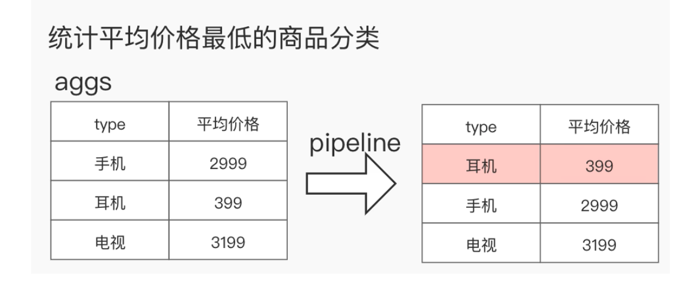
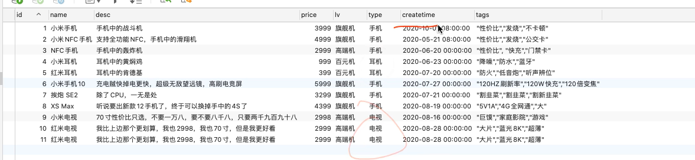

### Dynamic Mapping特性
- 向一个不存在的索引写数据，会根据写入的字段类型建mapping
- 数据写入失败也会自动创建索引，但不会根据数据字段类型建mapping


### 搜索API _search
#### 基础语法
```shell
GET /<index_name>/_search
GET /_search
```
##### 可选参数
- size:单次查询多少条文档，默认为 10
- from:起始文档偏移量。需要为非负数，默认为0
- timeout: 指定等待每个分片响应的时间段如果在超时到期之前未收到响应，则请求失败并返回错误。默认为无超时。
from 和size 类似mysql的offset 和limit

### index API
#### 基础语法
```shell
PUT <index_name>
```
#### 设置索引
```
PUT <index_name> {
	"settings": {}
}
```
##### 列如：
创建索引test_index，指定主分片的数量为1，主分片的副本数量为1
```shell
PUT <index_name> {
	"settings": {
		"number_of_shards": 1,
		"number_of_replicas": 1
	}
}
```
#### 修改索引
```
PUT <index_name>/_settings {
	"number_of_replicas": 2
}
```
- index.number_of_replicas: 每个主分片的副本数。默认为1，允许配置为 0
- index.refresh_interval: 执行刷新操作的频率，默认为1s.可以设置 -1为禁用刷新。
- index.max_result_window: from + size搜索此索引 的最大值。默认为 10000.搜索请求占用堆内存和时间 from + size，这限制了内存。请参阅 Scroll或Search After以获得更有效的替代方法

#### 删除索引
```
delete <index_name>
```
#### 查询索引是否存在
```shell
HEAD <index_name>
或者
GET <index_name>
```

#### 索引的不可变性
ES索引创建成功之后，以下属性将**不可修改**
- 索引名称
- 主分片数量
- 字段类型

### document 文档操作
- index:索(动词)，可以是创建，也可以是全量替换
- create:不存在则创建，存在则报错
**注意:**
- 以上操作均为写操作。
- ES中的数据写入均发生在 Primary Shard
- 当操作对象为数据流时，op_type 必须为 create
#### CRUD
##### create 
如果在PUT 数据的时候当前数据已经存在，则数据会被覆盖，如果在 PUT 的时候指定操作类型 create，此时如果数据**已存在则会返回失败**，因为已经强制指定了操作类型为create，ES就不会再去执行 update 操作
比如:下面一行代码创建id 为1的文档，指的就是在索引 goods 中强制创建id 为1的文档，如果 id 为1的文档已存在，则返回失败。指定创建文档 id
```shell
PUT /<index name>/_doc/<id>?op_type=create {}
```
简化为
```shell
PUT /<index_name>/_create/<id>/ {}
```

```shell
PUT /<index name>/_doc/<id>?op_type=index {}
```
###### 自动生成ID
将会使用随机的uuid
```shell
POST /<index name>/_doc {}
```
###### 批量写入/更新/删除
必须是这种格式, action 可以是create， index, update,delete
```shell
POST //_bulk 
{"action": {"_index": "<index_name>"}}
{"data"}
{"action": {"_index": "<index_name>"}}
{"data"}
。。。。
```
```shell
POST /_bulk 
{"create": {"_index": "goods", "_id": "1"}}
{"name": "oppo手机","content":"oppo手机111","price":10000,"tags":["智能手机","全面屏"]}
```

```shell
POST /<index name>/_bulk {}
```
```shell
POST /_bulk 
{"update": {"_index": "goods", "_id": "1"}}
{"doc": {"price": 998}}
```
```shell
POST /_bulk 
{"delete": {"_index": "goods", "_id": "1"}}
```
#### 获取文档
##### 查询指定id
```shell
GET  /<index_name>/_doc/<id> {}
```

##### 查询指定字段
不查询源数据 select id from TABLE
相当于mysql
```shell
GET  /<index_name>/_doc/<id>?_source=false 
```
##### 批量查询
```shell
GET  /_mget {
	"docs": [
		{
			"_index": <index_name>,
			"_source": false,
			"_id": <id>
		},
		{
			"_index": <index_name>,
			"_source": true,
			"_id": <id>
		},
		....
	]
}
```
GET  /<index_name>/_mget {
	"docs": [
		{
			"_id": <id>
		},
		{
			"_id": <id>
		},
		....
	]
}
```
GET  /<index_name>/_mget {
	"ids": [1,2,3...]
}
```

##### 只获取源数据，也就是我们自定义的业务数据
```shell
GET  /<index_name>/_source/<id>
```
##### query_string
query_string:和match类似(query_string不指定default_field的情况下)，但是match需要指定字段名，query_string是在所有字段中搜索，范围更广
语法
可以指定默认查询字段，也可以去掉
查询的分词可以使用AND OR 作为连接，如果是AND query 则不会对关键词进行分词。如果使用OR,则or的边会作为分词，只有匹配到一个都算匹配到了
```
GET /test_index/_search
{
  "query": {
    "query_string": {
      "default_field": "FIELD",
      "query": "this AND that OR thus"
    }
  }
}
```
```
GET /test_index/_search
{
  "query": {
    "query_string": {
      "default_field": "FIELD",
      "query": "(abc def)  OR (hello world)"
    }
  }
}
```

##### term
term: 也叫原子查询，**不会对搜索的词做任何处理**，不做分词不转成小写（倒排索引进行分词的时候都会转成小写, 所以term的关键词含有大写的话是搜索不到文档的），这种查询和match在有些时候是等价的，只查一个单词的时候(因为不用分词)，比如我们查询单个的词hello，那么会和match查询结果一样，但是如果查询“hello world”，结果就相差很大，因为这个输入**不会进行分词**，就是说查询的时候，是查询字段分词结果中是否有"hello world"的字样，而不是查询字段中包含“hello world”的字样，elasticsearch会对字段内容进行分词，“hello world"会被分成hello和world，不存在"hello world"，因此这里的查询结果会为空。这也是term查询和match的区别。
###### 类似mysql的in 查询
```
GET <INDEX_NAME>/_search
{
	"query": {
		"terms": {
			"user_id": ["1", "2", "3"],
			"boost": 1.0
		}
	}
}
GET /_search
{
	"query": {
		"terms": {
			"user.id": ["1", "2", "3"],
			"boost": 1.0
		}
	}
}
```
##### bool/复合查询
```
GET /test_index/_search
{
  "query": {
    "bool": {
      "must": [
        {}
      ],
      "should": [
        {}
      ],
      "must_not": [
        {}
      ],
      "filter": [
        {}
      ]
    }
  }
}
```
- must: 必须匹配,查询上下文,加分
- should: 应该匹配,查询上下文,加分
- must_not: 必须不匹配,过滤上下文，过滤
- filter: 必须匹配,过滤上下文，不算分

bool查询采用了一种匹配越多越好的方法，因此每个匹配的must或should子句的分数将被加在一起，以提供每个文档的最终得分

##### 聚合查询
聚合查询使用正排索引doc_values，也就是只有在正排索引创建的字段才能做聚合查询。
如果要在倒排索引上做聚合也不是不行，需要mapping上加 "fielddata": true， 在倒排索引上做聚合性能不好
```
POST products/_mapping 
{
	"properties": {
		"type": "text",
		// 这里还可以指定分词器
		"fielddata": true
	}
}
```
###### 聚合分类
- 分桶聚合: Bucket agregations
其实就是分类，把不同种类的不同属性的分成若干个桶，每个桶里面就是具有相同属性的元素，比如标签分类（类似mysql的group by）

- 指标聚合: Metrics agregations
Avg 平均值，Max 最大值，Min 最小值，Sum 求和，Cardinality 基数(去重), Value Count 计数
,Stats 统计聚合,Top Hits 聚合
- 管道聚合: Pipeline agregations
概念:对聚合的结果二次聚合
分类:父级和兄弟级
语法: buckets_path



语法

```
GET <INDEX_NAME>/_search
{
	"aggs": {
		"<AGGS_NAME>": {
			"<AGGS_TYPE>": {
				"field": "<FIELD_NAME>"
			}
		},
		//....可以多个
	}
}
```
###### 桶聚合
mapping和索引结构


如：统计不同标签商品的数量
在数据库中tags是以字符串存储 如 "a","b","c" 。在es用要以text存储如：tags: ["a","b","c"]
```
GET products/_search
{
	"aggs": {
		"aggs_tag": {
			"terms": {
				"field": "tags.keyword",
				"size":30,
				"order": {
					"_count": "asc"
				}
			}
		}
	}
}
```

不显示hits数据：size:0
```
GET products/_search
{
	"size":0,
	"aggs": {
		"tag_bucket": {
			"terms": {
				"field": "tags.keyword"
			}
		}
	}
}
```
求平均值
```
GET products/_search
{
	"aggs": {
		"tag_avg": {
			"avg": {
				"field": "age"
			}
		}
	}
}
```

###### 指标聚合
求最贵，最便宜和平均值
```
GET products/_search
{
	"aggs": {
		"max_tag": {
			"max": {
				"field": "price"
			}
		},
		"min_tag": {
			"min": {
				"field": "price"
			}
		},
		"avg_tag": {
			"avg": {
				"field": "price"
			}
		}
	}
}
```
查询所有指标
```
GET products/_search
{
	"aggs": {
		"price_stats":{
			"stats": {
				"field": "price"
			}
		}
	}
}
```
去重后的数量, 如按name去重后的数量
```
GET products/_search
{
	"aggs": {
		"dist_name":{
			"cardinality": {
				"field": "name.keyword"
			}
		}
	}
}
```

###### 管道聚合，二次聚合
要在谁的基础上进行二次运行，就跟睡平级
统计平均价格最低的商品分类
1 求平均值，2分类

第一步分类
```
GET products/_search
{
	"aggs": {
		"type_bucket":{
			"terms": {
				"field": "type.keyword"
			}
		}
	}
}
```

第二步 每个分类的平均值
```
GET products/_search
{
	"aggs": {
		"type_bucket":{
			"terms": {
				"field": "type.keyword"
			},
			"aggs": {
                "price_avg_bucket":{
                    "avg": {
                        "field": "price"
                    }
                }
            }
		}
	}
}
```
三，求最低, 开始管道查询（二次查询）
要在aggs里边进行二次查询
```
GET products/_search
{
	"aggs": {
		"type_bucket":{
			"terms": {
				"field": "type.keyword"
			},
			"aggs": {
                "price_avg_bucket":{
                    "avg": {
                        "field": "price"
                    }
                }
            }
		},
		"min_price_bucket": {
			"min_bucket": {
				"buckets_path": "type_bucket>price_avg_bucket"// 第一步的名字>第二部的名字
			}
		}
	}
}
```

##### text 和keyword
如何mapping的类型是text会自动嵌套一个keyword类型， text会分词，keyword不分词。如果需要精准查找就要指定keyword
```
GET /test_index/_search
{
  "size":0,
  "query": {
    "match": {
      "name.keyword": "TEXT"
    }
  }
}
```
#### 删除
##### 删除索引
```shell
DELETE  /<index_name>
```
##### 删除文档
```shell
DELETE  /<index_name>
```

```shell
DELETE  /<index_name>/_doc/<id>
```
##### 根据指定指定删除
删除价格为998的文档
```shell
POST /<index_name>/_delete_by_query {
	"query": {
		"term": {
			"price": 998
		}
	}
}
```

#### 更新
##### 更新指定字段

```shell
POST  /<index_name>/_update/<id> {
	"doc": {
		"我是要更新的字段": "更新的内容",
		.......
	}
}
```

##### 根据指定字段作为条件进行更新
UpdateByQuery


