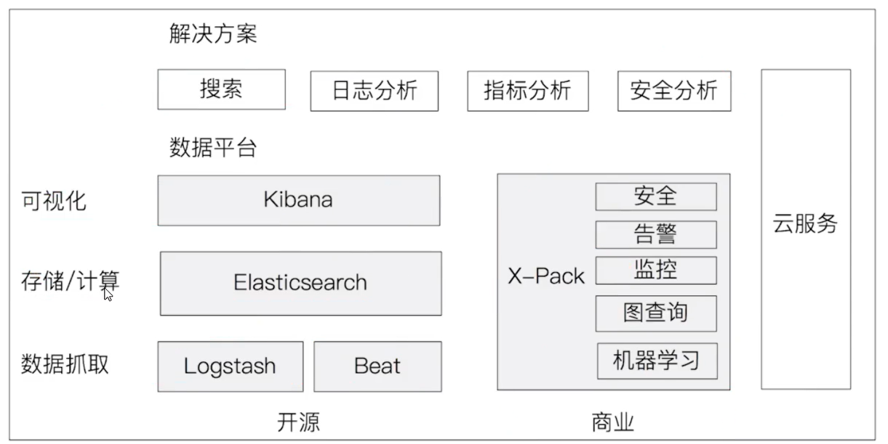
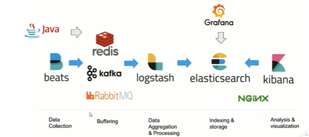
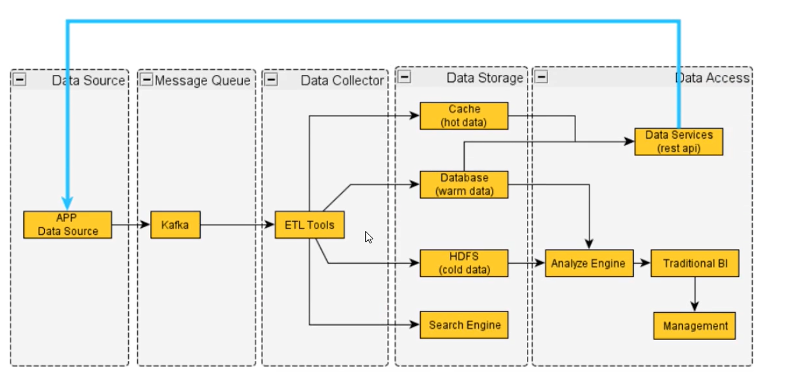
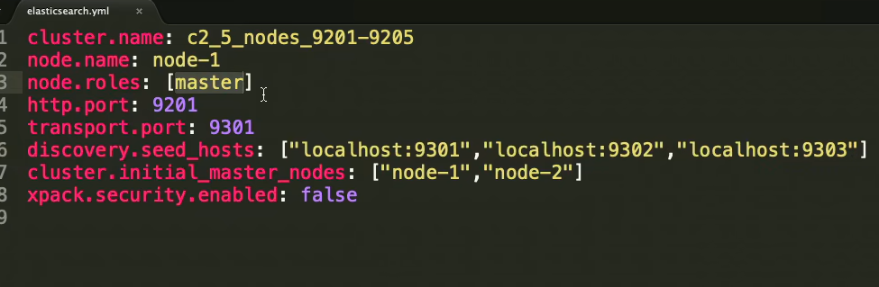
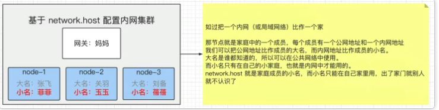
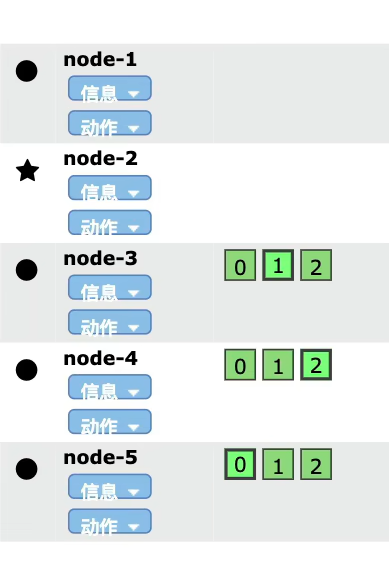
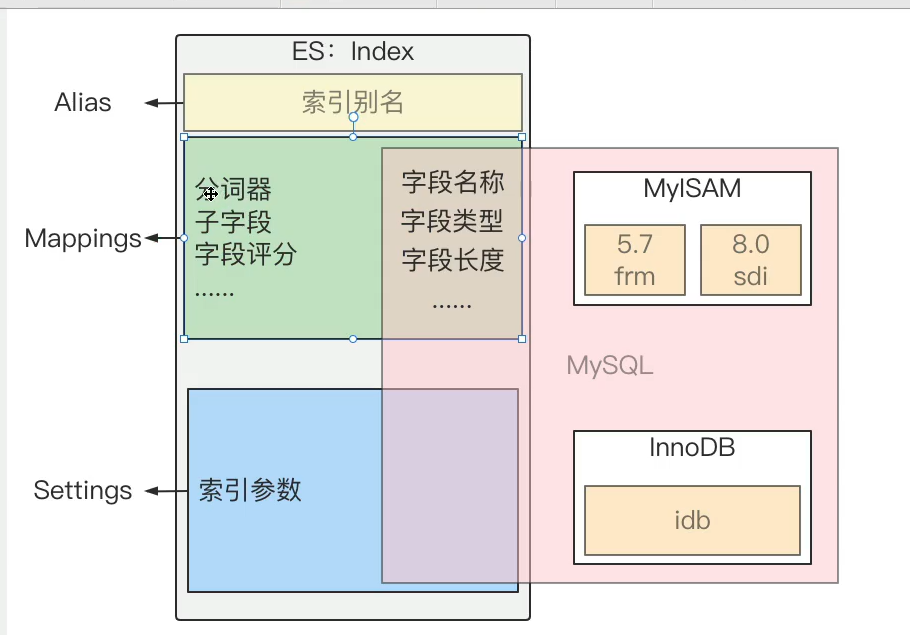
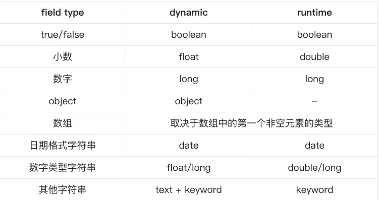

官网：https://www.elastic.co/cn/
下载：https://www.elastic.co/cn/downloads/past-releases#elasticsearch

### 安装
使用官网的docker compose 进行，
使用环境变量设置JVM的内存大小
-e ES_JAVA_OPTS="Xms1g Xmx1g"

#### 配置的建议
- Xms和Xmx设置成一样
- Xmx不要超过机器内存的50%

### 什么是ElasticSearch

Elasticsearch (后称为 ES)是天生支持分布式搜索、聚合分析、存储引擎
mysql 中一行数据成为row， es中一行数据称为一个文档document
### 什么是全文检索
全文检索是指:
- 通过一个程序扫描文本中的每一个单词，针对单词建立索引，并保存该单词在文本中的位置、以及出现的次数
- 用户查询时，通过之前建立好的索引来查询，将索引中单词对应的文本位置、出现的次数返回给用户，因为有了具体文本的位置，所.以就可以将具体内容读取出来了

### ES支持的搜索类型
- 结构化搜索
- 非结构化搜索， 比如文档，json， xml等
- 文本搜索
- 地理位置搜索

### es 不支持事务

### 倒排索引
正排索引： 通过索引（主键等）找到具体的记录
倒排索引：通过具体的记录（分词）找到索引

### 8.x新特性
8.x新特性

- Rest API相比较7.x而言做了比较大的改动(比如彻底删除_type)
- 默认开启安全配置（security）
- 存储空间优化:对倒排文件使用新的编码集，对于keyword、match only text、text类型字段有效，有3.5%的空间优化提升，对新建索引和segment自动生效。
- 优化geo_point，geo_shape类型的索 (写入) 效率: 15%的提升
- 技术预览版KNN API发布， (K邻近算法)，跟推荐系统、自然语言排名相关
https://www.elastic.co/guide/en/elastic-stack/current/elasticsearch-breaking-changes.html


### Elastic Stack介绍
在Elastic Stack之前我们听说过ELK，ELK分别是Elasticsearch，Logstash，Kibana这三款软件在一起的简称，在发展的过程中又有新的成员Beats的加入，就形成了Elastic Stack。

在Elastic Stack生态圈中Elasticsearch作为数据存储和搜索，是生态圈的基石，Kibana在上层提供用户一个可视化及操作的界面
Logstash和Beat可以对数据进行收集。在上图的右侧X-Pack部分则是Elastic公司提供的商业项目。

#### 日志分析，指标分析的过程


### ElasticSearch应用场景
- 站内搜索.
- 日志管理与分析.
- 大数据分析
- 应用性能监控
- 机器学习
国内现在有大量的公司都在使用 Elastisearch，包括携程、滴滴、今日头条、饿了么、360安全、小米、VVO等诸多知名公司。除了搜索之外，结合Kibana、Logstash， Beats，Elastic Stack还被广泛运用在大数据近实时分领域，包括日志分析，指标监控，信息安全等多个领域。它可以帮助你探索海量结构化、非结构化数据，按需创建可视化报表，对监控数据设置报警值，甚至通过使用机器学习技术自动识别异常状况。

### 通用数据处理流程


### 环境的依赖
https://www.elastic.co/cn/support/matrix#matrix_os


### 修改JVM配置
修改config/jvm.option配置文件，调整jvm堆内存大小
```
vim jvm.options
-Xms4g
-Xmx4g
```
配置的建议
- Xms和Xmx设置成一样
- Xmx不要超过机器内存的50%
- 不要超过30GB - https://www.elastic.co/cn/blog/a-heap-of-trouble


### 安装
https://www.elastic.co/guide/en/elasticsearch/reference/current/docker.html#docker
如果是集群就需要用docker-compose
https://www.elastic.co/guide/en/elasticsearch/reference/7.5/docker.html
docker pull elasticsearch:8.6.2
docker network create myes
docker run -d --name es862 --network myes -p 9200:9200 -p 9300:9300 -e "discovery.type=single-node" elasticsearch:8.6.2

一些环境变量 
  -E path.data = data1
  -E path.logs=log1
  -E node.anme=node1
  -E cluster.name=

docker pull kibana:8.6.2
docker run -d --name kb862 --net myes -p 5601:5601 kibana:8.6.2

进入 kibana
http://127.0.0.1:5601/
#### 生成账号和随机密码
docker exec -it es862 /usr/share/elasticsearch/bin/elasticsearch-reset-password -u elastic
用户名elastic
密码Sa1kwT*ady02=N8*w-2s

#### 生成指定密码
docker exec -it es862 /usr/share/elasticsearch/bin/elasticsearch-reset-password -u elastic -i
如果不想开启安全认证，由于8.x版本是默认开启Security的， 修改配置xpack.security.enabled 改为false 即可无需账号密码登录

https://127.0.0.1:9200/
http://127.0.0.1:5601/

### 基础配置
- cluster.name:集群名称，节点根据集群名称确定是否是同一个集群。默认名称为 elasticsearch，但应将其更改为描述集群用途的适当名称。不要在不同的环境中重用相同的集群名称。否则，节点可能会加入错误的集群
- node.name: 节点名称，集群内唯一，默认为主机名。，但可以在配置文件中显式配置。 一个节点就一个elasticsearch 示例对象， 一台服务器可以启动多个节点
- network.host: 节点对外提供服务的地址以及集群内通信的ip地址，例如127.0.0.1和[::1]
- http.port: 对外提供服务的端口号，默认9200
- transport.port: 节点通信端口号，默认 9300

### 开发模式和生产模式
- 开发模式:开发模式是默认配置(未配置集群发现设置)，如果用户只是出于学习目的，而引导检查会把很多用户挡在门外，所以ES提供了一个设置项discovery.type=single-node 。此项配置为指定节点为单节点发现以绕过引导检查。
- 生产模式:当用户修改了有关集群的相关配置会触发生产模式，在生产模式下，服务启动会触发ES的引导检查或者叫启动检查(bootstrap checks)，所谓引导检查就是在服务启动之前对一些重要的配置项进行检查，检查其配置值是否是合理的。引导检查包括对、VM大小、内存锁、虚拟内存、最大线程数、集群发现相关配置等相关的检查，如果某一项或者几项的配置不合理，ES会拒绝启动服务，并且在开发模式下的某些警告信息会升级成错误信息输出。引导检查十分严格，之所以宁可拒绝服务也要阻止用户启动服务是为了防止用户在对ES的基本使用不了解的前提下启动服务而导致的后期性能问题无法解决或者解决起来很麻烦。因为一旦服务以某种不合理的配置启动，时间久了之后可能会产生较大的性能问题，但此时集群已经变得难以维护和扩展，ES为了避免这种情况而做出了引导检查的设置，本来在开发模式下为警告的启动日志会升级为报错(Error)。这种设定虽然增加了用户的使用门槛，但是避免了日后产生更大的问题。


### 如何集群
#### 生成token， 让其他节点加入进来
在当前节点下 执行 bin/elasticsearch-create-enrollment-token -s node 生成 token， 将token复制出来。这个token的作用是为了让其他节点加入进来
如：
eyJ2ZXIiOiI4LjYuMiIsImFkciI6WyIxNzIuMTkuMC4yOjkyMDAiXSwiZmdyIjoiZWYzMzE5ODc0NWFiMTFlNTBhMThmNmIwYmNkYTZkMjlkOWYyY2I4ZTAxOWU2ZTAyZWM0OGUwYTJhZWIwMDhmMyIsImtleSI6Il9nenlzSVlCVGlIczF2bDg3MHZWOnE4RzdRM3NKVHJlTzZBOVV2SUlFVGcifQ==

#### 其他节点加入进来
在其他节点（没有启动）下执行
bin/elasticsearch --enrollment-token <TOKEN>
查看集群节点https://127.0.0.1:9200/_cat/nodes?v

### 节点node
一个节点就是一个es示例，也就是一个es进程

### 角色roles
Elasticsearch的重要基础概念角色在分布式、可扩展的系统架构中发挥着至关重要的作用，但是在ES的应用技术中，不需要过分深入去理解不同角色的具体含义如果你已经对ES应用层面熟练掌握，

#### 常见的角色
- 主节点(active master)：一般指活跃的主节点，一个集群中只能有一个，主要作用是对集群的管理(不处理数据)。
- 候选节点(master-eligible)：当主节点发生故障时，参与选举，也就是主节点的替代节点(不处理数据)。
- 数据节点 (data node):：数据节点保存包含已编入索引的文档的分片。数据节点处理数据相关操作，如 CRUD、搜索和聚合。这些操作是I/0 密集型、内存密集型和 CPU密集型的。监控这些资源并在它们过载时添加更多数据节点非常重要。
- 预处理节点 (ingest node):：预处理节点有点类似于logstash的消息管道，所以也叫ingest pipeline，常用于一些数据写入之前的预处理操作。
- 还有很多角色....

#### 如何配置
准确的说，应该叫节点角色，是区分不同功能节点的一项服务配置，配置方法为
```
node.roles: [角色1, 角色2, 角色3]
```

注意:
如果node.roles 为缺省配置，那么当前节点具备所有角色。所以不建议生产坏境这么做，否则会影响扩展

### 索引index
索引在ES 中所表述的含义**和 MySQL 中的索引完全不同** ，在 MySQL 中索引指的是加速数据查询的一种特殊的数据结构，如 normal index。而在 ES 中，索引表述的含义等价于 MySQL 中的表(仅针对ES 7.x 以后版本)，注意这里只是类比去理解，索引并不等于表
#### 索引的组成
- alias:即 索引别名，主要为了辅助和分工索引
- settings: 索引设置，常见设置如分片和副本的数量等
- mapping: 即映射（表结构），定义了索引中包含哪些字段，以及字段的类型、长度、分词器等。

#### 索引命名规范
- 字母全部小写
- 多个单词 不要用驼峰或者帕斯卡 test_index

#### 在ES中，索引在不同的特定条件下可以表示三种不同的意思:
- 表示源文件数据: 当做数据的载体，即类比为数据表，通常称作 index 。例如: 通常说集群中有 product 索，即表述当前 ES 的服务中存储了 product 这样一张“表”
- 表示索引文件：以加速查询检索为目的而设计和创建的数据文件，通常承载于某些特定的数据结构，如哈希、FST 等。例如: 通常所说的 正排索引和 倒排索引(也叫正向索引和反向索引)。就是当前这个表述，索引文件和源数据是完全独立的，索引文件存在的目的仅仅是为了加快数据的检索，不会对源数据造成任何影响
- 表示创建数据的动作：通常说创建或添加一条数据，在ES的表述为索引一条数据或索引一条文档，或者index 一个 doc 进去。此时索引一条文档的含义为向索引中添加数据。
### 类型type

### 文档document
相当于mysql的一行row数据


### 集群
#### 核心配置
- network.host:即提供服务的ip地址，一般配置为本节点所在服务器的**内网地址**，此配置会导致节点由开发模式转为**生产模式，从而触发引导检查**
- network.publish_host: 即提供服务的ip地址，一般配置为本节点所在服务器的公网地址
- http.port: 服务端口号，默认 9200，通常范围为 9200~9299
- transport.port: 节点通信端口，默认 9300，通常范围为 9300~9399
- discovery.seed hosts: 此设置提供集群中其他候选节点的列表，并且可能处于活动状态且可联系以播种发现过程。每个地址可以是 IP 地址，也可以是通过 DNS 解析为一个或多个P 地址的主机名

- cluster.initial_master_nodes:指定集群初次选举中用到的候选节点，称为集群引导，只在第一次形成集群时需要，如过配置了 network.host，则此配置项必须配置重新启动节点或将新节点添加到现有集群时不要使用此设置
[ES节点角色深层解读，及高可用集群架构角色设计](https://blog.csdn.net/wlei0618/article/details/127371710)
#### 内网集群

#### 公网集群


#### 集群的健康状态
- 绿色： 所有分片都可用
- 黄色:至少有一个副本不可用，但是所有主分片都可用，此时集群能提供完整的读写服务，但是可用性较低。
- 红色至少有一个主分片不可用，数据不完整。此时集群无法提供完整的读写服务。集群不可用。
##### 故障诊断API
- GET _cat/health
- GET _cluster/health
- GET _cat/indices?v
- GET _cat/nodes?v查看集群中的节点
- GET _cat/nodeattrs 查看节点属性
- GET _cat/shard 查看集群中所有分片的分配情况
- 可以在chrome 插件的elasticsearch head 插件中查看
- **GET _cluster/allocation/explain 查看执行计划，可用于查看分片未分配的原因**(也就是健康状态是yellow的时候)
- GET _cluster/health/<target> 查看集群状态

### 分片和副本（prirep）
一个索引可以有多个分片组成，类型mysql的分表分库。而副本是分片的备份。**主分片是可读可写，副本只可读**


#### 分片
##### 分片的种类
- 主分片 (primary shard) :
- 副本分片 (replica shard) :
##### 分片的作用和意义
- 高可用性：提高分布式服务的高可用性
- 提高性能：提供系统服务的吞吐量和并发响应的能力
- 易扩展性：当集群的性能不满足业务要求时，可以方便快速的扩容集群，而无需停止服务。
#####  分片的基本策略
- 一个索引包含一个或多个分片，在 7.0 之前默认五个主分片，每个主分片一个副本;在7.0之后默认一个主分片。副本可以在索引创建之后修改数量，但是主分片的数量一旦确定不可修改，只能创建索引
- 每个分片都是一个 Lucene 实例，有完整的创建索引和处理请求的能力
- ES 会自动再 nodes 上做分片均衡 shard reblance
- 一个doc不可能同时存在于多个主分片中，但是当每个主分片的副本数量不为一时，可以同时存在于多个副本中。
- 主分片和其副本分片 不能同时存在于同一个节点上，为了避免一损俱损
- 
- 完全相同的副本不能同时存在于同一个节点上。


### Mapping 映射(重点)
ES中的 mapping 有点类似与关系数据库中 `表结构` 的概念，在MySQL中，表结构里包含了字段名称，字段的类型还有索引信息等。在 Mapping 里也包含了一些属性，比如字段名称、类型、字段使用的分词器、是否评分、是否创建索引等属性，并且在 ES 中一个字段可以有对个类型


#### 查看完整的索引mapping
```shell
GET /<index_name>/_mappings
```

#### 查看索引中指定字段的mapping
```shell
GET /<index_name>/_mappings/field/<field_name>
```
#### 自动映射: dynamic mapping
自动映射也叫动态映射，是ES 在索引文档写入发生时自动创建 mapping 的一种机制。ES在创建索引之前，并不强制要求创建索引的 mapping，ES 会根据字段的值来推断字段类型，进而自动创建并指定索引类型。

下面是自动映射器推断字段类型的规则

自动映射器会尽可能的把字段映射为宽字段类型， 比如数字类型会映射为long类型

##### mapping 的使用禁忌
- ES没有隐式类型转换
- ES不支持类型修改
- **生产环境尽可能的避免使用 dynamic mapping**
  - 限制只有系统级的索引可以自动创建
  - dynamic 设置为 strict
```
PUT _cluster/settings
{
	"persistent": {
		"action.auto_create_index": ".security,.kibana*,.monitoring*,.watches,.triggered_watches,.watcher-history*"
	}
}

PUT <index_name>
{
  "mappings": {
    "dynamic": "strict"
  }
}
```

#### 手动映射: Explicit mapping（建议）
手动映射也叫做显式映射，即: 在索引文档写入之前，认为的创建索引并且指定索引中每个字段类型、分词器等参数。

如：给text_field指定类型为text， number_field为整型
```shell
PUT test_mapping
{
  "mappings": {
    "properties": {
      "text_field": {
        "type": "text",
        "analyzer": "standard",//分词器,可选
        "fields": { // 子字段，可选
          "text_field_keyword": {
            "type": "keyword"
          }
        }
      },
      "number_field": {
        "type": "integer"
      }
    }
  }
}
```
查查mapping
```shell
GET test_mapping/_mapping
```

#### ES的数据类型
每个字段都有字段数据类型或字段类型。其大致分为两种: 会被分词的字段类型和不会被分词的字段类型。
- 会被分词的类型:text、match_only_text 等
- 不会被分词类型: keyword、数值类型等


- binary:编码为 Base64 字符串的二进制值
- boolean:即布尔类型，接受 true 和 false。
- alias:字段别名。
- Keywords: 包含 keyword 、constant_keyword 和 wildcard。
- Dates:日期类型，包括 date 和data_nanos，两种类型
**对象关系类型(复杂类型)**
- object:非基本数据类型之外，默认的json 对象为 object 类型
- flattened: 单映射对象类型，其值为 json 对象
- nested :嵌套类型。
- join:父子级关系类型
**结构化类型**
- Range: 范围类型，比如 long_range，double_range，data_range 等
- ip: ipv4 或 ipv6 地址
- version:版本号
- murmur3:计算和存储值的散列

**聚合数据类型**
- aggregate_metric_double:
- histogram:
**文本搜索字段**
- text :文本数据类型，用于全文检索
- annotated-text:
- completion:
- search_as_you_type:
- token_count:
**文档排名类型**
- dense_vector:记录浮点值的密集向量
- rank_feature:记录数字特征以提高查询时的命中率
- rank_features:记录数字特征以提高查询时的命中率

**空间数据类型**
- geo_point:纬度和经度点
- geo_shape:复杂的形状，例如多边形
- point:任意笛卡尔点
- shape:任意笛卡尔几何
**其他类型**
- percolator:用Query DSL 编写的索引查询

##### 允许强制类型转换coerce

```shell
PUT test_coerce
{
  "mappings": {
    "properties": {
      "title":{
        "type": "integer",
        "coerce": false
      }
    }
  }
}

PUT test_coerce
{
  "settings": {
    "index.mapping.coerce": false
  },
  "mappings": {
    "properties": {
      "title":{
        "type": "integer"
      },
      "name":{
        "type": "long"
      }
    }
  }
}
```
##### copy_to
复制一份数据到指定的字段, 复制的数据是不可见的，但是可以搜索到
```shell
PUT test_copy_to_field
{
  "mappings": {
    "properties": {
      "first_name": {
        "type": "text",
        "copy_to": "full_name" 
      },
      "last_name": {
        "type": "text",
        "copy_to": "full_name" 
      },
      "full_name": {
        "type": "text"
      }
    }
  }
}

PUT test_copy_to_field/_doc/1
{
  "first_name": "John",
  "last_name": "Smith"
}

GET test_copy_to_field/_search
{
	"query": {
		"match": {
			"full_name": "Smith"
		}
	}

}
```

##### fielddate
查询时内存数据结构，在首次用当前字段**聚合、排序**或者在脚本中使用时，需要字段为fielddata数据结构，并且创建倒排索引保存到堆


##### fields 重要
给 field 创建多字段，用于不同目的 (全文检索或者聚合分析排序)


### 如何定制化排序
如何使用script_score和function_score定制化排序
使用rescore_query和pinned query来排序
#### 通过邻近查询提升相关度
配合使用match和match_phrease
match_phrease匹配条件比match更严格

```shell
PUT test_index
{
  "mappings": {
    "properties": {
      "name": {
        "type": "text"
      }
    }
  }
}


POST test_index/_doc
{
  "name": "测试"
}
POST test_index/_doc
{
  "name": "试测"
}

GET test_index/_search
{
  "query": {
    "bool": {
      "should": [
        {
          "match": {
            "name": "测试"
          }
        },
        {
          "match_phrase": {
            "name": "测试"
          }
        }
      ]
    }
  }
}
```
通过match 查询能查到两条数据，match_phrase只查到一条数据（测试），那么通过match_phrase查到的数据分数就更高，就越能查出用户想要的数据


影响排序的因素有很多，不仅仅商品名称，还有销量，收藏数，上架时间等，那么这么排序呢？
```shell
GET goods/_search
{
  "size": 40,
  "query": {
    "match_phrase": {
      "name": "iphone"
    }
  },
  "sort": [
    {
      "_score": {
        "order": "desc"
      },
      "last_month_sales": {
        "order": "desc"
      },
      "favorites": {
        "order": "desc"
      },
      "year": {
        "order": "desc"
      }
    }
  ]
}
```

如果我们想把包含指定关键词的文档或者一些指定条件的文档进行提权，我们也可以通过function score
```shell
GET /goods/_search
{
  "query": {
    "function_score": {
      "query": {
        "query": {
          "match_phrase": {
            "name": "iphone"
          }
        }
      },
      "functions": [
        {
          "filter": {
            "match": {
              "name": "pluse"
            }
          },
          "weight": 2
        }
      ]
    }
  }
}
```
如果匹配到plus关键词，那么权重提升2倍
只在title 和desc字段中查找golang分词，如果在title 中出现golang权重x2
#### multi_match
```shell
GET /test_index/_search
{
  "query": {
    "multi_match": {
      "query": "golang",
      "fields": ["title^2", "desc"]
    }
  }
}
```

### 分词器
[下载](https://github.com/medcl/elasticsearch-analysis-ik/releases)

- 下载lk，将目录改名为lk，放到es的plugins 目录下（docker可以做个数据卷进行映射），注意要和es的版本保存一致
- 目录 -v ./data/elasticsearch/plugins:/usr/share/elasticsearch/plugins
- 设置权限 chmod -R 0777 xxx
- 重启es（容器 docker restart）
cd bin
./elasticsearch-plugin list

查看分词执行情况
```
GET _analyzer {
	"text": "中华牙膏"
}
```
将所有的可能列举出来
```
GET _analyzer {
	"text": "中国科学技术大学",
	"analyzer": "ik_max_word"
}
```
```
PUT my_test
{
  "mappings": {
    "properties": {
      "title": {
        "type": "text",
        "analyzer": "lk-smark"// lk-max-work
      }
    }
  }
}
```