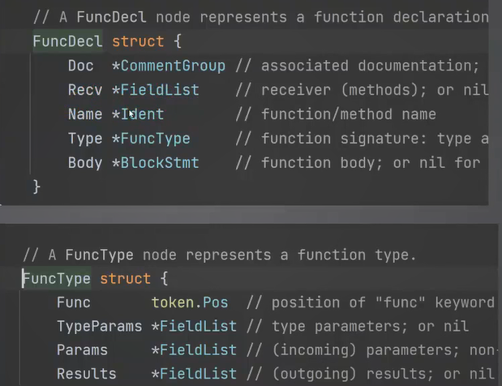

### 什么是 AST?
AST，即抽象语法树。它是源代码语法结构的一种抽象表示。它以树状的形式表现编程语言的语法结构，树上的每个节点都表示源代码中的一种结构。

**并发、反射和AST三者是构建复杂系统（中间件）的基石，真正的高级工具。
中间件开发必须学会反射和AST**


### 反射，unsafe 和AST

优先选择反射，如果反射性能有问题可以考虑使用unsafe，如果反射解决不了的问题，比如运行时拿不到的数据只能用AST，

### 学习AST的目的:
- **篡改源码**(比如源码是a = a +1, 你可以使用AST篡改为 a= a+2)
- **代码生成**：Go因为本身没有动态代理之类的工具，所以代码生成大行其道，非常流行
例子:
- GORM Gen子项目
https://github.com/go-gorm/gen
- 依赖注入Google Wire
https://github.com/google/wire
依赖注入简单的来讲就是不再需要你创建实例而是别人帮你把实例注入进去

### 步骤
####  Walk

Walk()方法是用来**遍历**AST语法树的，walk调用是深度优先(先从根节点遍历到叶子节点)
#### 基本步骤:

- 使用`token.NewFileSet`来创建`FileSet`
- 使用`parser.ParseFile`开始解析源码，可以指定mode
- 实现`ast. Visitor`的接口，作为遍历AST的处理器，我们可以利用该实现达到**读取、篡改**AST 树的目的 ，每一个node都会调用这个接口
- 调用`ast.Walk`开始遍历AST
- *ast.File 代表整个文件，parser.ParseFile的第二个或者第三个参数，也就是ast树的顶级节点

#### Visitor 设计模式详解
Visitor设计模式：这种设计模式常常用于遍历复杂的数据结构，典型的就是树形结构，一些情况下可以用于遍历**链表**等结构。

对于Node来说，就是接收Visitor,然后具体的实现里面再调用 Visitor的Visit方法，并且将自身传入下去。

对于Visitor 来说，一般是要做类型判断，判断该Node的实际类型，自己究竟能不能处理。


#### ast.Node接口
ast.Node接口代表了AST的节点。任何一个Go语句在AST 里面都代表了一个节点，多个语句之间可以组成一个更加复杂的节点。

三个关键子类:
- 表达式 Expr：例如各种内置类型、方法调用、数组索引等
- 语句Stmt：如赋值语句、if语句等
- 声明Decl：各种声明
- *ast.starExpr: 表示指针

不需要记这种东西，写代码的时候再去看具体的实现，因为总共有69种实现。

Node接口定义的方法其实不太常用，很多时候操作AST 都不关心 Pos，也就是位置。


#### ast.Node接口—GenDecl
// declare
GenDecl代表通用声明，一般是:

- 类型声明，以 type开头的
- 变量声明，以var 开头的
- 常量声明，以const 开头的i
- mport声明，以import开头的

基本上，都要进一步判断Tok来判断究竟是什么声明。


#### ast.Node接口——FuncDecl
FuncDecl是方法声明:
- Doc是文档。注意,不是所有的注释都是文档，要符合Go规范的文档
- Recv接收器
- Name方法名
- Type方法签名:里面包含泛型参数、参数类型、返回值




#### ast.Node接口—— StructType
StructType代表了一个结构体声明
- Fields:字段。

Fields 里面你找不到定义在改结构体上的**方法**。这些方法其实定义在**ast.File里面的Delcs里面**


```go

import (
	"fmt"
	"go/ast"
	"reflect"
)

type printVisitor struct {
}

// Visit 需要不断的打断点才能确认这个节点是什么
// 当前node 的子节点才会调用返回的w
// 那么就可以使用 其他的Visitor 来处理 子节点
func (t *printVisitor) Visit(node ast.Node) (w ast.Visitor) {
	if node == nil {
		fmt.Println(nil)
		return t
	}
	val := reflect.ValueOf(node)
	typ := reflect.TypeOf(node)
	for typ.Kind() == reflect.Ptr {
		typ = typ.Elem()
		val = val.Elem()
	}
	fmt.Printf("val: %+v, type: %s \n", val.Interface(), typ.Name())
    // 如果这里返回的是其他Visit ，那么当前node的子节点都会其他的visit，但是兄弟节点不会使用其他visit，还是使用当前visit
	return t
}


// 测试用例

func TestAst(t *testing.T) {
	
	fset := token.NewFileSet()
	//ParseFile(fset *token.FileSet, filename string, src any, mode Mode)的使用姿势，如果src 为nil ParseFile方法的filename才有有效。
	//否则就使用src参数，filename则无效
	f, err := parser.ParseFile(fset, "src.go",
		`
package ast

import (
	"fmt"
	"go/ast"
	"reflect"
)

type printVisitor struct {
}

func (t *printVisitor) Visit(node ast.Node) (w ast.Visitor) {
	if node == nil {
		fmt.Println(nil)
		return t
	}
	val := reflect.ValueOf(node)
	typ := reflect.TypeOf(node)
	for typ.Kind() == reflect.Ptr {
		typ = typ.Elem()
		val = val.Elem()
	}
	fmt.Printf("val: %+v, type: %s \n", val.Interface(), typ.Name())
	return t
}
`, parser.ParseComments) // ParseComments 解析注释
	if err != nil {
		t.Fatal(err)
	}
    // 在Walk这里打断点，然后进去里面就可以看到整个节点的信息
	ast.Walk(&printVisitor{}, f)
}
```


#### 代码演示——自定义注解
在Java里面有一种机制叫做注解，可以看做是特殊的接口。然而在Go里面并没有，不过我们可以通过AST 来设计一种全新的注解。这些注解将会被用于代码生成，可以看做是一种辅助的声明元数据的方式。
所谓注解:
- 单行注解形式：// @annotation_name annotation_value
- 多行注解形式:/*@annotation_name annotation_value */
演示如何获得类型定义、方法声明、字段上的注解。


annotation.go
```go
type annotations struct {
	Node ast.Node
	Ans  []Annotation
}

type Annotation struct {
	Key   string
	Value string
}

func newAnnotations(n ast.Node, cg *ast.CommentGroup) annotations {
	if cg == nil || len(cg.List) == 0 {
		return annotations{Node: n}
	}
	ans := make([]Annotation, 0, len(cg.List))
	for _, c := range cg.List {
		text, ok := extractContent(c)
		if !ok {
			continue
		}
		if strings.HasPrefix(text, "@") {
			segs := strings.SplitN(text, " ", 2)
			if len(segs) != 2 {
				continue
			}
			key := segs[0][1:]
			ans = append(ans, Annotation{
				Key:   key,
				Value: segs[1],
			})
		}
	}
	return annotations{
		Node: n,
		Ans:  ans,
	}
}

func extractContent(c *ast.Comment) (string, bool) {
	text := c.Text
	if strings.HasPrefix(text, "// ") {
		return text[3:], true
	} else if strings.HasPrefix(text, "/* ") {
		length := len(text)
		return text[3 : length-2], true
	}
	return "", false
}
```


file.go
```go
type SingleFileEntryVisitor struct {
	file *fileVisitor
}

func (s *SingleFileEntryVisitor) Get() File {
	if s.file != nil {
		return s.file.Get()
	}
	return File{}
}

func (s *SingleFileEntryVisitor) Visit(node ast.Node) ast.Visitor {
    // 这里打个断点
	file, ok := node.(*ast.File)
	if ok {
		s.file = &fileVisitor{
			ans: newAnnotations(file, file.Doc),
		}
		return s.file
	}
	return s
}

type fileVisitor struct {
	ans     annotations
	types   []*typeVisitor
	visited bool
}

func (f *fileVisitor) Get() File {
	types := make([]Type, 0, len(f.types))
	for _, t := range f.types {
		types = append(types, t.Get())
	}
	return File{
		annotations: f.ans,
		Types:       types,
	}
}

func (f *fileVisitor) Visit(node ast.Node) ast.Visitor {
    // 这里打个断点
	typ, ok := node.(*ast.TypeSpec)
	if ok {
		res := &typeVisitor{
			ans:    newAnnotations(typ, typ.Doc),
			fields: make([]Field, 0, 0),
		}
		f.types = append(f.types, res)
		return res
	}
	return f
}

type File struct {
	annotations
	Types []Type
}

type typeVisitor struct {
	ans    annotations
	fields []Field
}

func (t *typeVisitor) Get() Type {
	return Type{
		annotations: t.ans,
		Fields:      t.fields,
	}
}

func (t *typeVisitor) Visit(node ast.Node) (w ast.Visitor) {
    // 这里打个断点
	fd, ok := node.(*ast.Field)
	if ok {
		if fn.Doc == nil {
			return t
		}
		t.fields = append(t.fields, Field{annotations: newAnnotations(fd, fd.Doc)})
		return nil
	}
	return t
}

type Type struct {
	annotations
	Fields []Field
}

type Field struct {
	annotations
}
```

file_test.go
```go
import (
	"github.com/stretchr/testify/assert"
	"go/ast"
	"go/parser"
	"go/token"
	"testing"
)

func TestFileVisitor_Get(t *testing.T) {
	testCases := []struct {
		src  string
		want File
	}{
		{
            // 测试的时候可以删除一部分，一步一步的加进去进行测试
			src: `
// annotation go through the source code and extra the annotation
// @author Deng Ming
/* @multiple first line
second line
*/
// @date 2022/04/02
package annotation

type (
	// FuncType is a type
	// @author Deng Ming
	/* @multiple first line
	   second line
	*/
	// @date 2022/04/02
	FuncType func()
)

type (
	// StructType is a test struct
	//
	// @author Deng Ming
	/* @multiple first line
	   second line
	*/
	// @date 2022/04/02
	StructType struct {
		// Public is a field
		// @type string
		Public string
	}

	// SecondType is a test struct
	//
	// @author Deng Ming
	/* @multiple first line
	   second line
	*/
	// @date 2022/04/03
	SecondType struct {
	}
)

type (
	// Interface is a test interface
	// @author Deng Ming
	/* @multiple first line
	   second line
	*/
	// @date 2022/04/04
	Interface interface {
		// MyFunc is a test func
		// @parameter arg1 int
		// @parameter arg2 int32
		// @return string
		MyFunc(arg1 int, arg2 int32) string

		// second is a test func
		// @return string
		second() string
	}
)
`,
			want: File{
				annotations: annotations{
					Ans: []Annotation{
						{
							Key:   "author",
							Value: "Deng Ming",
						},
						{
							Key:   "multiple",
							Value: "first line\nsecond line\n",
						},
						{
							Key:   "date",
							Value: "2022/04/02",
						},
					},
				},
				Types: []Type{
					{
						annotations: annotations{
							Ans: []Annotation{
								{
									Key:   "author",
									Value: "Deng Ming",
								},
								{
									Key:   "multiple",
									Value: "first line\n\t   second line\n\t",
								},
								{
									Key:   "date",
									Value: "2022/04/02",
								},
							},
						},
					},
					{
						annotations: annotations{
							Ans: []Annotation{
								{
									Key:   "author",
									Value: "Deng Ming",
								},
								{
									Key:   "multiple",
									Value: "first line\n\t   second line\n\t",
								},
								{
									Key:   "date",
									Value: "2022/04/02",
								},
							},
						},
						Fields: []Field{
							{
								annotations: annotations{
									Ans: []Annotation{
										{
											Key:   "type",
											Value: "string",
										},
									},
								},
							},
						},
					},
					{
						annotations: annotations{
							Ans: []Annotation{
								{
									Key:   "author",
									Value: "Deng Ming",
								},
								{
									Key:   "multiple",
									Value: "first line\n\t   second line\n\t",
								},
								{
									Key:   "date",
									Value: "2022/04/03",
								},
							},
						},
					},
					{
						annotations: annotations{
							Ans: []Annotation{
								{
									Key:   "author",
									Value: "Deng Ming",
								},
								{
									Key:   "multiple",
									Value: "first line\n\t   second line\n\t",
								},
								{
									Key:   "date",
									Value: "2022/04/04",
								},
							},
						},
						Fields: []Field{
							{
								annotations: annotations{
									Ans: []Annotation{
										{
											Key:   "parameter",
											Value: "arg1 int",
										},
										{
											Key:   "parameter",
											Value: "arg2 int32",
										},
										{
											Key:   "return",
											Value: "string",
										},
									},
								},
							},
							{
								annotations: annotations{
									Ans: []Annotation{
										{
											Key:   "return",
											Value: "string",
										},
									},
								},
							},
						},
					},
				},
			},
		},
	}
	for _, tc := range testCases {
		fset := token.NewFileSet()
		f, err := parser.ParseFile(fset, "src.go", tc.src, parser.ParseComments)
		if err != nil {
			t.Fatal(err)
		}
		tv := &SingleFileEntryVisitor{}
		ast.Walk(tv, f)
		file := tv.Get()
		assertAnnotations(t, tc.want.annotations, file.annotations)
		if len(tc.want.Types) != len(file.Types) {
			t.Fatal()
		}
		for i, typ := range file.Types {
			wantType := tc.want.Types[i]
			assertAnnotations(t, wantType.annotations, typ.annotations)
			if len(wantType.Fields) != len(typ.Fields) {
				t.Fatal()
			}
			for j, fd := range typ.Fields {
				wantFd := wantType.Fields[j]
				assertAnnotations(t, wantFd.annotations, fd.annotations)
			}
		}
	}
}

func assertAnnotations(t *testing.T, wantAns annotations, dst annotations) {
	want := wantAns.Ans
	if len(want) != len(dst.Ans) {
		t.Fatal()
	}
	for i, an := range want {
		val := dst.Ans[i]
		assert.Equal(t, an.Value, val.Value)
	}
}
```
核心点就是要时刻打断点

[具体代码](./gen_answer.zip)


### 面试要点

AST在面试中大多数的情况下都是和**编译原理**一起面的。不过因为编译原理实在太难，大部分面试官根本不会面编译原理，所以只有在你面技术专家，或者编译相关岗位的时候才会面得比较多。
- **什么是AST（抽象语法树）**：是源代码的一种树形结构的表示，我们可以通过修改AST来修改源码

- **AST编程的作用**：语法检查、格式检查、错误检查、自动补全、优化代码、代码生成，基本上就是只要你够强，用AST你就可以为所欲为，甚至设计新的语言

- **Go有没有注解**：没有，但是我们可以用AST 来自己设计

- **Visitor设计模式**：Visitor模式主要用于遍历复杂结构体，要点在于接收一个节点作为输入，并且返回一个遍历子节点的 Visitor
