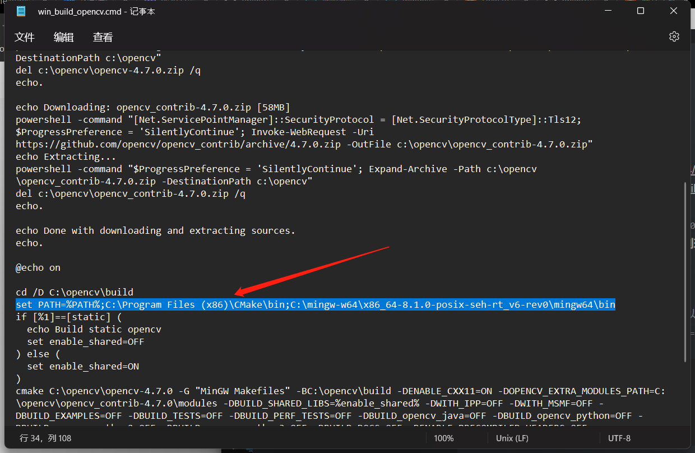

### windows:
安装vs 2022

安装cmake，并**设置环境变量**

安装gocv
官网：https://github.com/hybridgroup/gocv
go get 
安装MinGW-W64：
https://sourceforge.net/projects/mingw-w64/files/Toolchains%20targetting%20Win32/Personal%20Builds/mingw-builds/8.1.0/
安装目录必须在`C:\mingw-w64\x86_64-8.1.0-posix-seh-rt_v6-rev0\mingw64\`，**并把bin 目录添加到环境变量中**


如果cmake 或mingw 的安装目录不正确可以修改win_build_opencv.cmd 文件中的`set PATH=xxxxx`



```
chdir %GOPATH%\src\gocv.io\x\gocv
如果双击安装不了，就在cmd 下运行win_build_opencv.cmd
win_build_opencv.cmd
```
编译成功后 将`C:\opencv\build\install\x64\mingw\bin` 添加到环境变量中

