### 图像处理
#### 1读图片
IMRead
```go
func main() {
	mat := gocv.IMRead("1.jpg", gocv.IMReadReducedGrayscale2)
	if mat.Empty() {
		log.Fatal("empty image")
	}
	window := gocv.NewWindow("img")

	window.SetWindowTitle("test")
	window.IMShow(mat)
	// WaitKey 返回的是ascii码
	key := window.WaitKey(0)
	fmt.Println(key)
	if key >= 0 {
		window.Close()
	}
}
```
#### 2保存图片
IMWrite
```go
mat := gocv.IMRead("1.jpg", gocv.IMReadReducedGrayscale2)
if mat.Empty() {
	log.Fatal("empty image")
}

gocv.IMWrite("abc.jpg", mat)
```
##### 压缩后再保存
```go
func main() {
	imageFilePath := "lena.png"
	mat := gocv.IMRead(imageFilePath, gocv.IMReadAnyColor)
	if mat.Empty() {
		log.Panic("Can not read Image file : ", imageFilePath)
		return
	}

	// PNG Lossless Compression
	compressedImageFilePathForPNG := "./Lena_compressed1.png"
	gocv.IMWriteWithParams(compressedImageFilePathForPNG, mat, []int{gocv.IMWritePngCompression, 0})

	saveImage := gocv.IMRead(compressedImageFilePathForPNG, gocv.IMReadAnyColor)
	if &saveImage == nil {
		log.Panic("Can not read Image file : ", compressedImageFilePathForPNG)
		return
	}

	// JPG Lossy Compression
	compressedImageFilePathForJPG := "./Lena_compressed1.jpg"
	gocv.IMWriteWithParams(compressedImageFilePathForJPG, mat, []int{gocv.IMWriteJpegQuality, 0})
}
```

#### 3结合gin文件上传
```go
r := gin.Default()
	r.GET("/", func(ctx *gin.Context) {
		tpl := template.New("upload")
		tpl, err := tpl.Parse(`
<html>
<body>
	<form action="/upload" method="post" enctype="multipart/form-data">
		 <input type="file" name="myfile" />
		 <button type="submit">上传文件</button>
	</form>
</body>
<html>
`)
		if err != nil {
			log.Fatal(err)
		}
		page := &bytes.Buffer{}
		tpl.Execute(page, nil)
		ctx.Writer.Write(page.Bytes())
	})
	r.POST("/upload", func(ctx *gin.Context) {
		f, _, err := ctx.Request.FormFile("myfile")
		if err != nil {
			log.Fatal(err)
		}
		fullpath := "abcd.png"
		dst, err := os.OpenFile(fullpath, os.O_WRONLY|os.O_CREATE|os.O_TRUNC, 0o666)
		if err != nil {
			log.Fatal(err)
		}
		io.CopyBuffer(dst, f, nil)
		img := gocv.IMRead(fullpath, gocv.IMReadGrayScale)
		if img.Empty() {
			log.Fatal("empty")
		}
		win := gocv.NewWindow("test")
		win.IMShow(img)
		key := win.WaitKey(0)
		if key >= 0 {
			win.Close()
		}
	})

	r.Run(":8080")
```

#### 4使用窗口滑动条自定RGB颜色并保存为图片
```go
func main() {
	windowForTrackbar := gocv.NewWindow("Trackbar Window")
	defer windowForTrackbar.Close()
	// 创建4个滚动条
	trackbarR := windowForTrackbar.CreateTrackbar("R", 255)
	trackbarG := windowForTrackbar.CreateTrackbar("G", 255)
	trackbarB := windowForTrackbar.CreateTrackbar("B", 255)
	trackbarA := windowForTrackbar.CreateTrackbar("A", 10)

	mat := gocv.NewMatWithSize(600, 300, gocv.MatTypeCV8UC3)

	log.Println("-----------------------")
	log.Println("Rows:", mat.Rows())
	log.Println("Cols:", mat.Cols())

	for {
		// 获取动条的值
		// BGR
		blue := float64(trackbarB.GetPos())
		green := float64(trackbarG.GetPos())
		red := float64(trackbarR.GetPos())
		alpha := float64(trackbarA.GetPos()) / 10

		log.Println("-----------------------")
		log.Println("blue:", blue)
		log.Println("green:", green)
		log.Println("red:", red)
		log.Println("alpha:", alpha)

		// 设置的mat中
		mat.SetTo(gocv.NewScalar(blue, green, red, alpha))

		windowForTrackbar.IMShow(mat)

		key := windowForTrackbar.WaitKey(100)
		if key == 27 {
			gocv.IMWrite("rgba.png", mat)
			break
		}
	}
}
```
#### 像素值

```go
func main() {
	imgPath := filepath.Join("messi.jpg")
	// read in a color image
	img := gocv.IMRead(imgPath, gocv.IMReadColor)
	//img := gocv.IMRead(imgPath, gocv.IMReadGrayScale)
	if img.Empty() {
		fmt.Printf("Failed to read image: %s\n", imgPath)
		os.Exit(1)
	}
	// split image channels
	bgr := gocv.Split(img)
	// pixel values for each channel - we know this is a BGR image
	fmt.Printf("Pixel B: %d\n", bgr[0].GetUCharAt(100, 100))
	fmt.Printf("Pixel G: %d\n", bgr[1].GetUCharAt(100, 100))
	fmt.Printf("Pixel R: %d\n", bgr[2].GetUCharAt(100, 100))
}
```
结果
```
Pixel B: 37
Pixel G: 44
Pixel R: 41
```
注意几件事。

我们知道该图像有三个通道，以BGR的形式排列。
我们还知道，图像类型是gocv.MatTypeCV8UC3。
这基本上意味着我们可以使用gocv.Mat类型的GetUCharAt()函数访问特定的像素强度值。同样地，我们也可以使用**SetUCharAt()**函数来修改特定的像素强度值。

如果我们简单地尝试使用img.GetUCharAt(100, 100)，也就是说，如果我们**没有分开颜色通道**，gocv将只返回**最后一个通道的值**：在这种情况下，这将是R通道，因为图像是以BGR颜色方案读取。

那么`SetUCharAt()`也需要在分开颜色通道的情况下使用

#### 图像区域
通常我们需要**在图像中选择一个小区域**并对其进行处理，例如，当你检测到一个物体时，你可能想对其进行模糊处理或对其进行一些变换或其他的。你可以使用标准库image.Rectangle选择一个矩形区域。

让我们用我们的彩色图像在一个简单的例子上演示一下。我们将选择图像中包含足球的一个区域，我们将模糊它。现在不要担心代码中的模糊部分，我们将在后面的教程中介绍它。选择区域和模糊化的代码非常简单。
```go
func main() {
	imgPath := filepath.Join("messi.jpg")
	// read in a color image
	img := gocv.IMRead(imgPath, gocv.IMReadColor)
	//img := gocv.IMRead(imgPath, gocv.IMReadGrayScale)
	if img.Empty() {
		fmt.Printf("Failed to read image: %s\n", imgPath)
		os.Exit(1)
	}
	// rectangle region
	rec := image.Rectangle{Min: image.Point{214, 383}, Max: image.Point{292, 460}}
	ball := img.Region(rec)
	// apply Gaussian blur
	gocv.GaussianBlur(ball, &ball, image.Pt(35, 35), 0, 0, gocv.BorderDefault)
	// write image to filesystem
	outPath := filepath.Join("blur_messi.jpg")
	if ok := gocv.IMWrite(outPath, img); !ok {
		fmt.Printf("Failed to write image: %s\n")
		os.Exit(1)
	}
}
```

#### 5ROI 截取图片，显示图片选中的区域
```go
func main() {
	window := gocv.NewWindow("Video")
	defer window.Close()
	img := gocv.IMRead("1.jpg", gocv.IMReadColor)
	window.SelectROIs(img)
	// TODO....
}
```

#### 6.绘制2维基元标记 线条 椭圆 矩形和文本
```go
var (
	width  int
	height int
)

func main() {
	imageFilePath := "./Lena.png"
	mat := gocv.IMRead(imageFilePath, gocv.IMReadAnyColor)
	if mat.Empty() {
		log.Panic("Can not read Image file : ", imageFilePath)
		return
	}

	window := gocv.NewWindow("Drawing")
	defer window.Close()

	width, height = mat.Rows(), mat.Cols()

	// Circle
	gocv.Circle(&mat, getRandomPoint(), 40, color.RGBA{255, 0, 0, 0}, 1)
	gocv.Circle(&mat, getRandomPoint(), 5, color.RGBA{255, 0, 0, 0}, 2)
	gocv.Circle(&mat, getRandomPoint(), 40, color.RGBA{255, 85, 85, 0}, 2)
	gocv.Circle(&mat, getRandomPoint(), 40, color.RGBA{255, 170, 170, 0}, 2)

	// Line
	gocv.Line(&mat, getRandomPoint(), getRandomPoint(), color.RGBA{0, 255, 0, 0}, 1)
	gocv.Line(&mat, getRandomPoint(), getRandomPoint(), color.RGBA{85, 255, 85, 0}, 3)
	gocv.Line(&mat, getRandomPoint(), getRandomPoint(), color.RGBA{255, 170, 170, 0}, 3)

	// ArrowLine 箭头
	gocv.ArrowedLine(&mat, getRandomPoint(), getRandomPoint(), color.RGBA{0, 0, 255, 0}, 3)

	// Rectangle 矩形
	gocv.Rectangle(&mat, getRandomRectangle(), color.RGBA{255, 255, 255, 0}, 3)

	// Ellipse 椭圆
    /*
    center = (x, y) 椭圆中点的坐标
	axes = (minorAxes, majorAxes) = 短轴和长轴的长度
	angel = rotation，椭圆的旋转角度是逆时针计算的
	startAngle = 开始角度（顺时针数）
	endAngel = 结束角度（顺时针数）
	c = (color) 一个介于 0-255 之间的值，用于创建 RGBA 颜色
	thickness = 线宽
    */
	gocv.Ellipse(&mat, getRandomPoint(), image.Point{X: 50, Y: 300}, rand.Float64(), 0, 360, color.RGBA{55, 255, 255, 0}, 3)

	// Text
	gocv.PutText(&mat, "Emmmmm..", image.Point{X: 50, Y: 300}, gocv.FontHersheyTriplex, 2, color.RGBA{0, 0, 0, 0}, 2)

	for {
		window.IMShow(mat)

		key := window.WaitKey(3)
		if key == 27 {
			break
		}
	}

}

func getRandomPoint() image.Point {
	return image.Point{X: rand.Intn(width), Y: rand.Intn(height)}
}

func getRandomRectangle() image.Rectangle {
	return image.Rect(rand.Intn(width), rand.Intn(height), rand.Intn(width), rand.Intn(height))
}
```

#### 7.通过键盘的输入处理画图，CopyTo的使用
```go
var (
	width  int
	height int
)

func main() {
	imageFilePath := "./Lena.png"
	mat := gocv.IMRead(imageFilePath, gocv.IMReadAnyColor)
	if mat.Empty() {
		log.Panic("Can not read Image file : ", imageFilePath)
		return
	}

	window := gocv.NewWindow("Handling user input from keyboard")
	defer window.Close()

	width, height = mat.Rows(), mat.Cols()

	matCopied := gocv.NewMat()
	mat.CopyTo(&matCopied)

	running := true

	for running {
		window.IMShow(matCopied)

		key := gocv.WaitKey(0)

		switch key {
		case int('p'):

			for i := 0; i < 10; i++ {
				gocv.Circle(&matCopied, getRandomPoint(), 3, color.RGBA{255, 0, 0, 0}, -1)
			}
		case int('l'):
			gocv.Line(&matCopied, getRandomPoint(), getRandomPoint(), color.RGBA{0, 255, 0, 0}, 3)
		case int('r'):
			gocv.Rectangle(&matCopied, getRandomRectangle(), color.RGBA{0, 0, 255, 0}, 3)
		case int('e'):
			gocv.Ellipse(&matCopied, getRandomPoint(), getRandomPoint(), rand.Float64(), 0, 360, color.RGBA{255, 255, 0, 0}, 3)
		case int('t'):
			gocv.PutText(&matCopied, "OpenCV", getRandomPoint(), gocv.FontHersheySimplex, 1, color.RGBA{0, 0, 0, 0}, 3)
		case int('c'):
			mat.CopyTo(&matCopied)
		case 27:
			running = false
		}
	}

}

func getRandomPoint() image.Point {
	return image.Point{X: rand.Intn(width), Y: rand.Intn(height)}
}

func getRandomRectangle() image.Rectangle {
	return image.Rect(rand.Intn(width), rand.Intn(height), rand.Intn(width), rand.Intn(height))
}
```

#### 8,通过处理用户的鼠标输入使你的应用程序具有互动性
```go

```

#### 9.操作矩阵创建填充访问元素ROI
```go
const (
	WIDTH   = 480
	HEIGHT  = 640
	CHANNEL = 3
)

type Matrix []uint8

func main() {
	matrix := make(Matrix, WIDTH*HEIGHT*CHANNEL)

	// white
	matrix.changeColor(255, 255, 255)

	mat, err := gocv.NewMatFromBytes(HEIGHT, WIDTH, gocv.MatTypeCV8UC3, matrix)
	if err != nil {
		log.Panic("Can not change bytes to Mat")
		return
	}

	windowForWhite := gocv.NewWindow("White")
	defer windowForWhite.Close()
	windowForWhite.IMShow(mat)

	// red
	matrix.changeColor(0, 0, 255)

	mat, err = gocv.NewMatFromBytes(HEIGHT, WIDTH, gocv.MatTypeCV8UC3, matrix)
	if err != nil {
		log.Panic("Can not change bytes to Mat")
		return
	}

	windowForRed := gocv.NewWindow("Red")
	defer windowForRed.Close()
	windowForRed.IMShow(mat)

	// black
	matrix.changeColor(0, 0, 0)

	mat, err = gocv.NewMatFromBytes(HEIGHT, WIDTH, gocv.MatTypeCV8UC3, matrix)
	if err != nil {
		log.Panic("Can not change bytes to Mat")
		return
	}

	windowForBlack := gocv.NewWindow("Black")
	defer windowForBlack.Close()
	windowForBlack.IMShow(mat)

	// some white
	x := 240
	for _, y := range []int{160, 320, 480} {
		index := (WIDTH*y + x) * CHANNEL // getPixelIndex
		matrix[index] = 255
		matrix[index+1] = 255
		matrix[index+2] = 255
	}

	mat, err = gocv.NewMatFromBytes(HEIGHT, WIDTH, gocv.MatTypeCV8UC3, matrix)
	if err != nil {
		log.Panic("Can not change bytes to Mat")
		return
	}

	windowForSomeWhite := gocv.NewWindow("Some White")
	defer windowForSomeWhite.Close()
	windowForSomeWhite.IMShow(mat)

	// black to blue
	for i := 0; i < len(matrix); i += 3 {
		matrix[i] = 255
	}

	mat, err = gocv.NewMatFromBytes(HEIGHT, WIDTH, gocv.MatTypeCV8UC3, matrix)
	if err != nil {
		log.Panic("Can not change bytes to Mat")
		return
	}

	windowForBlackToBlue := gocv.NewWindow("Black to Blue")
	defer windowForBlackToBlue.Close()
	windowForBlackToBlue.IMShow(mat)

	// center vertical white line
	x = 320
	for y := 0; y < HEIGHT; y++ {
		index := (WIDTH*y + x) * CHANNEL // getPixelIndex
		matrix[index] = 255
		matrix[index+1] = 255
		matrix[index+2] = 255
	}

	mat, err = gocv.NewMatFromBytes(HEIGHT, WIDTH, gocv.MatTypeCV8UC3, matrix)
	if err != nil {
		log.Panic("Can not change bytes to Mat")
		return
	}

	windowForCenterVerticalWhiteLine := gocv.NewWindow("Center Vertical White Line")
	defer windowForCenterVerticalWhiteLine.Close()
	windowForCenterVerticalWhiteLine.IMShow(mat)

	// certain region
	x1, y1 := 100, 100
	x2, y2 := 200, 600

	for x = x1; x < x2; x++ {
		for y := y1; y < y2; y++ {
			index := (WIDTH*y + x) * CHANNEL // getPixelIndex
			matrix[index] = 255
			matrix[index+1] = 255
			matrix[index+2] = 255

		}
	}

	mat, err = gocv.NewMatFromBytes(HEIGHT, WIDTH, gocv.MatTypeCV8UC3, matrix)
	if err != nil {
		log.Panic("Can not change bytes to Mat")
		return
	}

	windowForCertainRegion := gocv.NewWindow("Certain region")
	defer windowForCertainRegion.Close()
	windowForCertainRegion.IMShow(mat)

	// wait
	for {
		key := gocv.WaitKey(3)
		if key == 27 {
			log.Println("Pressed ESC")
			break
		}
	}
}

func (matrix *Matrix) changeColor(blue, green, red uint8) {
	for i := 0; i < len(*matrix); i += 3 {
		(*matrix)[i] = blue    // Blue
		(*matrix)[i+1] = green // Green
		(*matrix)[i+2] = red   // Red
	}
}
```

#### 10.翻转，
```go
func main() {
	imageFilePath := "./data/1.jpg"
	originalMat := gocv.IMRead(imageFilePath, gocv.IMReadAnyColor)
	if originalMat.Empty() {
		log.Panic("Can not read image: " + imageFilePath)
		return
	}

	// original Image
	log.Println("size:", originalMat.Size())
	log.Println("type:", originalMat.Type()) // MatTypeCV8UC3
	log.Println("channel:", originalMat.Channels())

	windowForOriginal := gocv.NewWindow("Window Original")
	defer windowForOriginal.Close()
	windowForOriginal.IMShow(originalMat)

	// scale Image
	originalImage := originalMat.ToBytes()
	newImage := make([]uint8, len(originalImage))
	for i := 0; i < len(originalImage); i++ {
		clipValue := float32(originalImage[i]) / 255

		if clipValue*2 > 1 {
			newImage[i] = 1
		} else {
			newImage[i] = 0
		}
	}

	for i := 0; i < len(newImage); i++ {
		newImage[i] = newImage[i] * 255
	}

	scaleMat, err := gocv.NewMatFromBytes(originalMat.Rows(), originalMat.Cols(), gocv.MatTypeCV8UC3, newImage)
	if err != nil {
		log.Panic("Can not convert bytes to Mat")
		return
	}

	windowForScale := gocv.NewWindow("Window Scale")
	defer windowForScale.Close()
	windowForScale.IMShow(scaleMat)

	// wait
	for {
		key := gocv.WaitKey(3)
		if key == 27 {
			log.Println("Pressed ESC")
			break
		}
	}
}
```
#### gocv 操作通道
```go
img := gocv.IMRead(imgPath, gocv.IMReadColor)
bgr := gocv.Split(img)
gocv.Merge(bgr[2], bgr[1], bgr[0], &img)
```
```go
img := gocv.IMRead(imgPath, gocv.IMReadColor)
if img.Empty() {
    fmt.Printf("Failed to read image: %s\n", imgPath)
    os.Exit(1)
}
// split image channels: remember IMRead reads images in BGR scheme
bgr = gocv.Split(img)
// reorder image channels from BGR -> RGB
gocv.Merge(bgr[2], bgr[1], bgr[0], &img)
```
#### 11.操作通道，生成随机图片
```go
const (
	WIDTH   = 300
	HEIGHT  = 300
	CHANNEL = 3
)

func main() {
	filePath := "./random.cvs"

	newImage := createRandomImage(WIDTH, HEIGHT, CHANNEL)

	// save file
	err := ioutil.WriteFile(filePath, newImage, 0644)
	if err != nil {
		log.Panic("Can not write file", err)
		return
	}

	loadImage, err := ioutil.ReadFile(filePath)
	if err != nil {
		log.Panic("Can not read file", err)
		return
	}

	// show image
	mat, err := gocv.NewMatFromBytes(WIDTH, HEIGHT, gocv.MatTypeCV8UC3, loadImage)
	if err != nil {
		log.Panic("Can not convert bytes to Mat", err)
		return
	}

	window := gocv.NewWindow("Random Image")
	defer window.Close()
	window.IMShow(mat)

	// wait
	for {
		key := gocv.WaitKey(3)
		if key == 27 {
			log.Println("Pressed ESC")
			break
		}
	}
}

func createRandomImage(rows, cols, channel int) []uint8 {
	image := make([]uint8, rows*cols*channel)
	for row := 0; row < rows; row++ {
		for col := 0; col < cols; col++ {
			for ch := 0; ch < channel; ch++ {
				index := (rows*row+col)*channel + ch
				image[index] = uint8(rand.Intn(255))
			}
		}
	}
	return image
}
```

#### 12.操作通道，去除某个通道
```go
func main() {
	filep := "./data/opencv.png"
	mat := gocv.IMRead(filep, gocv.IMReadAnyColor)
	fmt.Println("row", mat.Rows())
	fmt.Println("col", mat.Cols())
	fmt.Println("ch", mat.Channels())
	window := gocv.NewWindow("origin Image")
	defer window.Close()
	window.IMShow(mat)

	b0Bytes := mat.ToBytes()
	newImage := changeChannelImage(mat.Rows(), mat.Cols(), mat.Channels(), b0Bytes)
	b0Mat, err := gocv.NewMatFromBytes(mat.Rows(), mat.Cols(), gocv.MatTypeCV8UC3, newImage)
	if err != nil {
		panic(err)
	}
	b0window := gocv.NewWindow("b0 Image")
	defer b0window.Close()
	b0window.IMShow(b0Mat)

	// wait
	for {
		key := gocv.WaitKey(3)
		if key == 27 {
			log.Println("Pressed ESC")
			break
		}
	}
}

func changeChannelImage(rows, cols, channel int, originByte []uint8) []uint8 {
	for row := 0; row < rows; row++ {
		for col := 0; col < cols; col++ {
			// 去掉红通道， 也就是把红通道置0(BGR)
			//index := (row*cols + col) * channel + 2
			//originByte[index] = 0

			// 去掉绿色通道
			index := (row*cols+col)*channel + 1
			originByte[index] = 0

			// 去掉蓝色通道
			//index = (row*cols + col) * channel
			//originByte[index] = 0
		}
	}
	return originByte
}
```
#### 13.直方图均衡化处理
```go
// equal_hist.go 直方图均衡化处理
func main() {
	filep := "./data/1.jpg"
	mat := gocv.IMRead(filep, gocv.IMReadGrayScale)

	window := gocv.NewWindow("origin Image")
	defer window.Close()
	window.IMShow(mat)

	// 直方图均衡化处理
	equalHistMat := gocv.NewMat()
	gocv.EqualizeHist(mat, &equalHistMat)
	equalHistWindow := gocv.NewWindow("equal hist Image")
	defer equalHistWindow.Close()
	equalHistWindow.IMShow(equalHistMat)

	for {
		key := gocv.WaitKey(3)
		if key == 27 {
			log.Println("Pressed ESC")
			break
		}
	}
}
```
```go
import (
	"fmt"
	"gocv.io/x/gocv"
	"gonum.org/v1/plot"
	"gonum.org/v1/plot/plotter"
	"gonum.org/v1/plot/vg"
	"log"
)

func main() {
	imageFilePath := "../../data/Lena.png"
	originalMat := gocv.IMRead(imageFilePath, gocv.IMReadGrayScale)
	if originalMat.Empty() {
		log.Panic("Can not read image: " + imageFilePath)
		return
	}

	// grey equalizeHist
	greyEqualizeHistMat := gocv.NewMat()
	gocv.EqualizeHist(originalMat, &greyEqualizeHistMat)

	windowForGreyEqualizeHist := gocv.NewWindow("Window For Grey EqualizeHist")
	defer windowForGreyEqualizeHist.Close()
	windowForGreyEqualizeHist.IMShow(greyEqualizeHistMat)

	// plot
	greyEqualizeHistImage := greyEqualizeHistMat.ToBytes()

	v := make(plotter.Values, len(greyEqualizeHistImage))
	for i := 0; i < len(v); i++ {
		v[i] = float64(greyEqualizeHistImage[i])
	}

	plot, err := plot.New()
	if err != nil {
		log.Println("Can not create plot", err)
		return
	}

	plot.Title.Text = fmt.Sprintf("pixel value")

	histogram, err := plotter.NewHist(v, len(v))
	if err != nil {
		log.Panic("Can not create histogram", err)
		return
	}

	histogram.Normalize(1)
	plot.Add(histogram)

	if err := plot.Save(4*vg.Inch, 4*vg.Inch, "pixel_value.png"); err != nil {
		log.Panic(err)
		return
	}

	// wait
	for {
		key := gocv.WaitKey(3)
		if key == 27 {
			log.Println("Pressed ESC")
			break
		}
	}
}
```
#### 14.计算并生成直方图
```go
func TestMy(t *testing.T) {
	imageFilePath := "./data/Lena.png"
	originalMat := gocv.IMRead(imageFilePath, gocv.IMReadGrayScale)
	if originalMat.Empty() {
		log.Panic("Can not read image: " + imageFilePath)
		return
	}

	windowForGrey := gocv.NewWindow("Original grey")
	defer windowForGrey.Close()
	windowForGrey.IMShow(originalMat)

	originalImage := originalMat.ToBytes()

	v := make(plotter.Values, len(originalImage))
	for i := 0; i < len(v); i++ {
		v[i] = float64(originalImage[i])
	}

	plot := plot.New()

	plot.Title.Text = fmt.Sprintf("Histogram of a %s", "Grey Image")

	histogram, err := plotter.NewHist(v, len(v))
	if err != nil {
		log.Panic("Can not create histogram", err)
		return
	}

	histogram.Normalize(1)

	plot.Add(histogram)

	if err := plot.Save(4*vg.Inch, 4*vg.Inch, "histogram_for_image.png"); err != nil {
		log.Panic(err)
		return
	}

	// wait
	for {
		key := gocv.WaitKey(3)
		if key == 27 {
			log.Println("Pressed ESC")
			break
		}
	}
}
```

#### 15.BGR通道转YUV 实现调节 彩色图的亮度，也就是彩色图像均衡化处理（待研究）
BGR通道模型是没有亮度的
要将BGR转换为YUV空间
YUV: 亮度，色度，饱和度，其中Y通道为亮度通道
过程：将原图(BGR)转成YUV ->取出Y通道，把Y通道进行直方图均衡化处理后的值放回到YUV Mat 的Y通道中， 最后将YUV转回到BGR

```go
func TestColorEqualizeHist(t *testing.T) {
	img := gocv.IMRead("./data/chuan.png", gocv.IMReadColor)
	if img.Empty() {
		fmt.Printf("Failed to read image\n")
		os.Exit(1)
	}
	originalW := gocv.NewWindow("original window")
	defer originalW.Close()
	originalW.IMShow(img)

	yuvMat := gocv.NewMat()
	gocv.CvtColor(img, &yuvMat, gocv.ColorBGRToYUV)
	yuv := gocv.Split(yuvMat)
	y := yuv[0]
	gocv.EqualizeHist(y, &y)
	yW := gocv.NewWindow("y window")
	defer yW.Close()
	yW.IMShow(y)
	// yuv[0] = y, 切片是引用类型，不需要重新赋值
	gocv.Merge(yuv, &yuvMat)
	gocv.CvtColor(yuvMat, &img, gocv.ColorYUVToBGR)
	newWindow := gocv.NewWindow("equalize hist window")
	defer newWindow.Close()
	newWindow.IMShow(img)

	for {
		if gocv.WaitKey(3) > 0 {
			break
		}
	}
}
```

#### 去除噪声
- 使用高斯模糊去噪声（gocv.GaussianBlur()）
- 使用中位数模糊(gocv.MedianBlur)
- 使用双边过滤器(gocv.BilateralFilter)
```go
type Image []float32

func main() {
	imageFilePath := "../../data/Lena.png"
	originalMat := gocv.IMRead(imageFilePath, gocv.IMReadAnyColor)
	if originalMat.Empty() {
		log.Panic("Can not read image: " + imageFilePath)
		return
	}

	originalImage := originalMat.ToBytes()
	originalFloat32Image := convertToFloat32(originalImage)

	// noised
	noisedImage := createNoisedImage(originalFloat32Image)

	noisedMat, err := gocv.NewMatFromBytes(originalMat.Rows(), originalMat.Cols(), gocv.MatTypeCV8UC3, noisedImage)
	if err != nil {
		log.Panic("Can not convert bytes to Mat")
		return
	}

	windowForNoisedImage := gocv.NewWindow("Noised Image")
	defer windowForNoisedImage.Close()
	windowForNoisedImage.IMShow(noisedMat)

	// gaussian
	gaussianBlurMat := gocv.NewMat()
	gocv.GaussianBlur(noisedMat, &gaussianBlurMat, image.Point{X: 7, Y: 7}, 0, 0, gocv.BorderConstant)

	windowForGaussian := gocv.NewWindow("Gaussian Filtered Image")
	defer windowForGaussian.Close()
	windowForGaussian.IMShow(gaussianBlurMat)

	// median
	medianBlurMat := gocv.NewMat()
	gocv.MedianBlur(noisedMat, &medianBlurMat, 7)

	windowForMedian := gocv.NewWindow("Median Filtered Image")
	defer windowForMedian.Close()
	windowForMedian.IMShow(medianBlurMat)

	// bilateral
	bilateralFilterMat := gocv.NewMat()
	gocv.BilateralFilter(noisedMat, &bilateralFilterMat, -1, 0.3, 10)

	windowForBilateralFilter := gocv.NewWindow("BilateralFilter Image")
	defer windowForBilateralFilter.Close()
	windowForBilateralFilter.IMShow(bilateralFilterMat)

	// wait
	for {
		key := gocv.WaitKey(3)
		if key == 27 {
			log.Println("Pressed ESC")
			break
		}
	}
}

func convertToFloat32(original []uint8) Image {
	floatArray := make(Image, len(original))
	for i := 0; i < len(original); i++ {
		floatArray[i] = float32(original[i]) / 255
	}

	return floatArray
}

func convertToUint8(original Image) []uint8 {
	floatArray := make([]uint8, len(original))
	for i := 0; i < len(original); i++ {
		floatArray[i] = uint8(original[i] * 255)
	}

	return floatArray
}

func createNoisedImage(image []float32) []uint8 {
	noised := make(Image, len(image))
	for i := 0; i < len(image); i++ {
		noise := image[i] + 0.2*rand.Float32()
		if noise > 1 {
			noise = 1
		}

		if noise < 0 {
			noise = 0
		}

		noised[i] = noise
	}

	return convertToUint8(noised)
}
```

#### 使用索贝尔滤镜计算梯度图像
```go
func TestMy(t *testing.T) {
	imageFilePath := "./data/Lena.png"
	originalMat := gocv.IMRead(imageFilePath, gocv.IMReadAnyColor)
	if originalMat.Empty() {
		log.Panic("Can not read image: " + imageFilePath)
		return
	}

	gaussianBlurMat := gocv.NewMat()
	gocv.GaussianBlur(originalMat, &gaussianBlurMat, image.Point{X: 3, Y: 3}, 0, 0, gocv.BorderDefault)
	gaussianBlurWin := gocv.NewWindow("gaussianBlur")
	defer gaussianBlurWin.Close()
	gaussianBlurWin.IMShow(gaussianBlurMat)

	grayMat := gocv.NewMat()
	gocv.CvtColor(gaussianBlurMat, &grayMat, gocv.ColorBGRToGray)

	windowForGray := gocv.NewWindow("Gray Image")
	defer windowForGray.Close()
	windowForGray.IMShow(grayMat)

	// dx
	dx := gocv.NewMat()
	gocv.Sobel(grayMat, &dx, gocv.MatTypeCV16S, 1, 0, 5, 1, 0, gocv.BorderDefault)
	gocv.ConvertScaleAbs(dx, &dx, 1, 0)

	windowForDx := gocv.NewWindow("dx Image")
	defer windowForDx.Close()
	windowForDx.IMShow(dx)

	// dy
	dy := gocv.NewMat()
	gocv.Sobel(grayMat, &dy, gocv.MatTypeCV16S, 0, 1, 5, 1, 0, gocv.BorderDefault)
	gocv.ConvertScaleAbs(dy, &dy, 1, 0)

	windowForDy := gocv.NewWindow("dy Image")
	defer windowForDy.Close()
	windowForDy.IMShow(dy)

	// wait
	for {
		key := gocv.WaitKey(3)
		if key == 27 {
			log.Println("Pressed ESC")
			break
		}
	}
}
```

#### 二值化&反二值化
主要用来提取图像中的主体元素，过滤掉不必要的部分
```go
func TestMy(t *testing.T) {
	imageFilePath := "./data/Lena.png"
	originalMat := gocv.IMRead(imageFilePath, gocv.IMReadGrayScale)
	if originalMat.Empty() {
		log.Panic("Can not read image: " + imageFilePath)
		return
	}

	originalWin := gocv.NewWindow("original win")
	defer originalWin.Close()
	originalWin.IMShow(originalMat)

	// 二值化
	binaryMat := gocv.NewMat()
	// 如果大于127这设置为255, 阈值可以根据需要来调
	gocv.Threshold(originalMat, &binaryMat, 127, 255, gocv.ThresholdBinary)
	binaryWin := gocv.NewWindow("binary win")
	defer binaryWin.Close()
	binaryWin.IMShow(binaryMat)

	// 反二值化
	gocv.Threshold(binaryMat, &binaryMat, 127, 255, gocv.ThresholdBinaryInv)
	binaryInvWin := gocv.NewWindow("binary inv win")
	defer binaryInvWin.Close()
	binaryInvWin.IMShow(binaryMat)

	// wait
	for {
		key := gocv.WaitKey(3)
		if key == 27 {
			log.Println("Pressed ESC")
			break
		}
	}
}
```
#### 自适应二值化
到目前为止，我们已经了解了固定阈值技术，即明确指定阈值。这种方法的问题是，如果我们事先不知道正确的值，我们最终会像没有明天一样测试各种阈值。此外，经过无休止的测试，我们最终确定的值可能在不同的照明条件下不能很好地工作。这就是自适应阈值处理可以帮助我们的地方。

自适应阈值处理为同一图像的**不同区域计算不同的阈值**。因此，我们最终会有几个阈值，这对有不同光照度区域的图像来说会有更好的效果。我们将在一个数独游戏的图像上演示不同的阈值处理技术。
```go
func TestMy(t *testing.T) {
	// sudoku image
	sudokuPath := filepath.Join("./data/sudoku.jpg")
	sudoku := gocv.IMRead(sudokuPath, gocv.IMReadGrayScale)
	if sudoku.Empty() {
		fmt.Printf("Failed to read image: %s\n", sudokuPath)
		os.Exit(1)
	}
	originalWindow := gocv.NewWindow("original window")
	defer originalWindow.Close()
	originalWindow.IMShow(sudoku)
	// adaptive mean
	adptMean := gocv.NewMat()
	gocv.AdaptiveThreshold(sudoku, &adptMean, 255.0, gocv.AdaptiveThresholdMean, gocv.ThresholdBinary, 5, 4.0)
	Mean := gocv.NewWindow("adaptive mean window")
	defer Mean.Close()
	Mean.IMShow(adptMean)

	// adaptive gaussian
	adptGauss := gocv.NewMat()
	gocv.AdaptiveThreshold(sudoku, &adptGauss, 255.0, gocv.AdaptiveThresholdGaussian, gocv.ThresholdBinary, 5, 4.0)
	Gauss := gocv.NewWindow("adaptive gauss window")
	defer Gauss.Close()
	Gauss.IMShow(adptGauss)
	for {
		if gocv.WaitKey(3) > 0 {
			break
		}
	}
	// write images to filesystem
	//outAdptMean := "sudoku_adaptive_mean.jpeg"
	//if ok := gocv.IMWrite(outAdptMean, adptMean); !ok {
	//	fmt.Printf("Failed to write image: %s\n", outAdptMean)
	//	os.Exit(1)
	//}
	//outAdptGauss := "sudoku_adaptive_gauss.jpeg"
	//if ok := gocv.IMWrite(outAdptGauss, adptGauss); !ok {
	//	fmt.Printf("Failed to write image: %s\n", outAdptGauss)
	//	os.Exit(1)
	//}
}
```

#### 二值化，高级阈值处理
在opencv中还有一种高级的阈值处理技术。大津二值化。它与固定阈值法结合使用，但提供了更多的高级功能。

当你不确定阈值，而且你的图像是双模的，即它有两个直方图峰值（两种 "主要 "颜色）时，大津二值化很方便。在这种情况下，寻找正确的阈值可能是一场噩梦，因为你基本上是在两种颜色之间跳舞。大津二值化阈值处理有助于解决这个问题。当在双模图像上使用Otsu时，你通常将阈值传递为0，并简单地将gocv.ThresholdBinary和gocv.ThresholdOtsu标志加在一起。
```go
gocv.Threshold(img, &img, 0.0, 255.0, gocv.ThresholdBinary+gocv.ThresholdOtsu)
```
#### 对指定区域的图像做模糊
```go
func TestMy2(t *testing.T) {
	imgPath := filepath.Join("./data/2.jpg")
	// read in a color image
	img := gocv.IMRead(imgPath, gocv.IMReadColor)
	//img := gocv.IMRead(imgPath, gocv.IMReadGrayScale)
	if img.Empty() {
		fmt.Printf("Failed to read image: %s\n", imgPath)
		os.Exit(1)
	}
	originalW := gocv.NewWindow("original window")
	defer originalW.Close()
	originalW.IMShow(img)
	// size of an image
	fmt.Printf("%s size: %d x %d\n", imgPath, img.Rows(), img.Cols())
	fmt.Printf("%s channels: %d\n", imgPath, img.Channels())
	// split image channels
	bgr := gocv.Split(img)
	// gocv.Merge(bgr[2], bgr[1], bgr[0], &img)
	// image type; for colored image: gocv.MatTypeCV8UC3
	fmt.Printf("Image type: %v\n", img.Type())
	// BGR pixel values
	fmt.Println("bgr[0].Channels: ", bgr[0].Channels())
	fmt.Printf("Pixel B: %d\n", bgr[0].GetUCharAt(100, 100))
	fmt.Printf("Pixel G: %d\n", bgr[1].GetUCharAt(100, 100))
	fmt.Printf("Pixel R: %d\n", bgr[2].GetUCharAt(100, 100))
	// Same as the last channel value i.e. R
	fmt.Printf("Pixel (same as R): %d\n", img.GetUCharAt(100, 100))
	// ball image region: image coordinates have been selected manually
	//rec := image.Rectangle{Min: image.Point{214, 383}, Max: image.Point{292, 460}}
	rec := image.Rect(214, 383, 292, 460)
	ball := img.Region(rec)
	fmt.Printf("rect size %d x %d\n", ball.Rows(), ball.Cols()) // 77 x 78
	// This will blur the selected ball region
	gocv.GaussianBlur(ball, &ball, image.Pt(35, 35), 0, 0, gocv.BorderDefault)
	// draw a blue around image
	blue := color.RGBA{B: 255}
	gocv.CopyMakeBorder(img, &img, 10, 10, 10, 10, gocv.BorderConstant, blue)

	newWindow := gocv.NewWindow("New Window")
	defer newWindow.Close()
	newWindow.IMShow(img)

	for {
		if gocv.WaitKey(3) > 0 {
			break
		}
	}
}
```

#### 追踪和提取物体，操纵物体场景
我们来谈谈一些稍微复杂的东西，这类似于电影中的视觉效果是如何完成的。通常，电影中的视觉效果是在蓝色或绿色的背景上拍摄的，然后在后期制作中用另一种背景代替。同样，你也可以提取某种颜色的物体，然后用另一个物体代替它，或者干脆就跟着它走，即跟踪它。

你可以通过使用gocv.InRange()函数来实现物体/背景的提取，这是一个范围阈值处理函数，允许你为像素强度选择下限和上限的阈值。我们将通过从下面的图片中切出比萨饼来说明这个函数的用法，该图片中的比萨饼坐在蓝色背景上。
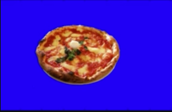
以下是我们要做的事情。

- 我们将搜索所有的蓝色像素
- 我们将创建一个遮罩，用黑色像素遮住所有披萨像素
- 我们将使用该蒙版将比萨饼从图像中切出来

为了使用gocv.InRange()函数，我们需要挑选下限和上限的像素值。我们将再一次使用HSV颜色模式。不过，棘手的部分是要弄清楚在HSV色彩空间中，蓝色的上界和下界应该是什么？在RGB色彩空间中，这很容易：[255, 0, 0]是绝对的蓝色--我们会根据经验在255附近选择范围值。在HSV色彩空间中，事情就不那么简单了。我们要做的是，为HSV色彩空间中的绝对蓝色找到HSV值，然后像这样挑选上下限值。[H-10, 100,100] 和 [H+10, 255, 255]。我们可以用以下程序得到这些像素值。

```go
func main() {
	blue := gocv.NewMatFromScalar(gocv.NewScalar(255.0, 0.0, 0.0, 0.0), gocv.MatTypeCV8UC3)
	gocv.CvtColor(blue, &blue, gocv.ColorBGRToHSV)
	hsv := gocv.Split(blue)
	fmt.Printf("H: %d S: %d V: %d\n", hsv[0].GetUCharAt(0, 0), hsv[1].GetUCharAt(0, 0), hsv[2].GetUCharAt(0, 0))
}
```
结果是:
```
H: 120 S: 255 V: 255
```
这意味着我们的蓝色背景的上限和下限值将是。[110, 100, 100]和[130, 255, 255]。
```go
func main() {
	// read image
	pizzaPath := filepath.Join("pizza.png")
	pizza := gocv.IMRead(pizzaPath, gocv.IMReadColor)
	if pizza.Empty() {
		fmt.Printf("Failed to read image: %s\n", pizzaPath)
		os.Exit(1)
	}
	// Convert BGR to HSV image (dont modify the original)
	hsvPizza := gocv.NewMat()
	gocv.CvtColor(pizza, &hsvPizza, gocv.ColorBGRToHSV)
	pizzaRows, pizzaCols := hsvPizza.Rows(), hsvPizza.Cols()
	// define HSV color upper and lower bound ranges
	lowerMask := gocv.NewMatWithSizeFromScalar(gocv.NewScalar(110.0, 50.0, 50.0, 0.0), pizzaRows, pizzaCols, gocv.MatTypeCV8UC3)
	upperMask := gocv.NewMatWithSizeFromScalar(gocv.NewScalar(130.0, 255.0, 255.0, 0.0), pizzaRows, pizzaCols, gocv.MatTypeCV8UC3)
	// global mask
	mask := gocv.NewMat()
	gocv.InRange(hsvPizza, lowerMask, upperMask, &mask)
	// cut out pizza mask
	pizzaMask := gocv.NewMat()
	gocv.Merge([]gocv.Mat{mask, mask, mask}, &pizzaMask)
	// cut out the pizza and convert back to BGR
	gocv.BitwiseAnd(hsvPizza, pizzaMask, &hsvPizza)
	gocv.CvtColor(hsvPizza, &hsvPizza, gocv.ColorHSVToBGR)
	// write image to filesystem
	outPizza := "no_pizza.jpeg"
	if ok := gocv.IMWrite(outPizza, hsvPizza); !ok {
		fmt.Printf("Failed to write image: %s\n", outPizza)
		os.Exit(1)
	}
	// write pizza mask to filesystem
	outPizzaMask := "no_pizza_mask.jpeg"
	if ok := gocv.IMWrite(outPizzaMask, mask); !ok {
		fmt.Printf("Failed to write image: %s\n", outPizza)
		os.Exit(1)
	}
}
```
注意，在分配gocv.Scalars来定义一些像素值时，你需要确保这些是3通道类型，因为HSV是3通道色彩空间；你可以为此使用gocv.MatTypeCV8UC3类型。

这就是我们把比萨饼切出来后得到的图像的样子。
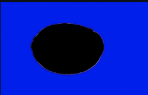
为了完整起见，让我们也显示一下通过gocv.InRange()阈值处理后的遮罩的样子。请注意，原始图像中的所有蓝色像素现在都是白色的，也就是说，这些像素现在的强度值是255，所有其他的像素--比萨饼的像素强度都被设置为0。
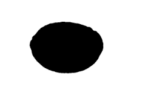

### 图像的形态变换

##### 仿射变换(affine transformation)
仿射变换是指图像可以通过一系列的几何变换来实现平移、旋转等多种操作。该变换能够保持图像的平直性和平行性。平直性是指图像经过仿射变换后，直线仍然是直线，平行性是指图像在完成仿射变换后，平行线仍然是平行线
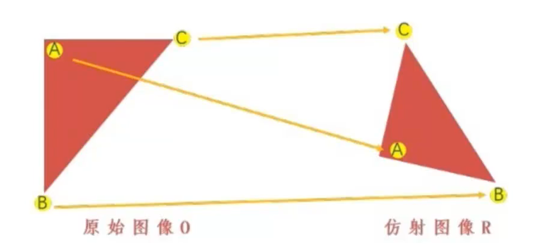
```go

```
###### 旋转
xy 都要发生变化
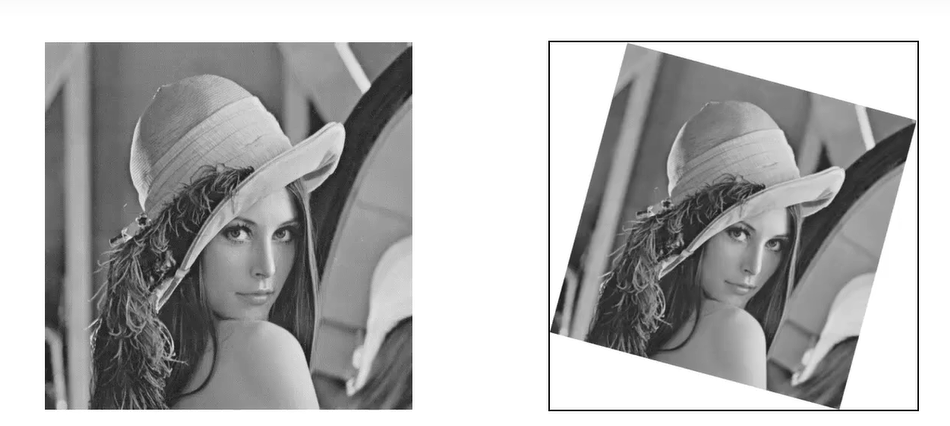
```go
func TestMy(t *testing.T) {
	imageFilePath := "./data/Lena.png"
	originalMat := gocv.IMRead(imageFilePath, gocv.IMReadGrayScale)
	if originalMat.Empty() {
		log.Panic("Can not read image: " + imageFilePath)
		return
	}

	originalWin := gocv.NewWindow("original win")
	defer originalWin.Close()
	originalWin.IMShow(originalMat)

	Win45 := gocv.NewWindow("45 win")
	defer Win45.Close()
	warpAffinedMat := gocv.NewMat()
    // 以原图像的中心点为中心
	mat := gocv.GetRotationMatrix2D(image.Point{X: originalMat.Rows() / 2, Y: originalMat.Rows() / 2}, -45, 1)
	// 第三个参数是参与变换的矩阵，第四个参数是输出图像的大小
	gocv.WarpAffine(originalMat, &warpAffinedMat, mat, image.Point{X: 0, Y: 0})
	Win45.IMShow(warpAffinedMat)
	// wait
	for {
		key := gocv.WaitKey(3)
		if key == 27 {
			log.Println("Pressed ESC")
			break
		}
	}
}
```

###### 平移
改变每一个像素的x，y的坐标
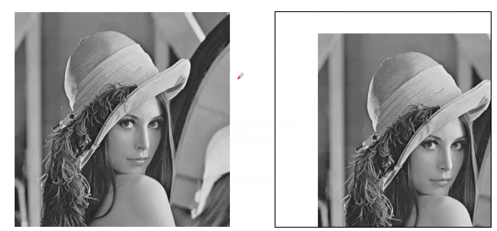
##### 镜像
镜像有水平镜像和垂直镜像.
水平：改变每个像素的x坐标(做翻转，关于y轴做对称)
垂直：x坐标不变，关于x周作对称
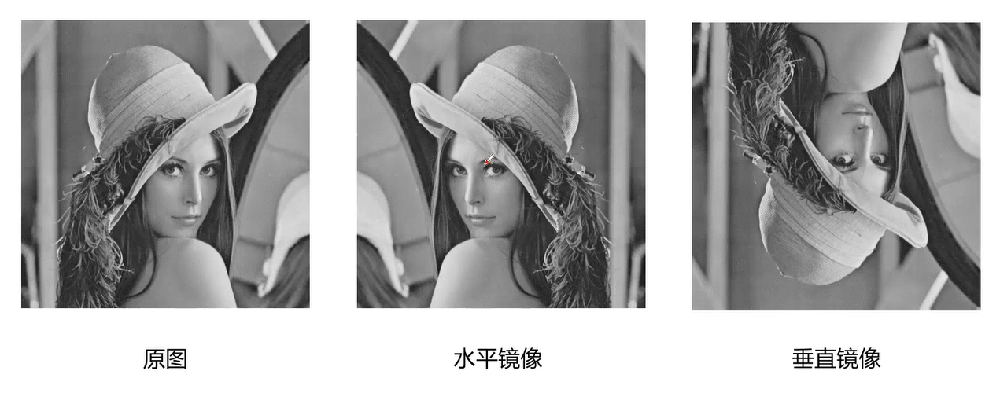

```go
func TestMy(t *testing.T) {
	imageFilePath := "./data/Lena.png"
	originalMat := gocv.IMRead(imageFilePath, gocv.IMReadGrayScale)
	if originalMat.Empty() {
		log.Panic("Can not read image: " + imageFilePath)
		return
	}

	originalWin := gocv.NewWindow("original win")
	defer originalWin.Close()
	originalWin.IMShow(originalMat)

	flipedMap := gocv.NewMat()
	// 第三个参数是翻转的方式
	// 0垂直镜像
	// 1水平镜像
	gocv.Flip(originalMat, &flipedMap, 0)
	yWin := gocv.NewWindow("y win")
	defer yWin.Close()
	yWin.IMShow(flipedMap)
	
	gocv.Flip(originalMat, &flipedMap, 1)
	xWin := gocv.NewWindow("x win")
	defer xWin.Close()
	xWin.IMShow(flipedMap)
	
	gocv.Flip(originalMat, &flipedMap, -1)
	Win := gocv.NewWindow(" win")
	defer Win.Close()
	Win.IMShow(flipedMap)
	// wait
	for {
		key := gocv.WaitKey(3)
		if key == 27 {
			log.Println("Pressed ESC")
			break
		}
	}
}
```


##### 透视变换
透视变换是将图片投影到一个新的视平面，也称作投影映射。它是二维 (x,y)到三维(X,Y,Z)，再到另一个二维(x,y’ )空间的映射相对于仿射变换，它提供了更大的灵活性，将一个四边形区域映射到另一个四边形区域(不一定是平行四边形).透视变换可用于**图像形状校正。**
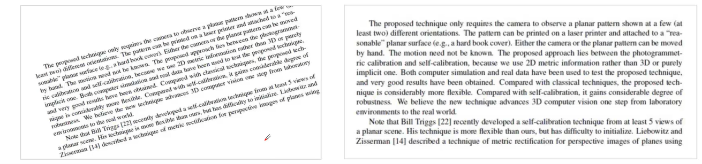
以下是透视变换的函数

```go
func GetPerspectiveTransform(src, dst []image.Point) Mat
func GetPerspectiveTransform2f(src, dst []Point2f) Mat
func WarpPerspective(src Mat, dst *Mat, m Mat, sz image.Point)
```

##### 图像的缩放
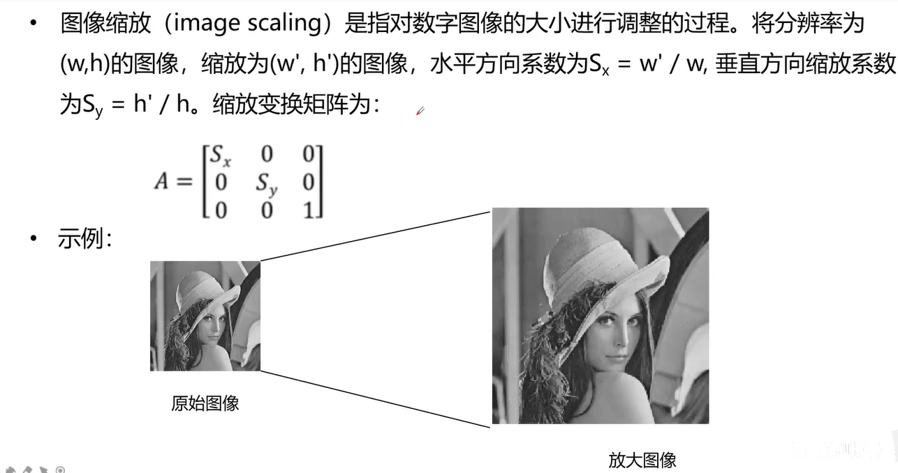
- 图像的缩小
图像缩小可以通过删除矩阵中的元素来实现，例如:下面的例子进行隔行隔列删除后，高度、宽度均减小为原来的一半
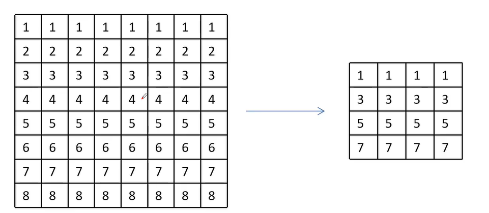
- 图像的放大
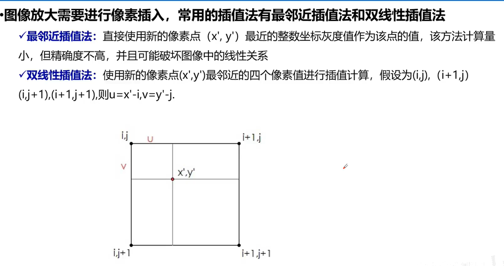

##### 图像的腐蚀
腐蚀是最基本的形态学操作之一，它能够将图像的边界点消除，使图像沿着边界向内收缩，也可以将小于指定结构体元素的部分去除。腐蚀用来“收缩”或者“细化二值图像中的前景，借此实现去除噪声、元素分割等功能
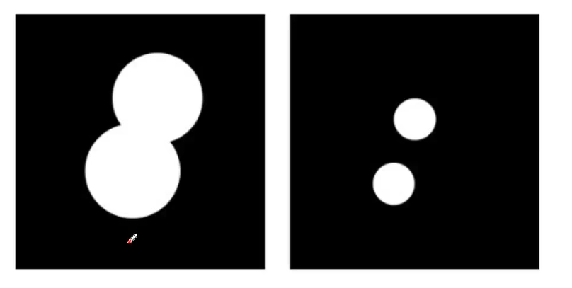
##### 图像的膨胀
图像膨胀(dilate)是指根据原图像的形状，向外进行扩充。如果图像内两个对象的距离较近，那么在膨胀的过程中，两个对象可能会连通在一起。膨胀操作对填补图像分割后图像内所存在的空白相当有帮助
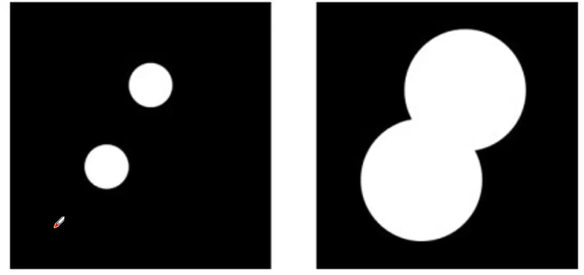
##### 图像的开运算
开运算进行的操作是先将图像腐蚀，再对腐蚀的结果进行膨胀。开运算可以用于去噪、计数等

开运算可用于取出主题图像之间细小的连接


##### 图像的闭运算
闭运算是先膨胀、后腐蚀的运算，它有助于关闭前景物体内部的小孔，或去除物体上的小黑点，还可以将不同的前景图像进行连接
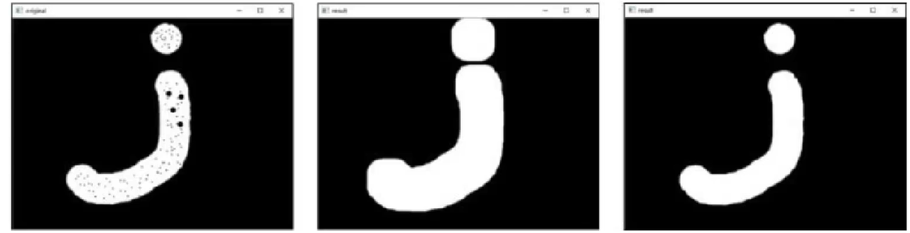
或者把两个物体连接起来
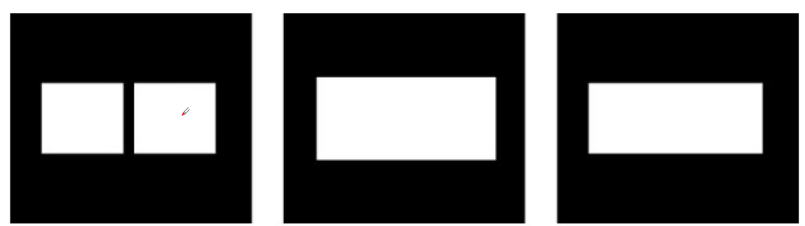

##### 形态学梯度
形态学梯度运算是用图像的膨胀图像 减去 腐蚀图像的操作，该操作可以获取原始图像中前景图像的边缘
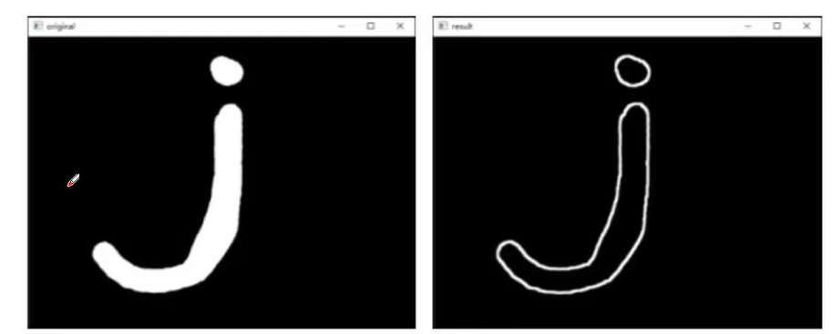

##### 礼帽运算
礼帽运算是用原始图像减去其开运算图像的操作。礼帽运算能够获取图像的噪声信息，或者得到比原始图像的边缘更亮的边缘信息。
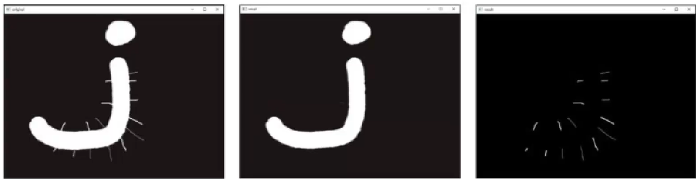
##### 黑帽运算
黑帽运算是用闭运算图像减去原始图像的操作。黑帽运算能够获取图像内部的小孔或前景色中的小黑点，或者得到比原始图像的边缘更暗的边缘部分
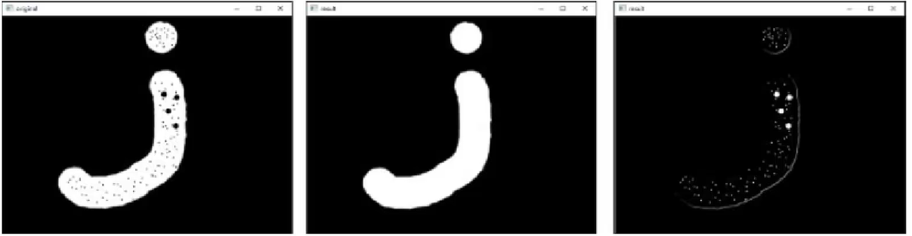

##### 图像的加/减法
**加法**
- 图像加法可以用于多幅图像平均去除噪声
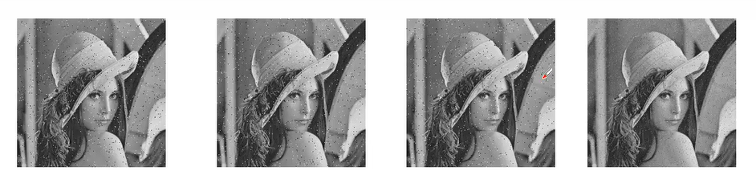
- 图像加法实现水印的叠加
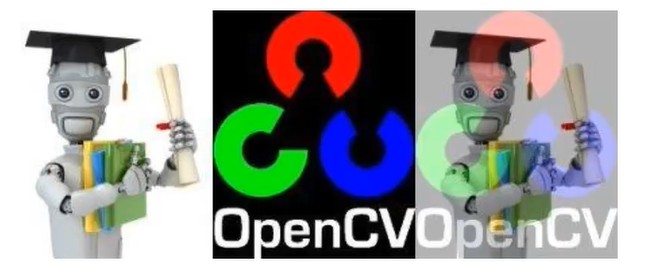

我们在做图像的加法时候不能做简单的图像叠加，否则会导致像素的值会越加越大，就会变得越白，一般来说我们是按照**权重**来加的

**减法**
图像减法是找出两幅图像的差异，可以在连续图像中可以实现消除背景和运动检测
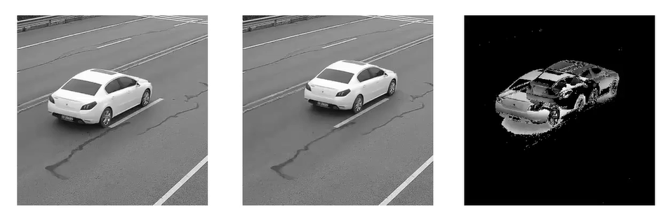


### 视频处理
#### 视频采集
##### VideoCapture: 从相机采集视频
  在不同的平台下使用的api是不一样的
  - linux: V4L2
  - windows: DSHOW
  - 安卓：ANDROID
  - ......
##### Read: 返回两个值
- 第一个为状态值读到帧为true
- 第二个值为视频帧

##### 示例
```go
func main() {
	capv, err := gocv.VideoCaptureDevice(0)
	if err != nil {
		log.Fatal(err)
	}
	defer capv.Close()

	win := gocv.NewWindow("test")
	defer win.Close()

	mat := gocv.NewMat()
	for {
		ok := capv.Read(&mat)
		if !ok {
			break
		}
		win.IMShow(mat)
		key := win.WaitKey(5)
		if key >= 0 {
			fmt.Println("quit")
			break
		}
	}

}
```

#### HSV空间，利用H色相实现图片场景分离, 比如将天空和白云朵分离

#### 本地视频文件
```go
func main() {
	capture, err := gocv.OpenVideoCapture("33.flv")
	if err != nil {
		log.Println("Can not find video: ", err)
		return
	}
	defer capture.Close()

	window := gocv.NewWindow("Video")
	defer window.Close()

	mat := gocv.NewMat()

	for {
		ok := capture.Read(&mat)
		if !ok {
			log.Println("Reached the end of the video")
			break
		}

		window.IMShow(mat)
		// 1000 /40 = 25 帧每秒
		key := window.WaitKey(40)
		if key >= 0 {
			break
		}

	}

}
```

#### 视频录制
VideoWriter
write
将原始视频帧按照特定的编码格式并压缩成多媒体文件，那么我们需要知道一个视频的帧率，分辨率和编码格式
```go
func main() {
	capture, err := gocv.VideoCaptureDevice(0)
	if err != nil {
		log.Println("Can not find video: ", err)
		return
	}
	defer capture.Close()

	window := gocv.NewWindow("Video")
	defer window.Close()

	buf := gocv.NewMat()
	if ok := capture.Read(&buf); !ok {
		fmt.Printf("Cannot read device %v\n", 0)
		return
	}

	// 分辨率一定要和摄像头的分辨率一致
	vw, err := gocv.VideoWriterFile("out.mp4", "mp4v", 25, buf.Cols(), buf.Rows(), true)
	if err != nil {
		log.Fatal(err)
	}
	defer vw.Close()

	for capture.IsOpened() {
		ok := capture.Read(&buf)
		if !ok {
			log.Println("Reached the end of the video")
			break
		}
		if buf.Empty() {
			continue
		}

		window.IMShow(buf)
		// 保存多媒体文件
		err = vw.Write(buf)
		if err != nil {
			break
		}
		key := window.WaitKey(1)
		if key >= 0 {
			break
		}
	}
}
```
```go
capture, err := gocv.VideoCaptureDevice(0)
	if err != nil {
		log.Panic("Can not find capture source")
		return
	}
	defer capture.Close()

	frameWidth := int(capture.Get(gocv.VideoCaptureFrameWidth))
	frameHeight := int(capture.Get(gocv.VideoCaptureFrameHeight))

	log.Println("Frame width:", frameWidth)
	log.Println("Frame height:", frameHeight)

	videoWriter, err := gocv.VideoWriterFile("./captured_video.avi", "X264", 25, frameWidth, frameHeight, true)
	if err != nil {
		log.Panic("Can not open video writer")
		return
	}
	defer videoWriter.Close()

	window := gocv.NewWindow("Frame")
	defer window.Close()

	mat := gocv.NewMat()

	for {
		capture.Read(&mat)

		if mat.Empty() {
			log.Fatal("Can not get frame")
			break
		}

		err = videoWriter.Write(mat)
		if err != nil {
			log.Panic("Can not write frame")
			break
		}

		window.IMShow(mat)

		key := window.WaitKey(1)
		if key == 27 {
			log.Println("Pressed ESC")
			break
		}
	}
```
#### 获取帧流属性，视频流属性
```go
func main() {
	videoPath := "../../data/drop.avi"
	err := printCaptureProperties(videoPath)
	if err != nil {
		log.Panic("Could not print capture properties: " + videoPath)
	}

	cameraNo := 0
	err = printCaptureProperties(cameraNo)
	if err != nil {
		log.Panic("Could not print capture properties: " + string(cameraNo))
	}
}

func printCaptureProperties(param interface{}) error {
	var capture *gocv.VideoCapture
	var err error

	switch param.(type) {
	case int:
		capture, err = gocv.VideoCaptureDevice(param.(int))
	case string:
		capture, err = gocv.VideoCaptureFile(param.(string))
	default:
		return errors.New(fmt.Sprintf("%v is not supported type(%T)", param, param))
	}

	if err != nil {
		log.Panic("Can not find capture source")
		return err
	}

	log.Println("--------------------")
	log.Println("Frame count:", capture.Get(gocv.VideoCaptureFrameCount))
	log.Println("Frame width:", capture.Get(gocv.VideoCaptureFrameWidth))
	log.Println("Frame height:", capture.Get(gocv.VideoCaptureFrameHeight))
	log.Println("Frame rate:", capture.Get(gocv.VideoCaptureFPS))

	return nil
}
```

#### 读取任意视频流帧
```go
func main() {
	capture, err := gocv.VideoCaptureFile("./data/drop.avi")
	if err != nil {
		log.Panic("Can not find video")
		return
	}
	defer capture.Close()

	frameCount := capture.Get(gocv.VideoCaptureFrameCount)
	log.Println("Frame Count:", frameCount)

	log.Println("Position:", int(capture.Get(gocv.VideoCapturePosFrames)))

	window1 := gocv.NewWindow("Window1")
	defer window1.Close()

	window2 := gocv.NewWindow("Window2")
	defer window2.Close()

	window3 := gocv.NewWindow("Window3")
	defer window3.Close()

	mat := gocv.NewMat()

	// window1
	log.Println("window1 Position:", capture.Get(gocv.VideoCapturePosFrames))
	ok := capture.Read(&mat)
	if !ok {
		log.Fatal("Can not read frame")
		return
	}

	window1.IMShow(mat)

	// window2
	log.Println("window2 Position:", capture.Get(gocv.VideoCapturePosFrames))
	ok = capture.Read(&mat)
	if !ok {
		log.Fatal("Can not read frame")
		return
	}

	window2.IMShow(mat)

	// window3
	capture.Set(gocv.VideoCapturePosFrames, 100)
	log.Println("window3 Position:", capture.Get(gocv.VideoCapturePosFrames))
	ok = capture.Read(&mat)
	if !ok {
		log.Fatal("Can not read frame")
		return
	}

	window3.IMShow(mat)

	for {
		key := gocv.WaitKey(3)
		if key == 27 {
			log.Println("Pressed ESC")
			break
		}
	}
}

```


### 鼠标控制
给窗口设置鼠标回调函数
setMouseCallback(winName, callback , params)
callback(event, x, y, flags, params)
- event: 鼠标参数，鼠标移动，左键右键
- x,y：鼠标坐标
- flags: 鼠标键及组合键

