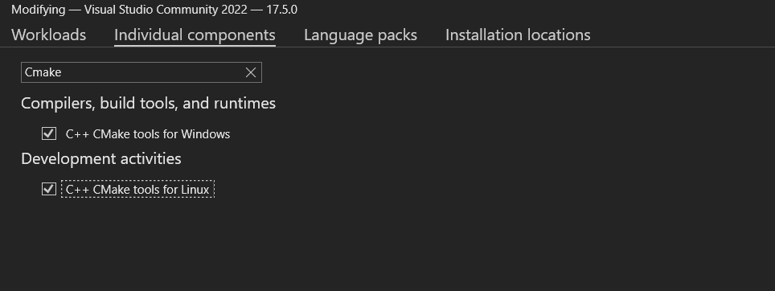

### python版
安装好python 及pip 
```
pip3 install numpy matplotlib opencv_python
```

### 源码安装opencv
#### window
依赖:
- cmake
- vs2017


##### 安装 VS 2017
社区版即可，下载地址：https://visualstudio.microsoft.com/zh-hans/downloads/
**必须安装**：

- Desktop development with C+ +
- 单个组件中搜索 Cmake 两个选项打上勾
- Visual Studio extension development



##### 安装 cmake

安装在默认路径

下载地址：https://github.com/Kitware/CMake/releases/download/v3.20.0-rc1/cmake-3.20.0-rc1-windows-x86_64.msi
https://github.com/Kitware/CMake/releases/download

1. opencv源码地址：https://github.com/opencv/opencv/releases

下载源码并解压
2. opencv-contrib源码地址：https://github.com/opencv/opencv_contrib/tags
下载对应opencv的版本并解压
将 opencv，opencv-contrib下载 C:\opencv中
C:\opencv目录下新建build目录
```shell
cd build
cmake C:\opencv\opencv-4.7.0 -G "MinGW Makefiles" -BC:\opencv\build -DENABLE_CXX11=ON -DOPENCV_EXTRA_MODULES_PATH=C:\opencv\opencv_contrib-4.7.0\modules -DBUILD_SHARED_LIBS=%enable_shared% -DWITH_IPP=OFF -DWITH_MSMF=OFF -DBUILD_EXAMPLES=OFF -DBUILD_TESTS=OFF -DBUILD_PERF_TESTS=OFF -DBUILD_opencv_java=OFF -DBUILD_opencv_python=OFF -DBUILD_opencv_python2=OFF -DBUILD_opencv_python3=OFF -DBUILD_DOCS=OFF -DENABLE_PRECOMPILED_HEADERS=OFF -DBUILD_opencv_saliency=OFF -DBUILD_opencv_wechat_qrcode=ON -DCPU_DISPATCH= -DOPENCV_GENERATE_PKGCONFIG=ON -DWITH_OPENCL_D3D11_NV=OFF -DOPENCV_ALLOCATOR_STATS_COUNTER_TYPE=int64_t -DWITH_FFMPEG=ON  -Wno-dev
```
如果需要编译更多扩展可以在cmake gui 中查看

打开科学上网多运行几遍，直到build目录下有Makefile 文件
```shell
mingw32-make -j6 # 开6个cpu核心来编译
或者 mingw32-make -j%NUMBER_OF_PROCESSORS%
mingw32-make install
```

将 C:\opencv\build\install\x64\mingw\bin 加入**path环境变量**

---

##### Cmake gui
编译时候需要去外网拉取依赖，需要打开科学上网
编译方法:

1. 在存放opencv源码目录中创建build目录
2. 运行cmake
- 选择opencv源码目录

- 选择编译目录(build)

- 人增加opencv-contrib选项

  搜索 OPENCV_EXTRA_MODULES_PATH, opencv-contrib源码的modules目录
  - 
  
- 其他扩展
搜索cuda, 并打勾（可能报错，貌似因特尔的显卡才可以，可以不装）
 
 如果安装cuda，搜索fast，并打勾2个
搜索nonfree, 并打勾
搜索type，去掉debug

- 点击配置（Configure）选择CPU架构（多配置几次直到不报红）
configure结束之后，没有错误之后，**一定要Generate！！！！！！**，不然想继续下面操作会报错： mingw32-make: *** No targets specified and no makefile found. Stop

可能出现问题：


- 检查编译选项
- 生成编译脚本

1）打开build目录 找到OpenCV.sln 双击使用vs打开
2）模式选择release
3）Build -> Build Solution 进行打包
4）右键右边的项目目录 CmakeTargets/INSTALL，就会在build目录中生成一个install目录

设置环境变量


### linux

https://docs.opencv.org/4.7.0/d7/d9f/tutorial_linux_install.html

https://www.ybliu.com/2020/06/how-to-install-opencv-and-opencvcontrib.html


### Windows中使用git-bash安装
https://docs.opencv.org/4.7.0/d3/d52/tutorial_windows_install.html
确保已经安装cmake 并且加入环境变量
创建shell脚本

```shell
#!/bin/bash -e
myRepo=$(pwd)
CMAKE_GENERATOR_OPTIONS=-G"Visual Studio 16 2019"
#CMAKE_GENERATOR_OPTIONS=-G"Visual Studio 15 2017 Win64"
#CMAKE_GENERATOR_OPTIONS=(-G"Visual Studio 16 2019" -A x64)  # CMake 3.14+ is required
if [  ! -d "$myRepo/opencv"  ]; then
    echo "cloning opencv"
    git clone https://github.com/opencv/opencv.git
else
    cd opencv
    git pull --rebase
    cd ..
fi
if [  ! -d "$myRepo/opencv_contrib"  ]; then
    echo "cloning opencv_contrib"
    git clone https://github.com/opencv/opencv_contrib.git
else
    cd opencv_contrib
    git pull --rebase
    cd ..
fi
RepoSource=opencv
mkdir -p build_opencv
pushd build_opencv
CMAKE_OPTIONS=(-DBUILD_PERF_TESTS:BOOL=OFF -DBUILD_TESTS:BOOL=OFF -DBUILD_DOCS:BOOL=OFF  -DWITH_CUDA:BOOL=OFF -DBUILD_EXAMPLES:BOOL=OFF -DINSTALL_CREATE_DISTRIB=ON)
set -x
cmake "${CMAKE_GENERATOR_OPTIONS[@]}" "${CMAKE_OPTIONS[@]}" -DOPENCV_EXTRA_MODULES_PATH="$myRepo"/opencv_contrib/modules -DCMAKE_INSTALL_PREFIX="$myRepo/install/$RepoSource" "$myRepo/$RepoSource"
echo "************************* $Source_DIR -->debug"
cmake --build .  --config debug
echo "************************* $Source_DIR -->release"
cmake --build .  --config release
cmake --build .  --target install --config release
cmake --build .  --target install --config debug
popd
```
可以修改Visual Studio 版本
比如：Visual Studio 17 2022 Win64


### 网上教程

https://zhuanlan.zhihu.com/p/488401407


在源码同一目录新建build目录
cd build
cmake ../opencv
