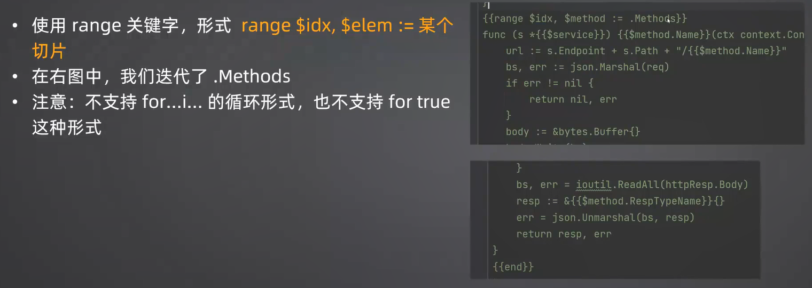

Go本身带了两个模板包，http/template和text/template。

两者功能相似，语法一致，可以认为http/template是text/template的加强版，主要就是增强了安全性。
- http/template：一般用于渲染页面
- text/template:常常用于各种代码生成

使用模板时，尽量避免使用复杂的模板特性。即将大多数事情在Go语言本身解决，而不要利用模板语言解决。


### 入门例子

#### 一般步骤:
- 创建一个模板实例:`template.New`，传入模板名字，在多个模板组合使用的时候可以按名索引

- 解析模板（预编译模板):调用`tpl.Parse`方法，传入的参数是模板的具体内容

  可以将模板定义在一个.gohtml 后缀的文件中，然后使用go 的embed工具读取出来。

  ```go
  // Go会读取tpl.gohtml里面的内容填充到变量tpl里面
  //go:embed tpl.gohtml
  var tpl string
  func main() {
      t := template.New("name")
      t.Parse(tpl)
  }
  ```

  

- 传入数据，渲染模板:调用 `Execute`方法，传入的参数作为模板渲染所使用的数据

```go
func TestTpl(t *testing.T) {
	type User struct {
		Name string
	}
	tpl := template.New("hello-world")
	tpl, err := tpl.Parse(`Hello, {{.Name}}`)
	if err != nil {
		t.Fatal(err)
	}
	bs :=&bytes.Buffer{}
	err = tpl.Execute(bs, &User{Name: "Tom"})
	if err != nil {
		t.Fatal(err)
	}
	assert.Equal(t, "Hello, Tom", bs.String())
}
```
#### 语法

- 使用{{}}来包裹模板语法
- 使用`.`来访问数据，`.`**代表的是当前作用域的当前对象**，类似于Java的 this、Python
的self。所以.Name代表的是访问传入的User 的 Name字段

- **要点**：要知道`.`究竟代表什么。它可以是普通结构体或者指针，也可以是map，也可以是切片或者数组。

```go
// map
tpl, err := tpl.Parse(`Hello, {{.Name}}`)
err = tpl.Execute(bs, map[string]string{"Name": "Tom"})

// 切片
tpl, err := tpl.Parse(`Hello, {{index . 0}}`)
err = tpl.Execute(bs, []string{"Tom"})
```
- 去空格和换行：-，注意要和别的元素用空格分开
- 声明变量：如同go语言，但是$来表示
$xxx := some_value

- 执行方法调用：形式"调用者.方法 参数1 参数2"。注意：方法调用的形式和go语言本身的调用形式差异很大。
```go
const serviceTpl = `
{{- $service := .GenName -}}
type {{  $service }}  struct {}
`
```

##### 方法调用


#####   循环



#####   间接for ...i 循环


#####   条件判断


#####   比较操作符

### 代码示例----- 为接口生成实现

背景：

在当下，很多时候我们需要调用别人的HTTP接口。但是普遍来说我们操作HTTP接口会比较繁琐，因为我们需要直接操作HTTP协议。

在这种情况下，我们可以考虑定义一个Go接口，并且为Go接口生成HTTP调用代码。

这也可以看做是最为轻量级的 RPC的实现。

注:这不是完整版。ServiceDefinition需要大家利用前面课程的AST技术从接口定义中抽取出来。


正常来说我们发起http调用
```go

type MyOrderServiceGen struct {
    Endpoint string
    Path string
	Client http.Client
}

func (s *MyOrderServiceGen) Create(ctx context.Context, req *CreateOrderReq) (*CreateOrderResp, error) {
	url := s.Endpoint + s.Path + "/Create"
	bs, err := json.Marshal(req)
	if err != nil {
		return nil, err
	}
	body := &bytes.Buffer{}
	body.Write(bs)
	httpReq, err := http.NewRequestWithContext(ctx, "POST", url, body)
	if err != nil {
		return nil, err
	}
	httpResp, err := s.Client.Do(httpReq)
	if err != nil {
		return nil, err
	}
	bs, err = ioutil.ReadAll(httpResp.Body)
	resp := &CreateOrderResp{}
	err = json.Unmarshal(bs, resp)
	return resp, err
}
```

```go
import (
	"io"
	"text/template"
)

type ServiceDefinition struct {
	Name    string
	Methods []Method
}

func (s *ServiceDefinition) GenName() string {
	return s.Name + "Gen"
}

type Method struct {
	Name         string
	ReqTypeName  string
	RespTypeName string
}

const serviceTpl = `
{{- $service :=.GenName -}}
type {{ $service }} struct {
    Endpoint string
    Path string
	Client http.Client
}
{{range $idx, $method := .Methods}}
func (s *{{$service}}) {{$method.Name}}(ctx context.Context, req *{{$method.ReqTypeName}}) (*{{$method.RespTypeName}}, error) {
	url := s.Endpoint + s.Path + "/{{$method.Name}}"
	bs, err := json.Marshal(req)
	if err != nil {
		return nil, err
	}
	body := &bytes.Buffer{}
	body.Write(bs)
	httpReq, err := http.NewRequestWithContext(ctx, "POST", url, body)
	if err != nil {
		return nil, err
	}
	httpResp, err := s.Client.Do(httpReq)
	if err != nil {
		return nil, err
	}
	bs, err = ioutil.ReadAll(httpResp.Body)
	resp := &{{$method.RespTypeName}}{}
	err = json.Unmarshal(bs, resp)
	return resp, err
}
{{end}}
`

func Gen(writer io.Writer, def *ServiceDefinition) error {
	tpl := template.New("service")
	tpl, err := tpl.Parse(serviceTpl)
	if err != nil {
		return err
	}
	// 还可以进一步调用 format.Source 来格式化生成代码
	return tpl.Execute(writer, def)
}

```
测试用例
```go
import (
	"bytes"
	"github.com/stretchr/testify/assert"
	"testing"
)

func TestGen(t *testing.T) {
	testCases := []struct {
		name    string
		def     *ServiceDefinition
		wantErr error
		wantGen string
	}{
		{
			name: "user service",
			def:  &ServiceDefinition{
				Name: "UserService",
				Methods: []Method{
					{
						Name: "Create",
						ReqTypeName: "User",
						RespTypeName: "User",
					},
					{
						Name: "Update",
						ReqTypeName: "User",
						RespTypeName: "UpdateUserResp",
					},
					{
						Name: "GetById",
						ReqTypeName: "GetUserReq",
						RespTypeName: "User",
					},
					{
						Name: "DeleteById",
						ReqTypeName: "DeleteByIdReq",
						RespTypeName: "DeleteByIdResp",
					},
				},
			},
			wantGen: `type UserServiceGen struct {
    Endpoint string
    Path string
	Client http.Client
}

func (s *UserServiceGen) Create(ctx context.Context, req *User) (*User, error) {
	url := s.Endpoint + s.Path + "/Create"
	bs, err := json.Marshal(req)
	if err != nil {
		return nil, err
	}
	body := &bytes.Buffer{}
	body.Write(bs)
	httpReq, err := http.NewRequestWithContext(ctx, "POST", url, body)
	if err != nil {
		return nil, err
	}
	httpResp, err := s.Client.Do(httpReq)
	if err != nil {
		return nil, err
	}
	bs, err = ioutil.ReadAll(httpResp.Body)
	resp := &User{}
	err = json.Unmarshal(bs, resp)
	return resp, err
}

func (s *UserServiceGen) Update(ctx context.Context, req *User) (*UpdateUserResp, error) {
	url := s.Endpoint + s.Path + "/Update"
	bs, err := json.Marshal(req)
	if err != nil {
		return nil, err
	}
	body := &bytes.Buffer{}
	body.Write(bs)
	httpReq, err := http.NewRequestWithContext(ctx, "POST", url, body)
	if err != nil {
		return nil, err
	}
	httpResp, err := s.Client.Do(httpReq)
	if err != nil {
		return nil, err
	}
	bs, err = ioutil.ReadAll(httpResp.Body)
	resp := &UpdateUserResp{}
	err = json.Unmarshal(bs, resp)
	return resp, err
}

func (s *UserServiceGen) GetById(ctx context.Context, req *GetUserReq) (*User, error) {
	url := s.Endpoint + s.Path + "/GetById"
	bs, err := json.Marshal(req)
	if err != nil {
		return nil, err
	}
	body := &bytes.Buffer{}
	body.Write(bs)
	httpReq, err := http.NewRequestWithContext(ctx, "POST", url, body)
	if err != nil {
		return nil, err
	}
	httpResp, err := s.Client.Do(httpReq)
	if err != nil {
		return nil, err
	}
	bs, err = ioutil.ReadAll(httpResp.Body)
	resp := &User{}
	err = json.Unmarshal(bs, resp)
	return resp, err
}

func (s *UserServiceGen) DeleteById(ctx context.Context, req *DeleteByIdReq) (*DeleteByIdResp, error) {
	url := s.Endpoint + s.Path + "/DeleteById"
	bs, err := json.Marshal(req)
	if err != nil {
		return nil, err
	}
	body := &bytes.Buffer{}
	body.Write(bs)
	httpReq, err := http.NewRequestWithContext(ctx, "POST", url, body)
	if err != nil {
		return nil, err
	}
	httpResp, err := s.Client.Do(httpReq)
	if err != nil {
		return nil, err
	}
	bs, err = ioutil.ReadAll(httpResp.Body)
	resp := &DeleteByIdResp{}
	err = json.Unmarshal(bs, resp)
	return resp, err
}

`,
		},
	}

	for _, tc := range testCases {
		t.Run(tc.name, func(t *testing.T) {
			bs := &bytes.Buffer{}
			err := Gen(bs, tc.def)
			assert.Equal(t, tc.wantErr, err)
			if err != nil {
				return
			}
			assert.Equal(t, tc.wantGen, bs.String())
		})
	}
}

```


### 递归调用
```go
package main

import (
	"bytes"
	"fmt"
	"testing"
	"text/template"
)

type Thing struct {
	Text   string
	Things []Thing
}

func TestTpl(t *testing.T) {
	RootHandler()
}

func RootHandler() {
	tmpl, err := template.New("root").Parse(`
		<html>
		{{ define "message" }}
			<li>{{ .Text }}
				{{ if gt (len .Things) 0}}
					<ul>
						{{ range .Things }}
						{{ template "message" . }}
						{{ end }}
					</ul>
				{{ end }}
			</li>
		{{ end }}
		<ul>{{ template "message" . }}</ul>
	`)
	data := Thing{
		Text: "Hello",
		Things: []Thing{
			{
				Text: "World",
				Things: []Thing{
					{
						Text: "ABC",
					},
				},
			},
			{
				Text: "World2",
			},
		},
	}
	bs := bytes.Buffer{}
	err = tmpl.Execute(&bs, data)
	if err != nil {
		//rw.WriteHeader(http.StatusInternalServerError)
		//fmt.Fprintln(rw, "Error:", err)
	}
	fmt.Println(bs.String())
}

```

### 模板渲染


### 面试要点


模板在日常工作中非常好用，面试的时候则主要聚焦在模板的语法上

- 模板的基本语法：变量声明、方法调用、循环、条件判断、操作符，以及一个比较常见的，就是怎么在模板里面实现 for ... i ...的循环
- 什么是前缀表达式（+ bc) ：也就是模板里面的那种语法，和中缀表达式（b+c）比起来，它更加贴近计算机的计算原理。所以模板用了前缀表达式，能够简化模板引擎的设计和实现
-  http/template和text/template有什么区别:前者多了对 HTTP 的支持，加强了安全性，例如特殊字符转义等。http/template 能够满足绝大多数页面渲染的要求
- 模板中的pipeline是什么?一串命令，pipeline之间可以通过|连在一起组成更加复杂的pipeline。单个命令可以是声明变量，也可以是方法调用
