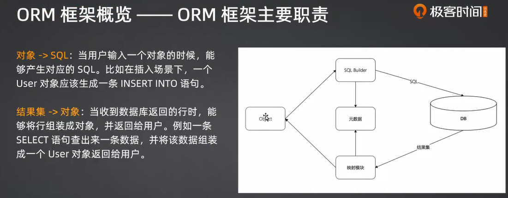
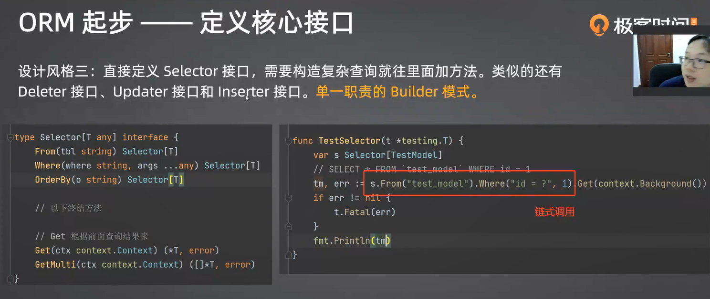
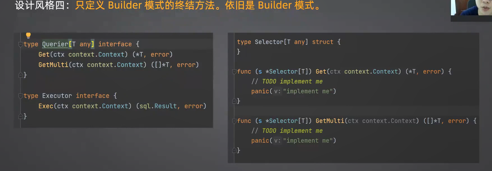
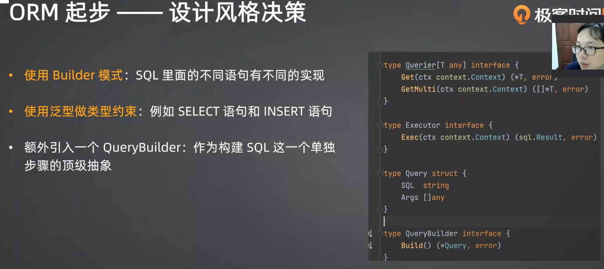

面试点：
ORM框架一般是面某个具体的框架，比如说GORM。但是总体上来说，这一类的面试都比较简单，讨论到具体知识点的时候我们会有针对性的问题:
- ORM框架的核心是什么? SQL构造和处理结果集。在别的语言里面，因为底层库可能不够强大，那么ORM 框架还要解决连接和会话管理的问题，Go是不需要的
- ORM是什么?ORM是指对象关系映射，一般是指用于语言对象和关系型数据库行相互转化的工具
- 为什么要使用ORM框架?从本质上来说，不使用ORM框架也是可以的，但是我们就要花费很多时间在处理拼接SQL，处理返回的行上，这些本身是不难但很琐碎的事情。所以我们需要一个ORM框架来帮我们解决这两个问题
- ORM的优点。基本上等同于上个问题，ORM的优点就是API对编程更加友好，开发效率更高
- 使用ORM性能会更好吗?显然不能，直接写SQL的性能最好

1分析使用场景
2总结功能需求非功能需求
3从2考虑api怎么设计(定义抽象，接口)
### ORM框架主要职责

