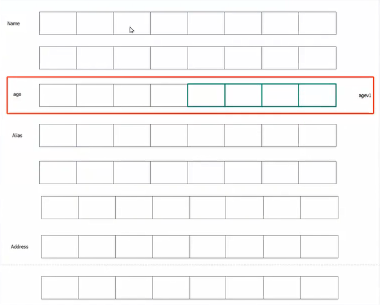
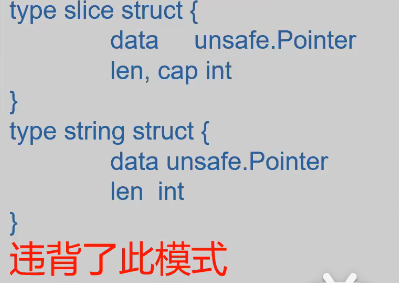

`unsafe.Pointer`：非类型安全指针类型
`*xxx` 都是类型安全指针，也就是除了`unsafe.Pointer`之外的指针， 如 `*int, *string...`等
所以 `*unsafe.Pointer`是以`unsafe.Pointer`为基类型的类型安全指针类型

## unsafe.Pointer 和uintptr，这两者都代表指针，那么有什么区别?
- unsafe.Pointer: 是 Go层面的指针，**GC会维护unsafe.Pointer的值**

- uintptr:直接就是一个数字，代表的是一个内存地址，所以uintptr是不靠谱的（uintptr不被gc接管），除了对指针的运算（加减）用uintptr外其余的都用Pointer。还可以用来表达**相对量**的概念，比如结构体字段的偏移量，地址的加减操作

## `unsafe.Pointer`简介
* 类似C语言中的无类型指针void*
* 借助`unsafe.Pointer`有时候可以挽回Go运行时(Go runtime)为了安全而牺牲的一些性能。
* 必须小心按照官方文档中的说明使用`unsafe.Pointer`。稍有不慎，将使Go类型系统（不包括非类型安全指针部分)精心设立内存安全壁垒的努力前功尽弃。
* 使用了`unsafe.Pointer`的代码不受Go 1兼容性保证。
* unsafe.Pointer 不是一个方法 是一种类型

**要理解unsafe，核心就是要理解Go中一个`对象`在内存中究竟是怎么布局的**
需要掌握:

- 计算地址
- 计算偏移量(这个字段是从哪字节开始的，有了类型信息后知道起始地址就知道占了多大空间，比如int32占4个字节，偏移量+4个字节)
- 直接操作内存

```GO
// PrintFieldOffset 用来打印字段偏移量
// 用于研究内存布局
// 只接受结构体作为输入
func PrintFieldOffset(entity any) {
	typ := reflect.TypeOf(entity)
	for i := 0; i < typ.NumField(); i++ {
		f := typ.Field(i)
		fmt.Println(f.Name, f.Offset)
	}
}

func main() {
	fmt.Println(unsafe.Sizeof(User{}))
	PrintFieldOffset(User{})

	fmt.Println(unsafe.Sizeof(UserV1{}))
	PrintFieldOffset(UserV1{})

	fmt.Println(unsafe.Sizeof(UserV2{}))
	PrintFieldOffset(UserV2{})
}

type User struct {
	Name    string
	age     int32
	Alias   []byte
	Address string
}

type UserV1 struct {
	Name    string
	age     int32
	agev1   int32
	Alias   []byte
	Address string
}

type UserV2 struct {
	Name    string
	Alias   []byte
	Address string
	age     int32
}
```
上面代码输出
```text
64
Name 0    
age 16    
Alias 24  
Address 48
64        
Name 0    
age 16    
agev1 20  
Alias 24  
Address 48
64        
Name 0    
Alias 16  
Address 40
age 56 
```
先分析第一个结构体输出，Name从0开始占16个字节，age是int32从16开始占4个字节，16+4 = 20，问题来了，Alias 为什么从24开始而不是20。在结合第二个结构体的输出agev1 20，核心在于它里面有个内存对齐的概念



## Go的对齐规则：

**按照字长对齐**。因为Go本身每一次访问内存都是按照字长的倍数来访问的（CPU访问内存都是按照字长的倍数来访问的）。

在32位字长机器上，就是按照4个字节对齐
在64位字长机器上，就是按照8个字节对齐

为什么 agev1 的偏移量为20，这种补齐只在相邻的两个字段存在，如果我们把agev1 20放到结构体的最后一个字段则 agev1 64

```go
type UserV1 struct {
	Name string
	age  int32
	Alias   []byte
	Address string
	agev1   int32
}
72        
Name 0    
age 16    
Alias 24  
Address 48
agev1 64
```
## (重点内容)使用unsafe来读取结构体字段
用unsafe取代部分反射操作来提升程序性能，把结果集的地址变成对象，直接用unsafe绕开了反射的那一套机制，减少了很多的内存分配

用unsafe取代反射的地方性能提升在组合(结构体组合结构体)的情况下效果会更好。普遍的使用组合会定义公共的entity，使用反射会经过两层处理，要先拿到嵌套的结构体然后在拿到嵌套的结构体的字段，但是使用unsafe就是一把梭哈 

**注意点:** 

- unsafe操作的是内存，本质上是对象的起始地址。

- 如果**嵌套的结构体是指针**，那么无法通过unsafe操作指针嵌套结构体内部的字段的

```go
type User1 struct {
	BaseEntity
	Id   int    `json:"id"`
	Pid  int    `json:"pid"`
	Name string `json:"name"`
}
type BaseEntity struct {
	createdTime int64
	updatedTime int64
}

// 嵌套指针对unsafe不友好
type User2 struct {
	*BaseEntity
	Id   int    `json:"id"`
	Pid  int    `json:"pid"`
	Name string `json:"name"`
}
```
**计算嵌套结构字段的地址**：
假设User1.BaseEntity 的地址是000那么BaseEntity.createdTime 的地址就是000 + 8

**读:** *(*T)(ptr)，T是目标类型，如果类型不知道，只能拿到反射的 Type，那么可以用reflect.NewAt(typ,ptr).Elem()。

**写:** *(*T)(ptr) =T，T是目标类型。

**ptr是结构体地址 + 字段偏移量:**
ptr=结构体起始地址(val.UnsafePointer())＋字段偏移量(fd.Offset)

起始地址，也就是结构体的地址 还可以通过反射 reflect.ValueOf(entity).Pointer(), 然后使用unsafe.Pointer(reflect.ValueOf(entity).Pointer()) 转成unsafe.Pointe

```go
type FieldAccessor interface {
	Field(field string) (int, error)
	SetField(field string, val int) error
}

type UnsafeAccessor struct {
	// 主要是字段偏移量
	fields     map[string]FieldMeta
	// 结构体的起始地址
	entityAddr unsafe.Pointer
}

func NewUnsafeAccessor(entity interface{}) (*UnsafeAccessor, error) {
	if entity == nil {
		return nil, errors.New("invalid entity")
	}
	val := reflect.ValueOf(entity)
	typ := reflect.TypeOf(entity)
	
	if typ.Kind() != reflect.Pointer || typ.Elem().Kind() != reflect.Struct {
		return nil, errors.New("invalid entity")
	}
	fields := make(map[string]FieldMeta, typ.Elem().NumField())
	elemType := typ.Elem()
	for i := 0; i < elemType.NumField(); i++ {
		fd := elemType.Field(i)
		fields[fd.Name] = FieldMeta{offset: fd.Offset, typ: fd.Type} // fd.Offset字段偏移量
	}
	up := val.UnsafePointer() // 结构体的起始地址
    //val.UnsafeAddr() 返回
	return &UnsafeAccessor{entityAddr: up, fields: fields}, nil
}

// Field 读int字段
func (u *UnsafeAccessor) Field(field string) (int, error) {
	fdMeta, ok := u.fields[field]
	if !ok {
		return 0, fmt.Errorf("invalid field %s", field)
	}
	// ptr = 结构体的起始地址 + 字段偏移量
	ptr := unsafe.Pointer(uintptr(u.entityAddr) + fdMeta.offset)
	if ptr == nil {
		return 0, fmt.Errorf("invalid address of the field: %s", field)
	}
	res := *(*int)(ptr)
	return res, nil
}

// FieldAny 读任意类型字段
func (u *UnsafeAccessor) FieldAny(field string) (any, error) {
	fdMeta, ok := u.fields[field]
	if !ok {
		return 0, fmt.Errorf("invalid field %s", field)
	}
	// ptr = 结构体的起始地址 + 字段偏移量
	ptr := unsafe.Pointer(uintptr(u.entityAddr) + fdMeta.offset)
	if ptr == nil {
		return 0, fmt.Errorf("invalid address of the field: %s", field)
	}
	// NewAt的用法：在unsafe.Pointer的地址上（这个地址上本身已经存放了数据）创建指定的新反射类型对象
	res := reflect.NewAt(fdMeta.typ, ptr)
	return res.Interface(), nil
}

func (u *UnsafeAccessor) SetField(field string, val int) error {
	fdMeta, ok := u.fields[field]
	if !ok {
		return fmt.Errorf("invalid field %s", field)
	}
	ptr := unsafe.Pointer(uintptr(u.entityAddr) + fdMeta.offset)
	if ptr == nil {
		return fmt.Errorf("invalid address of the field: %s", field)
	}
	*(*int)(ptr) = val
	return nil
}
func (u *UnsafeAccessor) SetFieldAny(field string, val int) error {
	fdMeta, ok := u.fields[field]
	if !ok {
		return fmt.Errorf("invalid field %s", field)
	}
	ptr := unsafe.Pointer(uintptr(u.entityAddr) + fdMeta.offset)
	if ptr == nil {
		return fmt.Errorf("invalid address of the field: %s", field)
	}
	val := reflect.NewAt(f.typ, ptr)
	if val.Kind() == reflect.Ptr {
		val = val.Elem()
	}
	if val.CanSet() {
		val.Set(reflect.ValueOf(v))
	}
	return nil
}

type FieldMeta struct {
	// offset 后期在我们考虑组合，或者复杂类型字段的时候，它的含义衍生为表达相当于最外层的结构体的偏移量
	offset uintptr
    typ    reflect.Type
}


// xxx_test.go 测试用例
func TestUnsafeAccessor_Field(t *testing.T) {
	testCases := []struct {
		name    string
		entity  interface{}
		field   string
		wantVal int
		wantErr error
	}{
		{
			name:    "normal case",
			entity:  &User{Age: 18},
			field:   "Age",
			wantVal: 18,
		},
	}

	for _, tc := range testCases {
		t.Run(tc.name, func(t *testing.T) {
			accessor, err := NewUnsafeAccessor(tc.entity)
			if err != nil {
				assert.Equal(t, tc.wantErr, err)
				return
			}
			val, err := accessor.Field(tc.field)
			assert.Equal(t, tc.wantErr, err)
			if err != nil {
				return
			}
			assert.Equal(t, tc.wantVal, val)
		})
	}
}

func TestUnsafeAccessor_SetField(t *testing.T) {
	testCases := []struct {
		name    string
		entity  *User
		field   string
		newVal  int
		wantErr error
	}{
		{
			name:   "normal case",
			entity: &User{},
			field:  "Age",
			newVal: 18,
		},
	}

	for _, tc := range testCases {
		t.Run(tc.name, func(t *testing.T) {
			accessor, err := NewUnsafeAccessor(tc.entity)
			if err != nil {
				assert.Equal(t, tc.wantErr, err)
				return
			}
			err = accessor.SetField(tc.field, tc.newVal)
			assert.Equal(t, tc.wantErr, err)
			if err != nil {
				return
			}
			assert.Equal(t, tc.newVal, tc.entity.Age)
		})
	}
}

type User struct {
	Age int
}
```

## `unsafe.Pointer`相关类型转换编译规则

1. 一个类型安全指针值可以被显式转换为一个非类型安全指针类型（
unsafe.Pointer)，反之亦然。
2. 一个uintptr值可以被显式转换为一个非类型安全指针类型，反之亦然。

> 注意:这些规则是编译器接收的规则。满足这些规则的代码编译没问题，但并不意味着在运行的时候是安全的。在使用非类型安全指针时，必须遵循一些原则以防止不安全的情况发生。

## 使用unsafe.Pointer的基本运行时原则
1. 保证要使用的值在unsafe操作前后时时刻刻要被有效的指针引用着，无论类型安全指针还是非类型安全指针。否则此值有可能被垃圾回收器回收掉（go支持垃圾自动回收）。
2. 任何指针都不应该引用未知内存块。

## 非类型安全指针相关的事实
* 事实一：非类型安全指针值是指针但`uintptr`值是整数。整数从来不会引用其它值。
* * 注意：go只有指针会直接引用其他指针
* 事实二：不再被使用的内存块的回收时间点是不确定的
* * 注意：go支持GC自动回收的，所以什么时候回收是不可预测的
* 事实三:某些值的地址在程序运行中可能改变
* * *有些值和地址在程序运行过程中是可以改变的，就是开在栈上的值 如果是一个指针 那么这个值在程序运行过程中发生改变*
* 事实四：一个值的生命范围可能并没有代码中看上去的大
* 事实五：`*unsafe.Pointer`是一个类型安全指针类型，它的基类型是`unsafe.Pointer`

## 简单介绍一下垃圾回收机制
三色算法:
1. 在每一轮垃圾回收过程的开始，所有的内存块将被标记为白色。然后垃圾回收器将所有开辟在栈和全局内存区上的内存块标记为灰色，并把它们加入一个灰色内存块列表。
2. 循环直到灰色内存块列表直到其为空:从个灰色内存块列表中取出一个内存块，并把它标记为黑色。然后扫描承载在此内存块上的指针值，并通过这些指针找到它们引用着的内存块。如果一个引用着的内存块为白色的，则将其标记为灰色并加入灰色内存块列表;否则，忽略之。
3. 最后仍然标记为白色的内存快将被视为垃圾而回收掉。

## 事实一:非类型安全指针值是指针但`uintptr`值是整数
`uintptr`值中时常用来存储内存地址值，但是一个`uintptr`值并不引用着存储于其中的地址处的值，所以此`uintptr`值仍在被使用的事实无法防止存储于其中的地址处的值被垃圾回收.

垃圾回收器同等对待类型安全指针和非类型安全指针。只有指针可以直接引用其它值。

## 事实二:不再被使用的内存块的回收时间点是不确定的
启动一轮新的垃圾回收过程的途径:
* GOGC环境变量， 或者`runtime/debug.SetGCPercent`
* 调用`runtime.GC`函数来手动开启
* 最大垃圾回收时间间隔为两分钟
并发，写屏障(write barrier)等细节。

## 事实三:某些值的地址在程序运行中可能改变
&emsp;&emsp;为了提高程序性能，每个协程维护着一个栈（一段连续内存块，64位系统上初始为2k)。在程序运行时，一个协程的栈的大小可能会根据需要而伸缩。当一个栈的大小改变时，runtime需要开辟一段新的连续内存块，并把老的连续内存块上的值复制（移动)到新的连续内存块上，从而相应地，开辟在此栈上的指针值中存储的地址可能将改变(如果此地址值处于老的连续内存块上)。

即:目前开辟在栈上的值的地址可能会发生改变;开辟在栈上的的指针值中存储的值可能会自动改变。


## 事实四:一个值的生命范围可能并没有代码中看上去的大
```go
type T struct {x int; y *[1024]byte}
func bar() {
    t := T{y: new([1<<23]byte)}
    // 任何一个普通指针(&t.y[O])可以显示转换成为非类型安全指针(unsafe.Pointer()),一个非类型安全指针可以转换为整数类型指针(uintptr())
    p := uintptr(unsafe.Pointer(&t.y[O]))
    //一个聪明的编译器能够觉察到值t.y将不会再被用到而回收之。
    *(*byte)(unsafe.Pointer(p))= 1//危险操作!
    println(t.x)// ok。继续使用值t，但只使用t.x字段。
}
```

## 事实五: `*unsafe.Pointer`是一个类型安全指针类型(这个对指针值的原子操作很有用)
`unsafe.Pointer` 可以和*`unsafe.Pointer` 相互转换，这个对指针值的原子操作很有用

```go
func main() {
    type T struct {x int}
    var p *T
    var unsafePPT = (*unsafe.Pointer)(unsafe.Pointer(&p))
    atomic.StorePointer(unsafePPT, unsafe.Pointer(&T{123}))
    fmt.Println(p)// &{123}
}
```

## 使用：

### 使用模式1:  将类型`*T1`的一个值转换为非类型安全指针值，然后将此非类型安全指针值转换为类型安全指针`*T2`

> 注意：T1的尺寸不小于T2(也就是尺寸大的可以转成小的，小的不能转成大的)
```go
func Float64bits(f float64) uint64 {
	return *(*uint64)(unsafe.Pointer(&f))
}

func Float64frombits(b uint64) float64 {
	return *(*float64)(unsafe.Pointer(&b))
}

// 字节切片转字符串
//strings标准库包中strings.Builder.String()方法的实现
func ByteSlice2String(b []byte) string {
	return *(*string)(unsafe.Pointer(&b))
}


```

#### 反例，错误例子
```go
func String2ByteSlice(s string) []byte {
	return *(*[]byte)(unsafe.Pointer(&s))
}
x := String2ByteSlice("abc")
fmt.Println(x)              // [97 98 99]
fmt.Println(len(x), cap(x)) // 3 824634949488
// cap()出来的值是随机的值,所以cap 出问题了，找不到本来的内存了，也就是违背了T1的尺寸要不小于T2

// 违背了刺模式， T1的尺寸不小于T2
type slice struct {
    data unsafe.Pointer
    len, cap int
}
type string struct {
    data unsafe.Pointer
    len int
}
```


改成：
```go
type StringEx struct {
	string
	cap int
}

func String2ByteSlice(s string) []byte {
	se := StringEx{
		string: s,
		cap:    len(s),
	}
	return *(*[]byte)(unsafe.Pointer(&se))
}
```
此时T1 的尺寸 = T2 的尺寸， 这样就ok


## 使用模式2:将一个非类型安全指针值转换为一个uintptr值，然后使用此uintptr值
> 不是太有用
```go
func main() {
	type T struct{ a int }
	var t T
	fmt.Printf("%p\n", &t)                          //Oxc6233120a8
	println(&t)                                     //Oxc6233120a8
	fmt.Printf("%x\n", uintptr(unsafe.Pointer(&t))) // c6233120a8
}
```
都可以得到内存地址，更推荐前两种做饭


## 使用模式3:将一个非类型安全指针转换为一个uintptr值，然后此uintptr值参与各种算术运算，再将算术运算的结果uintptr值转回非类型安全指针
有点C的感觉了
```go
ptr2 = unsafe.Pointer(Lintptr(ptr1) + offset)
ptr2 = unsafe.Pointer(uintptr(ptr1) &^7)//8字节对齐
```
> 要求:
> 1. 转换前后的非类型安全指针（这里的ptr1和ptr2）必须指向同一个内存块。
> 2. 两次转换必须在同一条语句中。

uintptr 可以进行指针运算
### 例子一
```go
type T struct {
	x bool
	y [3]int16
}
const N = unsafe.Offsetof(T{}.y)
const M = unsafe.Sizeof(T{}.y[0])

func main() {
	t := T{y: [3]int16{123, 456, 789}}
	p := unsafe.Pointer(&t)
	ty2 := (*int16)(unsafe.Pointer(uintptr(p) + N + M + M))
	fmt.Println(*ty2) // 789
}

```

### 例子二
```go
type T struct {
	x bool
	y [3]int16
}

var t = T{y: [3]int16{123, 456, 789}}

const N = unsafe.Offsetof(T{}.y)

func y2t(yAddr unsafe.Pointer) *T {
	return (*T)(unsafe.Pointer(uintptr(yAddr) - N))
}

func main() {
	fmt.Println(y2t(unsafe.Pointer(&t.y))) // &{false [123 456 789]}
}

```

### 错误例子一
```go
type T struct {
	x bool
	y [3]int16
}

const N = unsafe.Offsetof(T{}.y)
const M = unsafe.Sizeof(T{}.y[0])

func main() {
	t := T{y: [3]int16{123, 456, 789}}
	p := unsafe.Pointer(&t)
	// 不符合要求2 ，必须放在一条语句里面
	addr := uintptr(p) + N + M + M
	ty2 := (*int16)(unsafe.Pointer(addr))
	....
}
```
### 错误例子二
不符合要求2 ，必须放在一条语句里面
```go
func main() {
	var a int
	DoSomething(uintptr(unsafe.Pointer(&a)))
}

// 假设此函数不会被内联
func DoSomething(addr uintptr) {
	ptr := unsafe.Pointer(addr)
	// 对处于传递进来的地址的值进行读写
	*(*int)(ptr) = 123
}
```

### 错误例子三
https://gfw.go101.org/article/unofficial-faq.htmI#final-zero-size-field
```go
type T struct {
	x bool
	y [3]int16
}

const N = unsafe.Offsetof(T{}.y)
const M = unsafe.Sizeof(T{}.y[0])

func main() {
	t := T{y: [3]int16{123, 456, 789}}
	p := unsafe.Pointer(&t)
	ty2 := (*int16)(unsafe.Pointer(uintptr(p) + N + M + M + M))
	...
}
```


## 使用模式4:需要将reflect.Value.Pointer或者reflect.Value.UnsafeAddr方法的uintptr返回值转换为非类型安全指针

设计目的:避免不引用unsafe包就可以将这两个方法的返回值（如果是unsafe.Pointer类型）转换为任何类型安全指针类型。

不立即转换为unsafe.Pointer，将出现一个可能导致处于返回的地址处的内存块被回收掉的时间窗。
### 使用模式4:需要将reflect.Value.Pointer或者reflect.Value.UnsafeAddr方法的uintptr返回值转换为非类型安全指针
```go
p :=(*int)(unsafe.Pointer(reflect.ValueOf(new(int)).Pointer()))l/ ok
//而下面这样使用是危险的:
u := reflect.ValueOf(new(int)).Pointer()
/在这个时刻，处于存储在u中的地址处的内存块可能会被回收掉。p :=(*int)(unsafe.Pointer(u))
```

## 使用模式5: reflect.SliceHeader或者reflect.StringHeader值的Data字段和非类型安全指针之间的相互转换

```go
type SliceHeader struct {
	Data uintptr
	Len  int
	cap  int
}
type StringHeader struct {
	Data uintptr
	Len  int
}
```
reflect.SliceHeader和切片的内部结构一致;reflect.StringHeader和字符串的内部结构一致。使用原则:
不要凭空生成`SliceHeader`和`StringHeader`，要从切片和字符串转换出它们。

例子1：
编译没问题，也符合基本运行时原则。但是不推荐这么做,因为这打破了对字符串的不变性的预期。结果字符串不应传递给外部使用。

如果返回s， a可能会被回收， 读s会发生乱码

```go
func main() {
	a := [...]byte{'G', 'o','l', 'a', 'n', 'g'}
	s := "Java"
	hdr := (*reflect.StringHeader)(unsafe.Pointer(&s))
	hdr.Data = uintptr(unsafe.Pointer(&a))
	hdr.Len = len(a)
	fmt.Println(s) // Golang
	//现在，字符串s和切片a共享着底层的byte字节序列
	a[2], a[3], a[4], a[5] = 'o', 'g', 'l', 'e'
	fmt.Println(s)// Google
}
```

例子2：
这种方法比前面String2ByteSlice慢一点点，但是还是非常快

```go
func String2ByteSlice(str string) (bs []byte) {
	strHr := (*reflect.StringHeader)(unsafe.Pointer(&str))
	sliceHr := (*reflect.SliceHeader)(unsafe.Pointer(&bs))
	sliceHr.Data = strHr.Data
	sliceHr.Cap = strHr.Len
	sliceHr.Len = strHr.Len
	runtime.KeepAlive(&str) // 这里是必须的, str到这个位置为止都不会补gc回收掉 
	return
}
```


## 总结
* 非类型安全机制可以帮助我们写出运行效率更高的代码。
* 但是使用不当，将造成—些重现几率非常低的微妙的bug
* 我们应该知晓当前的非类型安全机制规则和使用模式可能在以后的Go版本中完全失效。当然，目前没有任何迹象表明这种变化将很快会来到。但是，一旦发生这种变化，前面列出的当前是正确的代码将变得不再安全甚至编译不通过。


#### String转[]byte的两种方法. 将[]byte 转成slice
```go
// 第一种
str := "abc"
fmt.Println([]byte(str))
// 第二种使用unsafe 
strHeader := (*reflect.StringHeader)(unsafe.Pointer(&str))
fmt.Println(strHeader.Data)
// unsafe.Pointer 不是一个方法。先将 string 强制转换成unsafe.Pointer, 再将unsafe.Pointer转成reflect.StringHeader
// 将[]byte 转成slice
strHeader := (*reflect.StringHeader)(unsafe.Pointer(&str))
var strByte []byte
slictHeader := (*reflect.SliceHeader)(unsafe.Pointer(&strByte))
slictHeader.Data = strHeader.Data
slictHeader.Cap = strHeader.Len
slictHeader.Len = strHeader.Len

// 将slice转换成[]byte
b := (*[]byte)(unsafe.Pointer(slictHeader))
fmt.Println(*b)
```
#### struct转[]byte的两种方法
```go
type User struct {
	ID   int
	Name string
}

func main() {
	user := &User{
		ID:   10,
		Name: "zs",
	}
	// 第一种:
	bs, _ := json.Marshal(user)
	fmt.Println(bs)
	// 第二种
	var b []byte
	size := unsafe.Sizeof(*user)
	byteHeader := (*reflect.SliceHeader)(unsafe.Pointer(&b))
	byteHeader.Len = int(size)
	byteHeader.Cap = int(size)
	byteHeader.Data = uintptr(unsafe.Pointer(user))
	fmt.Println(b)
}
```
## 面试要点

- uintptr和unsafe.Pointer的区别：
前者代表的是一个具体的地址，后者代表的是一个逻辑上的指针。后者在GC等情况下，go runtime 会帮你调整，使其永远指向真实存放对象的地址。

- Go对象是怎么对齐的?
按照字长。有些比较恶心的面试官可能要你手动演示如何对齐，或者写一个对象问你怎么计算对象的大小。

- 怎么计算对象地址?
对象的起始地址是通过反射来获取，对象内部字段的地址是通过起始地址＋字段偏移量来计算。
- unsafe为什么比反射高效?
可以简单认为反射帮我们封装了很多unsafe的操作，所以我们直接使用unsafe绕开了这种封装的开销。有点像是我们不用ORM框架，而是直接自己写SQL执行查询。