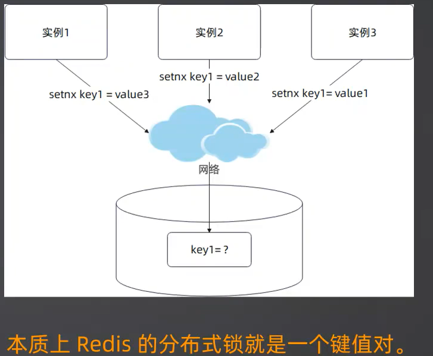
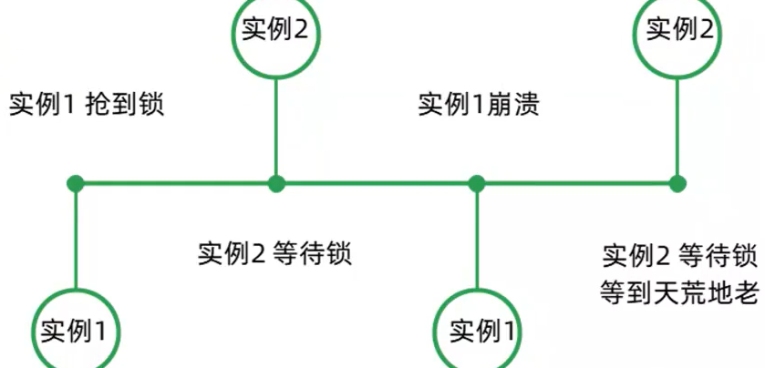
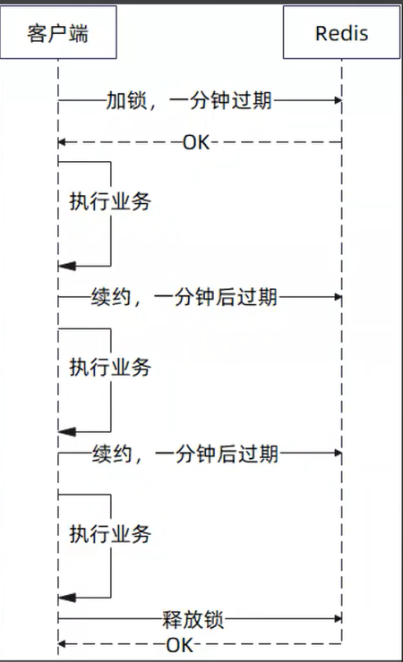
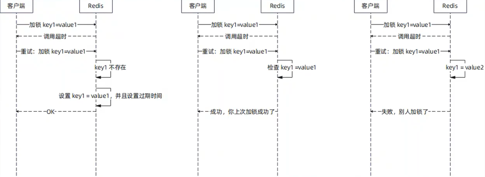
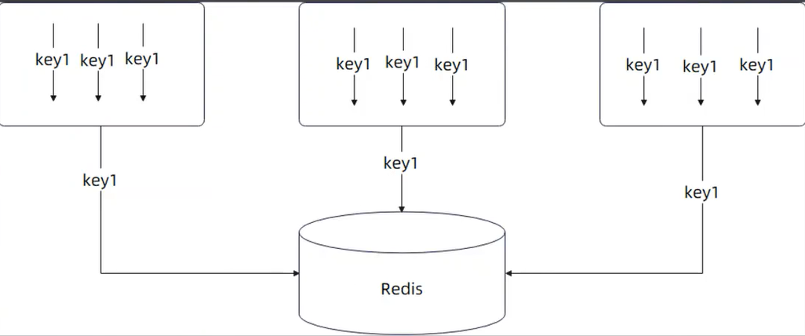

### 什么是分布式锁
分布式锁，简单来说就是在分布式环境下不同实例之间抢一把锁。
和普通的锁比起来，也就是抢锁的从线程(协程)变成了实例。
分布式锁之所以难，基本上都和网络有关

实现一个分布式锁的起点，就是利用 setnx 命令，**确保可以排他地设置一个键值对。**

```go

```
### 一系列问题：

- **没有过期时间**

  如果没有过期时间，那么原本加锁的实例崩溃之后，永远也没有人去释放锁。
  

- **解锁时锁不是自己的? **
  
- 本质上，我们就是需要一个唯一的值，用来比较这是某个实例加的锁。
  UUID 就成了一个不错的选择。当然也可以使用其它的值，只要确保同一把锁的值不会冲突就可以。
  
  实例1 在释放锁的时候，根本没有检查是不是自己加的锁，所以会把实例2 的锁释放掉

- **过期时间设置多长？**

  对于锁的用户来说，他很难确定锁的过期时间应该设置多长:

  - 设置短了，那么业务还没完成，锁就过期了
  - 设置长了，万一实例崩溃了，那么其它实例也长时间拿不到锁。

  更严重的是，不管你设置多长，极端情况下，都会出现业务执行时间超过过期时间
  

  - **解决方案：续约**
   我们可以考虑在锁还没有过期的时候，再一次延长过期时间，那么
   - - **过期时间不必设置得很长**，自动续约会帮我们设置好
   - - 如果实例崩溃了，则没有人再续约，过一段时间之后自然就会过期，其它实例就能拿到锁了
  
- 加锁重试
加锁可能遇到偶发性的失败，在这种情况下，可以尝试重试。重试逻辑:
  - 如果超时了，则直接加锁。
  - 检查一下 key 对应的值是不是我们刚才超时加锁请求的值，如果是，直接返回，前一次加锁成功了(这里你可能需要考虑重置一下过期时间)
  - 如果不是，直接返回，加锁失败。

### 使用singleflight 优化
在非常高并发并且热点集中的情况下（一般情况下不需要），可以考虑结合 singleflight 来进行优化。也就是说，本地所有的 goroutine 自己先竞争一把，胜利者再去抢全局的分布式锁


### 完整代码
#### lock.go
```go
package rlock

import (
	"context"
	_ "embed"
	"errors"
	"fmt"
	"sync"
	"time"

	"github.com/go-redis/redis/v9"
	"github.com/google/uuid"
	"golang.org/x/sync/singleflight"
)

var (
	//go:embed script/lua/unlock.lua
	luaUnlock string
	//go:embed script/lua/refresh.lua
	luaRefresh string

	//go:embed script/lua/lock.lua
	luaLock string

	ErrFailedToPreemptLock = errors.New("rlock: 抢锁失败")
	// ErrLockNotHold 一般是出现在你预期你本来持有锁，结果却没有持有锁的地方
	// 比如说当你尝试释放锁的时候，可能得到这个错误
	// 这一般意味着有人绕开了 rlock 的控制，直接操作了 Redis
	ErrLockNotHold = errors.New("rlock: 未持有锁")
)

type Client struct {
	client redis.Cmdable
	g      singleflight.Group
	// valuer 用于生成值，将来可以考虑暴露出去允许用户自定义
	valuer func() string
}

func NewClient(client redis.Cmdable) *Client {
	return &Client{
		client: client,
		valuer: func() string {
			return uuid.New().String()
		},
	}
}

func (c *Client) SingleflightLock(ctx context.Context, key string, expiration time.Duration, retry RetryStrategy, timeout time.Duration) (*Lock, error) {
	for {
		flag := false
		result := c.g.DoChan(key, func() (interface{}, error) {
			flag = true
			return c.Lock(ctx, key, expiration, retry, timeout)
		})
		select {
		case res := <-result:
			if flag {
				c.g.Forget(key)
				if res.Err != nil {
					return nil, res.Err
				}
				return res.Val.(*Lock), nil
			}
		case <-ctx.Done():
			return nil, ctx.Err()
		}
	}
}

// 转交的做法
// func (c *Client) LockV1(ctx context.Context, key string, expiration time.Duration) (*Lock, error) {
// 	keysWaitingChan := make(map[string]*Lock, 1)
// 	l, ok := keysWaitingChan[key]
// 	if !ok {
// 		// 尝试自己去拿
// 	}
// 	select {
// 		case <- l.waiting:
// 			case <- ctx.Done():
//
// 	}
//
// }

// Lock 是尽可能重试减少加锁失败的可能
// Lock 会在超时或者锁正被人持有的时候进行重试
// 最后返回的 error 使用 errors.Is 判断，可能是：
// - context.DeadlineExceeded: Lock 整体调用超时
// - ErrFailedToPreemptLock: 超过重试次数，但是整个重试过程都没有出现错误
// - DeadlineExceeded 和 ErrFailedToPreemptLock: 超过重试次数，但是最后一次重试超时了
// 你在使用的过程中，应该注意：
// - 如果 errors.Is(err, context.DeadlineExceeded) 那么最终有没有加锁成功，谁也不知道
// - 如果 errors.Is(err, ErrFailedToPreemptLock) 说明肯定没成功，而且超过了重试次数
// - 否则，和 Redis 通信出了问题
func (c *Client) Lock(ctx context.Context, key string, expiration time.Duration, retry RetryStrategy, timeout time.Duration) (*Lock, error) {
	val := c.valuer()
	if ctx.Err() !=nil {
		return nil, ctx.Err()
	}
	for {
		lctx, cancel := context.WithTimeout(ctx, timeout)
		res, err := c.client.Eval(lctx, luaLock, []string{key}, val, expiration.Seconds()).Result()
		cancel()
		if err != nil && !errors.Is(err, context.DeadlineExceeded) {
			// 非超时错误，那么基本上代表遇到了一些不可挽回的场景，所以没太大必要继续尝试了
			// 比如说 Redis server 崩了，或者 EOF 了
			return nil, err
		}
		if res == "OK" {
			return newLock(c.client, key, val, expiration), nil
		}
		interval, ok := retry.Next()
		if !ok {
			if err != nil {
				err = fmt.Errorf("最后一次重试错误: %w", err)
			} else {
				err = fmt.Errorf("锁被人持有: %w", ErrFailedToPreemptLock)
			}
			return nil, fmt.Errorf("rlock: 重试机会耗尽，%w", err)
		}

		select {
		case <-time.After(interval):
		case <-ctx.Done():
			return nil, ctx.Err()
		}
	}
}

// TryLock 尝试获取一个锁，不一定能拿到锁。
func (c *Client) TryLock(ctx context.Context,
	key string, expiration time.Duration) (*Lock, error) {
	val := c.valuer()
	ok, err := c.client.SetNX(ctx, key, val, expiration).Result()
	if err != nil {
		// 网络问题，服务器问题，或者超时，都会走过来这里
		return nil, err
	}
	if !ok {
		// 已经有人加锁了，或者刚好和人一起加锁，但是自己竞争失败了
		return nil, ErrFailedToPreemptLock
	}
	return newLock(c.client, key, val, expiration), nil
}

type Lock struct {
	client           redis.Cmdable
	key              string
	value            string
	expiration       time.Duration
	unlock           chan struct{}
	signalUnlockOnce sync.Once

	waiting chan struct{}
}

func newLock(client redis.Cmdable, key string, value string, expiration time.Duration) *Lock {
	return &Lock{
		client:     client,
		key:        key,
		value:      value,
		expiration: expiration,
		unlock:     make(chan struct{}, 1),
	}
}

func (l *Lock) AutoRefresh(interval time.Duration, timeout time.Duration) error {
	ticker := time.NewTicker(interval)
	// 刷新超时 channel
	ch := make(chan struct{}, 1)
	defer func() {
		ticker.Stop()
		close(ch)
	}()
	for {
		select {
		case <-ticker.C:
			ctx, cancel := context.WithTimeout(context.Background(), timeout)
			err := l.Refresh(ctx)
			cancel()
			// 超时这里，可以继续尝试
			if err == context.DeadlineExceeded {
				// 因为有两个可能的地方要写入数据，而 ch
				// 容量只有一个，所以如果写不进去就说明前一次调用超时了，并且还没被处理，
				// 与此同时计时器也触发了
				select {
				case ch <- struct{}{}:
				default:
				}
				continue
			}
			if err != nil {
				return err
			}
		case <-ch:
			ctx, cancel := context.WithTimeout(context.Background(), timeout)
			err := l.Refresh(ctx)
			cancel()
			// 超时这里，可以继续尝试
			if err == context.DeadlineExceeded {
				select {
				case ch <- struct{}{}:
				default:
				}
				continue
			}
			if err != nil {
				return err
			}
		case <-l.unlock:
			return nil
		}
	}
}

func (l *Lock) Refresh(ctx context.Context) error {
	res, err := l.client.Eval(ctx, luaRefresh,
		[]string{l.key}, l.value, l.expiration.Seconds()).Int64()
	if err != nil {
		return err
	}
	if res != 1 {
		return ErrLockNotHold
	}
	return nil
}

// 本地转交的思路
// func (l *Lock) UnlockV1(ctx context.Context) error {
// 	select {
// 	case l.waiting <- struct{}{}:
// 	default:
// 		// 真正的释放锁
// 	}
//
// }

// Unlock 解锁
func (l *Lock) Unlock(ctx context.Context) error {
	res, err := l.client.Eval(ctx, luaUnlock, []string{l.key}, l.value).Int64()
	defer func() {
		// 避免重复解锁引起 panic
		l.signalUnlockOnce.Do(func() {
			l.unlock <- struct{}{}
			close(l.unlock)
		})
	}()
	if err == redis.Nil {
		return ErrLockNotHold
	}
	if err != nil {
		return err
	}
	if res != 1 {
		return ErrLockNotHold
	}
	return nil
}

```
#### retry.go
```go
package rlock

import "time"

type RetryStrategy interface {
	// Next 返回下一次重试的间隔，如果不需要继续重试，那么第二参数发挥 false
	Next() (time.Duration, bool)
}

type FixIntervalRetry struct {
	// 重试间隔
	Interval time.Duration
	// 最大次数
	Max int
	cnt int
}

func (f *FixIntervalRetry) Next() (time.Duration, bool) {
	f.cnt++
	return f.Interval, f.cnt <= f.Max
}
```

#### lua/unlock.lua
```
if redis.call("get", KEYS[1]) == ARGV[1]
then
    return redis.call("del", KEYS[1])
else
    return 0
end
```
#### lua/lock.lua
```
local val = redis.call('get', KEYS[1])
-- 在加锁的重试的时候，要判断自己上一次是不是加锁成功了
if val == false then  -- key 不存在
    return redis.call('set', KEYS[1], ARGV[1], 'PX', ARGV[2])
elseif val == ARGV[1] then -- 上一次加锁成功
    -- 刷新过期时间
    redis.call('expire', KEYS[1], ARGV[2])
    return  "OK"
else
    -- 此时别人持有锁
    return ""
end
```
#### lua/refresh.lua
```
// 检查一下是不是自己的锁，是就刷新（续约）
if redis.call("get", KEYS[1]) == ARGV[1]
then
    return redis.call("expire", KEYS[1], ARGV[2])
else
    return 0
end
```
#### 样板代码
```go
func ExampleLockRefresh() {

	// 假如说我们拿到了一个锁
	var l *Lock

	stop := make(chan struct{}, 1)

	bizStop := make(chan struct{}, 1)
	go func() {
		// 间隔时间根据你的锁过期时间来决定
		ticker := time.NewTicker(time.Second * 30)
		defer ticker.Stop()
		// 不断续约，直到收到退出信号
		ch := make(chan struct{}, 1)
		retryCnt := 0
		for {
			select {
			case <- ticker.C:
				ctx, cancel := context.WithTimeout(context.Background(), time.Second)
				err := l.Refresh(ctx)
				cancel()
				// error 怎么处理
				// 可能需要对 err 分类处理

				// 超时了
				if err == context.DeadlineExceeded {
					// 可以重试
					// 如果一直重试失败，又怎么办？
					ch <- struct{}{}
					continue
				}
				if err != nil {
					// 不可挽回的错误
					// 你这里要考虑中断业务执行
					bizStop <- struct{}{}
					return
				}

				retryCnt = 0
			case <- ch:
				retryCnt ++
				// 重试信号
				ctx, cancel := context.WithTimeout(context.Background(), time.Second)
				err := l.Refresh(ctx)
				cancel()
				// error 怎么处理
				// 可能需要对 err 分类处理

				// 超时了
				if err == context.DeadlineExceeded {
					// 可以重试
					// 如果一直重试失败，又怎么办？
					if retryCnt > 10 {
						// 考虑中断业务
						return
					} else {
						ch <- struct{}{}
					}
					continue
				}
				if err != nil {
					// 不可挽回的错误
					// 你这里要考虑中断业务执行
					bizStop <- struct{}{}
					return
				}
				retryCnt = 0
			case <- stop:
				return
			}
		}
	}()

	// 这边就是你的业务

	for {
		select {
		case <- bizStop:
			// 要回滚的
			break
		default:
			// 你的业务，你的业务被拆成了好几个步骤，非常多的步骤
		}
	}

	// 业务结束
	// 这边是不是要通知不用再续约了
	stop <- struct{}{}

	// Output:
	// hello world
}
```
#### 测试用例
##### 使用gomock 来单测redis

要利用 gomock 来执行单元测试
go mock 官网 https.//github.com/golang/mock
go install github.com/golang/mock/mockgen@v1.6.0
在根目录下执行: 

```
mockgen -package=mocks -destination=cache/mocks/mock_redis_cmdable.gen.go github.com/go-redis/redis/v9 Cmdable
```

参数意义:

- package: 指定生成代码的 Go 代码的 package 的值
- destination: 目标位置，我们这里是写到了一个文件里面
- `github.com/go-redis/redis/v9 Cmdable`: 表示为该包下面的 `Cmdable` 接口生成 mock 代码
```go
import (
	"context"
	"errors"
	"fmt"
	"gitee.com/geektime-geekbang/geektime-go/cache/redis-lock/mocks"
	"testing"
	"time"

	"github.com/go-redis/redis/v9"
	"github.com/golang/mock/gomock"
	"github.com/stretchr/testify/assert"
	"github.com/stretchr/testify/require"
)

func TestClient_Lock(t *testing.T) {
	t.Parallel()
	ctrl := gomock.NewController(t)
	defer ctrl.Finish()
	testCases := []struct {
		name string

		mock func() redis.Cmdable

		key        string
		expiration time.Duration
		retry      RetryStrategy
		timeout    time.Duration

		wantLock *Lock
		wantErr  string
	}{
		{
			name: "locked",
			mock: func() redis.Cmdable {
				cmdable := mocks.NewMockCmdable(ctrl)
				res := redis.NewCmd(context.Background(), nil)
				res.SetVal("OK")
				cmdable.EXPECT().Eval(gomock.Any(), luaLock, []string{"locked-key"}, gomock.Any()).
					Return(res)
				return cmdable
			},
			key:        "locked-key",
			expiration: time.Minute,
			retry:      &FixIntervalRetry{Interval: time.Second, Max: 1},
			timeout:    time.Second,
			wantLock: &Lock{
				key:        "locked-key",
				expiration: time.Minute,
			},
		},
		{
			name: "not retryable",
			mock: func() redis.Cmdable {
				cmdable := mocks.NewMockCmdable(ctrl)
				res := redis.NewCmd(context.Background(), nil)
				res.SetErr(errors.New("network error"))
				cmdable.EXPECT().Eval(gomock.Any(), luaLock, []string{"locked-key"}, gomock.Any()).
					Return(res)
				return cmdable
			},
			key:        "locked-key",
			expiration: time.Minute,
			retry:      &FixIntervalRetry{Interval: time.Second, Max: 1},
			timeout:    time.Second,
			wantErr:    "network error",
		},
		{
			name: "retry over times",
			mock: func() redis.Cmdable {
				cmdable := mocks.NewMockCmdable(ctrl)
				first := redis.NewCmd(context.Background(), nil)
				first.SetErr(context.DeadlineExceeded)
				cmdable.EXPECT().Eval(gomock.Any(), luaLock, []string{"retry-key"}, gomock.Any()).
					Times(3).Return(first)
				return cmdable
			},
			key:        "retry-key",
			expiration: time.Minute,
			retry:      &FixIntervalRetry{Interval: time.Millisecond, Max: 2},
			timeout:    time.Second,
			wantErr:    "rlock: 重试机会耗尽，最后一次重试错误: context deadline exceeded",
		},
		{
			name: "retry over times-lock holded",
			mock: func() redis.Cmdable {
				cmdable := mocks.NewMockCmdable(ctrl)
				first := redis.NewCmd(context.Background(), nil)
				//first.Set
				cmdable.EXPECT().Eval(gomock.Any(), luaLock, []string{"retry-key"}, gomock.Any()).
					Times(3).Return(first)
				return cmdable
			},
			key:        "retry-key",
			expiration: time.Minute,
			retry:      &FixIntervalRetry{Interval: time.Millisecond, Max: 2},
			timeout:    time.Second,
			wantErr:    "rlock: 重试机会耗尽，锁被人持有: rlock: 抢锁失败",
		},
		{
			name: "retry and success",
			mock: func() redis.Cmdable {
				cmdable := mocks.NewMockCmdable(ctrl)
				first := redis.NewCmd(context.Background(), nil)
				first.SetVal("")
				cmdable.EXPECT().Eval(gomock.Any(), luaLock, []string{"retry-key"}, gomock.Any()).
					Times(2).Return(first)
				second := redis.NewCmd(context.Background(), nil)
				second.SetVal("OK")
				cmdable.EXPECT().Eval(gomock.Any(), luaLock, []string{"retry-key"}, gomock.Any()).
					Return(second)
				return cmdable
			},
			key:        "retry-key",
			expiration: time.Minute,
			retry:      &FixIntervalRetry{Interval: time.Millisecond, Max: 3},
			timeout:    time.Second,
			wantLock: &Lock{
				key:        "retry-key",
				expiration: time.Minute,
			},
		},
		{
			name: "retry but timeout",
			mock: func() redis.Cmdable {
				cmdable := mocks.NewMockCmdable(ctrl)
				first := redis.NewCmd(context.Background(), nil)
				first.SetVal("")
				cmdable.EXPECT().Eval(gomock.Any(), luaLock, []string{"retry-key"}, gomock.Any()).
					Times(2).Return(first)
				return cmdable
			},
			key:        "retry-key",
			expiration: time.Minute,
			retry:      &FixIntervalRetry{Interval: time.Millisecond * 550, Max: 2},
			timeout:    time.Second,
			wantErr:    "context deadline exceeded",
		},
	}

	for _, tc := range testCases {
		t.Run(tc.name, func(t *testing.T) {
			mockRedisCmd := tc.mock()
			client := NewClient(mockRedisCmd)
			ctx, cancel := context.WithTimeout(context.Background(), tc.timeout)
			defer cancel()
			l, err := client.Lock(ctx, tc.key, tc.expiration, tc.retry, time.Second)
			if tc.wantErr != "" {
				assert.EqualError(t, err, tc.wantErr)
				return
			} else {
				require.NoError(t, err)
			}

			assert.Equal(t, mockRedisCmd, l.client)
			assert.Equal(t, tc.key, l.key)
			assert.Equal(t, tc.expiration, l.expiration)
			assert.NotEmpty(t, l.value)
		})
	}
}

func TestClient_TryLock(t *testing.T) {
	ctrl := gomock.NewController(t)
	defer ctrl.Finish()
	testCases := []struct {
		name string

		mock func() redis.Cmdable

		key        string
		expiration time.Duration

		wantLock *Lock
		wantErr  error
	}{
		{
			// 加锁成功
			name:       "locked",
			key:        "locked-key",
			expiration: time.Minute,
			mock: func() redis.Cmdable {
				res := mocks.NewMockCmdable(ctrl)
				res.EXPECT().SetNX(gomock.Any(), "locked-key", gomock.Any(), time.Minute).
					Return(redis.NewBoolResult(true, nil))
				return res
			},
			wantLock: &Lock{
				key:        "locked-key",
				expiration: time.Minute,
			},
		},
		{
			// mock 网络错误
			name:       "network error",
			key:        "network-key",
			expiration: time.Minute,
			mock: func() redis.Cmdable {
				res := mocks.NewMockCmdable(ctrl)
				res.EXPECT().SetNX(gomock.Any(), "network-key", gomock.Any(), time.Minute).
					Return(redis.NewBoolResult(false, errors.New("network error")))
				return res
			},
			wantErr: errors.New("network error"),
		},
		{
			// 模拟并发竞争失败
			name:       "failed",
			key:        "failed-key",
			expiration: time.Minute,
			mock: func() redis.Cmdable {
				res := mocks.NewMockCmdable(ctrl)
				res.EXPECT().SetNX(gomock.Any(), "failed-key", gomock.Any(), time.Minute).
					Return(redis.NewBoolResult(false, nil))
				return res
			},
			wantErr: ErrFailedToPreemptLock,
		},
	}

	for _, tc := range testCases {
		t.Run(tc.name, func(t *testing.T) {
			mockRedisCmd := tc.mock()
			client := NewClient(mockRedisCmd)
			l, err := client.TryLock(context.Background(), tc.key, tc.expiration)
			assert.Equal(t, tc.wantErr, err)
			if err != nil {
				return
			}
			assert.Equal(t, mockRedisCmd, l.client)
			assert.Equal(t, tc.key, l.key)
			assert.Equal(t, tc.expiration, l.expiration)
			assert.NotEmpty(t, l.value)
		})
	}
}

func TestLock_Unlock(t *testing.T) {
	ctrl := gomock.NewController(t)
	defer ctrl.Finish()
	testCases := []struct {
		name string
		mock func() redis.Cmdable

		wantErr error
	}{
		{
			// 解锁成功
			name: "unlocked",
			mock: func() redis.Cmdable {
				rdb := mocks.NewMockCmdable(ctrl)
				cmd := redis.NewCmd(context.Background())
				cmd.SetVal(int64(1))
				rdb.EXPECT().Eval(gomock.Any(), luaUnlock, gomock.Any(), gomock.Any()).
					Return(cmd)
				return rdb
			},
		},
		{
			// 解锁失败，因为网络问题
			name: "network error",
			mock: func() redis.Cmdable {
				rdb := mocks.NewMockCmdable(ctrl)
				cmd := redis.NewCmd(context.Background())
				cmd.SetErr(errors.New("network error"))
				rdb.EXPECT().Eval(gomock.Any(), luaUnlock, gomock.Any(), gomock.Any()).
					Return(cmd)
				return rdb
			},
			wantErr: errors.New("network error"),
		},
		{
			// 解锁失败，锁已经过期，或者被人删了
			// 或者是别人的锁
			name: "lock not exist",
			mock: func() redis.Cmdable {
				rdb := mocks.NewMockCmdable(ctrl)
				cmd := redis.NewCmd(context.Background())
				cmd.SetVal(int64(0))
				rdb.EXPECT().Eval(gomock.Any(), luaUnlock, gomock.Any(), gomock.Any()).
					Return(cmd)
				return rdb
			},
			wantErr: ErrLockNotHold,
		},
	}

	for _, tc := range testCases {
		t.Run(tc.name, func(t *testing.T) {
			l := newLock(tc.mock(), "mock-key", "mock value", time.Minute)
			err := l.Unlock(context.Background())
			require.Equal(t, tc.wantErr, err)
		})
	}
}

func ExampleLock_Refresh() {
	var lock *Lock
	end := make(chan struct{}, 1)
	go func() {
		ticker := time.NewTicker(time.Second * 30)
		for {
			select {
			case <-ticker.C:
				ctx, cancel := context.WithTimeout(context.Background(), time.Second)
				err := lock.Refresh(ctx)
				cancel()
				// 错误处理

				if err == context.DeadlineExceeded {
					// 超时，按照道理来说，你应该立刻重试
					// 超时之下可能续约成功了，也可能没成功
				}
				if err != nil {
					// 其它错误，你要考虑这个错误能不能继续处理
					// 如果不能处理，你怎么通知后续业务中断？
				}
			case <-end:
				// 你的业务退出了
			}
		}
	}()
	// 后面是你的业务
	fmt.Println("Finish")
	// 你的业务完成了
	end <- struct{}{}
	// Output:
	// Finish
}

func TestClient_SingleflightLock(t *testing.T) {
	ctrl := gomock.NewController(t)
	defer ctrl.Finish()
	rdb := mocks.NewMockCmdable(ctrl)
	cmd := redis.NewCmd(context.Background())
	cmd.SetVal("OK")
	rdb.EXPECT().Eval(gomock.Any(), luaLock, gomock.Any(), gomock.Any()).
		Return(cmd)
	client := NewClient(rdb)
	// TODO 并发测试
	_, err := client.SingleflightLock(context.Background(),
		"key1",
		time.Minute,
		&FixIntervalRetry{
			Interval: time.Millisecond,
			Max:      3,
		}, time.Second)
	require.NoError(t, err)
}

func TestLock_AutoRefresh(t *testing.T) {
	t.Parallel()
	ctrl := gomock.NewController(t)
	defer ctrl.Finish()
	testCases := []struct {
		name         string
		unlockTiming time.Duration
		lock         func() *Lock
		interval     time.Duration
		timeout      time.Duration
		wantErr      error
	}{
		{
			name:         "auto refresh success",
			interval:     time.Millisecond * 100,
			unlockTiming: time.Second,
			timeout:      time.Second * 2,
			lock: func() *Lock {
				rdb := mocks.NewMockCmdable(ctrl)
				res := redis.NewCmd(context.Background(), nil)
				res.SetVal(int64(1))
				rdb.EXPECT().Eval(gomock.Any(), luaRefresh, []string{"auto-refreshed"}, []any{"123", float64(60)}).
					AnyTimes().Return(res)
				cmd := redis.NewCmd(context.Background())
				cmd.SetVal(int64(1))
				rdb.EXPECT().Eval(gomock.Any(), luaUnlock, gomock.Any(), gomock.Any()).
					Return(cmd)
				return &Lock{
					client:     rdb,
					key:        "auto-refreshed",
					value:      "123",
					expiration: time.Minute,
					unlock:     make(chan struct{}, 1),
				}
			},
		},
		{
			name:         "auto refresh failed",
			interval:     time.Millisecond * 100,
			unlockTiming: time.Second,
			timeout:      time.Second * 2,
			lock: func() *Lock {
				rdb := mocks.NewMockCmdable(ctrl)
				res := redis.NewCmd(context.Background(), nil)
				res.SetErr(errors.New("network error"))
				rdb.EXPECT().Eval(gomock.Any(), luaRefresh, []string{"auto-refreshed"}, []any{"123", float64(60)}).
					AnyTimes().Return(res)
				cmd := redis.NewCmd(context.Background())
				cmd.SetVal(int64(1))
				rdb.EXPECT().Eval(gomock.Any(), luaUnlock, gomock.Any(), gomock.Any()).
					Return(cmd)
				return &Lock{
					client:     rdb,
					key:        "auto-refreshed",
					value:      "123",
					expiration: time.Minute,
					unlock:     make(chan struct{}, 1),
				}
			},
			wantErr: errors.New("network error"),
		},
		{
			name:         "auto refresh timeout",
			interval:     time.Millisecond * 100,
			unlockTiming: time.Second * 1,
			timeout:      time.Second * 2,
			lock: func() *Lock {
				rdb := mocks.NewMockCmdable(ctrl)
				first := redis.NewCmd(context.Background(), nil)
				first.SetErr(context.DeadlineExceeded)
				rdb.EXPECT().Eval(gomock.Any(), luaRefresh, []string{"auto-refreshed"}, []any{"123", float64(60)}).Return(first)

				second := redis.NewCmd(context.Background(), nil)
				second.SetVal(int64(1))
				rdb.EXPECT().Eval(gomock.Any(), luaRefresh, []string{"auto-refreshed"}, []any{"123", float64(60)}).AnyTimes().Return(first)

				cmd := redis.NewCmd(context.Background())
				cmd.SetVal(int64(1))
				rdb.EXPECT().Eval(gomock.Any(), luaUnlock, gomock.Any(), gomock.Any()).
					Return(cmd)

				return &Lock{
					client:     rdb,
					key:        "auto-refreshed",
					value:      "123",
					expiration: time.Minute,
					unlock:     make(chan struct{}, 1),
				}
			},
			wantErr: nil,
		},
	}

	for _, tt := range testCases {
		tc := tt
		t.Run(tc.name, func(t *testing.T) {
			lock := tc.lock()
			go func() {
				time.Sleep(tc.unlockTiming)
				err := lock.Unlock(context.Background())
				require.NoError(t, err)
			}()
			err := lock.AutoRefresh(tc.interval, tc.timeout)
			assert.Equal(t, tc.wantErr, err)
		})
	}
}

func TestLock_Refresh(t *testing.T) {
	ctrl := gomock.NewController(t)
	defer ctrl.Finish()
	testCases := []struct {
		name    string
		lock    func() *Lock
		wantErr error
	}{
		{
			// 续约成功
			name: "refreshed",
			lock: func() *Lock {
				rdb := mocks.NewMockCmdable(ctrl)
				res := redis.NewCmd(context.Background(), nil)
				res.SetVal(int64(1))
				rdb.EXPECT().Eval(gomock.Any(), luaRefresh, []string{"refreshed"}, []any{"123", float64(60)}).Return(res)
				return &Lock{
					client:     rdb,
					expiration: time.Minute,
					value:      "123",
					key:        "refreshed",
				}
			},
		},
		{
			// 刷新失败
			name: "lock not hold",
			lock: func() *Lock {
				rdb := mocks.NewMockCmdable(ctrl)
				res := redis.NewCmd(context.Background(), nil)
				res.SetErr(redis.Nil)
				rdb.EXPECT().Eval(gomock.Any(), luaRefresh, []string{"refreshed"}, []any{"123", float64(60)}).Return(res)
				return &Lock{
					client:     rdb,
					expiration: time.Minute,
					value:      "123",
					key:        "refreshed",
				}
			},
			wantErr: redis.Nil,
		},
		{
			// 未持有锁
			name: "lock not hold",
			lock: func() *Lock {
				rdb := mocks.NewMockCmdable(ctrl)
				res := redis.NewCmd(context.Background(), nil)
				res.SetVal(int64(0))
				rdb.EXPECT().Eval(gomock.Any(), luaRefresh, []string{"refreshed"}, []any{"123", float64(60)}).Return(res)
				return &Lock{
					client:     rdb,
					expiration: time.Minute,
					value:      "123",
					key:        "refreshed",
				}
			},
			wantErr: ErrLockNotHold,
		},
	}

	for _, tc := range testCases {
		t.Run(tc.name, func(t *testing.T) {
			err := tc.lock().Refresh(context.Background())
			assert.Equal(t, tc.wantErr, err)
		})
	}
}
```


### 面试要点
分布式锁的面试题来来回回就是那么几个:
- 分布式锁怎么实现? 基本原理就是刚才讲的那些，核心就是 SetNX，只不过在我们引入重试之后，就需要使用 lua 脚本了。
- 分布式锁的过期时间怎么设置? 按照自己业务的耗时，例如 999 线的时间设置超时时间，重要的是要入续约的机制。
- 怎么延长过期时间(续约)? 其实讨论的就是分布式锁续约的那几个问题，什么时候续约、续多长时间、续约失败怎么办等等。续约失败之后，无非就是中断业务执行，并且可能还要执行一些回滚或者补偿动作。
- 分布式锁加锁失败有什么原因? 超时、网络故障、Redis 服务器故障，以及锁被人持有着，怎么优
- 化分布式锁的性能? 也没什么好办法，根源上还是尽量避免使用分布式锁，硬要用那就可以考虑使用 singleflight 来进行优化。
- j加锁超时了怎么办？释放锁超时了怎么办？