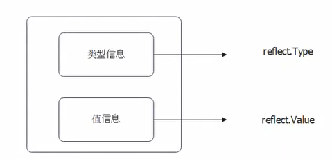
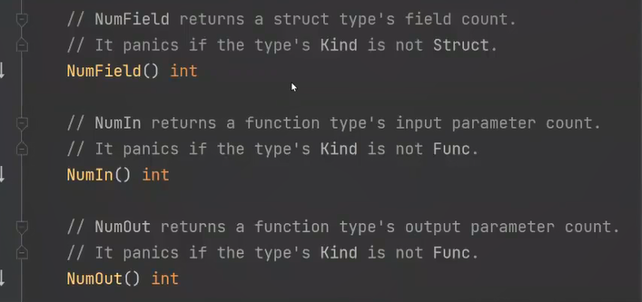

### 概念
运行时动态的修改和访问任意类型对象的结构体和成员
在运行时动态的获取一个变量的类型信息和值信息，叫反射

在G0反射里面，一个实例(interface, any)可以看成两部分:
- 值(值相关的操作或者读取)
- 实际类型(类型的相关的读取)


反射的相关API都在reflect包，最核心的两个:
- **reflect.Value**: 用于操作值，部分值是可以被反射修改的
- **reflect.Type**: 用于操作类信息,类信息是只能读取
- **reflect.Type**可以通过`reflect.Value`得到，但是反过来则不行。

### Go 反射编程小技巧
- 读写值，使用reflect.Value
- 读取类型信息，使用reflect.Type
- 时刻注意你现在操作的类型是不是指针。指针和指针指向的对象在反射层面上是两个东西
- 大多数情况，指针类型对应的reflect.Type毫无用处。除了操作有接受者的方法，其他的我们操作的都是指针指向的那个类型reflect.Type.Elem()
- 没有足够的测试就不要用反射，因为反射API充斥着panic
- 切片和数组在反射上也是两个东西
- 方法类型的字段和方法，在反射上也是两个不同的东西
- 无法获取私有字段的值，否则会panic，使用CanInterface() 判断是否可导出
```go
// 方法类型的字段
type User struct {
	f func()
}
// 方法
type User struct {
}

func (u *User) Name() {}

```


### kind
**Kind**: Kind是一个枚举值，用来判断操作的对应类型，例如是否是`指针`、是否是`数组`、是否是`切片`等。
所以reflect的方法，如果你调用得不对，它直接就 `panic`。
在调用API之前一定要**先读注释**，确认什么样的情况下可以调用!!!!


#### 指针是一种具体类型
```go
func TestReflect(t *testing.T) {
	typ := reflect.TypeOf(User{})
	if typ.Kind() == reflect.Struct {
		t.Log("结构体")
	}
	if typ.Kind() == reflect.Ptr {
		t.Log("指针")
	}

	typ = reflect.TypeOf(&User{})
	if typ.Kind() == reflect.Struct {
		t.Log("结构体")
	}
	if typ.Kind() == reflect.Ptr {
		t.Log("指针")
	}
}
```
上述代码代码输出 `结构体`，`指针`, 所以，任何指针是一种类型，操作或者读取指针类型都必须先调用`Elem()`

### 多重指针

使用for 遍历

```go
typ := reflect.TypeOf(User{})
 for typ.Kind() == reflect.Ptr {
   typ = typ.Elem()
}
```

### 示例以及测试用例的写法

测试用例分为三部分：名称，输入，期望输出

**要考虑:**

- 输入是不是指针，会不会是多重指针
- 输入会不会是数组或者切片
- 结构体字段会不会也是结构体

```go
// filed.go
func IterateFields(val any) {
   // 复杂逻辑
   res, err := iterateFields(val)

   // 简单逻辑
   if err != nil {
      fmt.Println(err)
      return
   }
   for k, v := range res {
      fmt.Println(k, v)
   }
}

// iterateFields 返回所有的字段名字
// val 只能是结构体，或者结构体指针，可以是多重指针
func iterateFields(input any) (map[string]any, error) {
   typ := reflect.TypeOf(input)
   val := reflect.ValueOf(input)

   // 处理指针，要拿到指针指向的东西
   // 这里我们综合考虑了多重指针的效果
   for typ.Kind() == reflect.Ptr {
      typ = typ.Elem()
      val = val.Elem()
   }

   // 如果不是结构体，就返回 error
   if typ.Kind() != reflect.Struct {
      return nil, errors.New("非法类型")
   }

   num := typ.NumField()
   res := make(map[string]any, num)
   for i := 0; i < num; i++ {
       // 使用Field 比FieldByName性能快三十多倍
      fd := typ.Field(i)
      fdVal := val.Field(i)
       // 是否是私有字段, 无法获取私有字段的值
      if fd.IsExported() {
         res[fd.Name] = fdVal.Interface()
      } else {
         // 反射也拿不到私有字段的值，为了演示效果，不公开字段我们用零值来填充
         res[fd.Name] = reflect.Zero(fd.Type).Interface()
      }
   }
   return res, nil
}


func SetField(entity any, field string, newVal any) error {
	val := reflect.ValueOf(entity)
	typ := val.Type()

	// 只能是一级指针，类似 *User
	if typ.Kind() != reflect.Ptr || typ.Elem().Kind() != reflect.Struct {
		return errors.New("非法类型")
	}

	typ = typ.Elem()
	val = val.Elem()

	// 这个地方判断不出来 field 在不在
	fd := val.FieldByName(field)
	// 利用 type 来判断 field 在不在
	if _, found := typ.FieldByName(field); !found {
		return errors.New("字段不存在")
	}

	if !fd.CanSet() {
		return errors.New("不可修改字段")
	}
	fd.Set(reflect.ValueOf(newVal))
	return nil
}


// filed_test.go
// TDD => test driven development
func TestIterateFields(t *testing.T) {
   up := &types.User{}
    // 多级指针
   up2 := &up
   testCases := []struct {
      name       string
      input      any
      wantFields map[string]any
      wantErr    error
   }{
      {
         // 普通结构体
         name: "normal struct",
         input: types.User{
            Name: "Tom",
            // age:  18,
         },
         wantFields: map[string]any{
            "Name": "Tom",
            "age":  0,
         },
      },
      {
         // 指针
         name: "pointer",
         input: &types.User{
            Name: "Tom",
         },
         wantFields: map[string]any{
            "Name": "Tom",
            "age":  0,
         },
      },
      {
         // 多重指针
         name:  "multiple pointer",
         input: up2,
         wantFields: map[string]any{
            "Name": "",
            "age":  0,
         },
      },
      {
         // 非法输入，输入的不是结构体
         name:    "slice",
         input:   []string{},
         wantErr: errors.New("非法类型"),
      },
      {
         // 非法指针输入
         name:    "pointer to map",
         input:   &(map[string]string{}),
         wantErr: errors.New("非法类型"),
      },
   }
   for _, tc := range testCases {
      t.Run(tc.name, func(t *testing.T) {
         res, err := iterateFields(tc.input)
         assert.Equal(t, tc.wantErr, err)
         if err != nil {
            return
         }
         assert.Equal(t, tc.wantFields, res)
      })
   }
}


func TestSetField(t *testing.T) {
	testCases := []struct {
		name string

		field  string
		entity any
		newVal any

		wantErr error
	}{
		{
			name:    "struct",
			entity:  types.User{},
			field:   "Name",
			wantErr: errors.New("非法类型"),
		},
		{
			name:    "private field",
			entity:  &types.User{},
			field:   "age",
			wantErr: errors.New("不可修改字段"),
		},
		{
			name:    "invalid field",
			entity:  &types.User{},
			field:   "invalid_field",
			wantErr: errors.New("字段不存在"),
		},
		{
			name: "pass",
			entity: &types.User{
				Name: "",
			},
			field:  "Name",
			newVal: "Tom",
		},
	}

	for _, tc := range testCases {
		t.Run(tc.name, func(t *testing.T) {
			err := SetField(tc.entity, tc.field, tc.newVal)
			assert.Equal(t, tc.wantErr, err)
		})
	}
}


type User struct {
   Name string
   // 因为同属一个包，所以 age 还可以被测试访问到
   // 如果是不同包，就访问不到了
   age int
}
```
注意：对于私有字段只能拿到类型信息，拿不到值


### 使用反射设置值时最好要先调用CanSet()来判断是否可以修改

```go
i := 3
pv := reflect.ValueOf(&i)
vv := reflect.ValueOf(i)
fmt.Println(pv.Elem().CanSet()) // true
fmt.Println(vv.CanSet())        // false
pv.Elem().SetInt(66)
fmt.Println(i)
```

```go
type ReflectAccessor struct {
	val reflect.Value
	typ reflect.Type
}

func NewReflectAccessor(val any) (*ReflectAccessor, error) {
	typ := reflect.TypeOf(val)
	// 必须是一级指针，不能是多级指针，多级指针要使用for 
	if typ.Kind() != reflect.Pointer || typ.Elem().Kind() != reflect.Struct {
		return nil, errors.New("invalid entity")
	}
	return &ReflectAccessor{
		val: reflect.ValueOf(val).Elem(),
		typ: typ.Elem(),
	}, nil
}

func (r *ReflectAccessor) Field(field string) (int, error) {
	if _, ok := r.typ.FieldByName(field); !ok {
		return 0, errors.New("非法字段")
	}
	return r.val.FieldByName(field).Interface().(int), nil
}

func (r *ReflectAccessor) SetField(field string, val int) error {
	if _, ok := r.typ.FieldByName(field); !ok {
		return errors.New("非法字段")
	}
	fdVal := r.val.FieldByName(field)
	if !fdVal.CanSet() {
		return errors.New("无法设置新值的字段")
	}
	fdVal.Set(reflect.ValueOf(val))
	return nil
}

```

```go
func TestReflectAccessor_Field(t *testing.T) {
	testCases := []struct {
		name string

		// 这个是输入
		entity interface{}
		field  string

		// 这个是期望输出
		wantVal int
		wantErr error
	}{
		{
			name:    "normal case",
			entity:  &User{Age: 18},
			field:   "Age",
			wantVal: 18,
		},
	}

	for _, tc := range testCases {
		t.Run(tc.name, func(t *testing.T) {
			accessor, err := NewReflectAccessor(tc.entity)
			if err != nil {
				assert.Equal(t, tc.wantErr, err)
				return
			}
			val, err := accessor.Field(tc.field)
			assert.Equal(t, tc.wantErr, err)
			if err != nil {
				return
			}
			assert.Equal(t, tc.wantVal, val)
		})
	}
}

func TestReflectAccessor_SetField(t *testing.T) {
	testCases := []struct {
		name    string
		entity  *User
		field   string
		newVal  int
		wantErr error
	}{
		{
			name:   "normal case",
			entity: &User{},
			field:  "Age",
			newVal: 18,
		},
	}

	for _, tc := range testCases {
		t.Run(tc.name, func(t *testing.T) {
			accessor, err := NewReflectAccessor(tc.entity)
			if err != nil {
				assert.Equal(t, tc.wantErr, err)
				return
			}
			err = accessor.SetField(tc.field, tc.newVal)
			assert.Equal(t, tc.wantErr, err)
			if err != nil {
				return
			}
			assert.Equal(t, tc.newVal, tc.entity.Age)
		})
	}
}

type User struct {
	Age int
}
```

### 方法调用
func.go
```go
// IterateFuncs 输出方法信息，并执行调用
func IterateFuncs(val any) (map[string]*FuncInfo, error) {
	typ := reflect.TypeOf(val)
	if typ.Kind() != reflect.Struct && typ.Kind() != reflect.Ptr {
		return nil, errors.New("非法类型")
	}
	// 如果val是指针，不要调用Elem(),如果调用了typ = typ.Elem(),那么就变成值类型接受者的方法, 方法和结构体是不一样的，
	// 接受者方法的数量
	num := typ.NumMethod()
	result := make(map[string]*FuncInfo, num)
	for i := 0; i < num; i++ {
		// 获取方法
		f := typ.Method(i)
		// 方法参数的个数
		numIn := f.Type.NumIn()
		parameters := make([]reflect.Value, 0, f.Type.NumIn())
		// 第一个参数永远都是接收器，类似于 java 的 this 概念
		parameters = append(parameters, reflect.ValueOf(val))
		in := make([]reflect.Type, 0, f.Type.NumIn())
		for j := 0; j < numIn; j++ {
			// 获取方法的输入参数
			p := f.Type.In(j)
			in = append(in, p)
			if j > 0 {
				parameters = append(parameters, reflect.Zero(p))
			}
		}
		// 执行方法调用，并调用获取结果
		ret := f.Func.Call(parameters)
		// 方法的返回参数的个数
		outNum := f.Type.NumOut()
		out := make([]reflect.Type, 0, outNum)
		res := make([]any, 0, outNum)
		for k := 0; k < outNum; k++ {
			out = append(out, f.Type.Out(k))
			res = append(res, ret[k].Interface())
		}
		result[f.Name] = &FuncInfo{
			Name:   f.Name,
			In:     in, 
			Out:    out, 
			Result: res,
		}
	}
	return result, nil
}

type FuncInfo struct {
	Name string
	In   []reflect.Type// 方法的输入参数
	Out  []reflect.Type// 方法的返回结果

	// 反射调用得到的结果
	Result []any
}
```
func_test.go
```go
func TestIterateFuncs(t *testing.T) {
	testCases := []struct {
		name string

		input any

		wantRes map[string]*FuncInfo
		wantErr error
	}{
		{
			// 普通结构体
			name:  "normal struct",
			input: types.User{},
			wantRes: map[string]*FuncInfo{
				"GetAge": {
					Name:   "GetAge",
					In:     []reflect.Type{reflect.TypeOf(types.User{})}, // 反射中接收者是方法的第一个参数
					Out:    []reflect.Type{reflect.TypeOf(0)},
					Result: []any{0},
				},
			},
		},
		{
			// 指针
			name:  "pointer",
			input: &types.User{},
			wantRes: map[string]*FuncInfo{
				"GetAge": {
					Name:   "GetAge",
					In:     []reflect.Type{reflect.TypeOf(&types.User{})},
					Out:    []reflect.Type{reflect.TypeOf(0)},
					Result: []any{0},
				},
				"ChangeName": {
					Name:   "ChangeName",
					In:     []reflect.Type{reflect.TypeOf(&types.User{}), reflect.TypeOf("")},
					Out:    []reflect.Type{},
					Result: []any{},
				},
			},
		},
	}

	for _, tc := range testCases {
		t.Run(tc.name, func(t *testing.T) {
			res, err := IterateFuncs(tc.input)
			assert.Equal(t, tc.wantErr, err)
			if err != nil {
				return
			}
			assert.Equal(t, tc.wantRes, res)
		})
	}
}
```

user.go(主要是为了构建测试用例)
```go
type User struct {
	Name string
	// 因为同属一个包，所以 age 还可以被测试访问到
	// 如果是不同包，就访问不到了
	age int
}

func (u User) GetAge() int {
	return u.age
}

func (u *User) ChangeName(newName string) {
	u.Name = newName
}

//func (u User) private() {
//	fmt.Println("private")
//}
```

### 数组

```go
// Iterate 迭代数组，切片，或者字符串
func Iterate(input any) ([]any, error) {
	val := reflect.ValueOf(input)
	typ := val.Type()
	kind := typ.Kind()
	if kind != reflect.Array && kind != reflect.Slice && kind != reflect.String {
		return nil, errors.New("非法类型")
	}
	res := make([]any, 0, val.Len())
	for i := 0; i < val.Len(); i++ {
		ele := val.Index(i)
		res = append(res, ele.Interface())
	}
	return res, nil
}
```
### map

```go
// IterateMapV1 返回键，值
func IterateMapV1(input any) ([]any, []any, error) {
	val := reflect.ValueOf(input)
	if val.Kind() != reflect.Map {
		return nil, nil, errors.New("非法类型")
	}
	l := val.Len()
	keys := make([]any, 0, l)
	values := make([]any, 0, l)
	for _, k := range val.MapKeys() {
		keys = append(keys, k.Interface())
		v := val.MapIndex(k)
		values = append(values, v.Interface())
	}
	return keys, values, nil
}
```
```go
// IterateMapV2 返回键，值
func IterateMapV2(input any) ([]any, []any, error) {
	val := reflect.ValueOf(input)
	if val.Kind() != reflect.Map {
		return nil, nil, errors.New("非法类型")
	}
	l := val.Len()
	keys := make([]any, 0, l)
	values := make([]any, 0, l)
	itr := val.MapRange()
	for itr.Next() {
		keys = append(keys, itr.Key().Interface())
		values = append(values, itr.Value().Interface())
	}
	return keys, values, nil
}
```

### New 和NewAt

在Go语言中，`reflect.New()` 函数用于创建一个指定类型的新零值，并返回一个指向该零值的**指针**的 `reflect.Value` 类型。例如，`reflect.New(reflect.TypeOf(42))` 将返回一个指向新分配的 `int` 类型零值的指针的 `reflect.Value` 类型。

另一方面，`reflect.NewAt()` 函数用于在给定的地址处创建一个指定类型的新值，并返回一个指向该值的指针的 `reflect.Value` 类型。这个函数需要两个参数：一个是类型，另一个是一个 `unsafe.Pointer` 类型，它指向要存储新值的内存地址。

总之，`reflect.New()` 用于创建一个新的零值并返回其指针，而 `reflect.NewAt()` 用于在给定地址处创建一个新值并返回其指针。
```go
type Test struct {
	Age int64
}

func main() {
	t := &Test{Age: 18}
	v := reflect.ValueOf(t).Elem()
	ageTyp := v.Field(0)
	ageVal := reflect.New(ageTyp.Type())
	var i int64 = 19
	ageVal.Elem().Set(reflect.ValueOf(i))
	fmt.Println(ageVal.Elem().Interface())
}
```
```go
func main() {
    var x int
    p := unsafe.Pointer(&x)
    intType := reflect.TypeOf(0)
    newIntPtr := reflect.NewAt(intType, p)
    newIntPtr.Elem().SetInt(42)

    fmt.Printf("x: %d\n", x)
}
```

New是将值放在任意一个地址，NewA是指定的地址

### NewAt()的用法

第一个参数是reflect.Type，第二个是unsafe.Pointer
在unsafe.Pointer的地址上（这个地址上本身已经存放了数据）创建指定的新反射类型对象，返回reflect.Value

```go
func NewAt(typ Type, p unsafe.Pointer) Value {...}
```
具体用法在unsafe笔记的FieldAny 中


### 递归反射
#### 一。递归结果值是只有一层的递归 ，递归生成insert into 语句
只有一层的slice，map等

不需要从父方法中传入接收结果变量作为递归函数的参数。
每次调用递归时，本次调用的上下文(各种变量等)都会被保存。待下次调用结束后，上下文就会恢复，此时就可以将递归调用的保存到上次调用的上下文中

```go
var errInvalidEntity = errors.New("invalid entity")

// InsertStmt 会为实例生成一个 INSERT 语句。
// INSERT 语句只需要考虑 MySQL 的语法
// 只接收非 nil，一级指针，结构体实例
// 结构体字段只能是基本类型，或者实现了 driver.Valuer 接口
// 但是我们只做最简单的校验，不会全部情况都校验
func InsertStmt(entity interface{}) (string, []interface{}, error) {
	if entity == nil {
		return "", nil, errInvalidEntity
	}
	val := reflect.ValueOf(entity)
	typ := val.Type()
	if typ.Kind() == reflect.Pointer {
		val = val.Elem()
		typ = val.Type()
	}

	if typ.Kind() != reflect.Struct {
		return "", nil, errInvalidEntity
	}

	bd := strings.Builder{}
	_, _ = bd.WriteString("INSERT INTO `")
	bd.WriteString(typ.Name())
	bd.WriteString("`(")
	fields, values := fieldNameAndValues(val)
	for i, name := range fields {
		if i > 0 {
			bd.WriteRune(',')
		}
		bd.WriteRune('`')
		bd.WriteString(name)
		bd.WriteRune('`')
	}
	bd.WriteString(") VALUES(")
	args := make([]interface{}, 0, len(values))
	for i, fd := range fields {
		if i > 0 {
			bd.WriteRune(',')
		}
		bd.WriteRune('?')
		args = append(args, values[fd])
	}
	if len(args) == 0 {
		return "", nil, errInvalidEntity
	}
	bd.WriteString(");")
	return bd.String(), args, nil
}

// 我们这种写法会导致在出现组合的时候会有额外的内存分配
// 第一个数组来保证顺序，第二个map保存结果，并且用于去重
// 重复的时候，第一个胜出
func fieldNameAndValues(val reflect.Value) ([]string, map[string]interface{}) {
	typ := val.Type()
	fieldNum := typ.NumField()
	fields := make([]string, 0, fieldNum)
	values := make(map[string]interface{}, fieldNum)
	for i := 0; i < fieldNum; i++ {
		field := typ.Field(i)
		fieldVal := val.Field(i)

		// Anonymous 只处理真正的组合，这是区别我们测试用例里面 Buyer 和 Seller 不同声明方式的差异点
		if field.Type.Kind() == reflect.Struct && field.Anonymous {
			subFields, subValues := fieldNameAndValues(fieldVal)
			for _, k := range subFields {
				if _, ok := values[k]; ok {
					// 重复字段，只会出现在组合情况下。我们直接忽略重复字段。
					continue
				}
				fields = append(fields, k)
				values[k] = subValues[k]
			}
			continue
		}
		fields = append(fields, field.Name)
		values[field.Name] = fieldVal.Interface()
	}
	return fields, values
}
```

```go
import (
	"database/sql"
	"github.com/stretchr/testify/assert"
	"testing"
)

func TestInsertStmt(t *testing.T) {
	testCases := []struct {
		name     string
		entity   interface{}
		wantErr  error
		wantSQL  string
		wantArgs []interface{}
	}{
		{
			name:    "nil",
			wantErr: errInvalidEntity,
		},
		{
			name:    "empty struct",
			entity:  Empty{},
			wantErr: errInvalidEntity,
		},
		{
			name:   "simple struct",
			entity: BaseEntity{},
			// 稍微注意一下，这里我们用反射取出来的不是存粹的 nil，而是一个带了类型的 nil
			wantArgs: []interface{}{int64(0), (*int64)(nil)},
			wantSQL:  "INSERT INTO `BaseEntity`(`CreateTime`,`UpdateTime`) VALUES(?,?);",
		},
		{
			name:     "pointer",
			entity:   &BaseEntity{CreateTime: 123, UpdateTime: ptrInt64(234)},
			wantArgs: []interface{}{int64(123), ptrInt64(234)},
			wantSQL:  "INSERT INTO `BaseEntity`(`CreateTime`,`UpdateTime`) VALUES(?,?);",
		},
		{
			name: "multiple pointer",
			entity: func() interface{} {
				entity := &BaseEntity{CreateTime: 123, UpdateTime: ptrInt64(234)}
				return &entity
			}(),
			wantErr: errInvalidEntity,
		},
		{
			// 组合
			name: "composition",
			entity: User{
				BaseEntity: BaseEntity{
					CreateTime: 123,
					UpdateTime: ptrInt64(456),
				},
				Id:       789,
				NickName: sql.NullString{String: "Tom", Valid: true},
			},
			wantArgs: []interface{}{int64(123), ptrInt64(456), uint64(789),
				sql.NullString{String: "Tom", Valid: true}, (*sql.NullInt32)(nil)},
			wantSQL: "INSERT INTO `User`(`CreateTime`,`UpdateTime`,`Id`,`NickName`,`Age`) VALUES(?,?,?,?,?);",
		},
		{
			name: "deep composition",
			entity: &Buyer{
				User: User{
					BaseEntity: BaseEntity{
						CreateTime: 123,
						UpdateTime: ptrInt64(456),
					},
					Id:       789,
					NickName: sql.NullString{String: "Tom", Valid: true},
					Age:      &sql.NullInt32{Int32: 18, Valid: true},
				},
				Address: "China",
			},
			wantArgs: []interface{}{int64(123), ptrInt64(456), uint64(789),
				sql.NullString{String: "Tom", Valid: true}, &sql.NullInt32{Int32: 18, Valid: true}, "China"},
			wantSQL: "INSERT INTO `Buyer`(`CreateTime`,`UpdateTime`,`Id`,`NickName`,`Age`,`Address`) VALUES(?,?,?,?,?,?);",
		},
		{
			name: "multiple composition",
			entity: &Customer{
				Buyer: Buyer{
					User: User{
						BaseEntity: BaseEntity{
							CreateTime: 123,
							UpdateTime: ptrInt64(456),
						},
						Id:       789,
						NickName: sql.NullString{String: "Tom", Valid: true},
						Age:      &sql.NullInt32{Int32: 18, Valid: true},
					},
					Address: "China",
				},
				BaseEntity: BaseEntity{
					CreateTime: 987,
					UpdateTime: ptrInt64(654),
				},
				Company: "DM",
			},
			wantArgs: []interface{}{int64(123), ptrInt64(456), uint64(789),
				sql.NullString{String: "Tom", Valid: true}, &sql.NullInt32{Int32: 18, Valid: true}, "China", "DM"},
			wantSQL: "INSERT INTO `Customer`(`CreateTime`,`UpdateTime`,`Id`,`NickName`,`Age`,`Address`,`Company`) VALUES(?,?,?,?,?,?,?);",
		},
		{
			// 使用指针的组合，我们不会深入解析，会出现很奇怪的结果
			name: "pointer composition",
			entity: InvalidUser{
				BaseEntity: &BaseEntity{},
				Address:    "China",
			},
			// &BaseEntity{} 这个参数发送到 driver 那里，会出现无法解析的情况
			wantArgs: []interface{}{&BaseEntity{}, "China"},
			wantSQL:  "INSERT INTO `InvalidUser`(`BaseEntity`,`Address`) VALUES(?,?);",
		},
		{
			name:   "not embed field",
			entity: Seller{User: User{}},
			// 顺便测试一下单个字段
			wantArgs: []interface{}{User{}},
			wantSQL:  "INSERT INTO `Seller`(`User`) VALUES(?);",
		},
	}

	for _, tc := range testCases {
		t.Run(tc.name, func(t *testing.T) {
			query, args, err := InsertStmt(tc.entity)
			assert.Equal(t, tc.wantErr, err)
			if tc.wantErr != nil {
				// 预期会有错误返回，就不需要进一步校验其它两个返回值了
				return
			}
			assert.Equal(t, tc.wantSQL, query)
			assert.Equal(t, tc.wantArgs, args)
		})
	}
}

type Empty struct {
}

type BaseEntity struct {
	CreateTime int64
	UpdateTime *int64
}

type User struct {
	BaseEntity
	Id       uint64
	NickName sql.NullString
	Age      *sql.NullInt32
}

type Buyer struct {
	User
	Address string
}

type InvalidUser struct {
	*BaseEntity // 这种指针嵌套对unsafe不友好，所以不支持这种写法，这种指针嵌套无法计算里面指定偏移量
	Address string
}

type Customer struct {
	Buyer
	BaseEntity
	Company string
}

// Seller 注意和 Buyer 的区别。在 Seller 这种模式下，我们会认为，它们是一个关联关系，比如说一对一关系
// 而在 Buyer 的模式下，我们会认为它们是同一张表。
type Seller struct {
	User User
}

func ptrInt64(val int64) *int64 {
	return &val
}
```

#### 二。递归获取树节点（多层）

需要从父方法中传入接收结果变量(必须是引用类型，map，slice，或者指针等)作为递归函数的参数。

深度优先

```go
var itemList = `[
          {"id":1,"pid":0,"name":"顶级节点"},
        {"id":2,"pid":1,"name":"b"},
        {"id":3,"pid":1,"name":"c"},
        {"id":4,"pid":2,"name":"d"},
        {"id":5,"pid":3,"name":"e"},
      {"id":6,"pid":0,"name":"顶级节点"},
      {"id":7,"pid":6,"name":"g"},
      {"id":8,"pid":6,"name":"h"},
      {"id":9,"pid":0,"name":"顶级节点"},
      {"id":10,"pid":9,"name":"j"},
      {"id":11,"pid":10,"name":"k"},
      {"id":12,"pid":11,"name":"l"}
]
`

type Users struct {
   Id   int    `json:"id"`
   Pid  int    `json:"pid"`
   Name string `json:"name"`
}

type Data struct {
   Id       int     `json:"id"`
   Pid      int     `json:"pid"`
   Name     string  `json:"name"`
   Children []*Data `json:"children"`
}
type MyTree []*Data

func TestList2Tree(t *testing.T) {
   users := Decode[[]Users](itemList)
   tree := MyTree(make([]*Data, 0, len(users)))
   for _, u1 := range users {
      if u1.Pid == 0 {
         childTree := Data{
            Id:   u1.Id,
            Pid:  u1.Pid,
            Name: u1.Name,
         }
         tree = append(tree, &childTree)
         // &childTree从父方法中传入接收结果变量
         tree.list2Tree(users, &childTree, childTree.Id)
      }
   }

   b, _ := json.Marshal(tree)
   fmt.Println(string(b))

}

func (t *MyTree) list2Tree(users []Users, parent *Data, pid int) {
   for _, user := range users {
      if user.Pid == pid {
         child := &Data{
            Id:   user.Id,
            Pid:  user.Pid,
            Name: user.Name,
         }
         parent.Children = append(parent.Children, child)
         fmt.Println(parent.Children)
         // child从父方法中传入接收结果变量
         t.list2Tree(users, child, child.Id)
      }
   }
}

type Result interface {
   // 还可以进一步进行处理
   map[string]interface{} | []interface{} | []Users
}

func Decode[T Result](str string) T {
   var ret T
   if err := json.Unmarshal([]byte(str), &ret); err != nil {
      log.Fatalln(err)
   }

   return ret
}
```


### Go反射面试要点
Go反射面得很少，因为Go反射本身是一个写代码用的，理论上的东西不太多。
- 什么是反射?
反射可以看做是对对象和对类型的描述，而我们可以通过反射来间接操作对象。
- 反射的使用场景?
一大堆，基本上任何高级框架都会用反射，ORM是一个典型例子。Beego 的controller模式的Web框架也利用了反射。
- 能不能通过反射修改方法?
不能。为什么不能?go runtime没暴露接口。
- 什么样的字段可以被反射修改?
有一个方法CanSet可以判断，简单来说就是addressable
