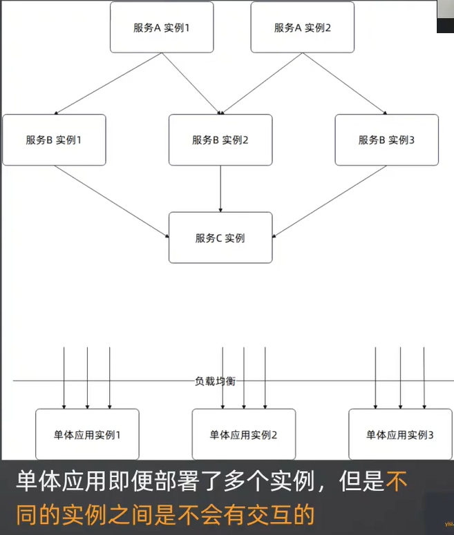
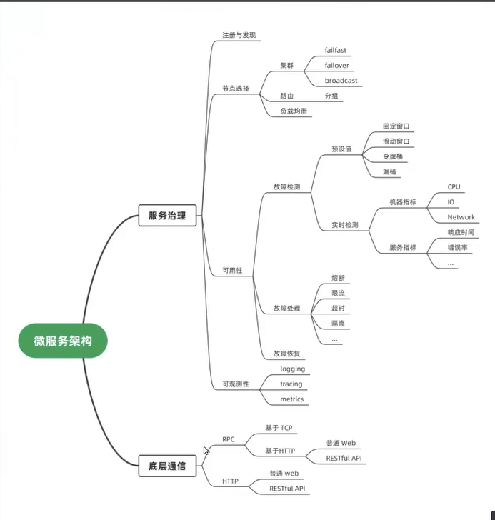
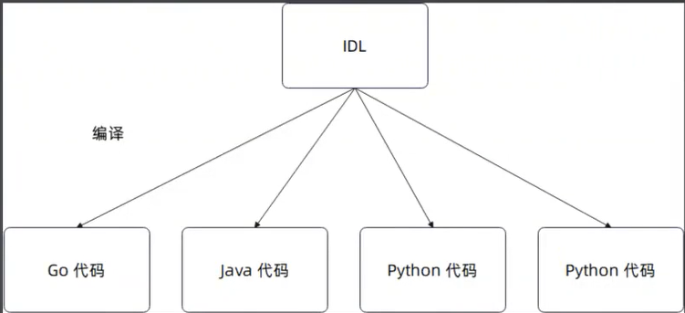
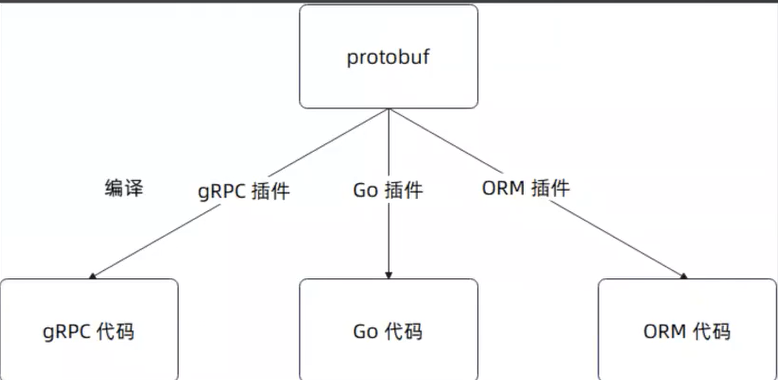
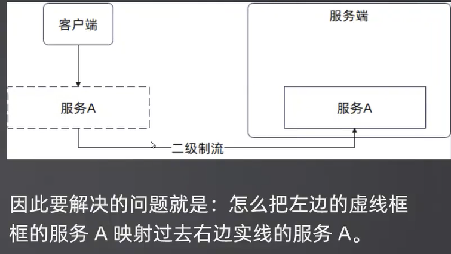
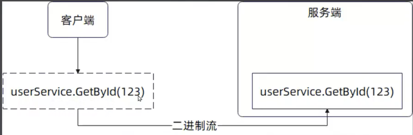
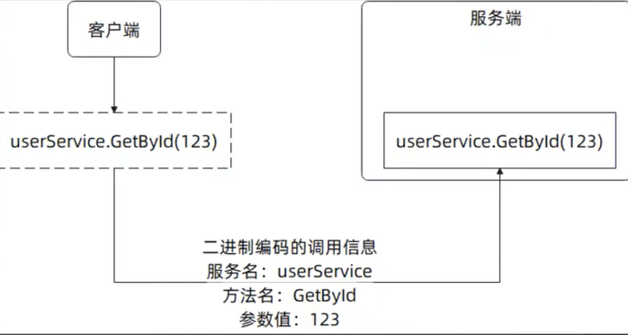
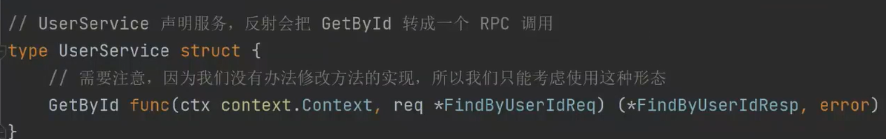

### 学微服务框架必须学grpc 和dubbo框架
### 微服务架构
微服务框架是服务于微服务架构的。

微服务架构简单来说，就是指整个系统由多个组件组成，每一个组件都独立管理，组件之间通过网络来通信。

注意:单体应用可以部署多个实例，但是它依旧是单体应用。

所以：**一切问题都可以源于网络间通信**

### 微服务框架主要问题
两个核心部分，**通信 + 服务治理**
- 通信：即服务之间如何发起调用，一般就是 RPC，或者是 HTTP 直接通信
- 服务治理：涵盖从服务注册与发现到可观测性的全部内容
- 
  - 限流：只让一部分请求正常执行，其他都拒掉
  - 熔断：全部请求都拒绝掉
  - 降级：我的请求会走到一条消耗资源更少的路径
  - 隔离：隔离主要利用路由，集群的一些策略
  - 故障恢复：我现在触发熔断，比如说我发现你的响应时间已经超过1秒了，我就认为你这台机器已经不行了，我把你给熔断了，那问题就来了，我什么时候把这台机器给恢复过来。你是一下子恢复过来还是渐渐放流量看看反馈在恢复过来

### 主要微服务框架类型
微服务框架又可以进一步分成:
- 纯粹的 RPC 框架。这一类框架的代表是早期的 gRPC，发展到现在，也可以认为是定义了服务主力相关的接口，并且提供了一些默认实现

- 服务治理框架。它们没有设计自己的微服务协议，比如说直接依赖于 gRPC 或者HTTP 的。这一类框架专注在处理服务治理的问题，甚至于部分框架可能只专注于解决服务治理中的某一个方面

- 大一统的微服务框架。这一类框架既有自己的通信协议，又有服务治理模块，典型的例子就是 Dubbo。早期的微服务框架比较多这种

### gRPC简介
在底层通信协议上，我的建议遇事不决用 gRPC。如果是小型系统，那么可以考虑直接使用 HTTP 接口。

gRPC 比较学院派，它是典型的**使用 IDL 来生成代码的RPC 框架。**

IDL (interface description/definition language)接口描述语言/接口定义语言。

是指用一种中间语言来定义接口，而后为其它的语言生成对应代码的设计方案。
所以** gRPC 是多语言通信的首选**

#### `gRPC`与` protobuf`
`gRPC` 使用的**IDL 是 `protobuf`。**

`protobuf`**是一个独立的 IDL**，也就是说你可以用`protobuf` 来生成 `gRPC`的代码，也可以用 `protobuf`来生成其它RPC框架的代码

`protobuf` 也定义了序列化格式，所以我们也常说使用**`protobuf`来作为序列化协议**

### RPC
#### RPC 要解决的核心问题
RPC的全称是 Remote Procedure Call，即远程过程调用
核心就是：如同本地调用一般调用服务器上的方法

#### 调用信息
要完成这种映射，首先要解决第一个问题: 映射什么?
举个例子，假如说我们在客户端调用的是`userService.GetByld`，传入的参数是int 类型的值 123.

那么服务端究竟怎么知道客户端调用的是`userService.GetBvld`，参数是 int 类型的 123?

答案很简单：我们把这些信息传过去给服务端这些信息我们统称为**调用信息**

那么调用信息需要包含什么?
- 服务名: 也就是 userService

- 方法名: GetByld

- 参数值: 123
  要不要参数类型?
  如果你在支持**重载**的语言上设计微服务框架，并且决定支持重载，那么你就需要传递参数类型，否则你不需要传递参数类型、

  重载：同方法名不同参数

- 
#### 客户端捕捉本地调用
既然要传递调用信息，那么问题就在于:RPC 客户端怎么获得这些调用信息?
这个问题是指:用户调用的是 userService.GetByld(123)，我底层框架怎么知道 userService,GetByld,123这种信息?
- 代码生成策略，如 gRPC、go-micro
- 代理模式：
这里就要用到代理模式了:定义一个结构体，为结构体里面的方法类型字段，注入调用逻辑。
要记住，**Go 是没有办法修改方法实现的**。go 不能在运行期间生成一个新的类型或者加载新的类型，这是go的先天限制。所以我们只能迂回救国

我们约定:
每一个方法第一个参数必须是 context.Context，第二个就是请求结构体指针，并且只有这两个参数返回值的第一个是响应，并且必须是指针，第二个是 error，并且只有这两个返回值。
这种限制主要就是为了简化微服务框架的代码，在真实生产里面，你可以保持这个限制，也可以考虑去掉

#### 微服务网关和微服务框架的区别

除了底层通信协议不一样。
其他的微服务网关和微服务框架很相似，微服务网关底层通信协议强调的是兼容任何协议，而且要做到协议之间的转换。比如一个http请求打到微服务网关上要把它转换成rpc请求。也可以这么理解微服务网关就是在微服务框架的基础上加了协议转换 的功能。网关一般都有一个管理后台，可以在上面配置各种规则。网关本身的性质就是具备全局信息

### 面试点

- **微服务框架是什么?**主要就是解决两个问题，通信和服务治理
- **你了解 XXX 微服务框架吗?** 你们需要提前了解一下面试官使用的微服务框架，有针对性的准备。一般记住这个微服务框架的大体功能就可以，后面讨论到具体功能实现的时候再进一步深入了解
- **为什么使用微服务架构?**本质上是为了分而治之，将业务拆分之后独立治理、部署
- **RPC 框架和 `RESTFul`, http有什么区别?** 应该说，两者基本没联系，全是区别。唯一的联系，就是 RPC 框架可以利用RESTful来实现。RESTful是指符合REST 风格的 HTTP 接口，而RPC指的是远程过程调用，从本质上就是两回事。rest 时一种设计风格，微服务时一种架构，rpc是一种通讯形式。http是一种协议
- **RCP 框架和 Web 框架有什么区别?**  基本也没什么联系，都是区别。唯一的共同点可以通过对 Web 框架进行封装来实现RPC通信

- **什么是 RPC?** 远程过程调用。类似的还有 RMI，远程方法调用
- **和使用 HTTP 接口比起来，使用 RPC 有什么优势?**不必关心 HTTP 调用的细节，对于使用者来说就如同本地调用一般
- **RPC 框架的要点是什么?**客户端捕捉调用信息，编码成二进制，发送到服务端。服务端查找本地服务，执行调用，写回响应。任何一个RPC 框架都类似。所以如果面试官问 `gRPC` 的大概步骤，也可以这么回答
- **RPC 框架怎么捕捉本地调用信息**(或者说RPC框架怎么知道你调用的是什么)? 要依赖于代理模式和代码生成技术
- **什么是代理模式?什么是动态代理模式? **动态代理可以看做是动态生成的代理，一般是指运行时生成的
- **代理动态代理技术能用来做什么? **四个字，为所欲为。在这里就是用来发起 RPC 调用，然后再返回响应

