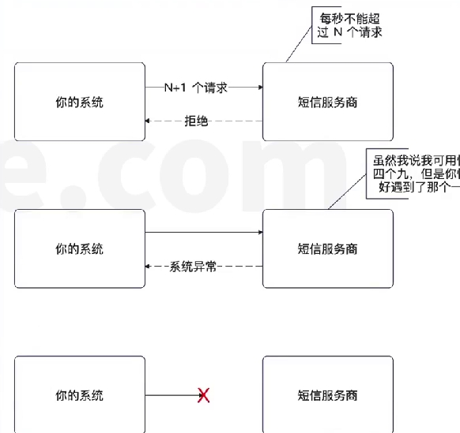
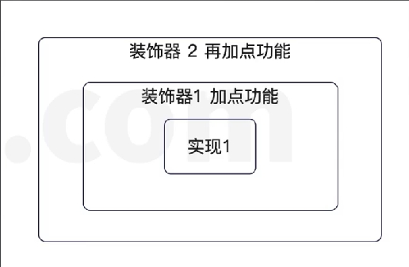
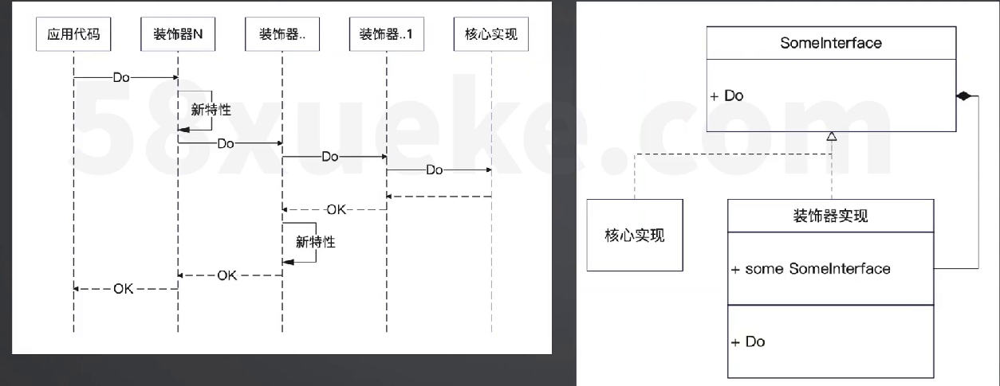
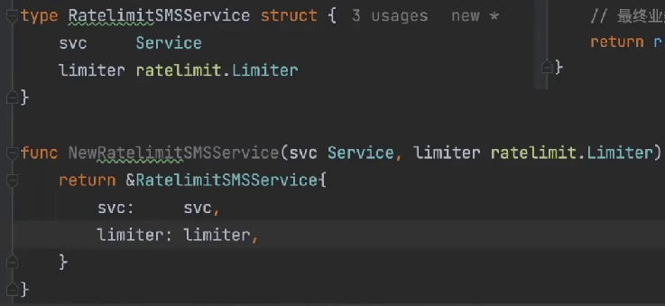
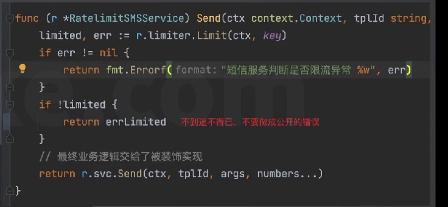

#第三方服务调用治理
要知道，一切不在你控制范围内的东西，都是**不定时炸弹**，冷不丁就炸了。
所以，针对一切跟第三方打交道的地方，都要做好**容错**。严格的来讲，但凡不是自己写的代码都要做容错，因为不可控。
推而广之，只要接口不是你写的，你调用的时候都要考虑做好治理。
记住血泪教训: **不要相信公司外的人，不要相信别的部门的人，不要相信同组的人，最后不要相信昨天的自己。**


# 整体思路
核心思路就是两点

- 尽量不要搞崩第三方
- 万一第三方崩了，你的系统还要能够稳定运行
具体到短信服务这里：
- 短信服务商都有保护自己系统的机制，你要小心不要触发了。比如说短信服务商的限流机制
- 短信服务商可能崩溃，你和短信服务商之间的网络通信可能崩溃，所以你要想好容错机制。



# 利用装饰器模式(AOP)来改进
正常来说，你要在一个已有实现的基础上**叠加**一个新特性，那么就非常适合装饰器模式
装饰器模式(大明版定义): **不改变原有实现而增加新特性的一种设计模式。**
装饰器可以层层叠加，我称之为叠床架屋。明月装饰了你的窗子,你装饰了别人的梦。

## 如何理解装饰器


## 用装饰器模式实现限流的短信接口服务
下面和右边实现的代码，可以注意到
依旧保持面向接口和依赖注入的风格
svc 也就是被装饰者
最终业务逻辑是转交给了 svc 执行的。该实现就只处理一件事: 判断要不要限流




# 开闭原则、非侵入式、装饰器
这是三个经常一起出现的概念开闭原则: 
- 对修改闭合，对扩展开放。
- 非侵入式: 不修改已有代码。
记住一句话: **侵入式修改是万恶之源**(修改原来的代码的)。它会降低代码可读性，降低可测试性，强耦合，降低可扩展性。
侵入式 =垃圾代码，这个等式基本成立
除非逼不得已，不然绝对不要搞侵入式修改!!!
要是老的代码出bug了管我屁事，我又没修改老的代码，锅甩不到我身上


# 自动切换不同的服务商
...

# 
基本上任何公司都难免要和第三方打交道,你找到这一类代码,而后设计一些治理措施，**来提高可用性、扩展性和安全性。**
### 可行的方式包括:
- 提供自动重试功能。也就是调用方不需要操心重试，以及重试失败怎么处理的问题。
- 设计提高可用性的措施，确保在第三方崩溃或者网络崩溃的时候,尽量保持系统依旧可用。
- 在类似于短信这种可以替换服务商的服务中，设计 failover 策略
- 为第三方调用提供客户端限流功能。
- 为第三方调用提供 mock 实现，方便测试
就算不是为了升职加薪，单纯为了跳槽，你都要做做这些事情

failover 示例(装饰器)：

```go
type FailoverSMSService struct {
	// 一大堆可供你选择的 SMS Service 实现
	svcs []sms.Service

	idx uint64
}

func NewFailoverSMSService(svcs []sms.Service) *FailoverSMSService {
	return &FailoverSMSService{
		svcs: svcs,
	}
}

func (f *FailoverSMSService) Send(ctx context.Context, tplId string, args []string, numbers ...string) error {
	for _, svc := range f.svcs {
		err := svc.Send(ctx, tplId, args, numbers...)
		if err == nil {
			return nil
		}
		// 这边要打印日志
	}
	return errors.New("发送失败，所有服务商都尝试过了")
}

func (f *FailoverSMSService) SendV1(ctx context.Context, tplId string, args []string, numbers ...string) error {
	// 二话不说先把下标往后推一位
	idx := atomic.AddUint64(&f.idx, 1)
	length := uint64(len(f.svcs))
	for i := idx; i < idx+length; i++ {
		svc := f.svcs[i%length]
		err := svc.Send(ctx, tplId, args, numbers...)
		switch err {
		case nil:
			return nil
		case context.DeadlineExceeded, context.Canceled:
			//	调用者设置的超时时间到了
			// 调用者主动取消了
			return err
		}
		// 其它情况会走到这里，这边要打印日志
	}
	return errors.New("发送失败，所有服务商都尝试过了")
}
```


failover连续超时 示例：
```go
type TimeoutFailoverSMSService struct {
	//lock sync.Mutex
	//svcs 多个 短信服务器接口
	svcs []sms.Service
	idx  int32

	// 连续超时次数
	cnt int32

	// 连续超时次数阈值
	threshold int32
}

func NewTimeoutFailoverSMSService(svcs []sms.Service, threshold int32) *TimeoutFailoverSMSService {
	return &TimeoutFailoverSMSService{
		svcs:      svcs,
		threshold: threshold,
	}
}

func (t *TimeoutFailoverSMSService) Send(ctx context.Context, tplId string, args []string, numbers ...string) error {
	cnt := atomic.LoadInt32(&t.cnt)
	idx := atomic.LoadInt32(&t.idx)
	if cnt >= t.threshold {
		// 触发切换，计算新的下标
		newIdx := (idx + 1) % int32(len(t.svcs))
		// CAS 操作失败，说明有人切换了，所以你这里不需要检测返回值
		if atomic.CompareAndSwapInt32(&t.idx, idx, newIdx) {
			// 说明你切换了
			atomic.StoreInt32(&t.cnt, 0)
		}
		idx = newIdx
	}
	svc := t.svcs[idx]
	// 当前使用的 svc
	err := svc.Send(ctx, tplId, args, numbers...)
	switch err {
	case nil:
		// 没有任何错误，重置计数器
		atomic.StoreInt32(&t.cnt, 0)
	case context.DeadlineExceeded:
		atomic.AddInt32(&t.cnt, 1)
	default:
		// 如果是别的异常的话，我们保持不动
	}
	return err
}
```
使用装饰器来实现重试机制
```go
// 小心并发问题，需要加上原子锁
type Service struct {
	svc sms.Service
	retryMax int
}
func (s *Service) Send(ctx context.Context, tpl string, args []strings, numbers...) {
	err := s.svc.Send(ctx, tpl, args, numbers...)
	cnt:=1
	for err !=nil && cnt < s.retryMax {
		err := s.svc.Send(ctx, tpl, args, numbers...)
		if err  == nil {
			return nil
		}
		cnt ++
	}
	return errors.New("重试都失败了")

}
```


面试案例
设计并实现了一个高可用的短信平台
1.提高可用性: 重试机制、客户端限流、failgyer (轮询，实时检测)
	1.1 实时检测:
        1.1.1 基于超时的实时检测 (连续超时)
        1.1.2 基于响应时间的实时检测 (比如说，平均响应时间上升 20%)
        1.1.3 基于长尾请求的实时检测 (比如说，响应时间超过 1s 的请求占比超过了 10%)
        1.1.4 错误率
2。提高安全性:
    2.1 完整的资源申请与审批流程
    2.2 鉴权:
    2.2.1 静态 token
    2.2.2 动态 token（类似登录）
3：提高可观测性:日志、metrics，tracing，丰富完善的排查手段


项目经历:高可用的短信服务
你可以在面试的时候使用今天学习的内容项目描述:负责维护一个高可用的短信服务
核心面试点
- 客户端限流
- failover 策略: 轮询，或者判定服务商健康状态。
- 同步转异步
- 权限控制。
- 后台管理界面: 可以查询到具体每个短信发送请求的发送状态，审批流程

强调这是一个高可用的项目，比如说在某次网络故障之后,自动切换到了别的服务商等等


