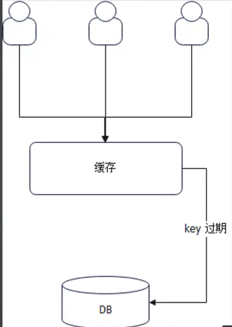

使用缓存 你首先应该想到的是：
- 一致性问题
- redis崩了怎么办（保护数据库）？
	崩了怎么办？要有兜底方案，比如使用orm的中间做对数据库的限流(不能使用redis的限流器，因为redis 已经崩了)
	使用本地缓存，redis崩了使用本地缓存(二级缓存)
	使用第二台redis(二级缓存)

### 缓存大体上分成两大类：
- 本地缓存
- 分布式(集中式)缓存，如：redis、memcache

一般在公司内部，我们都会再次封装不同缓存的 API，并且在这些 API 之上解决一些缓存问题


值的问题

- string: 可以，问题是本地缓存，结构体转化为 string，比如用 json 表达 User
- []byte: 最通用的表达，可以存储序列化后的数据，也可以存储加密数据，还可以存储压缩数据。用户用起来不方便
- any: Redis 之类的实现，你要考虑序列化的问题
```go
type Cache interface {
	Get(ctx context.Context, key string) (any, error)
	Set(ctx context.Context, key string, val any, expiration time.Duration) error
	.....
}
```
### 如何处理过期时间?
- 策略1: 在Set的时候每个 key 开一个 goroutine 盯着，过期了就执行删除策略

- - 策略2: 开一个goroutine 死循环定时遍历所有的key，过期则删除
- 策略3: 懒策略（懒删除），在Get的时候在检查是否过期 
- 策略4：
	- 1.Set的时候将expire转换为var deadline int64=time.Now().Add(expire).UnixNano(),将系统调用分摊到set方法中
	- 2.Get的时候判断Key的deadline和time.Now().UnixNano0的关系来决定是否返回Key 同时，启动一个go协程遍历所有的key，并记录启动go协程的时间lastCheckTime，即如果两次Get的时间间隔满足某个时间阈值，就启动一个go协程遍历所有key

double-checking的写法
```go
type LocalCache struct {
	data map[string]any
	mutex sync.RWMutex
	close chan struct{}
	closeOnce sync.Once

	// onEvicted func(key string, val any) error
	onEvicted func(key string, val any)
	// onEvicted func(ctx context.Context, key string, val any) error
	// onEvicted func(ctx context.Context, key string, val any)
}
// onEvicted 可以设计成option模式
func NewLocalCache(onEvicted func(key string, val any)) *LocalCache {
	res := &LocalCache{
		close: make(chan struct{}),
	}
	// 间隔时间，过长则过期的缓存迟迟得不到删除
	// 过短，则频繁执行，效果不好（过期的 key 很少）
	ticker := time.NewTicker(time.Second)
	go func() {
		// 没有时间间隔，不断遍历
		for {
			select {
			// case now := <-ticker.C:
			case <-ticker.C:
				// 00:01:00
				cnt := 0
				res.mutex.Lock()
				for k, v := range res.data {
					if v.(*item).deadline.Before(time.Now()) {
						res.delete(k, v.(*item).val)
					}
					cnt ++
					if cnt >= 1000 {
						break
					}
				}
				res.mutex.Unlock()
			case <- res.close:
				return
			}
		}
	}()
	return res
}

func (l *LocalCache) delete(key string, val any) {
	delete(l.data, key)
	if l.onEvicted != nil {
		l.onEvicted(key, val)
	}
}

func (l *LocalCache) Get(ctx context.Context, key string) (any, error) {
	l.mutex.RLock()
	// 第一次检查
	val, ok := l.data[key]
	l.mutex.RUnlock()
	if !ok {
		return nil, errs.NewErrKeyNotFound(key)
	}
	// 别人在这里调用 Set，而下面又删了是不行了
	// 这是使用double-checking的写法解决
	itm := val.(*item)
	if itm.deadline.Before(time.Now()) {
		l.mutex.Lock()
		defer l.mutex.Unlock()
		// 第二次检查
		val, ok = l.data[key]
		if !ok {
			return nil, errs.NewErrKeyNotFound(key)
		}
		itm = val.(*item)
		if itm.deadline.Before(time.Now()) {
			l.delete(key, itm.val)
		}
		return nil, errs.NewErrKeyNotFound(key)
	}
	return itm.val, nil
}

// Set(ctx, "key1", value1, time.Minute)
// 执行业务三十秒
// Set(ctx, "key1", value2, time.Minute)
// 再三十秒，第一个 time.AfterFunc 就要执行了
func (l *LocalCache) Set(ctx context.Context, key string, val any, expiration time.Duration) error {
	// 这个是有破绽的
	// time.AfterFunc(expiration, func() {
	// 	if l.m.Load(key).expiration
	// 	l.Delete(context.Background(), key)
	// })
	// 如果你想支持永不过期的，expiration = 0 就说明永不过期
	l.mutex.Lock()
	defer l.mutex.Unlock()
	l.data[key] = &item{
		val: val,
		deadline: time.Now().Add(expiration),
	}
	return nil
}

func (l *LocalCache) Delete(ctx context.Context, key string) error {
	l.mutex.Lock()
	defer l.mutex.Unlock()
	val, ok := l.data[key]
	if ok {
		return nil
	}
	l.delete(key, val.(*item).val)
	return nil
}


// close 无缓存，调用两次 Close 呢？第二次会阻塞
// close 1 缓存，调用三次就会阻塞
func (l *LocalCache) Close() error {
	// 这种写法，第二次调用会 panic
	// l.close <- struct{}{}
	// close(l.close)


	// 这种写法最好
	l.closeOnce.Do(func() {
		l.close <- struct{}{}
		close(l.close)
	})


	// 使用 select + default 防止多次 close 阻塞调用者
	// select {
	// case l.close<- struct{}{}:
	// 关闭 channel 要小心，发送数据到已经关闭的 channel 会引起 panic
	// 	close(l.close)
	// default:
	// 	// return errors.New("cache: 已经被关闭了")
	// 	return nil
	// }
	return nil
}

// 可以考虑用 sync.Pool 来复用的，是复用，不是缓存
type item struct {
	val any
	deadline time.Time
}

```

#### 控制缓存的内存使用量

**控制内存有两种策略：**
- 控制键值对数量，比如说只能允许十万个键值对
- 控制整体内存，需要计算每个对象的大小，然后累加

策略1 我们使用装饰器模式进行封装即可
```go
type MaxCntCacheDecorator struct {
	mutex sync.Mutex
	MaxCnt int32
	Cnt int32
	Cache *LocalCache
}

func NewMaxCntCache(maxCnt int32) *MaxCntCacheDecorator {
	res := &MaxCntCacheDecorator{MaxCnt: maxCnt}
	c := NewLocalCache(func(key string, val any) {
		atomic.AddInt32(&res.Cnt, -1)
	})
	res.Cache = c
	return res
}

func (c *MaxCntCacheDecorator)Set(ctx context.Context, key string, val any, expiration time.Duration) error{
	//还要考虑同名重复set的情况？
    c.mutex.Lock()
	defer c.mutex.Unlock()
	_, err := c.Cache.Get(ctx, key)
	if err != nil && err != errKeyNotFound {
		// 这个错误比较棘手
		return err
	}
	if err == errKeyNotFound {
		// 判断有没有超过最大值（）
		cnt := atomic.AddInt32(&c.Cnt, 1)
		// 满了
		if cnt > c.MaxCnt {
			atomic.AddInt32(&c.Cnt, -1)
			return errors.New("cache: 已经满了")
		}
	}
	return c.Cache.Set(ctx, key, val, expiration)
}
```
#### 控制内存策略二，使用LRU
查找了A就应该把A放在队尾


你需要一个复合结构:1具备 List 的特性，并且增删性能很好2.快速查找某个元素的能力

可以使用b+树，因为叶子节点是连起来的，linkedlist （container.list）只能用来简单实现

types.go
```go
package cache

import (
	"context"
	"time"
)

// Cache 屏蔽不同的缓存中间件的差异
type Cache interface {
	Get(ctx context.Context, key string) ([]byte, error)
	Set(ctx context.Context, key string, val []byte,
		expiration time.Duration) error
	Delete(ctx context.Context, key string) error

	LoadAndDelete(ctx context.Context, key string) ([]byte, error)

	OnEvicted(func(key string, val []byte))
}


type CacheV1 interface {
	Get(ctx context.Context, key string) ([]byte, error)
	Set(ctx context.Context, key string, val []byte,
		expiration time.Duration) error
	Delete(ctx context.Context, key string) error

	LoadAndDelete(ctx context.Context, key string) ([]byte, error)

	Subscribe() <- chan Event
}

type Event struct {
	Key string
	Val any
	// 增删改查
	Type int
}
```
```go
package cache

import (
	"context"
	"github.com/gotomicro/ekit/list"
	"sync"
	"time"
)

type MaxMemoryCache struct {
	Cache
	max  int64
	used int64
	// 使用 mutex 性能最差，但是肯定不会有并发问题
	// 可以考虑替换原子操作，但是内存控制就不准确了
	mutex *sync.Mutex
	// 这个地方因为 linked list 删除必须要遍历，所以性能很差
	// 按照正常的设计，这边需要的是一个接近  Java 的 LinkedHashMap 的结构
	keys *list.LinkedList[string]

	// 理论上优秀设计
	// s Strategy
}

// 淘汰策略接口
// type Strategy interface {
//
// }

func NewMaxMemoryCache(max int64, cache Cache) *MaxMemoryCache {
	res := &MaxMemoryCache{
		max:   max,
		Cache: cache,
		mutex: &sync.Mutex{},
		keys:  list.NewLinkedList[string](),
	}
	// 注册淘汰的回调
	res.Cache.OnEvicted(res.evicted)
	return res
}

func (m *MaxMemoryCache) Set(ctx context.Context, key string, val []byte,
	expiration time.Duration) error {
	m.mutex.Lock()
	defer m.mutex.Unlock()

	// 也可以用 Get，但是要记得调整 keys 和计算容量变化差值
	_, _ = m.Cache.LoadAndDelete(ctx, key)
	for m.used+int64(len(val)) > m.max {
		k, err := m.keys.Get(0)
		if err != nil {
			return err
		}
		_ = m.Cache.Delete(ctx, k)
	}
	err := m.Cache.Set(ctx, key, val, expiration)
	if err == nil {
		m.used = m.used + int64(len(val))
		_ = m.keys.Append(key)
	}

	return nil
}

func (m *MaxMemoryCache) Get(ctx context.Context, key string) ([]byte, error) {
	// 加锁是为了防止遇上懒惰删除的情况，触发了删除
	m.mutex.Lock()
	defer m.mutex.Unlock()
	val, err := m.Cache.Get(ctx, key)
	if err == nil {
		// 把原本的删掉
		// 然后将 key 加到末尾
		m.deleteKey(key)
		_ = m.keys.Append(key)
	}
	return val, err
}

func (m *MaxMemoryCache) Delete(ctx context.Context, key string) error {
	m.mutex.Lock()
	defer m.mutex.Unlock()
	return m.Cache.Delete(ctx, key)
}

func (m *MaxMemoryCache) LoadAndDelete(ctx context.Context, key string) ([]byte, error) {
	m.mutex.Lock()
	defer m.mutex.Unlock()
	return m.Cache.LoadAndDelete(ctx, key)
}

func (m *MaxMemoryCache) OnEvicted(fn func(key string, val []byte)) {
	m.mutex.Lock()
	defer m.mutex.Unlock()
	m.Cache.OnEvicted(func(key string, val []byte) {
		m.evicted(key, val)
		fn(key, val)
	})
}

func (m *MaxMemoryCache) evicted(key string, val []byte) {
	m.used = m.used - int64(len(val))
	m.deleteKey(key)
}

func (m *MaxMemoryCache) deleteKey(key string) {
    // 这里的两次遍历不是一个特备好的做法。可以使用迭代器优化，见：https://github.com/ecodeclub/ekit/issues/118
	for i := 0; i < m.keys.Len(); i++ {
		ele, _ := m.keys.Get(i)
		if ele == key {
			_, _ = m.keys.Delete(i)
			return
		}
	}
}
```
#### 测试
```go
package cache

import (
	"context"
	"errors"
	"github.com/gotomicro/ekit/list"
	"github.com/stretchr/testify/assert"
	"testing"
	"time"
)

var errNotFound = errors.New("not found")

func TestMaxMemoryCache_Set(t *testing.T) {
	testCases := []struct {
		name  string
		cache func() *MaxMemoryCache

		key string
		val []byte

		wantKeys []string
		wantErr  error
		wantUsed int64
	}{
		{
			// 不触发淘汰
			name: "not exist",
			cache: func() *MaxMemoryCache {
				res := NewMaxMemoryCache(100, &mockCache{data: map[string][]byte{}})
				return res
			},
			key:      "key1",
			val:      []byte("hello"),
			wantKeys: []string{"key1"},
			wantUsed: 5,
		},
		{
			// 原本就有，覆盖导致 used 增加
			name: "override-incr",
			cache: func() *MaxMemoryCache {
				res := NewMaxMemoryCache(100, &mockCache{
					data: map[string][]byte{
						"key1": []byte("hello"),
					},
				})
				res.keys = list.NewLinkedListOf[string]([]string{"key1"})
				res.used = 5
				return res
			},
			key:      "key1",
			val:      []byte("hello,world"),
			wantKeys: []string{"key1"},
			wantUsed: 11,
		},
		{
			// 原本就有，覆盖导致 used 减少
			name: "override-decr",
			cache: func() *MaxMemoryCache {
				res := NewMaxMemoryCache(100, &mockCache{
					data: map[string][]byte{
						"key1": []byte("hello"),
					},
				})
				res.keys = list.NewLinkedListOf[string]([]string{"key1"})
				res.used = 5
				return res
			},
			key:      "key1",
			val:      []byte("he"),
			wantKeys: []string{"key1"},
			wantUsed: 2,
		},
		{
			// 执行淘汰，一次
			name: "delete",
			cache: func() *MaxMemoryCache {
				res := NewMaxMemoryCache(40, &mockCache{
					data: map[string][]byte{
						"key1": []byte("hello, key1"),
						"key2": []byte("hello, key2"),
						"key3": []byte("hello, key3"),
					},
				})
				res.keys = list.NewLinkedListOf[string]([]string{"key1", "key2", "key3"})
				res.used = 33
				return res
			},
			key:      "key4",
			val:      []byte("hello, key4"),
			wantKeys: []string{"key2", "key3", "key4"},
			wantUsed: 33,
		},
		{
			// 执行淘汰，多次
			name: "delete-multi",
			cache: func() *MaxMemoryCache {
				res := NewMaxMemoryCache(40, &mockCache{
					data: map[string][]byte{
						"key1": []byte("hello, key1"),
						"key2": []byte("hello, key2"),
						"key3": []byte("hello, key3"),
					},
				})
				res.keys = list.NewLinkedListOf[string]([]string{"key1", "key2", "key3"})
				res.used = 33
				return res
			},
			key:      "key4",
			val:      []byte("hello, key4,hello, key4"),
			wantKeys: []string{"key3", "key4"},
			wantUsed: 34,
		},
	}

	for _, tc := range testCases {
		t.Run(tc.name, func(t *testing.T) {
			cache := tc.cache()
			err := cache.Set(context.Background(), tc.key, tc.val, time.Minute)
			assert.Equal(t, tc.wantKeys, cache.keys.AsSlice())
			assert.Equal(t, tc.wantErr, err)
			assert.Equal(t, tc.wantUsed, cache.used)
		})
	}
}

func TestMaxMemoryCache_Get(t *testing.T) {
	testCases := []struct {
		name  string
		cache func() *MaxMemoryCache

		key string

		wantKeys []string
		wantErr  error
	}{
		{
			name: "not exist",
			cache: func() *MaxMemoryCache {
				res := NewMaxMemoryCache(100, &mockCache{})
				return res
			},
			key:      "key1",
			wantKeys: []string{},
			wantErr:  errNotFound,
		},
		{
			name: "exist",
			cache: func() *MaxMemoryCache {
				res := NewMaxMemoryCache(100, &mockCache{
					data: map[string][]byte{
						"key1": []byte("OK"),
					},
				})
				res.keys = list.NewLinkedListOf[string]([]string{"key1", "key2"})
				return res
			},
			key:      "key1",
			wantKeys: []string{"key2", "key1"},
		},
	}

	for _, tc := range testCases {
		t.Run(tc.name, func(t *testing.T) {
			cache := tc.cache()
			_, err := cache.Get(context.Background(), tc.key)
			assert.Equal(t, tc.wantErr, err)
			assert.Equal(t, tc.wantKeys, cache.keys.AsSlice())
		})
	}
}

type mockCache struct {
	Cache
	fn   func(key string, val []byte)
	data map[string][]byte
}

func (m *mockCache) Set(ctx context.Context, key string, val []byte, expiration time.Duration) error {
	m.data[key] = val
	return nil
}

func (m *mockCache) Get(ctx context.Context, key string) ([]byte, error) {
	val, ok := m.data[key]
	if ok {
		return val, nil
	}
	return nil, errNotFound
}

func (m *mockCache) Delete(ctx context.Context, key string) error {
	val, ok := m.data[key]
	if ok {
		m.fn(key, val)
	}
	return nil
}

func (m *mockCache) LoadAndDelete(ctx context.Context, key string) ([]byte, error) {
	val, ok := m.data[key]
	if ok {
		m.fn(key, val)
		return val, nil
	}
	return nil, errNotFound
}

func (m *mockCache) OnEvicted(fn func(key string, val []byte)) {
	m.fn = fn
}
```

### redis 缓存
实现Cache 抽象
使用cmdable 可以使用mock工具


```go
import (
	"context"
	"errors"
	"github.com/go-redis/redis/v9"
	"time"
)

type RedisCache struct {
	client redis.Cmdable
}


func NewRedisCache(client redis.Cmdable) *RedisCache {
	return &RedisCache{
		client: client,
	}
}

func (r *RedisCache) Get(ctx context.Context, key string) (any, error) {
	return r.client.Get(ctx, key).Result()
}

func (r *RedisCache) Set(ctx context.Context, key string, val any, expiration time.Duration) error {
	res, err := r.client.Set(ctx, key, val, expiration).Result()
	if err != nil {
		return err
	}
	if res != "OK" {
		return errors.New("cache: 设置键值对失败")
	}
	return err
}

func (r *RedisCache) Delete(ctx context.Context, key string) error {
	_, err := r.client.Del(ctx, key).Result()
	return err
}

```

#### 使用gomock 来单测redis

要利用 gomock 来执行单元测试
go mock 官网 https.//github.com/golang/mock
go install github.com/golang/mock/mockgen@v1.6.0
在根目录下执行: 

```
mockgen -package=mocks -destination=cache/mocks/mock_redis_cmdable.gen.go github.com/go-redis/redis/v9 Cmdable
```
参数意义:
- package: 指定生成代码的 Go 代码的 package 的值
- destination: 目标位置，我们这里是写到了一个文件里面
- `github.com/go-redis/redis/v9 Cmdable`: 表示为该包下面的 `Cmdable` 接口生成 mock 代码
```go
import (
	"context"
	"gitee.com/shijting/mycache/cache/mocks" // 这是mockgen生成的
	"github.com/go-redis/redis/v9"
	"github.com/golang/mock/gomock"
	"github.com/stretchr/testify/assert"
	"testing"
	"time"
)

func TestRedisCache_Set(t *testing.T) {
	ctrl := gomock.NewController(t)
	defer ctrl.Finish()
	testCases := []struct{
		name string
		mock func()redis.Cmdable
		key string
		val string
		expiration time.Duration

		wantErr error
	} {
		{
			name: "return OK",
			mock: func() redis.Cmdable {
				res := mocks.NewMockCmdable(ctrl)
				cmd := redis.NewStatusCmd(nil)
				cmd.SetVal("OK")
				res.EXPECT().Set(gomock.Any(), "key1", "value1", time.Minute).
					Return(cmd)
				return res
			},
			key: "key1",
			val: "value1",
			expiration: time.Minute,
		},

		{
			name: "timeout",
			mock: func() redis.Cmdable {
				res := mocks.NewMockCmdable(ctrl)
				cmd := redis.NewStatusCmd(nil)
				cmd.SetErr(context.DeadlineExceeded)
				res.EXPECT().Set(gomock.Any(), "key1", "value1", time.Minute).
					Return(cmd)
				return res
			},
			key: "key1",
			val: "value1",
			expiration: time.Minute,
			wantErr: context.DeadlineExceeded,
		},
	}

	for _, tc := range testCases {
		t.Run(tc.name, func(t *testing.T) {
			cmdable := tc.mock()
			client := NewRedisCache(cmdable)
			err := client.Set(context.Background(), tc.key, tc.val, tc.expiration)
			assert.Equal(t, tc.wantErr, err)
		})
	}
}

```
#### 缓存API-组合式API
什么是组合式 API? 就是多个动作组合在一起，作为一个 API 提供出去
- LoadOrStore
- LoadAndDelete
- 自增、自减 API
这种组合式 API 要注意: 线程安全。在本地实现里面加锁就可以;在Redis里面(可能) 要使用 lua 脚本。

### 面试要点
主要考察缓存的设计和实现:
- 缓存过期时间怎么控制? 定期删除 + 懒惰删除
- 定期删除过期缓存有什么要注意的? 注意控制 CPU 开销，防止定期删除占用太多资源(这是 Redis 定期删除点到即止的核心原因)
- 为什么无法做到缓存一过期就删除?借助于延迟队列可以勉强做到，例如在毫秒级的时间误差内做到。但是更加精确的时间误差就做不到了。如果没有延迟队列，那么就只能考虑开 goroutine 盯着缓存键值对，资源开销太大
- 本地缓存如何避免占用内存太多?要控制内存使用量，可以通过控制内存总量，也可以控制键值对总数
- 如何提供缓存的内存利用率?一个是不要使用 Hash 一类的数据结构，另外一个是不要直接存储对象而是存储序列化后的数据。这个也可以看做是缓存节约内存的一部分措施

### 缓存模式

常见的缓存模式有：
- cache-aside
- read-through(读穿透)
- write-through
- write-back(回写)
- refresh-ahead(类似那种监听MySQL binlog 然后更新redis 缓存的那种)

#### cache-aside
- 把 Cache 当成一个普通的数据源
- 更新 Cache 和 DB 都依赖于开发者自己写代码
业务代码可以做决策:
- 未命中的时候是否要从 DB 取数据。如果不从 DB 取可以考虑使用默认值进行业务处理
- 同步 or 异步读取数据并且写入
- 采用 singleflight
同步

半同步

要点: 业务代码会同步从数据库读取数据，而后用 DB 数据来执行业务，同时异步刷新缓存。
异步

要点:业务代码在发现缓存没有返回数据的时候，会直接返回响应，或者使用默认值。而后异步从 DB 读取数据，刷新缓存。

**数据不一致**

read/write through 也会有这种问题
#### read-through
- 业务代码只需要从 cache 中读取数据，cache 会在缓存不命中的时候去读取数据（由cache 决定是否从db里同步数据）
- 写数据的时候，业务代码需要自己写 DB 和写cache
cache 可以做决策:
- 未命中的时候是否要从 DB 取数据。如果不从 DB取，可以考虑使用默认值进行业务处理
- 同步 or 异步读取数据并且写入
- 采用 singleflight
同步

半异步

要点: cache 会同步从数据库读取数据，而后直接返回值，同时异步刷新缓存
异步

要点: cache 会直接返回响应，而后异步从 DB读取数据，刷新缓存。

#### write-through
- 开发者只需要写入 cache，cache 自己会更新数据库
- 在读未命中缓存的情况下，开发者需要自己去数据库捞数据，然后更新缓存(此时缓存不需要更新 DB 了)
cache 可以做决策
- 同步 or 异步写数据到 DB，或者到 cachecache 可以自由决定先写 DB 还是先写
- cache，一般是先写 DB

全同步


半异步

要点: cache 会同步将数据刷新到 DB，而后返回响应，同时异步刷新缓存。
异步

要点: 只具备理论意义，实际上几乎不会用


#### Write Back
- 在写操作的时候写了缓存直接返回，不会直接更新数据库，读也是直接读缓存
- 在缓存过期的时候，将缓存写回去数据库
优缺点
- 所有 goroutine 都是读写缓存，不存在一致性的问题(如果是本地缓存依旧会有问题)
- 数据可能丢失:如果在缓存过期刷新到数据库之前，缓存宕机，那么会丢失数据

write-back 主要是利用 OnEvicted 回调，在里面将数据刷新到 DB 里。


#### Refresh-ahead
refresh-ahead 依赖于 CDC(changed data capture) 接口:
- 数据库暴露数据变更接口
- cache 或者第四方在监听到数据变更之后自动更新数据
- 如果读 cache 未命中，依旧要刷新缓存的话，依然会出现并发问题


### 缓存异常
#### 缓存穿透
- 读请求对应的数据根本不存在，因此每次都会发起数据库查询。数据库返回 NULL，所以下一次请求依旧会打到数据库。

- 关键点就是这个**数据根本没有，所以不会回写缓存**

- 一般是黑客使用了一些非法的请求，比如说非法的邮箱、ID 等
  

  解决方案：

- 使用 singleflight 能够缓解问题。但如果攻击者是构造了大量不同的不存在的 key，那么 singleflight 的效果并不是很好
- 知道数据库里面根本没有数据，**缓存未命中就直接返回**
  - 缓存里面是全量数据（比如热点数据），那么未命中就可以直接返回
  - **使用布隆过滤器**、bit array 等结构，未命中的时候再问一下这些结构
- 缓存没有，但是依旧不会去数据库查询，而是使用默认值
- 在缓存未命中回表查询的时候，加上限流器

#### 缓存击穿:
- 缓存中没有对应 key 的数据（数据库中有）
- 一般情况下，某个 key 缓存未命中并不会导致严重问题。但是如果该 key 的访问量非常大，大家都去数据库查询数据，那么就可能压垮数据库。
- 击穿和穿透比起来，****关键在于击穿本身数据在 DB 里面是有的，只是缓存里面没有而已，所以只要回写到缓存，此一次访问就是命中缓存
**解决方案：**
- singleflight： 就足以解决问题
- 缓存未命中的时候，使用默认值
- 在回查数据库的时候，**加上限流器**，不过这个是保护系统，而不是解决问题

#### 缓存雪崩:
- 同一时刻，大量 key 过期，查询都要回查数据库
- 常见场景是在启动的时候加载缓存，因为所有 key的过期时间都一样，所以会在同一时间全部过期。

**解决方案**
在设置 key 过期时间的时候，加上一个随机的偏移量
example
```go
offset :=rand.Intn(300)
```
#### 解决思路
singleflight 设计模式能够有效减轻对数据库的压力。
singleflight: 在有多个 goroutine 试图去数据库加载同一个 key 对应数据的时候，只允许一个 goroutine 过去查询，其它都在原地等待结果。
对数据库的压力本来是跟 QPS 相当，变为跟同一时刻不同 key 的数量和实例数量相当。例如同一个时刻需要加载十个不同 key的数据，应用部署了三个实例，那么对数据库的压力就是10*3
热点越集中的应用，效果越好

普通的 singleflight 是和 cache aside 一起使用的。
在下边代码块中，业务代码发现缓存返回了KeyNotFound，于是开始利用 singleflight 设计模式去数据库加载数据，并且刷新缓存。
```go
import (
	"context"
	"errors"
	"golang.org/x/sync/singleflight"
	"log"
	"time"
)


var (
	cache Cache
	KeyNotFound = errors.New("key not found")
)

var group = &singleflight.Group{}
func Biz(key string) {
	val, err := cache.Get(context.Background(), key)
	if err == KeyNotFound {
		val, err, _ = group.Do(key, func() (interface{}, error) {
			newVal, err := QueryFromDB(key)
			if err != nil {
				return nil, err
			}
			err = cache.Set(context.Background(), key, newVal, time.Minute)
			return newVal, err
		})
	}
	println(val)
}

func QueryFromDB(key string) (any, error) {
	panic("implement")
}

// SingleflightCacheV1 也是装饰器模式
// 进一步封装 ReadThroughCache
// 在加载数据并且刷新缓存的时候应用了 singleflight 模式
type SingleflightCacheV1 struct {
	ReadThroughCache
}

func NewSingleflightCacheV1(cache Cache,
	loadFunc func(ctx context.Context, key string)(any, error)) Cache {
	g := &singleflight.Group{}
	return &SingleflightCacheV1{
		ReadThroughCache: ReadThroughCache{
			Cache: cache,
			LoadFunc: func(ctx context.Context, key string) (any, error) {
				defer func() {
					g.Forget(key)
				}()
				// 多个 goroutine 进来这里
				// 只有一个 goroutine 会真的去执行
				val, err, _ := g.Do(key, func() (interface{}, error) {
					return loadFunc(ctx, key)
				})
				return val, err
			},
		},
	}
}

// SingleflightCacheV2 也是装饰器模式
// 进一步封装 ReadThroughCache
// 在加载数据并且刷新缓存的时候应用了 singleflight 模式
type SingleflightCacheV2 struct {
	ReadThroughCache
	group *singleflight.Group
}

func NewSingleflightCacheV2(cache Cache,
	loadFunc func(ctx context.Context, key string)(any, error)) Cache {
	return &SingleflightCacheV2{
		ReadThroughCache: ReadThroughCache{
			Cache: cache,
			LoadFunc: loadFunc,
		},
		group: &singleflight.Group{},
	}
}

func (s *SingleflightCacheV2) Get(ctx context.Context, key string) (any, error) {
	val, err := s.Cache.Get(ctx, key)
	if err == KeyNotFound {
		defer func() {
			s.group.Forget(key)
		}()
		val, err, _ = s.group.Do(key, func() (interface{}, error) {
			v, er := s.LoadFunc(ctx, key)
			if er == nil {
				if e := s.Set(ctx, key, val, time.Minute); e != nil {
					log.Fatalf("刷新缓存失败, err: %v", err)
				}
			}
			return v, er
		})
	}
	return val, err
}

type BloomFilter interface {
	HasKey(ctx context.Context, key string) (bool, error)
}

type BloomFilterCache struct {
	ReadThroughCache
	bf BloomFilter
}

func NewBloomFilterCache(cache Cache,
	bf BloomFilter,
	loadFunc func(ctx context.Context, key string)(any, error)) Cache {
	return &BloomFilterCache{
		ReadThroughCache: ReadThroughCache{
			Cache: cache,
			LoadFunc: func(ctx context.Context, key string) (any, error) {
				ok, _ := bf.HasKey(ctx, key)
				if ok {
					return loadFunc(ctx, key)
				}
				return nil, errors.New("invalid key")
			},
		},
	}
}

func (s *BloomFilterCache) Get(ctx context.Context, key string) (any, error) {
	val, err := s.Cache.Get(ctx, key)
	if err == KeyNotFound {
		found, _ := s.bf.HasKey(ctx, key)
		if found {
			val, err = s.LoadFunc(ctx, key)
			if err == nil {
				if e := s.Set(ctx, key, val, time.Minute); e != nil {
					log.Fatalf("刷新缓存失败, err: %v", err)
				}
			}
		}
	}
	return val, err
}


type RandomExpirationCache struct {
	Cache
	offset func() time.Duration
}

func NewRandomExpirationCache(cache Cache, offset func()time.Duration) Cache {
	return &RandomExpirationCache{
		Cache: cache,
		offset: offset,
	}
}

func (r *RandomExpirationCache) Set(ctx context.Context,
	key string, val any, expiration time.Duration) error {

	expiration = expiration + r.offset()
	return r.Cache.Set(ctx, key, val, expiration)
}

```

### 示例

#### read through
```go
type ReadThroughCache struct {
	mutex sync.RWMutex
	Cache
	Expiration time.Duration
	// 我们把最常见的”捞DB”这种说法抽象为”加载数据”
	LoadFunc func(ctx context.Context, key string) (any, error)
	// Loader

	Async bool
}

func (c *ReadThroughCache) Get(ctx context.Context, key string) (any, error) {
	// 逻辑：
	// 先捞缓存
	// 再捞 DB
	c.mutex.RLock()
	val, err := c.Cache.Get(ctx, key)
	c.mutex.RUnlock()
	if err != nil && err != errKeyNotFound {
		// 这个代表出问题了，但是不知道哪里出问题了
		return nil, err
	}

	// 缓存没有数据
	if err == errKeyNotFound {

		// 全异步，在这里直接开 goroutine
		// go func() {
		// 	c.mutex.Lock()
		// 	defer c.mutex.Unlock()
		// 	// 加锁问题
		// 	// 两个 goroutine 进来这里
		//
		//
		// 	// 捞DB
		// 	val, err = c.LoadFunc(ctx, key)
		//
		// 	// 第一个 key1=value1
		// 	// 中间有人更新了数据库
		// 	// 第二个 key1=value2
		//
		// 	if err != nil {
		// 		log.Fatalln(err)
		// 		return
		// 	}
		//
		// 	// 这里 err 可以考虑忽略掉，或者输出 warn 日志
		// 	err = c.Cache.Set(ctx, key, val, c.Expiration)
		// 	if err != nil {
		// 		log.Fatalln(err)
		// 	}
		// }()


		c.mutex.Lock()
		defer c.mutex.Unlock()
		// 加锁问题
		// 两个 goroutine 进来这里


		// 捞DB
		val, err = c.LoadFunc(ctx, key)

		// 第一个 key1=value1
		// 中间有人更新了数据库
		// 第二个 key1=value2

		if err != nil {

			// 讨论清楚
			// 1. 你的缓存框架有 Log 抽象，那么你可以打印错误
			// log.Println(err)
			// return nil, errors.New("cache: 无法加载数据")
			// 所以很显然，如果你是公司自研的缓存框架，那么你就爱怎么打就怎么打

			// 2. 你不想引入 Log，而是希望通过返回 error 来暴露信息
			// 这里你就不要丢掉原始 err 信息
			// 你可以 wrap 也可以不 wrap
			// 我个人偏好：只在我确实不希望用户知道我的底层实现的时候，我才会 wrap
			// 但是 LoadFunc 是用户指定的，不关我事，所以直接返回也没啥


			// 这里会暴露 LoadFunc 底层
			// 例如如果 LoadFunc 是数据库查询，这里就会暴露数据库的错误信息（或者 ORM 框架的）
			return nil, fmt.Errorf("cache: 无法加载数据, %w", err)

			// 转新 error 我不建议
			// return nil, errors.New("cache: 无法加载数据")
		}

		// 这里开 goroutine 就是半异步


		// 这里 err 可以考虑忽略掉，或者输出 warn 日志
		err = c.Cache.Set(ctx, key, val, c.Expiration)

		// 可能的结果: goroutine1 先，毫无问题，数据库和缓存是一致的
		// goroutine2 先，那就有问题了, DB 是 value2，但是 cache 是 value1
		if err != nil {
			log.Fatalln(err)
		}
		return val, nil
	}
	return val, nil
}

func (c *ReadThroughCache) Set(ctx context.Context, key string, val any, expiration time.Duration) error {
	// 你加不加锁，数据都可能不一致
	c.mutex.Lock()
	defer c.mutex.Unlock()
	return c.Cache.Set(ctx, key, val, expiration)
}
```
test
```go
func TestReadThroughCache_Get(t *testing.T) {
	local := NewLocalCache(func(key string, val any) {

	})
	var db *orm.DB
	cache := &ReadThroughCache{
		Cache: local,
		Expiration: time.Minute,
		LoadFunc: func(ctx context.Context, key string) (any, error) {
			if strings.HasPrefix(key, "/user/") {
				// 找用户的数据
				// Key = /user/123 ，其中123 是用户 id
				// 这是用户的
				id := strings.Trim(key, "/user/")
				return orm.NewSelector[User](db).Where(orm.C("Id").EQ(id)).Get(ctx)
			} else if strings.HasPrefix(key, "/order/") {
				// 找 Order 数据
			} else if strings.HasPrefix(key, "produce") {
				// 找商品的数据
			}
			// if-else 就没完没了了
			return nil, errors.New("不支持操作")
		},
	}

	cache.Get(context.Background(), "/user/123")

	userCache := &ReadThroughCache{
		Cache: local,
		Expiration: time.Minute,
		LoadFunc: func(ctx context.Context, key string) (any, error) {
			if strings.HasPrefix(key, "/user/") {
				// 找用户的数据
				// Key = /user/123 ，其中123 是用户 id
				// 这是用户的
				id := strings.Trim(key, "/user/")
				return orm.NewSelector[User](db).Where(orm.C("Id").EQ(id)).Get(ctx)
			}
			// if-else 就没完没了了
			return nil, errors.New("不支持操作")
		},
	}

	userCache.Get(context.Background(), "/user/123")
	// orderCache
}
```

#### Write Though
```go
type WriteThoughCache struct {
	Cache
	StoreFunc func(ctx context.Context, key string, val any) error
}

func (w *WriteThoughCache) Set(ctx context.Context,
	key string, val any, expiration time.Duration) error {
	err := w.StoreFunc(ctx, key, val)
	if err != nil {
		return err
	}
	return w.Cache.Set(ctx, key, val, expiration)
}
```

#### Bloom cache
```go
type BloomCache struct {
	BloomFilter
	Cache
	LoadFunc func(ctx context.Context, key string) (any, error)
}

func (b *BloomCache) Get(ctx context.Context, key string) (any, error) {
	val, err := b.Cache.Get(ctx, key)
	if err!= nil && err != errKeyNotFound {
		return nil, err
	}
	if err == errKeyNotFound {
		exist := b.BloomFilter.Exist(key)
		if exist {
			val, err = b.LoadFunc(ctx, key)
			b.Cache.Set(ctx, key, val, time.Minute)
		}
	}
	return val, err
}

type BloomCacheV1 struct {
	*ReadThroughCache
}

func NewBloomCacheV1(c Cache, b BloomFilter, lf func(ctx context.Context, key string) (any, error) ) *BloomCacheV1 {
	return &BloomCacheV1{
		ReadThroughCache: &ReadThroughCache{
			Cache: c,
			LoadFunc: func(ctx context.Context, key string) (any, error) {
				exist := b.Exist(key)
				if exist {
					return lf(ctx, key)
				}
				return nil, errors.New("数据不存在")
			},
		},
	}
}


type BloomFilter interface {
	Exist(key string) bool
}


// 加了限流的实现
type LimitCache struct {

}
```


### redis 分布式锁
##### lock.go
```go
package rlock

import (
	"context"
	_ "embed"
	"errors"
	"fmt"
	"sync"
	"time"

	"github.com/go-redis/redis/v9"
	"github.com/google/uuid"
	"golang.org/x/sync/singleflight"
)

var (
	//go:embed script/lua/unlock.lua
	luaUnlock string
	//go:embed script/lua/refresh.lua
	luaRefresh string

	//go:embed script/lua/lock.lua
	luaLock string

	ErrFailedToPreemptLock = errors.New("rlock: 抢锁失败")
	// ErrLockNotHold 一般是出现在你预期你本来持有锁，结果却没有持有锁的地方
	// 比如说当你尝试释放锁的时候，可能得到这个错误
	// 这一般意味着有人绕开了 rlock 的控制，直接操作了 Redis
	ErrLockNotHold = errors.New("rlock: 未持有锁")
)

type Client struct {
	client redis.Cmdable
	g      singleflight.Group
	// valuer 用于生成值，将来可以考虑暴露出去允许用户自定义
	valuer func() string
}

func NewClient(client redis.Cmdable) *Client {
	return &Client{
		client: client,
		valuer: func() string {
			return uuid.New().String()
		},
	}
}

func (c *Client) SingleflightLock(ctx context.Context, key string, expiration time.Duration, retry RetryStrategy, timeout time.Duration) (*Lock, error) {
	for {
		flag := false
		result := c.g.DoChan(key, func() (interface{}, error) {
			flag = true
			return c.Lock(ctx, key, expiration, retry, timeout)
		})
		select {
		case res := <-result:
			if flag {
				c.g.Forget(key)
				if res.Err != nil {
					return nil, res.Err
				}
				return res.Val.(*Lock), nil
			}
		case <-ctx.Done():
			return nil, ctx.Err()
		}
	}
}

// 转交的做法
// func (c *Client) LockV1(ctx context.Context, key string, expiration time.Duration) (*Lock, error) {
// 	keysWaitingChan := make(map[string]*Lock, 1)
// 	l, ok := keysWaitingChan[key]
// 	if !ok {
// 		// 尝试自己去拿
// 	}
// 	select {
// 		case <- l.waiting:
// 			case <- ctx.Done():
//
// 	}
//
// }

// Lock 是尽可能重试减少加锁失败的可能
// Lock 会在超时或者锁正被人持有的时候进行重试
// 最后返回的 error 使用 errors.Is 判断，可能是：
// - context.DeadlineExceeded: Lock 整体调用超时
// - ErrFailedToPreemptLock: 超过重试次数，但是整个重试过程都没有出现错误
// - DeadlineExceeded 和 ErrFailedToPreemptLock: 超过重试次数，但是最后一次重试超时了
// 你在使用的过程中，应该注意：
// - 如果 errors.Is(err, context.DeadlineExceeded) 那么最终有没有加锁成功，谁也不知道
// - 如果 errors.Is(err, ErrFailedToPreemptLock) 说明肯定没成功，而且超过了重试次数
// - 否则，和 Redis 通信出了问题
func (c *Client) Lock(ctx context.Context, key string, expiration time.Duration, retry RetryStrategy, timeout time.Duration) (*Lock, error) {
	val := c.valuer()
	var timer *time.Timer
	defer func() {
		if timer != nil {
			timer.Stop()
		}
	}()
	for {
		lctx, cancel := context.WithTimeout(ctx, timeout)
		res, err := c.client.Eval(lctx, luaLock, []string{key}, val, expiration.Seconds()).Result()
		cancel()
		if err != nil && !errors.Is(err, context.DeadlineExceeded) {
			// 非超时错误，那么基本上代表遇到了一些不可挽回的场景，所以没太大必要继续尝试了
			// 比如说 Redis server 崩了，或者 EOF 了
			return nil, err
		}
		if res == "OK" {
			return newLock(c.client, key, val, expiration), nil
		}
		interval, ok := retry.Next()
		if !ok {
			if err != nil {
				err = fmt.Errorf("最后一次重试错误: %w", err)
			} else {
				err = fmt.Errorf("锁被人持有: %w", ErrFailedToPreemptLock)
			}
			return nil, fmt.Errorf("rlock: 重试机会耗尽，%w", err)
		}
		if timer == nil {
			timer = time.NewTimer(interval)
		} else {
			timer.Reset(interval)
		}
		select {
		case <-timer.C:
		case <-ctx.Done():
			return nil, ctx.Err()
		}
	}
}

func (c *Client) TryLock(ctx context.Context,
	key string, expiration time.Duration) (*Lock, error) {
	val := c.valuer()
	ok, err := c.client.SetNX(ctx, key, val, expiration).Result()
	if err != nil {
		// 网络问题，服务器问题，或者超时，都会走过来这里
		return nil, err
	}
	if !ok {
		// 已经有人加锁了，或者刚好和人一起加锁，但是自己竞争失败了
		return nil, ErrFailedToPreemptLock
	}
	return newLock(c.client, key, val, expiration), nil
}

type Lock struct {
	client           redis.Cmdable
	key              string
	value            string
	expiration       time.Duration
	unlock           chan struct{}
	signalUnlockOnce sync.Once

	waiting chan struct{}
}

func newLock(client redis.Cmdable, key string, value string, expiration time.Duration) *Lock {
	return &Lock{
		client:     client,
		key:        key,
		value:      value,
		expiration: expiration,
		unlock:     make(chan struct{}, 1),
	}
}

func (l *Lock) AutoRefresh(interval time.Duration, timeout time.Duration) error {
	ticker := time.NewTicker(interval)
	// 刷新超时 channel
	ch := make(chan struct{}, 1)
	defer func() {
		ticker.Stop()
		close(ch)
	}()
	for {
		select {
		case <-ticker.C:
			ctx, cancel := context.WithTimeout(context.Background(), timeout)
			err := l.Refresh(ctx)
			cancel()
			// 超时这里，可以继续尝试
			if err == context.DeadlineExceeded {
				// 因为有两个可能的地方要写入数据，而 ch
				// 容量只有一个，所以如果写不进去就说明前一次调用超时了，并且还没被处理，
				// 与此同时计时器也触发了
				select {
				case ch <- struct{}{}:
				default:
				}
				continue
			}
			if err != nil {
				return err
			}
		case <-ch:
			ctx, cancel := context.WithTimeout(context.Background(), timeout)
			err := l.Refresh(ctx)
			cancel()
			// 超时这里，可以继续尝试
			if err == context.DeadlineExceeded {
				select {
				case ch <- struct{}{}:
				default:
				}
				continue
			}
			if err != nil {
				return err
			}
		case <-l.unlock:
			return nil
		}
	}
}

func (l *Lock) Refresh(ctx context.Context) error {
	res, err := l.client.Eval(ctx, luaRefresh,
		[]string{l.key}, l.value, l.expiration.Seconds()).Int64()
	if err != nil {
		return err
	}
	if res != 1 {
		return ErrLockNotHold
	}
	return nil
}

// 本地转交的思路
// func (l *Lock) UnlockV1(ctx context.Context) error {
// 	select {
// 	case l.waiting <- struct{}{}:
// 	default:
// 		// 真正的释放锁
// 	}
//
// }

// Unlock 解锁
func (l *Lock) Unlock(ctx context.Context) error {
	res, err := l.client.Eval(ctx, luaUnlock, []string{l.key}, l.value).Int64()
	defer func() {
		// 避免重复解锁引起 panic
		l.signalUnlockOnce.Do(func() {
			l.unlock <- struct{}{}
			close(l.unlock)
		})
	}()
	if err == redis.Nil {
		return ErrLockNotHold
	}
	if err != nil {
		return err
	}
	if res != 1 {
		return ErrLockNotHold
	}
	return nil
}
```
##### retry.go
```go
package rlock

import "time"

type RetryStrategy interface {
	// Next 返回下一次重试的间隔，如果不需要继续重试，那么第二参数发挥 false
	Next() (time.Duration, bool)
}

type FixIntervalRetry struct {
	// 重试间隔
	Interval time.Duration
	// 最大次数
	Max int
	cnt int
}

func (f *FixIntervalRetry) Next() (time.Duration, bool) {
	f.cnt++
	return f.Interval, f.cnt <= f.Max
}
```

##### lock_test.go
```go
import (
	"context"
	"errors"
	"fmt"
	"gitee.com/geektime-geekbang/geektime-go/cache/redis-lock/mocks" // 这里是gomock 生成的
	"testing"
	"time"

	"github.com/go-redis/redis/v9"
	"github.com/golang/mock/gomock"
	"github.com/stretchr/testify/assert"
	"github.com/stretchr/testify/require"
)

func TestClient_Lock(t *testing.T) {
	t.Parallel()
	ctrl := gomock.NewController(t)
	defer ctrl.Finish()
	testCases := []struct {
		name string

		mock func() redis.Cmdable

		key        string
		expiration time.Duration
		retry      RetryStrategy
		timeout    time.Duration

		wantLock *Lock
		wantErr  string
	}{
		{
			name: "locked",
			mock: func() redis.Cmdable {
				cmdable := mocks.NewMockCmdable(ctrl)
				res := redis.NewCmd(context.Background(), nil)
				res.SetVal("OK")
				cmdable.EXPECT().Eval(gomock.Any(), luaLock, []string{"locked-key"}, gomock.Any()).
					Return(res)
				return cmdable
			},
			key:        "locked-key",
			expiration: time.Minute,
			retry:      &FixIntervalRetry{Interval: time.Second, Max: 1},
			timeout:    time.Second,
			wantLock: &Lock{
				key:        "locked-key",
				expiration: time.Minute,
			},
		},
		{
			name: "not retryable",
			mock: func() redis.Cmdable {
				cmdable := mocks.NewMockCmdable(ctrl)
				res := redis.NewCmd(context.Background(), nil)
				res.SetErr(errors.New("network error"))
				cmdable.EXPECT().Eval(gomock.Any(), luaLock, []string{"locked-key"}, gomock.Any()).
					Return(res)
				return cmdable
			},
			key:        "locked-key",
			expiration: time.Minute,
			retry:      &FixIntervalRetry{Interval: time.Second, Max: 1},
			timeout:    time.Second,
			wantErr:    "network error",
		},
		{
			name: "retry over times",
			mock: func() redis.Cmdable {
				cmdable := mocks.NewMockCmdable(ctrl)
				first := redis.NewCmd(context.Background(), nil)
				first.SetErr(context.DeadlineExceeded)
				cmdable.EXPECT().Eval(gomock.Any(), luaLock, []string{"retry-key"}, gomock.Any()).
					Times(3).Return(first)
				return cmdable
			},
			key:        "retry-key",
			expiration: time.Minute,
			retry:      &FixIntervalRetry{Interval: time.Millisecond, Max: 2},
			timeout:    time.Second,
			wantErr:    "rlock: 重试机会耗尽，最后一次重试错误: context deadline exceeded",
		},
		{
			name: "retry over times-lock holded",
			mock: func() redis.Cmdable {
				cmdable := mocks.NewMockCmdable(ctrl)
				first := redis.NewCmd(context.Background(), nil)
				//first.Set
				cmdable.EXPECT().Eval(gomock.Any(), luaLock, []string{"retry-key"}, gomock.Any()).
					Times(3).Return(first)
				return cmdable
			},
			key:        "retry-key",
			expiration: time.Minute,
			retry:      &FixIntervalRetry{Interval: time.Millisecond, Max: 2},
			timeout:    time.Second,
			wantErr:    "rlock: 重试机会耗尽，锁被人持有: rlock: 抢锁失败",
		},
		{
			name: "retry and success",
			mock: func() redis.Cmdable {
				cmdable := mocks.NewMockCmdable(ctrl)
				first := redis.NewCmd(context.Background(), nil)
				first.SetVal("")
				cmdable.EXPECT().Eval(gomock.Any(), luaLock, []string{"retry-key"}, gomock.Any()).
					Times(2).Return(first)
				second := redis.NewCmd(context.Background(), nil)
				second.SetVal("OK")
				cmdable.EXPECT().Eval(gomock.Any(), luaLock, []string{"retry-key"}, gomock.Any()).
					Return(second)
				return cmdable
			},
			key:        "retry-key",
			expiration: time.Minute,
			retry:      &FixIntervalRetry{Interval: time.Millisecond, Max: 3},
			timeout:    time.Second,
			wantLock: &Lock{
				key:        "retry-key",
				expiration: time.Minute,
			},
		},
		{
			name: "retry but timeout",
			mock: func() redis.Cmdable {
				cmdable := mocks.NewMockCmdable(ctrl)
				first := redis.NewCmd(context.Background(), nil)
				first.SetVal("")
				cmdable.EXPECT().Eval(gomock.Any(), luaLock, []string{"retry-key"}, gomock.Any()).
					Times(2).Return(first)
				return cmdable
			},
			key:        "retry-key",
			expiration: time.Minute,
			retry:      &FixIntervalRetry{Interval: time.Millisecond * 550, Max: 2},
			timeout:    time.Second,
			wantErr:    "context deadline exceeded",
		},
	}

	for _, tc := range testCases {
		t.Run(tc.name, func(t *testing.T) {
			mockRedisCmd := tc.mock()
			client := NewClient(mockRedisCmd)
			ctx, cancel := context.WithTimeout(context.Background(), tc.timeout)
			defer cancel()
			l, err := client.Lock(ctx, tc.key, tc.expiration, tc.retry, time.Second)
			if tc.wantErr != "" {
				assert.EqualError(t, err, tc.wantErr)
				return
			} else {
				require.NoError(t, err)
			}

			assert.Equal(t, mockRedisCmd, l.client)
			assert.Equal(t, tc.key, l.key)
			assert.Equal(t, tc.expiration, l.expiration)
			assert.NotEmpty(t, l.value)
		})
	}
}

func TestClient_TryLock(t *testing.T) {
	ctrl := gomock.NewController(t)
	defer ctrl.Finish()
	testCases := []struct {
		name string

		mock func() redis.Cmdable

		key        string
		expiration time.Duration

		wantLock *Lock
		wantErr  error
	}{
		{
			// 加锁成功
			name:       "locked",
			key:        "locked-key",
			expiration: time.Minute,
			mock: func() redis.Cmdable {
				res := mocks.NewMockCmdable(ctrl)
				res.EXPECT().SetNX(gomock.Any(), "locked-key", gomock.Any(), time.Minute).
					Return(redis.NewBoolResult(true, nil))
				return res
			},
			wantLock: &Lock{
				key:        "locked-key",
				expiration: time.Minute,
			},
		},
		{
			// mock 网络错误
			name:       "network error",
			key:        "network-key",
			expiration: time.Minute,
			mock: func() redis.Cmdable {
				res := mocks.NewMockCmdable(ctrl)
				res.EXPECT().SetNX(gomock.Any(), "network-key", gomock.Any(), time.Minute).
					Return(redis.NewBoolResult(false, errors.New("network error")))
				return res
			},
			wantErr: errors.New("network error"),
		},
		{
			// 模拟并发竞争失败
			name:       "failed",
			key:        "failed-key",
			expiration: time.Minute,
			mock: func() redis.Cmdable {
				res := mocks.NewMockCmdable(ctrl)
				res.EXPECT().SetNX(gomock.Any(), "failed-key", gomock.Any(), time.Minute).
					Return(redis.NewBoolResult(false, nil))
				return res
			},
			wantErr: ErrFailedToPreemptLock,
		},
	}

	for _, tc := range testCases {
		t.Run(tc.name, func(t *testing.T) {
			mockRedisCmd := tc.mock()
			client := NewClient(mockRedisCmd)
			l, err := client.TryLock(context.Background(), tc.key, tc.expiration)
			assert.Equal(t, tc.wantErr, err)
			if err != nil {
				return
			}
			assert.Equal(t, mockRedisCmd, l.client)
			assert.Equal(t, tc.key, l.key)
			assert.Equal(t, tc.expiration, l.expiration)
			assert.NotEmpty(t, l.value)
		})
	}
}

func TestLock_Unlock(t *testing.T) {
	ctrl := gomock.NewController(t)
	defer ctrl.Finish()
	testCases := []struct {
		name string
		mock func() redis.Cmdable

		wantErr error
	}{
		{
			// 解锁成功
			name: "unlocked",
			mock: func() redis.Cmdable {
				rdb := mocks.NewMockCmdable(ctrl)
				cmd := redis.NewCmd(context.Background())
				cmd.SetVal(int64(1))
				rdb.EXPECT().Eval(gomock.Any(), luaUnlock, gomock.Any(), gomock.Any()).
					Return(cmd)
				return rdb
			},
		},
		{
			// 解锁失败，因为网络问题
			name: "network error",
			mock: func() redis.Cmdable {
				rdb := mocks.NewMockCmdable(ctrl)
				cmd := redis.NewCmd(context.Background())
				cmd.SetErr(errors.New("network error"))
				rdb.EXPECT().Eval(gomock.Any(), luaUnlock, gomock.Any(), gomock.Any()).
					Return(cmd)
				return rdb
			},
			wantErr: errors.New("network error"),
		},
		{
			// 解锁失败，锁已经过期，或者被人删了
			// 或者是别人的锁
			name: "lock not exist",
			mock: func() redis.Cmdable {
				rdb := mocks.NewMockCmdable(ctrl)
				cmd := redis.NewCmd(context.Background())
				cmd.SetVal(int64(0))
				rdb.EXPECT().Eval(gomock.Any(), luaUnlock, gomock.Any(), gomock.Any()).
					Return(cmd)
				return rdb
			},
			wantErr: ErrLockNotHold,
		},
	}

	for _, tc := range testCases {
		t.Run(tc.name, func(t *testing.T) {
			l := newLock(tc.mock(), "mock-key", "mock value", time.Minute)
			err := l.Unlock(context.Background())
			require.Equal(t, tc.wantErr, err)
		})
	}
}

func ExampleLock_Refresh() {
	var lock *Lock
	end := make(chan struct{}, 1)
	go func() {
		ticker := time.NewTicker(time.Second * 30)
		for {
			select {
			case <-ticker.C:
				ctx, cancel := context.WithTimeout(context.Background(), time.Second)
				err := lock.Refresh(ctx)
				cancel()
				// 错误处理

				if err == context.DeadlineExceeded {
					// 超时，按照道理来说，你应该立刻重试
					// 超时之下可能续约成功了，也可能没成功
				}
				if err != nil {
					// 其它错误，你要考虑这个错误能不能继续处理
					// 如果不能处理，你怎么通知后续业务中断？
				}
			case <-end:
				// 你的业务退出了
			}
		}
	}()
	// 后面是你的业务
	fmt.Println("Finish")
	// 你的业务完成了
	end <- struct{}{}
	// Output:
	// Finish
}

func TestClient_SingleflightLock(t *testing.T) {
	ctrl := gomock.NewController(t)
	defer ctrl.Finish()
	rdb := mocks.NewMockCmdable(ctrl)
	cmd := redis.NewCmd(context.Background())
	cmd.SetVal("OK")
	rdb.EXPECT().Eval(gomock.Any(), luaLock, gomock.Any(), gomock.Any()).
		Return(cmd)
	client := NewClient(rdb)
	// TODO 并发测试
	_, err := client.SingleflightLock(context.Background(),
		"key1",
		time.Minute,
		&FixIntervalRetry{
			Interval: time.Millisecond,
			Max:      3,
		}, time.Second)
	require.NoError(t, err)
}

func TestLock_AutoRefresh(t *testing.T) {
	t.Parallel()
	ctrl := gomock.NewController(t)
	defer ctrl.Finish()
	testCases := []struct {
		name         string
		unlockTiming time.Duration
		lock         func() *Lock
		interval     time.Duration
		timeout      time.Duration
		wantErr      error
	}{
		{
			name:         "auto refresh success",
			interval:     time.Millisecond * 100,
			unlockTiming: time.Second,
			timeout:      time.Second * 2,
			lock: func() *Lock {
				rdb := mocks.NewMockCmdable(ctrl)
				res := redis.NewCmd(context.Background(), nil)
				res.SetVal(int64(1))
				rdb.EXPECT().Eval(gomock.Any(), luaRefresh, []string{"auto-refreshed"}, []any{"123", float64(60)}).
					AnyTimes().Return(res)
				cmd := redis.NewCmd(context.Background())
				cmd.SetVal(int64(1))
				rdb.EXPECT().Eval(gomock.Any(), luaUnlock, gomock.Any(), gomock.Any()).
					Return(cmd)
				return &Lock{
					client:     rdb,
					key:        "auto-refreshed",
					value:      "123",
					expiration: time.Minute,
					unlock:     make(chan struct{}, 1),
				}
			},
		},
		{
			name:         "auto refresh failed",
			interval:     time.Millisecond * 100,
			unlockTiming: time.Second,
			timeout:      time.Second * 2,
			lock: func() *Lock {
				rdb := mocks.NewMockCmdable(ctrl)
				res := redis.NewCmd(context.Background(), nil)
				res.SetErr(errors.New("network error"))
				rdb.EXPECT().Eval(gomock.Any(), luaRefresh, []string{"auto-refreshed"}, []any{"123", float64(60)}).
					AnyTimes().Return(res)
				cmd := redis.NewCmd(context.Background())
				cmd.SetVal(int64(1))
				rdb.EXPECT().Eval(gomock.Any(), luaUnlock, gomock.Any(), gomock.Any()).
					Return(cmd)
				return &Lock{
					client:     rdb,
					key:        "auto-refreshed",
					value:      "123",
					expiration: time.Minute,
					unlock:     make(chan struct{}, 1),
				}
			},
			wantErr: errors.New("network error"),
		},
		{
			name:         "auto refresh timeout",
			interval:     time.Millisecond * 100,
			unlockTiming: time.Second * 1,
			timeout:      time.Second * 2,
			lock: func() *Lock {
				rdb := mocks.NewMockCmdable(ctrl)
				first := redis.NewCmd(context.Background(), nil)
				first.SetErr(context.DeadlineExceeded)
				rdb.EXPECT().Eval(gomock.Any(), luaRefresh, []string{"auto-refreshed"}, []any{"123", float64(60)}).Return(first)

				second := redis.NewCmd(context.Background(), nil)
				second.SetVal(int64(1))
				rdb.EXPECT().Eval(gomock.Any(), luaRefresh, []string{"auto-refreshed"}, []any{"123", float64(60)}).AnyTimes().Return(first)

				cmd := redis.NewCmd(context.Background())
				cmd.SetVal(int64(1))
				rdb.EXPECT().Eval(gomock.Any(), luaUnlock, gomock.Any(), gomock.Any()).
					Return(cmd)

				return &Lock{
					client:     rdb,
					key:        "auto-refreshed",
					value:      "123",
					expiration: time.Minute,
					unlock:     make(chan struct{}, 1),
				}
			},
			wantErr: nil,
		},
	}

	for _, tt := range testCases {
		tc := tt
		t.Run(tc.name, func(t *testing.T) {
			lock := tc.lock()
			go func() {
				time.Sleep(tc.unlockTiming)
				err := lock.Unlock(context.Background())
				require.NoError(t, err)
			}()
			err := lock.AutoRefresh(tc.interval, tc.timeout)
			assert.Equal(t, tc.wantErr, err)
		})
	}
}

func TestLock_Refresh(t *testing.T) {
	ctrl := gomock.NewController(t)
	defer ctrl.Finish()
	testCases := []struct {
		name    string
		lock    func() *Lock
		wantErr error
	}{
		{
			// 续约成功
			name: "refreshed",
			lock: func() *Lock {
				rdb := mocks.NewMockCmdable(ctrl)
				res := redis.NewCmd(context.Background(), nil)
				res.SetVal(int64(1))
				rdb.EXPECT().Eval(gomock.Any(), luaRefresh, []string{"refreshed"}, []any{"123", float64(60)}).Return(res)
				return &Lock{
					client:     rdb,
					expiration: time.Minute,
					value:      "123",
					key:        "refreshed",
				}
			},
		},
		{
			// 刷新失败
			name: "lock not hold",
			lock: func() *Lock {
				rdb := mocks.NewMockCmdable(ctrl)
				res := redis.NewCmd(context.Background(), nil)
				res.SetErr(redis.Nil)
				rdb.EXPECT().Eval(gomock.Any(), luaRefresh, []string{"refreshed"}, []any{"123", float64(60)}).Return(res)
				return &Lock{
					client:     rdb,
					expiration: time.Minute,
					value:      "123",
					key:        "refreshed",
				}
			},
			wantErr: redis.Nil,
		},
		{
			// 未持有锁
			name: "lock not hold",
			lock: func() *Lock {
				rdb := mocks.NewMockCmdable(ctrl)
				res := redis.NewCmd(context.Background(), nil)
				res.SetVal(int64(0))
				rdb.EXPECT().Eval(gomock.Any(), luaRefresh, []string{"refreshed"}, []any{"123", float64(60)}).Return(res)
				return &Lock{
					client:     rdb,
					expiration: time.Minute,
					value:      "123",
					key:        "refreshed",
				}
			},
			wantErr: ErrLockNotHold,
		},
	}

	for _, tc := range testCases {
		t.Run(tc.name, func(t *testing.T) {
			err := tc.lock().Refresh(context.Background())
			assert.Equal(t, tc.wantErr, err)
		})
	}
}
```
##### script/lua/unlock.lua
```text
if redis.call("get", KEYS[1]) == ARGV[1]
then
    return redis.call("del", KEYS[1])
else
    return 0
end
```
##### script/lua/refresh.lua
```
if redis.call("get", KEYS[1]) == ARGV[1]
then
    return redis.call("expire", KEYS[1], ARGV[2])
else
    return 0
end
```
##### script/lua/lock.lua
```
local val = redis.call('get', KEYS[1])
-- 在加锁的重试的时候，要判断自己上一次是不是加锁成功了
if val == false then
    -- key 不存在
    return redis.call('set', KEYS[1], ARGV[1], 'PX', ARGV[2])
elseif val == ARGV[1] then
    -- 刷新过期时间
    redis.call('expire', KEYS[1], ARGV[2])
    return  "OK"
else
    -- 此时别人持有锁
    return ""
end
```

### 注意点
如有有一系列的操作都要考虑时序问题，比如有个需求是从缓存中查找数据，然后删除。有可能出现的问题是，查找的时候key没有过期，但是在你删除前被其他用户对该key重新设置了缓存，或者是其他操作，就会导致你删除的别人的key了，不是之前的。**所以两个以上的操作时要使用double-checking**
不止是map本地缓存，操作redis 等缓存也是一样的（redis是单线程 可以使用lua脚本）