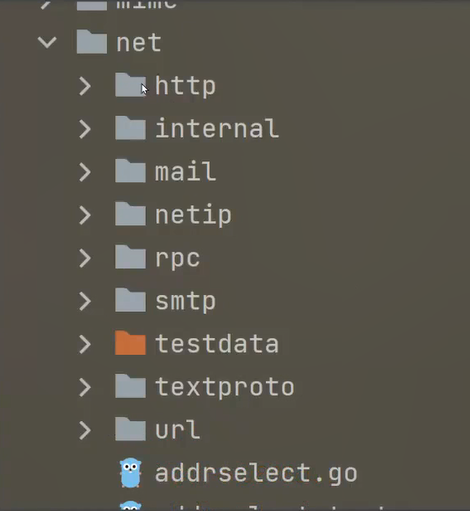
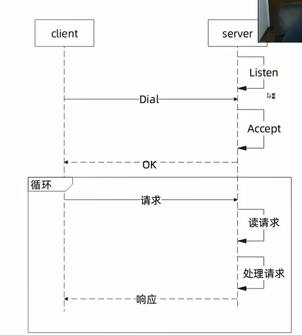
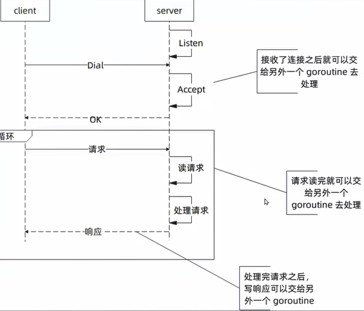
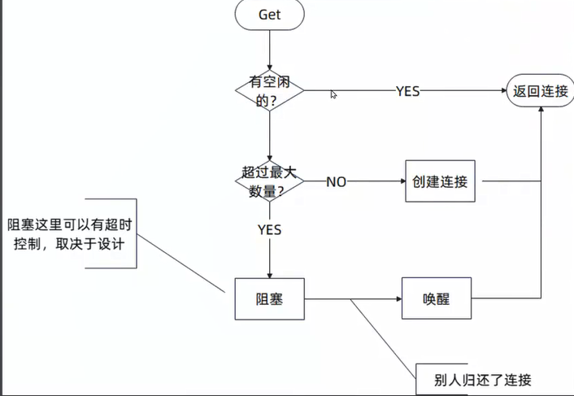

net包是网络相关的核心包。net 里面包含了http、rpc等关键包。
在net 里面，最重要的两个调用:
- Listen(network, addr string):监听某个端口，等待客户端连接
- Dial(network, addr string):拨号，其实也就是连上某个服务端



### 流程

Accept:已经完成了三次握手，连接建立成功
### 处理连接
处理连接基本上就是在一个 for循环内:
- 先读数据：
  读数据要根据上层协议来决定怎么读。例如，简单的 RPC协议一般是分成两段读，先读头部，根据头部得知 Body有多长，再把剩下的数据读出来。

- 处理数据

- 回写响应：
  即便处理数据出错，也要返回一个错误给客户端，不然客户端不知道你处理出错了。

### 错误处理
在读写的时候，都可能遇到错误，一般来说代表连接已经关掉的是这三个:
EOF、ErrUnexpectedEOF 和 ErrClosed。
但是，我建议只要是出错了就直接关闭，这样对客户端和服务端代码都简单。


server示例：
```go
func Serve(addr string) error {
	// 监听端口
	listener, err := net.Listen("tcp", addr)
	if err != nil {
		return err
	}
	for {
		// 接收连接（接受客户端的Dial()）
		conn, err := listener.Accept()
		if err != nil {
			return err
		}
		go func() {
			handleConn(conn)
		}()
	}
}

func handleConn(conn net.Conn) {
	for {
		// 读数据
		bs := make([]byte, 8)
		_, err := conn.Read(bs)
		if err == io.EOF || err == net.ErrClosed ||
			err == io.ErrUnexpectedEOF {
			// 一般关闭的错误比较懒得管
			// 也可以把关闭错误输出到日志
			_ = conn.Close()
			return
		}
		if err != nil {
			continue
		}
		res := handleMsg(bs)
		_, err = conn.Write(res)
		if err == io.EOF || err == net.ErrClosed ||
			err == io.ErrUnexpectedEOF {
			_ = conn.Close()
			return
		}
	}
}

func handleConnV1(conn net.Conn) {
	for {
		// 读数据
		bs := make([]byte, 8)
		_, err := conn.Read(bs)
		if err != nil {
			// 一般关闭的错误比较懒得管
			// 也可以把关闭错误输出到日志
			_ = conn.Close()
			return
		}
		res := handleMsg(bs)
		_, err = conn.Write(res)
		if err != nil {
			_ = conn.Close()
			return
		}
	}
}

func handleMsg(bs []byte) []byte {
	return []byte("world")
}
```
### 解决粘包问题

服务端

```go
type Server struct {
	addr string
}

func (s *Server) StartAndServe() error {
	listener, err := net.Listen("tcp", s.addr)
	if err != nil {
		return err
	}
	for {
		conn, err := listener.Accept()
		if err != nil {
			return err
		}
		go func() {
			// 直接在这里处理
			er := s.handleConn(conn)
			if er != nil {
				_ = conn.Close()
				fmt.Printf("connect error: %v", er)
			}
		}()
	}
}

func (s *Server) handleConn(conn net.Conn) error {
	for {
        // 解决粘包。读数据长度，客户端会在数据的前面加一个大端(以uint64为例)来告诉服务端它的数据长度
		bs := make([]byte, 8)
		_, err := conn.Read(bs)
		if err != nil {
			return err
		}
		// 解码，读出长度
        lenBs := binary.BigEndian.Uint64(bs)
        // 开始正式读取消息
		reqBs := make([]byte, lenBs)
		// 这里可以使用io.ReadFull(conn, reqBs) 进行读取
		_, err = conn.Read(reqBs)
		if err != nil {
			return err
		}
		res := string(reqBs) + ", from response"
		// 总长度
		bs = make([]byte, 8, len(res)+8)
		// 写入消息长度
		binary.BigEndian.PutUint64(bs, uint64(len(res)))
		bs = append(bs, res...)
		_, err = conn.Write(bs)
		if err != nil {
			return err
		}
	}
}


```
客户端
```go
// 假定我们永远用 8 个字节来存放数据长度
const lenBytes = 8

type Client struct {
	addr string
}

func (c *Client) Send(msg string) (string, error) {
	conn, err := net.DialTimeout("tcp", c.addr, 3*time.Second)
	if err != nil {
		return "", err
	}
	defer func() {
		_ = conn.Close()
	}()
	// 总长度
	bs := make([]byte, lenBytes, len(msg)+lenBytes)
	// 写入消息长度
	binary.BigEndian.PutUint64(bs, uint64(len(msg)))
	bs = append(bs, msg...)
	_, err = conn.Write(bs)
	if err != nil {
		return "", err
	}

	// 读取响应长度
	lenBs := make([]byte, lenBytes)
	_, err = conn.Read(lenBs)
	if err != nil {
		return "", err
	}
	resLength := binary.BigEndian.Uint64(lenBs)

	// 读取响应
	resBs := make([]byte, resLength)
    // 这里可以使用io.ReadFull(conn, reqBs) 进行读取
	_, err = conn.Read(resBs)
	return string(resBs), nil
}
```
客户端测试用例
```go
func TestClient_Send(t *testing.T) {
	testCases := []struct {
		req  string
		resp string
	}{
		{
			req:  "hello",
			resp: "hello, from response",
		},
		{
			req:  "aaa bbb cc \n",
			resp: "aaa bbb cc \n, from response",
		},
	}

	c := &Client{
		addr: "localhost:8080",
	}
	for _, tc := range testCases {
		t.Run(tc.req, func(t *testing.T) {
			resp, err := c.Send(tc.req)
			assert.Nil(t, err)
			assert.Equal(t, tc.resp, resp)
		})
	}
}
```

### goroutine 问题
前面的模板，我们是在创建了连接之后，就交给另外一个goroutine去处理,除了这个位置，还有两个位置:
- 在读取了请求之后，交给别的 goroutine处理，当前的goroutine 继续读请求
- 写响应的时候，交给别的goroutine去写


### 连接池
在前面的示例代码里面，我们客户端创建的连接都是一次性使用。然而，创建一个连接是非常昂贵的:
- 要发起系统调用TCP
- 要完成三次握手
- 高并发的情况，可能耗尽文件描述符

连接池就是为了**复用**这些创建好的连接。

#### 开源实例
Github地址: https://github.com/silenceper/pool (建议结合处理流程看源码 )
- InitialCap: 这种参数是在初始化的时候直接创建好的连接数量。过小,启动的时候可能大部分请求都需要创建连接;过大，则浪费。
- Maxldle: 最大空闲连接数，过大浪费，过小无法应付突发流量
- MaxCap:最大连接数


```go
p,err := pool.NewChannelPool(&pool.Config{
    Initialcap: 1,
    MaxCap: 30
    MaxIdle: 10
    IdleTimeout: time.Minute,
    Factory: func() (interfacef}, error) {
    	return net.DialTimeout( network: "tcp", addr, time.Second * 3)
    }
    Close: func(i interfaceJ) error {
    	return i.(net.conn).close()
    }
})

conn := p.Get().(net.Conn)
// 用完后放回去
```


#### 一般连接池处理流程
1. Get获取连接
- 阻塞的地方可以有超时控制，例如最多阻塞1s
- 从空闲处取出来的连接，可能需要进一步检查这个连接有没有超时（就是很久没用了)


2. Put放回连接
- Put会先看有没有阻塞的goroutine（线程），有就直接转交
- 如果空闲队列满了，又没有人需要连接，那么需要关闭这个连接


#### 连接池代码示例
简单版
```go
type Option func(p *SimplePool)

type SimplePool struct {
	idleChan    chan conn
	waitChan chan *conReq

	factory     func() (net.Conn, error)
	idleTimeout time.Duration

	maxCnt int32
	// 连接数
	cnt int32

	l sync.Mutex
}

func NewSimplePool(factory func()(net.Conn, error), opts...Option) *SimplePool {
	res := &SimplePool {
		idleChan: make(chan conn, 16),
		waitChan: make(chan *conReq, 128),
		factory: factory,
		maxCnt: 128,
	}
	for _, opt := range opts {
		opt(res)
	}
	return res
}

func (p *SimplePool) Get() (net.Conn, error) {
	for {
		select {
		case c := <-p.idleChan:
			// 超时，直接关闭.
			// 有没有觉得奇怪，就是明明我们就是需要一个连接，但是我们还关闭了
			if c.lastActive.Add(p.idleTimeout).Before(time.Now()) {
				atomic.AddInt32(&p.cnt, -1)
				_ = c.c.Close()
				continue
			}
			return c.c, nil
		default:
			cnt := atomic.AddInt32(&p.cnt, 1)
			if cnt <= p.maxCnt {
				return p.factory()
			}
			atomic.AddInt32(&p.cnt, -1)
			// 超过最大连接数，阻塞等待
			req := &conReq{
				con: make(chan conn, 1),
			}
			// 可能阻塞在这两句，对应不同的情况。
			// 所以实际上 waitChan 根本不需要设计很大的容量
			// 另外，这里需不需要加锁？
			p.waitChan <- req
			c := <- req.con
			return c.c, nil
		}
	}
}

func (p *SimplePool) Put(c net.Conn) {
	// 为什么我只在这个部分加锁，其余部分都不加？
	p.l.Lock()
	if len(p.waitChan) > 0 {
		req := <- p.waitChan
		p.l.Unlock()
		req.con <- conn{c: c, lastActive: time.Now()}
		return
	}

	p.l.Unlock()

	select {
	case p.idleChan <- conn{c: c, lastActive: time.Now()}:
	default:
		defer func() {
			atomic.AddInt32(&p.maxCnt, -1)
		}()
		_ = c.Close()
	}
}

// WithMaxIdleCnt 自定义最大空闲连接数量
func WithMaxIdleCnt(maxIdleCnt int32) Option {
	return func(p *SimplePool) {
		p.idleChan = make(chan conn, maxIdleCnt)
	}
}

// WithMaxCnt 自定义最大连接数量
func WithMaxCnt(maxCnt int32) Option {
	return func(p *SimplePool) {
		p.maxCnt = maxCnt
	}
}

type conn struct {
	c          net.Conn
	lastActive time.Time
}

type conReq struct {
	con chan conn
}
```
测试用例
```go
package net

import (
	"fmt"
	"github.com/stretchr/testify/assert"
	"net"
	"testing"
	"time"
)

// TestSimplePool 这个难以用 table-driven 的形式来写测试
func TestSimplePool(t *testing.T) {
	p := NewSimplePool(func() (net.Conn, error) {
		return &mockConn{}, nil
	}, WithMaxIdleCnt(2), WithMaxCnt(3))

	// 这三次都能正常拿出来
	c1, err := p.Get()
	assert.Nil(t, err)
	c2 , err := p.Get()
	assert.Nil(t, err)
	c3, err := p.Get()
	assert.Nil(t, err)

	// 正常放回去
	p.Put(c1)
	p.Put(c2)

	// 空闲队列满了，这里c3会被关闭
	p.Put(c3)
	assert.True(t, c3.(*mockConn).closed)
}

func TestSimplePool_GetBlock(t *testing.T) {
	p := NewSimplePool(func() (net.Conn, error) {
		return &mockConn{}, nil
	}, WithMaxIdleCnt(2), WithMaxCnt(3))

	// 这三次都能正常拿出来
	c1, err := p.Get()
	assert.Nil(t, err)
	_ , err = p.Get()
	assert.Nil(t, err)
	_, err = p.Get()
	assert.Nil(t, err)

	now := time.Now()

	go func() {
		// 睡两秒
		time.Sleep(time.Second)
		p.Put(c1)
	}()
	// 直接阻塞
	c4, err := p.Get()
	assert.Nil(t, err)
	// 就是我们放回去的那个
	assert.Equal(t, c1, c4)
	// 确认被阻塞过
	assert.Greater(t, time.Now().Sub(now), time.Second)
}

// mockConn 用于辅助测试
type mockConn struct {
	closed bool
}

func (m *mockConn) Read(b []byte) (n int, err error) {
	// TODO implement me
	panic("implement me")
}

func (m *mockConn) Write(b []byte) (n int, err error) {
	// TODO implement me
	panic("implement me")
}

func (m *mockConn) Close() error {
	// 用于辅助测试
	fmt.Println("connection closing")
	m.closed = true
	return nil
}

func (m *mockConn) LocalAddr() net.Addr {
	// TODO implement me
	panic("implement me")
}

func (m *mockConn) RemoteAddr() net.Addr {
	// TODO implement me
	panic("implement me")
}

func (m *mockConn) SetDeadline(t time.Time) error {
	// TODO implement me
	panic("implement me")
}

func (m *mockConn) SetReadDeadline(t time.Time) error {
	// TODO implement me
	panic("implement me")
}

func (m *mockConn) SetWriteDeadline(t time.Time) error {
	// TODO implement me
	panic("implement me")
}


```

### 面试要点
- 几个参数的含义:
	- 初始连接
	- 最大空闲连接
	- 最大连接数
- 连接池的运作原理: 拿连接会发生什么，放回去又会发生什么
- sql.DB解决过期连接的懒惰策略(要使用连接的时候才会检查有没有过期并close连接。并不是主动关闭，如维护一个协程来定期遍历所有的连接来主动检查有没有过期的)，可以类比其它如本地缓存的（redis也是懒策略）

