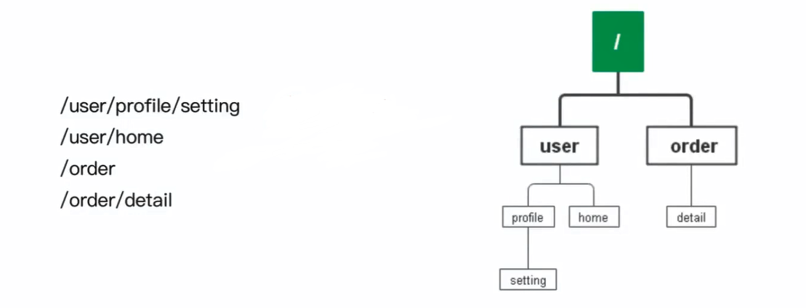
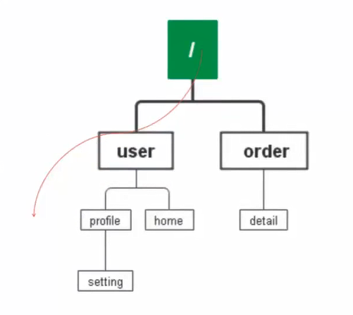

也叫前缀树


`/` 表示根节点
### v 1版本：
不考虑路径参数问题:例如/user/:id 等，只支持静态路由
不考虑http method:例如暂时区分GET /user还是POST /user
不考虑性能问题:这是为了排除干扰，减少代码的复杂度
不支持路由冲突

### 新增一条路由:
`/user/friends`


步骤:

1. 从根节点出发，作为当前节点
2. 查找命中的子节点(找到了user)
3. 将子节点作为当前节点，重复2
4. 如果当前节点的子节点没有匹配下一段的，为下一段路径创建子节点
5. 如果路径还没结束，重复46.新增成功

新增一条:/user/friends的具体步骤:
1. 根节点出发，找到第一段命中的子节点，user
2. user作为当前节点，找子节点中命中 friends 的，没找到
3. 在 user 之下创建子节点friends4.该路由已经全部创建完成，返回

```go
package main

import "strings"

// 路由数
// handlerFunc 路由函数
type handlerFunc func(c *Context)

type HandlerBaseOnTree struct {
	root *node
}

type node struct {
	// 当前节点，如果是跟节点就是 “/”
	path string
	// 所有的子节点
	children []*node
	// 如果是叶子节点，匹配成功之后调用此方法
	handler handlerFunc
}


// Route 插入路由
/**
1. 从根节点出发，作为当前节点
2. 查找命中的子节点(找到了user)
3. 将子节点作为当前节点，重复2
4. 如果当前节点的子节点没有匹配下一段的，为下一段路径创建子节点
5. 如果路径还没结束，重复46.新增成功
*/
func (h *HandlerBaseOnTree) Route(method, pattern string, handler handlerFunc) {
	// 全掉前后的 "/", /user/friend/ | /user/friend | user/friend/ => user/friend
	pattern = strings.Trim(pattern, "/")
	// 切割 user/friend => [user, friend]
	paths := strings.Split(pattern, "/")

	// 当前节点， 模式是跟节点，这里是浅拷贝
	cur := h.root

	// 使用使用递归优化
	for i, path := range paths {
		// 查找子节点
		matchChild, ok := cur.findMatchChild(path)
		if ok {
			cur = matchChild
		} else {
			// 没有找到对呀子节点则创建,这里的创建是要创建后面所有的节点
			// 比如 user/friend， 因为没有匹配到user 那么就要创建 user节点 和 user的子节点friend节点
			cur.createSubTree(paths[i:], handler)
			return
		}
	}
}

func (n *node) createSubTree(paths []string, hf handlerFunc) {
	// 这里是浅拷贝
	cur := n
	for _, path := range paths {
		newNode := &node{
			path:     path,
			children: make([]*node, 0, 2),
		}
		cur.children = append(cur.children, newNode)
		cur = newNode
	}
	cur.handler = hf
}

func (n *node) findMatchChild(path string) (*node, bool) {
	for _, child := range n.children {
		if child.path == path {
			return child, true
		}
	}
	return nil, false
}

```

### v2版支持通配符*
刚才我们的v1实在是太死板了，只能所有的路径都完全匹配。比如说注册`/order`的路由，那么`/order/order_sn`就不匹配了。
我们尝试扩展一下，支持*，例如注册路由`/order/*`， 那么/order/order_sn就匹配上。


```go
func (n *node) findMatchChild(path string) (*node, bool) {
	for _, child := range n.children {
		
		if child.path == path || child.path == "*" {
			return child, true
		}
	}
	return nil, false
}
```


问题来了:
1.用户注册了一个路由/order/*
2.用户又注册了一个路由/order/order_sn
请求/order/order_sn该命中哪一个?
答案:我们遵循最“详细”原则。按照一般的说法，应该是最左最长匹配。所以应该命中/order/order_sn而不是/order/*

```go
func (n *node) findMatchChild(path string) (*node, bool) {
	var wildcardNode *node
	for _, child := range n.children {
		// 并不是*的节点命中了就直接返回， !=* 为为了防止用户乱输入
		if child.path == path && child.path != "*" {
			return child, true
		}
		// 命中了通配符的，我们看看后面还有没有更加详细的
		if child.path == "*" {
			wildcardNode = child
		}
	}
	return wildcardNode, wildcardNode != nil
}
```


这里还有一个小问题:
/order/*究竟能不能匹配/order ?
这个问题的看法，这是一个典型的设计决策问题，因为无论是否匹配，都能找到一些“冠冕堂皇"的理由
这里我没有支持，仅仅是因为我觉得，当你希望匹配/order的时候，你完全可以自己注册一下．当你注册/order/*我觉得你是期望/order之后肯定有东西的,不然你注册/order就可以了.
我也不觉得，正常的业务下/order和/order/*对应的handler 会是一样的。


这就是一个很有意思的话题:中间件开发者试图教你如何写代码。


如果你发现有些框架，不能这么写，不能那么写.有时候是功能确实不好支持，有些时候就是作者在教你写代码，他通过不支持某些东西，来避免用户写出一些他完全无法接受的代码，所谓的无法接受的代码，你可以稍微思考一下，这个是确实是不良实践，还是说这就是作者的个人偏好。


Tip:不想教用户如何写代码的框架开发者是没有原则的

