Kafka 是消息队列的一种实现，类似的还有RocketMQ 和 RabbitMQ。
Kafka 不论是在实践中还是在面试中（mysql , redis, kafka），都是热点。
消息队列的基本形态，就是有 N 个生产者， N 个消费者(生产消费者模型)。
在这种形态下，生产者和消费者就解耦了。
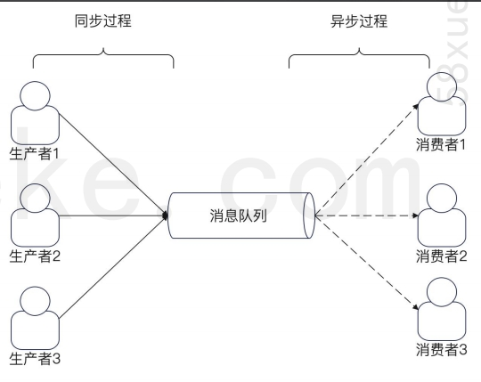

### Kafka 基本概念
Kafka 的设计比较复杂，涉及的知识点很多，但是基本上都是围绕这些基本概念来进行的。
- 生产者 producer
- 消费者 consumer
- broker，也可以理解为消息服务器(kafka, 整个Kafka集群，或者单机的kafka)
- topic 与分区（partition）
- 消费者组与消费者
下图是生产者、消费者和 broker 三者之间的关系。
Broker 的意思是“中间人”，是一个逻辑上的概念。在实践中，一个 broker 就是一个消息队列进程，也可以认为一个 broker 就是一台机器。
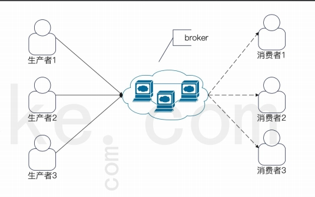

### topic 和 分区
Topic 是消息队列上**代表不同业务场景的东西**。简单来说，一个业务就是一个 topic。
而一个 topic 有多个分区（至少一个分区）。
如下图中，topic1 有两个分区，而 topic2 有一个分区。
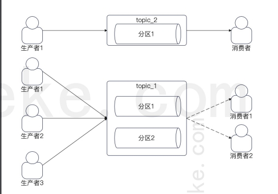
具体需要多少个分区的公式：
max(发送者总速率/单一分区写入速率, 发送这总速率/单一消费者速率) + 几个冗余的分区

### 主分区和从分区
实际上，我们说某个 topic 有多少个分区的时候，指的是有多少个主分区。
但是事实上，Kafka 为了保证高可用和数据不丢失，分区有主分区和从分区。
**当发送消息到 Kafka 上的时候，Kafka 会把消息写入主分区之后，再同步到从分区。**
如右图，每一个分区实际上是一主两从的结构。
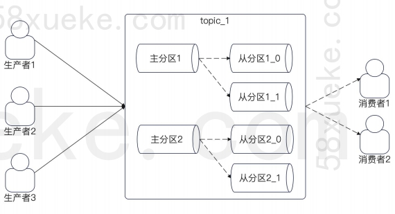

### 分区和 broker（kafka的进程） 的关系
正常情况下，同一个 topic 的分区会尽量均匀分散到所有的 broker 上。
这意味着两件事：
- **主分区之间，不会在同一个 broker 上。**
- **同一个分区的主分区和从分区，也不会在同一个broker 上。**
核心目标：保证当某个 broker 崩溃的时候，对业务的影响最小。满足上面两个要求的话，某一个
broker 崩溃，最多导致 topic 的某一个主分区不可用，不至于完全不可用。
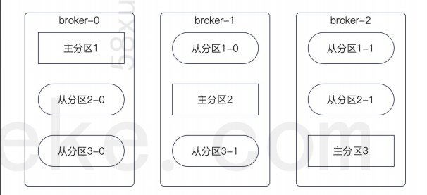
### 分区和生产者的关系（*）
正常情况下，一个 topic 都会有多个分区，**所以发送者在发送消息的时候，就需要选择一个目标分区。**
比较常用的有三种：
- 轮询：一个分区发送一次，挨个轮流。
- 随机：随机挑选一个。
- 哈希：根据消息中的 key 来筛选一个目标分区。
也可以自己设计一些比较复杂的路由策略，用在面试中效果会比较好。
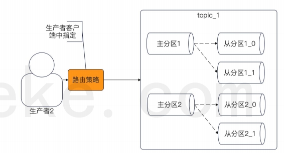

### 分区和消息有序性（*）
Kafka 中的消息有序性保证是以分区为单位的。也就是说，**同一个分区内的消息是有序的**。即，消息在一个分区内的顺序，就是分区的消息被消费的顺
序。因此，如果要做到全局有序，就只能有一个分区。
如果要做到业务有序，就需要保证业务的消息都丢
到同一个分区里面。
右图是一个不同分区上的消息失序的例子。生产者
发送 msgA 和 msgB，但是消费者的消费顺序是
msgB、msgA。
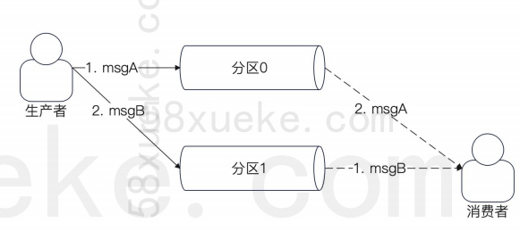

### 分区和消费者组、消费者的关系（*）
在 Kafka 中，消费者都是归属于某一个消费者组的。**一个消费者组可以看做是关心这个 topic 的一个业务方**。比如说在创建用户的时候，搜索关心新用户，推荐也关心新用户，那么搜索自己是一个消费者组，推荐也是一个消费者组。

一个消费者组就是一个业务

**同一个消费者组里面，一个分区最多只有一个消费者。**也就是在同一个消费者组里面：

- 一个消费者可以消费多个分区的数据。
- 一个分区在同一时刻，只可能被一个消费者消费

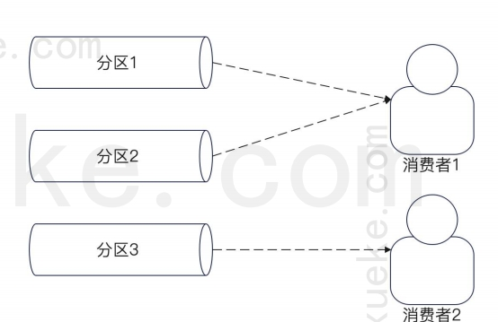
### 最多一个消费者的内涵
一个分区最多一个消费者！图中分区 2 被两个消费者消费，这种是不允许的。
由此衍生出来：
-  **如果一个 topic 有 N 个分区，那么同一个消费组最多有 N 个消费者。多于这个数字的消
费者会被忽略。**
- **如果消费者性能很差，那么并不能通过无限增加消费者来提高消费速率。
这就是典型的面试热点：消息积压问题。**
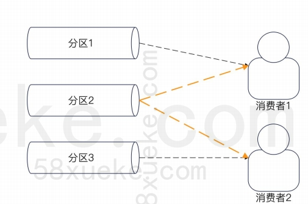

### Kafka Shell 工具：常见用法
因为 Shell 脚本非常多，所以实际上记住全部内容是不现实的。这里优先学习几个开发常用的：
• 创建 topic：kafka-topics.sh --bootstrap-server localhost:9092 --topic first_topic --create --partitions 3 --replication-factor 1
• 查看一个 topic：kafka-topics.sh --bootstrap-server localhost:9092 --describe --topic first_topic
• 启动一个消费者，监控发送的消息：kafka-console-consumer.sh --bootstrap-server localhost:9092 --topic first_topic，这条消息就是从启动生产者，发送一条消息：kafka-console-producer.sh --bootstrap-server localhost:9092 --topic first_topic
核心就是：看文档！看文档！这种命令我也记不住的！
[https://docs.confluent.io/kafka/operations-tools/kafka-tools.html](https://docs.confluent.io/kafka/operations-tools/kafka-tools.html)

### Sarama 使用入门：指定 acks
在 Kafka 里面，生产者在发送数据的时候，有一个
很关键的参数，就是 acks。
有三个取值：
• 0：客户端发一次，不需要服务端的确认。
• 1：客户端发送，并且需要服务端写入到主分区。
• -1：客户端发送，并且需要服务端同步到所有的
ISR 上。
从上到下，性能变差，但是数据可靠性上升。需要
性能，选 0，需要消息不丢失，选 -1。

### 图解 acks
理解 acks 你就要抓住核心点，谁 ack 才算数？
- 0：TCP 协议返回了 ack 就可以。
- 1：主分区确认写入了就可以。
- -1：所有的 ISR 都确认了就可以。

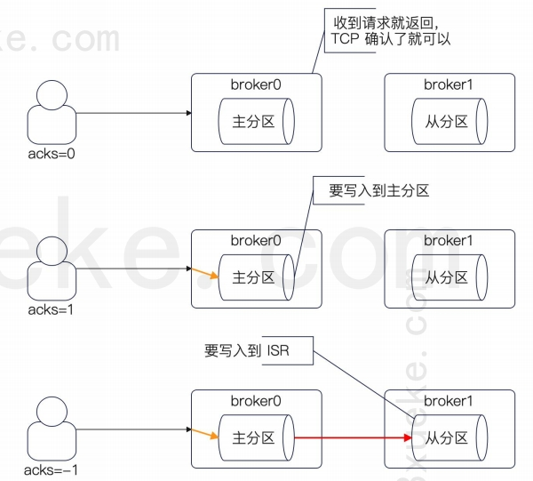

### ISR 含义
ISR（In Sync Replicas），用通俗易懂的话来说，就
是跟上了节奏的从分区。
什么叫做跟上了节奏？就是它和主分区保持了数据同
步。
所以，当消息被同步到从分区之后，如果主分区崩溃
了，那么依旧可以保证在从分区上还有数据。
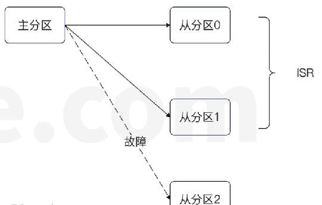

### 重复消费问题：
可能源自两个方法，一是生产者重发发送，二是消费者消费后没有提交
关于二 可以分为两个步骤：
- ① 消费者拿到消息后执行你的业务逻辑进行消费
- ② 告诉Kafka 你消费完了
如果你的第二个步骤失败了或者说还没来得及执行第二个步骤你就宕机了，这时候你在去拉消息你就会拉到刚刚那一条没有提交的数据也会导致重复消费

### Kafka Go 客户端比较
在 Go 里面有三个比较有名气的 Go 客户端。
• Sarama：用户数量最多，但是有一些 BUG（个人认为是因为用户多 BUG 才暴露得比较清晰，我没怎么遇到
过），早期这个项目是在 Shopify 下面，现在挪到了 IBM 下。
• segmentio/kafka-go：没啥大的缺点。
• confluent-kafka-go：需要启用 cgo，跨平台问题比较多，交叉编译也不支持。
这里我们选用 Sarama，因为用户多，你出去工作接触到它的概率最大。

### **批量处理消息提高性能(*)**
在类似于阅读数的这种场景中，非常适合用批量处理接口来加快消费者速率。
在这个解决思路里面，我们假定发送者那一边，依旧是一次点击发送一条消息，但是消费者这一边就改进为批量接口。
在实践中这很常见，因为通常消费者没有能力要求生产者改变自己的生产模型（单个改批量）。
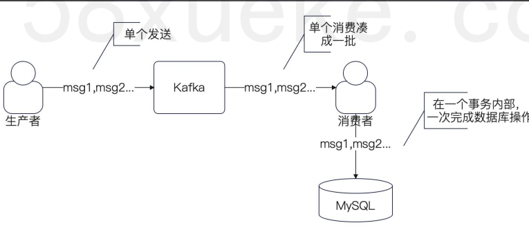

#### 批量处理的 ConsumerClaims
基本上就是原本的批量处理的代码里面，稍微改
一下就可以。
两个步骤：
- 凑够一批，要注意超时控制。
- 发起调用。
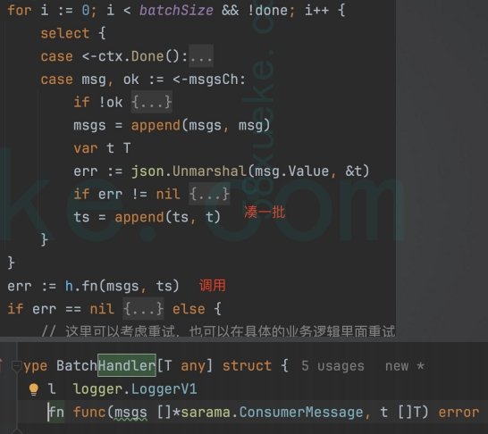

### 解决消息积压的面试
早期我们公司我参与的这个项目里面有一个非常严重的问题，就是我们的生产者性能或者说消费者性能比较差引起了消息积压，注意点出4个关键字消息积压，这4个字一出，面试官就会问你消息积压的问题，然后你就说，我当时负责解决消息积压这个问题，我当时主要有两个思路，一个是异步消费，另一个思路是批量接口，然后你就讲，异步消费主要是开goroutine	，开goroutine的时候为了解决消息偏移量的问题，异步消费批量提交 ，然后我在把这个方案解决后 发现数据库受不了，相当与消息积压问题解决了，但是压力转到了数据库，于是我又另外的提出了另一个方案，就是用批量接口，因为我们消费者这边可以把单个改为批量，于是我就综合了异步和批量接口优化了性能，同时数据库的压力也不大，

## 升职加薪
正常来讲，面试不是达标性质，就是我符合他们公司的要求，就会把我招进去，不是，面试其实是排名性质，比如我要找三个人我就取前一二三个人，我要找一个人我就取前一个人，所以你要比别人面得好 才有竞争优势，怎么样把竞争优势面出来呢，其实最重要得 是要准备好面试思路，比如说面试官可能问我，这个系统有什么难点，你就要提前准备一些难点，没难点怎么办？玩过三国杀没，三国杀里面有个叫无中生有，比如说我当时面临得难点就是这个系统消息积压问题，然后你就讲你怎么解决这个消息积压问题，你就要想着怎么设计这个回答方案，你的标题就是 你的系统有什么难点，你的回答是消息积压，接下来你就要想你利用消息积压怎么回答，你就要层层递进，改怎么把话题引导我熟悉得地方，你就想到，第一点：异步消费，一旦回答异步消费，面试官就会问题你消息消费了但是没提交怎么办？你就可以回答批量提交，而进一步这个时候面试官可能会问题批量提交你都没提交怎么办？你回答无非就是重试，你回答重试，面试可能就会问你幂等，你要解释你怎么做幂等，做幂等就要准备一个高端方案，比如说我可以直接利用redis得高可用，99%得可用性，用redis去重，我都不用唯一索引，我就是这么得骚。很多人在回答完异步消费之后就会停下来，觉得我已经回答出了他的问题，不，你还可以进一步装比，怎么个装法，你说我在做完异步消费后确实解决了消息积压得问题， 但是数据库压力变大了导致查询变慢了影响到了别的业务，然后你就进一步引导到你是怎么利用批量接口来改造，一提到批量接口，你就可以主动得说原本单个操作数据库改为批量操作数据库 ，你这么已回答，面试官就会问你为什么批量炒作数据库会比较快，你就可以从mvcc得原理上回答，那么mvcc得原理你是不是可以提前背好，把什么redolog,undolog,binlog之类得背得滚瓜烂熟，那你就拼命得输出拼命得输出，你可以从redolog,undolog,binlog刷磁盘得这个点，你又可以引申回来kafka这里，卡夫卡、也要刷磁盘，他的数据要存到磁盘里面去，然后你就回归到Kafka，去聊Kafka得零拷贝，数据写这些问题上，你这样面试就相当于说，套路非常深，从一个话题到另一个话题又回到另外的话题上

## 简历亮点
高可用，高并发，高性能，还有一些常用的技术难点，什么消息积压，什么数据一致性，巴拉巴拉，你的简历上一定要把这些词出现的足够多，足够的高频，你的简历才能更高几率通过筛选，