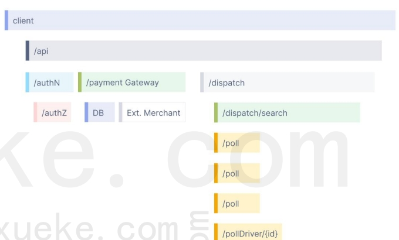
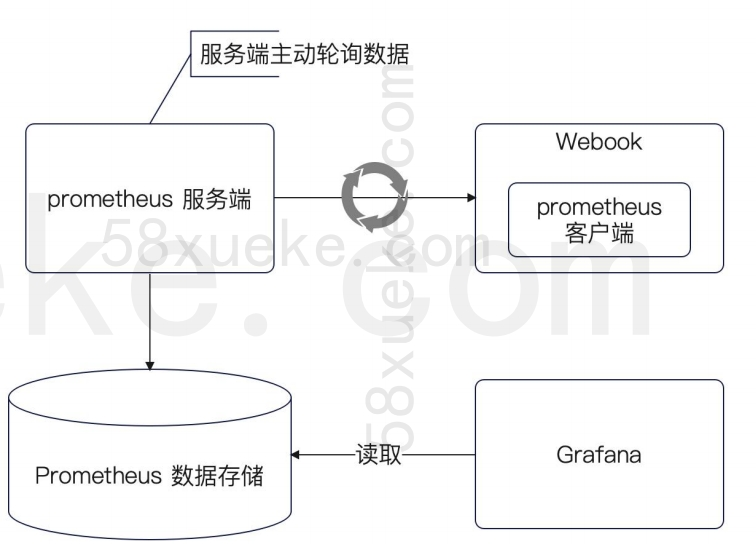
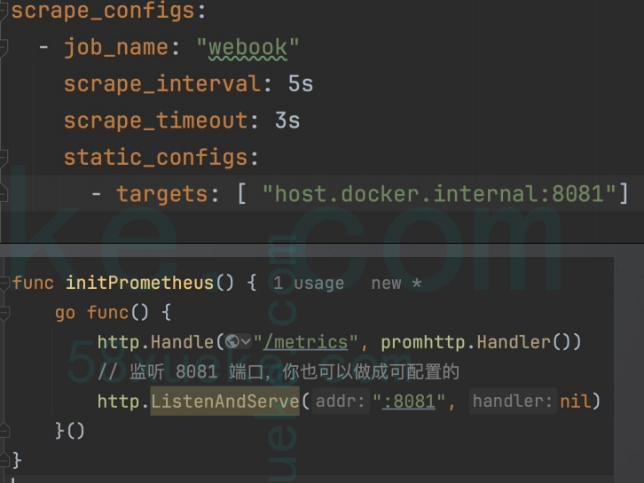

可观测性这个专业名词一定要学会，有些人上来就是我记日志，不够高端，我们应该说提高了系统的可观测性，我优化了系统的可观测性，在这个基础上我就进一步的去提高我的可用性和优化我的性能，我们要用高端的词汇

# 可观测性的概念

可观测性（Observability）是指在软件系统中，通过度量、监控和分析系统的各个组件行为，**以便于了解系统的状态、性能和问题的能力。**它可以帮助开发人员快速定位和解决系统中的问题，提高系统的稳定性和可靠性。可观测性被更频繁地用于提高分布式 IT 系统性能。

具体来说，分成三个部分：
- **日志（Logging）：**记录系统的状态和行为，用于了解系统的历史记录和实时状态变化。
- **度量（Metrics）：**量化系统的性能和行为，例如 CPU负载、内存使用量等，帮助我们理解和监控系统的整体性能。
- **追踪（Tracing）：**追踪系统的请求和响应，帮助开发人员诊断和调试问题，了解系统中的路径和延迟。

### Metrics
**Metrics 是就是可度量可聚合的数据。**
现实中我们提到的各种响应时间、错误率等都归属于这个范畴。
右图中是各种 metrics 在 Grafana 上的显示。目前来说，采集 metrics 的中间件就是 Prometheus 占
据了主要地位

### Tracing
**Tracing 正常来说叫做链路追踪数据。**
右边是一个典型的 tracing 图像。
整个图像是由一个个横条组成的，这些横条叫做 span。
**Span 之间有父子关系。**
比如说在右图中，最顶级的是一个叫做 client 的 span，而后这个 span 有一个叫做 /api 的子 span。
/api 这个 span 由 /authN、/payment Gateway 和/dispatch 三个子 span 组成

#### Tracing 解读
- Span 的长度代表的是执行时间长度。
- 空隙代表的是父 span 的代码执行时间。例如说 client和 /api 之前一段的空白，就是 client 自身代码运行的时间。
- 如果有很多空隙很长，则往往意味着需要补充打点

### Prometheus 基本架构
Prometheus 自身分为客户端和服务端。
服务端也就是我们采集到数据存储的地方，客户端就是我们用 Prometheus 的地方。
你可以注意到，Prometheus 采用的是服务端主动轮询的方案，也就是拉模型。
而 Prometheus 的数据，可以被其余的框架访问，可以在 UI 访问。比如最典型的就是使用 Grafana 来查看 Prometheus 的数据

#### Prometheus 安装

#### Prometheus 配置文件
在前面我们知道了，Prometheus 采用的是主动拉数据的模型。
所以很自然地就要告诉 Prometheus 的服务器，拉谁、怎么拉。
这部分就是通过配置文件来设置的。配置文件有非常多的配置项，但是都不需要你提前学习，你只需要学会右图中最小化的配置。
在实践中要注意设置 scrape_interval，高并发的应用不宜太过频繁。
在 webook 里面，启动了一个额外的端口来暴露自己采集的数据。

#### 查看 Prometheus 采集的数据
右图是我们暴露的 8081 端口，直接在浏览器中输入
localhost:8081/metrics 就能看到我们采集的数据。
这些是 Prometheus 自动采集的
#### 查看数据
下图是 Prometheus 自带的界面，打开 localhost:9090 就可以访问到。

#### Prometheus 中指标类型
Prometheus 支持的指标类型比较多样。所以在实践中就要注意选择合适的指标。
- Counter：计数器，统计次数，比如说某件事发生了多少次。
- Gauge：度量，它可以增加也可以减少，比如说当前正在处理的请求数。
- Histogram：柱状图，对观察对象进行采样，然后分到一个个桶里面。
- Summary：采样点按照百分位进行统计，比如说99 线、999 线等。
右图是一个 Counter 的图像例子。可以看到，它统计的是创建订单的总数，一直在保持增长。

#### Prometheus 中指标类型：Gauge
**Gauge：度量，它可以增加也可以减少**，比如说当前正在处理的请求数。
常见的使用场景包括：
- 统计当前正在执行的 HTTP 请求数量。
- 统计当前本实例开启的数据库事务数量。
- 统计下游服务的可用节点。
业务层面上的话则是和具体业务有关，比如说可以考虑统计当前在线人数等

