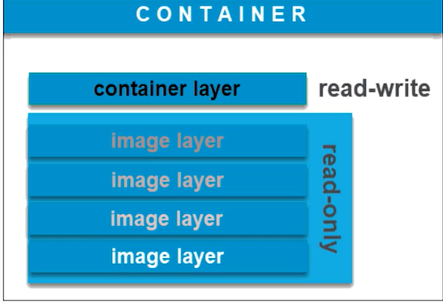

docker 引擎必须运行在Linux系统，如果在Windows 上使用docker，就会在hyper v 或者 wsl 上创建 一个虚拟机来运行docker


### 镜像和容器的关系
image镜像
。Dockerimage是一个 read-only 文件
。这个文件包含文件系统，源码，库文件，依赖，工具等一些运行application所需要的文件
。可以理解成一个模板
。docker image具有分层的概念
container容器
一个运行中的"docker image”
。实质是复制image并在image最上层加上一层 read-write 的层 (称之为 container layer ,容器
层)
。基于同一个image可以创建多个container


### docker 容器
容器相关的所有命令都能在docker container --help 中查看

#### 运行容器：
```
docker container run 镜像名称/id
```

#### 停止容器：
```
docker container stop 容器id
```
#### 停止所有容器：
```
# 列出所有容器id
docker container ps -aq
# 停止列出的容器id
docker container stop $(docker container ps -aq)
```
#### 删除容器：docker container rm 容器id
#### 删除所有容器
```
docker container rm $(docker container ps -aq)
```
#### 强制删除一个正在运行的容器
```
docker container rm -f 容器id
```
#### 强制删除所有容器（包括正在运行）
```
docker container rm -f $(docker ps -aq)
```

#### 获取日志
```
docker logs 容器id
或者
docker attach 容器id（如果退出attach 容器也会停止）
```
#### 容器的交互模式
运行容器的的时候加 exec 和 -it 
```
docker container exec -it 容器ID sh或者/bin/bash 
```

#### 查看容器中运行了哪些进程
```
docker container top ID
如果宿主机是Linux系统使用 ps -aux | grep 容器名称 也可以查看到所有进程
树状结构显示： pstree -halps 进程id
```

#### docker container run 背后发生了什么?
```shell
docker container run -d --publish 80:80 --mame webhost nginx
```
1.在本地查找是否有nginx这个image镜像，但是没有发现
2.去远程的image registry查找nginx镜像 (默认的registry是Docker Hub)
3.下载最新版本的nginx镜像 (nginx:latest 默认)
4.基于nginx镜像来创建一个新的容器，并且准备运行
5.docker engine分配给这个容器一个虚拟IP地址
6.在宿主机上打开80端口并把容器的80端口转发到宿主机上。
7.启动容器，运行指定的命令 (这里是一个shel脚本去启动nginx)


### 镜像image
#### 如何获取image

##### 离线方式
###### 镜像的离线导出
```shell
docker image save 容器名称:TAG -o xxx.image
```
###### 镜像的离线导出
```shell
docker image load -i xxx.image
docker image ls
docker image tag ID 镜像名称:标签
```
###### 从hub.docker.com 拉取
###### Dockerfile 进行build
###### 从运行中的container commit
```
docker container commit ID NAME:TAG
```


#### 将image 镜像发布到线上
1. 要在hub.docker.com 上注册自己的账号
2. 镜像的标签要符合： 账号/镜像名称:标签 如 shijinting/nginx:v1。可以使用docker tag ID xxx/xx:x 进行修改
3. 执行 docker login 进行登录
4. docker image push  账号/镜像名称:标签 。 如 docker image push  shijinting/nginx:v1


### Dockerfile
https://dockertips.readthedocs.io/en/latest/dockerfile-guide.html
- Dockerfle是用于构建docker镜像的文件
- Dockerfle里包含了构建镜像所需的“指令
- Dockerfle有其特定的语法规则
#### 基础命令
https://docs.docker.com/engine/reference/builder/
- FROM: 指定一个镜像

- RUN: 主要用于在Image里执行指令，比如安装软件，下载文件等.多个命令使用 `&&` 间隔 使用`\\` 换行 。建议一个镜像内只是用一个RUN，可以减少体积

- ADD: index.html /yyy/index.html 将本地的index.html 添加到镜像中的/yyy目录中。

- COPY: COPY和ADD都可以把local的一个文件复制到镜像里，如果目标目录不存在，则会自动创建。如COPY hello.py /app/hello.py
ADD 比COPY高级一点的地方就是，如果复制的是一个gzip等压缩文件时，ADD会帮助我们自动去解压缩文件。

- WORKDIR：在当前镜像内进行cd操作， 比cd高级一点的是，如果目录不存在会创建。如 WORKDIR /app

- ARG 和 ENV ：两者是经常容易被混淆的两个Dockerfle的语法，都可以用来设置一个“变量”。但实际上两者有很多的不同。如 ENV VERSION=1.0
```shell
FROM ubuntu:20.04
ENV VERSION=2.0.1
RUN apt-get update && \
    apt-get install -y wget && \
    wget https://github.com/ipinfo/cli/releases/download/ipinfo-${VERSION}/ipinfo_${VERSION}_linux_amd64.tar.gz && \
    tar zxf ipinfo_${VERSION}_linux_amd64.tar.gz && \
    mv ipinfo_${VERSION}_linux_amd64 /usr/bin/ipinfo && \
    rm -rf ipinfo_${VERSION}_linux_amd64.tar.gz
```
区别：env 会在镜像内也设置该环境变量但arg不会

- CMD: CMD [] 可以用来设置容器启动时默认会执行的命令。CMD ["php", "hello.php"] 在镜像中执行 php hello.php
  - 容器启动时默认执行的命令
  - 如果docker container run启动容器时指定了其它命令，则CMD命令会被忽略
  - 如果定义了多个CMD，只有最后一个会被执行
- ENTRYPOINT: ENTRYPOINT []也可以设置容器启动时要执行的命令。但是和CMD是有区别的。CMD设置的命令，可以在docker container run 时传入其它命令，覆盖掉 CMD 的命令，但是CMDENTRYPOINT 所设置的命令是**一定会被执行**的。
ENTRYPOINT 和 CMD 可以联合使用， ENTRYPOINT 设置执行的命令，CMD传递参数 

#### 构建 生成image
需要在Dockerfile的同级目录中运行（注意后面有一个`.` 表示当前目录的Dockerfile）
```shell
docker image build -t 镜像名称:标签 .
```

#### 多阶段构建
比如第一阶段 从一个装有golang环境的镜像进行go编译生成而执行的二进制文件，在把二进制文件复制到一个体积较小的alpine镜像中进行部署(第二阶段)，然后把阶段一的镜像删除

```shell
FROM gcc:9.4 AS builder
COPY hello.c /src/hello.c
WORKDIR /src
RUN gcc --static -o hello hello.c

FROM alpine:3.13.5
COPY --from=builder /src/hello /src/hello
ENTRYPOINT[“/src/hello”]
CMD []
```
ENTRYPOINT 和CMD联合使用，CMD会作为ENTRYPOINT的参数（这里是空），docker container run启动容器时指定了其它命令，CMD命令会被忽略，ENTRYPOINT 就可以使用启动是的命令作为参数。golang项目的多阶段打包也是同理
假设把dockerfile 构建为hello 镜像
docker container run -d hello xxx.yaml  ENTRYPOINT的命令就是 /src/hello xxx.yaml


