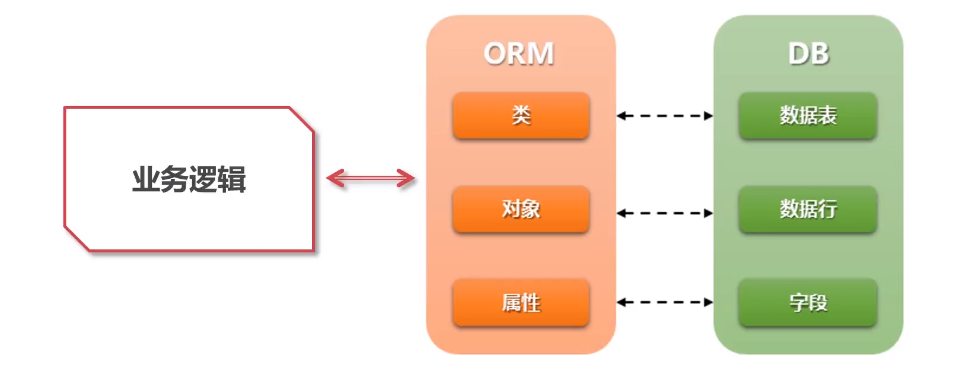
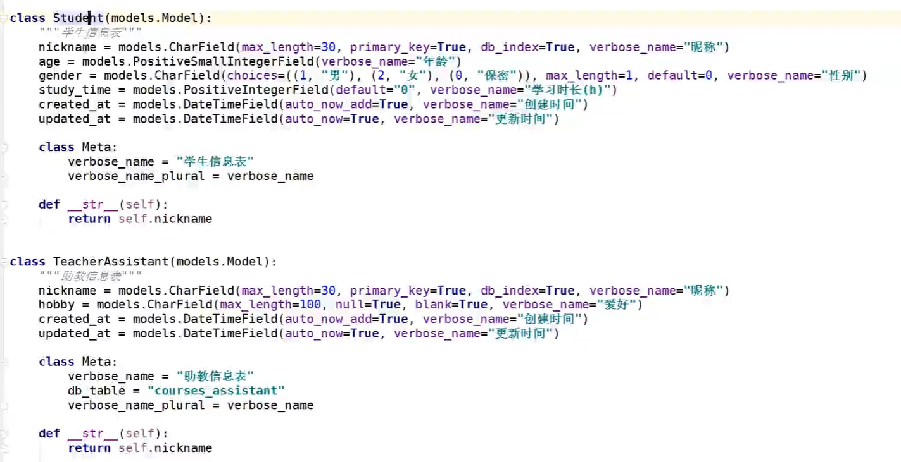
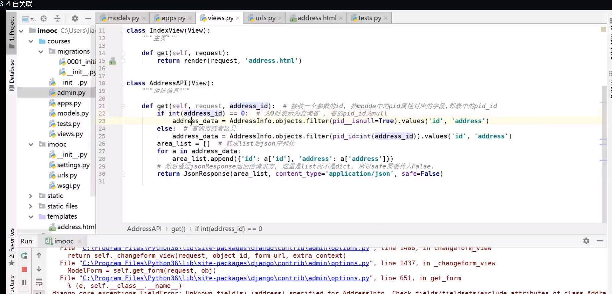
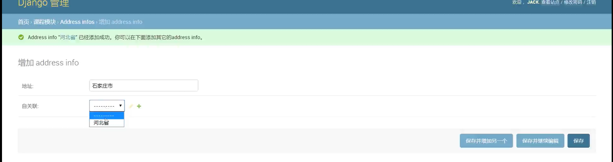
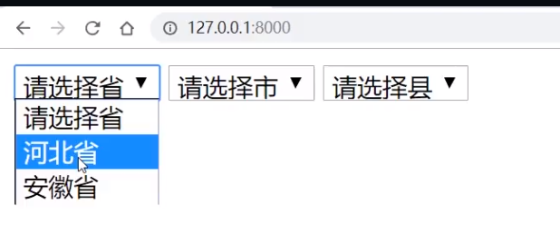

类    <--> 数据表
对象 <--> 记录
属性 <--> 字段


生成迁移数据表：python3 manage.py makemigrates
进行迁移：python3 manage.py migrate

既每个应用(包)下的models.py

### 常用的字段 

```python
from django.db import models
# 包名+ "_"+类名既是表名
class Test(models.Model):
	# 自增长字段
    # Auto为数据库字段名
    Auto = models.AutoField()
    BigAuto = models.BigAutoField()

    # 二进制数据
    Binary = models.BinaryField()

    # 布尔型
    Boolean = models.BooleanField()
    NullBoolean = models.NullBooleanField()

    # 整型
    PositiveSmallInteger = models.PositiveSmallIntegerField(db_column="age")  # 5个字节，自定义数据库字段名为age
    SmallInteger = models.SmallIntegerField(primary_key=False)  # 6个字节
    PositiveInteger = models.PositiveIntegerField()  # 10个字节
    Integer = models.IntegerField(verbose_name="11个字节大小")  # 11个字节
    BigInteger = models.BigIntegerField(unique=True)  # 20个字节

    # 字符串类型
    Char = models.CharField(max_length=100, null=True, blank=True, db_index=True)  # 对应sql中的varchar,blank=True 表单提交是为空，db_index=True给Char字段建立索引
    Text = models.TextField(help_text="这个是longtext")  # longtext，help_text=""在表单中显示说明

    # 时间日期类型
    Date = models.DateField(unique_for_date=True, auto_now=True)# 年月日
    DateTime = models.DateTimeField(editable=False, unique_for_month=True, auto_now_add=True) # 年月日时分秒
    Duration = models.DurationField()  # int, Python timedelta实现

    # 浮点型
    Float = models.FloatField()
    Decimal = models.DecimalField(max_digits=4, decimal_places=2)  # 11.22, 16.34

    # 其它字段
    Email = models.EmailField()  # 邮箱
    Image = models.ImageField()
    File = models.FileField()
    FilePath = models.FilePathField() # 文件路径
    URL = models.URLField()
    UUID = models.UUIDField()
    GenericIPAddress = models.GenericIPAddressField()
```

### 关系型字段

- #### 一对一( OneToOneField )
- #### 一多对( ForeignKey )
- #### 多对多( ManyToManyField ) ，默认或自定义中间表
- #### 自关联(自己关联自己)

```python
class A(models.Model):
	onetoone = models.OneToOneField(Test) # 父表是Test,子表是A
    #onetoone = models.OneToOneField(Test, related_name="one") 
class B(models.Model):
	foreign = models.ForeignKey(A)
	#foreign = models.ForeignKey(A, on_delete=models.CASCADE)#删除级联，A表的数据被删除后对应的B表数据也会被删除
	#foreign = models.ForeignKey(A, on_delete=models.SET_NULL, null=True,blank=True)
class C(models.Model):
	manytomany = models.ManyToManyField(B)
	
# 自关联
class AddressInfo(models.Model):
    ""省市区地址信息""
    address = models.CharField(max_length=200, null=Ture,blank=True, verbose_name="地址")
    pip = models.ForeignKey('self', null=Ture,blank=True, verbose_name="自关联")
    # 或者
    # pip = models.ForeignKey('AddressInfo', null=Ture,blank=True, verbose_name="自关联")
    def __str__(self):
    	return self.address
```

### 如何区分哪个是父表，子表
有外键字段的表叫子表

#### 关于自关联的测试
生成迁移数据表：python3 manage.py makemigrates
进行迁移：python3 manage.py migrate
views.py

后台

views.py 对应的首页


生成的表

### 参数

1. #### 所有字段都有的属性值
- editable: 是否可以编辑, 默认为False
- help_text: 在表单中显示帮助信息的参数
- db_index: 为当前字段建立索引, 默认为False
- null/blank: 字段是否可以为空, null约束数据库层面, blank约束前端表单提交时
- unique: 唯一性约束, 默认为False
- verbose_name: 设置字段别名（或备注）
- primary_key: 设置当前字段是否为主键, 默认为False
- db_column: 设置当前字段的名称

2. 属于个别字段的参数
- max_length[CharField]
- unique_for_date[DateField]: 字段日期必须唯一
- unique_for_month[DateField]
- auto_now[DateField]: 修改记录时是否自动更新当前日期
- auto_now_add[DateField]: 添加记录时是否自动设置当前日期
- max_digits[DecimalField]: 总共有多少位
- decimal_places[DecimalField]: 小数点后数字的个数

3. 关系型字段的参数

- related_name: 外键关联中的反向查询，由父表查询子表的信息
- on_delete: 当一个被外键关联的对象被删除时，Django将模仿on_delete参数定义的SQL约束执行相应操作
- - CASCADE: 模拟SQL语言中的ON DELETE CASCADE约束，将定义有外键的模型对象同时删除（该操作为当前Django版本的默认操作）
- - PROTECT: 阻止上面的删除操作, 弹出ProtectedError异常
- - SET_NULL: 将外键字段设为null, 只有当字段设置了null=True时, 方可使用该值
- - SET_DEFAULT: 将外键字段设为默认值, 只有当字段设置了default参数时，方可使用
- - DO_NOTHING: 什么也不做
- - SET(): 设置为一个传递给SET()的值或者一个回调函数的返回值, 注意大小写

### 元数据
自定义表相关的一些信息
```python
class AddressInfo(models.Model): # coures_addressinfo
    ""省市区地址信息""
    address = models.CharField(max_length=200, null=Ture,blank=True, verbose_name="地址")
    pip = models.ForeignKey('self', null=Ture,blank=True, verbose_name="自关联")
    note = models.CharField(max_length=200, null=Ture,blank=True, verbose_name="说明")
    # 或者
    # pip = models.ForeignKey('AddressInfo', null=Ture,blank=True, verbose_name="自关联")
    def __str__(self):
    	return self.address
    class Meta:
    	# 定义元数据
    	# 自定义数据表名为address
    	db_table = 'address'
    	# 按pid升序
    	ordering = ['pid']
    	# 给模型类设置一个人类直观可读的名称
    	verbose_name= '省市区地址信息'
    	# verbose_name 的复数（英文）
    	verbose_name_plural = verbose_name
    	# 把当前模型类设置基类，不生成数据表，只供其他的子类继承
    	#abstract = True
    	
    	# 给数据表设置额外的权限
    	#permissions = (('定义好的权限','说明')，('定义好的权限2','说明2'))
    	# 表示是否安装django 定义的规则来管理当前模型类，比如是否创建或者删除数据表
    	#managed = False
    	# 对应sql中的联合唯一索引
    	unique_togeter = ('address', 'note')#((),())
    	# app_lable = 'courses'
    	#db_tablespace # 定义数据库表空间
    	

```

### 如何删除一个模型类
1. 删除modes.py 中的模型类 
2. 删除对应的migrations目录下的迁移文件
3. 删除数据库中对应的表
4. 删除django_migrate 表中对应的记录


### curd
```python
from django.shortcuts import render
from django.views.generic import View
from .models import *


def course_view(request):
   # 1.查询、检索、过滤
   teachers = Teacher.objects.all()
   print(teachers)  # 返回查询集
   # <QuerySet [<Teacher: Teacher object (holy)>, <Teacher: Teacher object (Jack)>, <Teacher: Teacher object (Allen)>]>

   teacher1 = Teacher.objects.get(nickname='Jack')  # 返回一条结果
   print(teacher1, type(teacher1))
   # Teacher object (Jack) <class 'course.models.Teacher'>

   teacher2 = Teacher.objects.filter(fans__gte=500)  # QuerySet 可以是多条结果
   for t in teacher2:
       print(f'讲师姓名{t.nickname}--粉丝数{t.fans}')
       # 讲师姓名Jack--粉丝数666
       # 讲师姓名Henry--粉丝数899

   # 2. 字段字符匹配，大小写敏感
   teacher3 = Teacher.objects.filter(fans__in=[666, 1200])
   print(teacher3)
   # <QuerySet [<Teacher: Teacher object (Jack)>]>

   teacher4 = Teacher.objects.filter(nickname__icontains='A')
   print(teacher4)
   # <QuerySet [<Teacher: Teacher object (Jack)>, <Teacher: Teacher object (Allen)>]>

   # 3.结果切片、排序、链式查询
   print(Teacher.objects.all()[:1])

   teacher5 = Teacher.objects.all().order_by('-fans')
   for teacher in teacher5:
       print(teacher.nickname, teacher.fans)
       # Henry 899
       # Jack 666
       # Allen 123
       # holy 0
   print(Teacher.objects.filter(fans__gte=500).order_by('nickname'))
   # <QuerySet [<Teacher: Teacher object (Henry)>, <Teacher: Teacher object (Jack)>]>

   # 4. 查看执行的原生SQL     str(xx.query)
   print(str(Teacher.objects.all().query))
   # SELECT "course_teacher"."nickname", "course_teacher"."introduction",
   #    "course_teacher"."fans", "course_teacher"."created_at", "course_teacher"."updated_at" FROM "course_teacher"

   return render(request, 'course.html')
```

```python
Student.object.all().exclude(nickname='A') ：不包括

Student.object.all().reverse()对结果集反向排序：需要在Meta中先ordering

Student.object.all().distinct():对结果集去重


Student.object.all().extra(select={"name": "nickname"})  对结果集中的nickname字段起一个name的别名

Student.object.all().only('nickname', 'age') 对结果集中的字段做选择，只显示选择的字段

Student.object.all().defer('nickname')  和only相反，排除一些字段

Student.object.values('nickname', 'hobby') 返回结果是QuerySet的列表嵌套一个个字典

Student.object.values_list('nickname', hobby')返回结果是QuerySet的列表嵌套一个个组

Student.object.values_list('nickname', flag=True) 当values_list只有一个字段时使用flag=True，可以将返回的结果QuerySet直接放在列表里，没有嵌套


Course.objects.dates('created_at', 'month', order='DESC') 返回以字段created_at的月份(去重后)降序的结果集（year, month, day）

Course.objects.datetimes('created_at', 'munite', order='DESC') 返回以字段created_at的分钟(去重后)降序的结果集（year, month, day, hour, munite, second）


union()并集   intersection()交集   difference()差集

p1 = Course.objects.filter(price__gte=240)

p2 = Course.objects.filter(price__lte=240)

p1.union(p2)

p1.intersection(p2)

p1.difference(p2)


通过子表查父表（外键都设置在子表中）

select_related() 一对一，多对一查询优化（查询子表的时候一次将父表的信息也查出来）

courses = Course.objects.all().select_related('teacher')  原生的SQL语句会变的很少

for c in courses:

       print(f"{c.title}--{c.teacher.nickname}")


prefetch_related() 一对多，多对多查询优化

students = Students.objects.filter(age__lt=30).prefetch_related('course')

for s in students:

        print(s.course.all())


通过父表查子表（外键都设置在子表中）：反向查询

Teacher.objects.get(nickname='Jack').course_set.all()  通过父表Teacher查Course，需要小写类名_set获取子表的信息

如果子表的外键中设置有属性related_name='relate' 可以使用下面的方法替代course_set

Teacher.objects.get(nickname='Jack').relate.all()


annotate() 使用聚合计数，Count, Sum, Avg, Max, Min

annotate(vol=Sum('valume'))  annotate(别名=Sum('字段名'))

Course.objects.values('teacher').annotate(vol=Sum('valume'))

Course.objects.values('teacher').annotate(pri=Sum('price'))
```

```python
不返回queryAPI

1.获取对象get(),get_or_create(),frist(),last(),latest(),earliest(),in_bulk()

2.创建对象create(),bulk_create(),create_or_updata()创建，批量创建，创建或更新

3.更新对象updata（）updata_or_create()更新，更新或创建

4.删除对象delete()使用filte过滤

5其他操作exists（），count（），aggrrgate()判断是否存在，统计个数，聚合
```

```python
F对象: 操作字段的数据

Course.objects.update(price=F('price') - 11) # 所有课程价格减11

Course.objects.filter(volume__lte=F('price') * 10)) # 查询课程价格的10倍小于销量的课程

Q对象: 结合AND, OR, NOT, |, ~, &实现复杂的查询

Couse.objects.filter(Q(title__icontains='java') & Q(volume__gte=5000)) # 查询销量大于等于5000的java课程
```