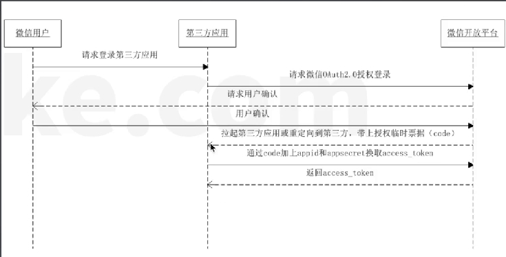
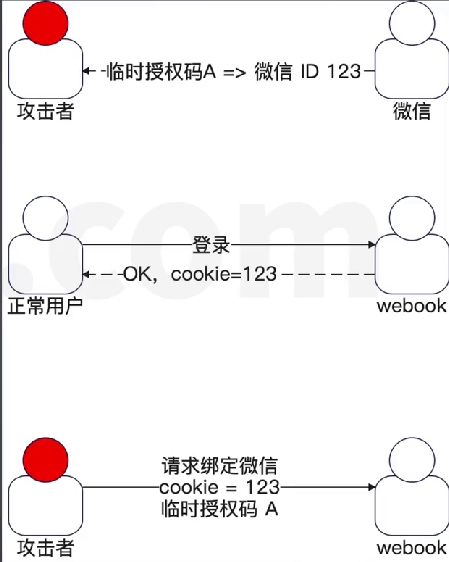
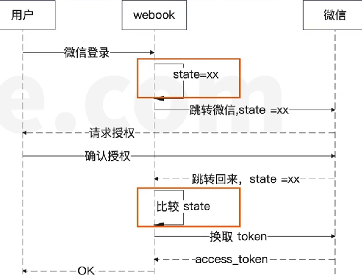

微信扫码登录API
再来看看微信扫码登录 API,看看官方是怎么说的。
这一步就有点像短信登录那里，你要先去了解一下短信 API是怎么用的。
微信扫码登录其实是一个 OAuth2 授权过程
简单来说，就是你作为用户授权第三方应用获得了对应的 **access token**,第三方应用就认为你登录了
在大多数场景下，第一次登录的时候还会尝试获取你的用户信息
[文档](https://developers.weixin.qq.com/doc/oplatform/Website_App/WeChat_Login/Wechat_Login.html)



流程要点总结
两次跳转
- 点击微信登录，跳转到微信页面。跳转过去的地址是微信的地址，根据要求拼接上回调地址redirect_uri、appld 和 state 三个关键属性
- 微信扫码登录,确认登录,微信跳转回来。跳转回来的地址就是 redirect uri 的地址。微信此时会带上临时授权码 code。
- 后台处理 redirect uri 中带过来的 code，找微信换取真正的长时间有效的授权码。

我们的流程
根据前面的分析，我们应该可以明确，要提供两个接口:
- 第一个接口，用于构造跳到微信那边的 URL。
- 第二个接口，处理微信跳转回来的请求。
这里我们定义了一个新的 OAuth2WechatHandler 来处理和微信 OAuth2 有关的事情。

```go
func (h *OAuth2WechatHandler) RegisterRoutes(s *gin.Engine) {
    g := s.Group( "/oauth2/wechat")
    g.GET("/authurl"，h.OAuth2URL)
    //这边用Any万无一失
    g.Any("/callback", h.Callback)
}
```

### 从微信中拿回来的字段
关键的两个部分: 授权码和ID
授权码部分
access token:你后面就可以拿着这个 access token去访问微信，获取用户的数据。expires in:也就是 access token 的有效期refresh_token:当 access token 过期之后，你就可以用这个 refresh token 去找微信换一个新的access token.
ID 部分:
open_id:你在这个应用下的唯一ID
union_id:你在这个公司下的唯一ID。

### open_id和union id
假设你的公司在微信上注册了两个产品:A和 B
那么对于某一个用户张伟来说，他在 A 上有一个open_id,在 B 上也有一个 open_id
但是张伟在你们公司的 A 和 B 两个产品上的union id 都是同一个


### state
CORS 场景
记住，理解 state 的核心是**抓住攻击者让你用他的临时授权码来绑定账号.**
在下图中
- 攻击者首先弄出来一个绑定微信的临时授权码 A（攻击者的临时授权码code）
- 正常用户登录成功。
- 攻击者伪造一个页面，诱导用户点击，攻击者带着正常用户的 Cookie(或者 JwT token)去请求，攻击者的临时授权码A去绑定(让正常用户的绑定攻击者的微信)
结果: **在 webook 中，攻击者可以通过微信扫码登录成功，看到正常用户的数据。**


攻击者如何拿到code
可以修改本地hosts ，让重定向url 跳转到你本地， 如 127.0.0.1 REDIREST_URL


#### 如何避免这个问题
在我们 webook 登录这个场景下，是不存在这个问题的。因为我们在登录的时候，是如果用户存在，就直接登录。如果不存在，就创建用户
不过我们还是可以考虑尝试解决掉这个问题，至少面试用得上。
整体思路就是
当生成 AuthURL 的时候，我们标识一下这一次的会话,将 state 和这一次的请求绑定在一起。等到回调问来的时候，我们看看回调中的 state 是不是我们生成的时候用的 state.



