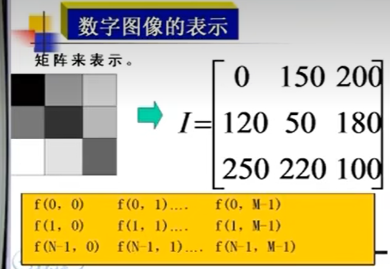
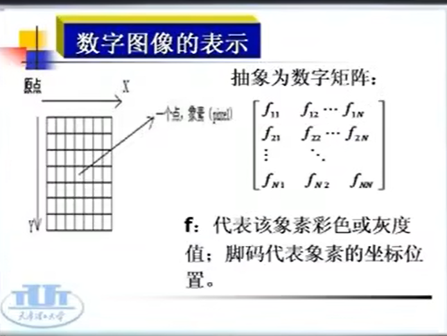
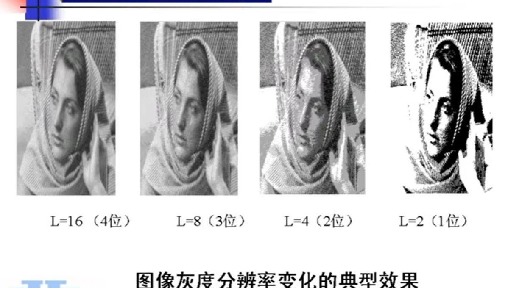

### 位图

图像可以用一个矩阵来表示
长*宽=分辨率（从左到右是款，从上到下是高）
如果是真彩色每个像素是由红绿蓝三个分量组成

每一个像素的值对应一个图像当中的一个点， 图像可以用一个二维矩阵来表示。
每一个像素的值代表了它的颜色或者灰度值。脚码（下标）代表位置

灰度级分辨率: 即颜色深度，表示每一像素的颜色值所占的二进制位数。颜色深度越大则能表示的颜色数目越多。比如1位就0和1两种颜色（黑白），8位的颜色深度可以显示256个颜色，24位真彩色 每个像素 有2^24次方个颜色

#### 图像处理过程

#### 图像处理中常用的技术

