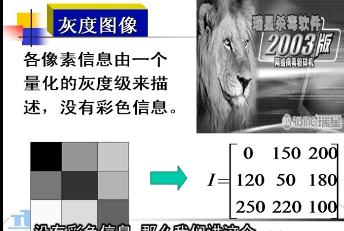

### 图像的存储格式
**按照颜色深度分类**,常用图像文件:
- 黑白图像
- 8位索引图像
- 24位真彩色图像

#### 8位索引图像

一个像素占8位(0~255), 8位索引图像有两个矩阵，一个是颜色的索引表矩阵，一个是颜色的每个像素的数值矩阵

#### 灰度图像

各像素信息由一个量化的灰度级来描述，没有彩色信息

#### 8位灰度索引图像

#### 24位真彩色图像

(1)每一像素由RGB三个分量组成。
(2)每个分量各占8位，取值范围为0~255，每个像素24位

真彩色：指图像中的每个像素值都分成红、绿、蓝三个基色分量，每个基色分量直接决定其基色的强度

#### 图像文件格式
- BMP(BitMap)格式
- GIF(Graphics Interchange Format) 格式。GIF主要用于不同平台上交流和传输，而不是作为文件的存储格式。最大不能超过64M。颜色最多为256色
- TIFF(Tagged Image Format File)格式。TIF文件的设计考虑了扩展性、方便性和可修改性，是最复杂的一种。要求用更多的代码来控制它，结果导致文件读写速度慢,代码长。
- JPEG(Joint Photographic Expert Group)格式， 是一种压缩格式

