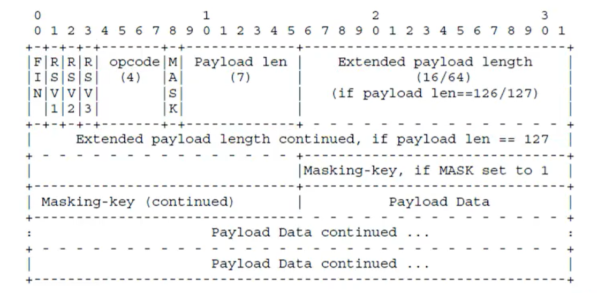

websocket是基于tcp的应用层协议
流式套接字(先发先收)

解决了数据包如何分包问题(tcp的粘包)，传输的是否是明文和哪个版本问题(ws,wss)

websocket 的头部最少占6个字节(byte)


```
if(payload len < 126) {
	header = 6 byte
} else if(payload len == 126) {
	header = 8 byte
} else if (payload len < 127) {
	header = 14 byte
}
```

一个websocket最大可以发送（payload length ）：7bits，7+16bits 或者7+64bits

### 为什么要握手(handshake)?

- 检查协议，协议协商，客户端和服务器之间有多协议版本，通过握手可以确定接下来的这个连接是走哪个协议版本（在建立连接时检查协议，那么在后面的每一次发送数据时就不需要检查了）
- 兼容http
- 验证双方的身份是否合法
### 为什么要断开(close)?