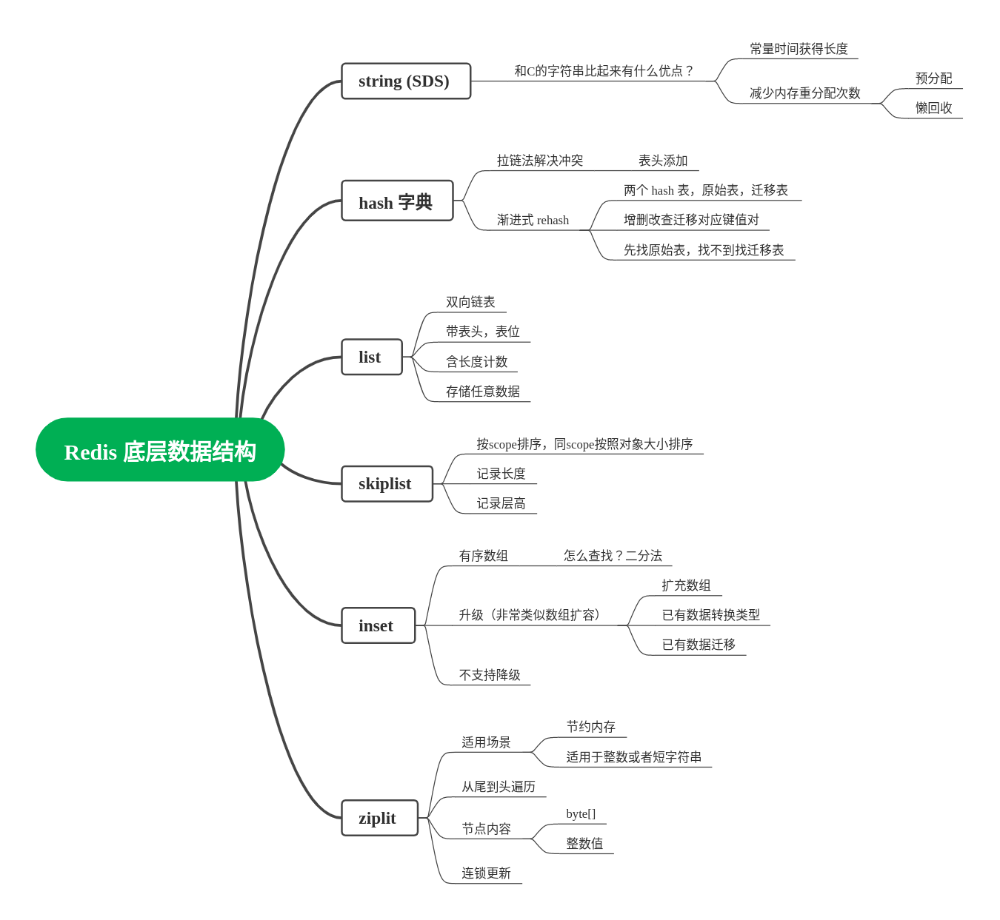

# Redis 数据结构

分析：这是`Redis`必考题。考察`Redis`数据结构有两大类问法，一种是直接问你某种数据结构的特征，一种是问你某个场景下应该使用什么数据结构。本质上，两者考察的都是同一个东西，即你是否了解某种数据结构。在复习这个模块的时候，要从表象和底层实现两个角度去学习，熟记于心。你要注意区分，你要回答的是 Redis 值对象的数据结构（表象），还是底层实现。大多数情况下，你应该从表象出发，即值对象的角度出发，而后讨论每一种值对象的可能的底层实现。如果记不住全部的底层实现，可以只讨论重点的几个。先看图：

总体回答的讨论就是“某种值对象-有什么实现-某种实现的特点”。

答案：从使用的角度来说，Redis 有五种数据结构（注意，我们这里按照第一张图来回答，即从值对象的角度出发）

- 字符串对象，即我们设置的值是一个简单的数字或者字符串；
- 列表对象，即值是一个列表，存储多个元素。从底层实现上来说，有`ziplist`和`linkedlist`两种实现；
- 字典对象，即值本身就是一个字典。从底层实现上来说，有`ziplist`和`hashtable`俩中实现；
- 集合对象，即值是一个集合（Set）。底层有`intset`和`hashtable`两种实现；
- 有序集合对象，即值是一个有序的集合。底层有`ziplist`和`skiplist`两种实现；

分析：注意，回到这一步差不多就可以了。接下来，如果面试官想要继续探讨这些问题，他就会问底层实现了。讨论底层实现的时候，要把注意力放在横向比较上。因为一个很显然的问题，就是上面的不同对象类型，都有多种底层实现。
另外一个点是，很多时候考察为什么 Redis 那么高效，除了一般的那些理由，也可以说 Redis 设计了非常多的数据结构，并且选择合适的数据结构，来减少缓存加快效率。

## 扩展点

### Redis 使用的字符串有什么特点？

分析：考察底层数据结构特点。

答案：Redis 使用的字符串，叫做 SDS。SDS 的特点是：

1. 直接存储了字符串长度，可以常量时间获得长度；
2. SDS 采用了预分配和懒回收的策略来分配内存，可以减少内存分配次数；

#### 类似问题
- SDS 有什么特点
- SDS 和 C 字符串比起来有什么优点
- Redis 为什么不直接使用 C 字符串

#### 如何引导
可以考虑在前面回答字符串对象的时候主动谈起。

### Redis 的 hashtable 是如何实现的

分析：考察底层数据结构hashtable的实现。刷亮点的机会，在于回答出来扩容，即 rehash 的过程。注意的是， Redis 的渐进式 rehash 是很有特色的。要结合各自语言的 hashtable 实现来做交叉对比。例如，对于 Java 的开发者来说，可以比较 Redis 的 rehash 和 Java HashMap 的 rehash 过程；对于 golang 来说，Redis 的 rehash 过程和 map 的底层实现理念接近，也可以一并说起来。

而后要再一次点出，采用渐进式 rehash 的优缺点，即采用渐进式 rehash 会时总的开销增大，但是这种开销被平摊到了每次访问数据中，是一种取舍。

在回答完毕之后，为了万无一失，可以再一次提起，就是说字典除了可以用哈希表实现，也可以用`ziplist`来实现。

答案：（关于哈希算法这一段，可以作为候选，因为哈希算法名字很难记）Redis 采用 MurmurHash2 （么么哈希），该算法效率高，随机性好，可以减少冲突可能。

Redis的哈希表是采用了拉链法来解决冲突，在冲突的时候，会将元素加在表头，以加快速度。

Redis 的扩容比较有特色，采用的是渐进式 rehash。即 Redis 实际上维持了新旧两张表，迁移发生的时候，Redis 并不是直接把数据迁移到新的表，而是在后续删改查的时候逐步挪过去。

（以下是和特定语言进行比较，看你的语言里面 rehash 是如何实现的，Java 版本）Java 里面的 rehash 则不一样，而是一次性迁移的。
（golang 版本）go 语言的 map 实现理念很接近。golang 的 map 的扩容也是渐进式的，也是在访问数据过程中逐步完成迁移。

所以，当查找某个 key 的时候，大概是先去原表里面找，找不到就去新表里面找。如果在原表找到了，就同时执行迁移逻辑。

（亮点第二弹，结合 Redis Cluster 的重新分配来做横向比较，不熟悉重新分片不建议使用，或者你可以拼一把，就是可能面试官也不太了解重新分片，所以不会问细节）这种渐进式的思想在 Redis 里面还体现在重新分片上。Redis 的重新分片也是一边迁移数据，同时对外提供服务。在找一个 key 的时候，也是先找源节点，找到了同时迁移，找不到就说明迁移到了目标节点。

（总结，升华主题，强调一下渐进式的改进并不是毫无缺点的。这也是回答“为什么使用渐进式 rehash ”）总体而言，渐进式 rehash 可以带来更平滑的响应时间。但是渐进式的 rehash 也会带来总体开销比一次性迁移开销大的缺点。

分析：这个话题是很能体现你对数据结构的理解。特别是要点出 rehash 过程的优缺点。在数据库索引那里，我说过，工程学上，我们会倾向于选择可预测性， rehash 也是这种思想的体现。即渐进式的 rehash 不会出现说因为哈希表扩容导致响应时间猛增的问题。

关键点：拉链法，MurmurHash2（么么哈希），渐进式 rehash

#### 类似问题
- 为什么要使用渐进式 rehash
- 渐进式 rehash 有什么缺点？（总开销大，每次查询都比一次性 rehash要慢）
- Redis 的哈希表扩容有什么特色
- Redis 的哈希表如何扩容

#### 如何引导
- 讨论到你的语言的 map 的底层实现的时候，你可以用 Redis 作为横向对比

### Redis 里面的 ziplist 是如何实现的？有什么用？

分析：考察底层数据结构。`ziplist`在 Redis 里面是一个很重要的结构，要紧紧围绕`ziplist`节省内存，结构紧凑，搜索快速的特点来回答。要想答出特色来，要先回答`ziplist`的基本特点，要把重点放在`ziplist`增删改数据时候的行为，关键点在于两个，一个是数据移动，一个是连锁更新。

答案：`ziplist`是一个很特殊的列表，它的内存类似数组那样是连续，但是每个元素的大小却不相同。`ziplist`通常用于单个数据小，并且数据量不多的情况。在 Redis 里面，`ziplist`用于组成有序集合，字典和列表三种值对象。

（回答第一个要点，元素移动）
`ziplist`能够在`O(1)`的时间内完成对头尾的操作（因为`ziplist`记录了首尾节点），但是一般的增删改查，都是`O(N)`的。这是因为`ziplist`是一个连续内存的结构，找到位置`i`，需要从头部开始遍历，而在**增删**的时候需要将位置`i`之后的元素移动（增往后移动，删往前移动）。

（回答第二个要点，连锁更新）
尤其是，因为`ziplist`的节点存储了前一个节点的长度`prelen`，所以，当前一个节点发生变更的时候，就需要更新长度`prelen`。而 Redis 为了节约内存，`prelen`有一个字节和五个字节两种长度。举例来说，假设前一个节点，最开始的长度是254，而后更新成了256，那么当前节点原本一个字节能够放下`prelen`，不得不扩展到五个字节。假如说当前节点最开始长度也是254，那么`prelen`扩展到五个字节之后就变成了258，当前节点的后一个节点，就不得不跟着扩展。

这就是所谓的连锁更新，它使得一个增删改操作，最坏的时候是`O(N^2)`。这也是为什么`ziplist`只适合放置小数据，少数据的原因。（从这里也可以解释为什么前面那些编码，都是限制数据小于64字节，并且数量少于512）

关键点：内存连续，数据移动，连锁更新，

#### 类似问题
- 如何往`ziplist`里面插入或者删除一个元素？（考察数据移动和连锁更新）
- 什么时候会触发连锁更新？
- `ziplist`在最糟糕的情况下性能如何？（考察连锁更新）
- 为什么数据量大的时候不用`ziplist`？（考察`ziplist`的特点，特别是增删改查的行为）
- `ziplist`的操作效率是多少？（O(N)，一般情况下，只要不是操作头尾，即PUSH，POP之类的操作，都是）
- 删除会引起连锁更新么？（当然可能！增删改都可能！）
- 为什么使用`ziplist`？（考察`ziplist`特点）
- 什么情况下使用`ziplist`？ （同上，单个数据小，数据量也少）

#### 如何引导
- 讨论到了有序列表的时候
- 讨论到 ArrayList, LinkedList 的时候。`ziplist`的实现不同于这两种，所以可以扩展到这里

### Redis 的整数集合(intset)是什么？有什么特色

分析：考察底层数据结构，核心就在于理解`intset`的**升级不降级**的特性。

答案：`intset`是一个数组结构，用于存储整数类型，里面的元素是唯一的。它可以存放16、32、64位的整数。如果元素位数变大，那么就会触发升级过程。例如原本存储的元素都是16位整数，现在插入一个32位的整数，那么 Redis 需要按照32位重新计算内存大小，并且分配内存，迁移原本的数据，而后将新数据插入。有一点需要注意的是，Redis并不支持降级。

#### 类似问题
- 如果我有一个小的整数数据集想要放到 Redis，Redis会用什么结构来存储？
- Redis 的`intset`是否支持降级？

## 总结

Redis 的问题大同小异，套路就是：
1. 你用过XXX结构么？
2. 如果我想存储XXX特点的数据，你会用什么？
3. 如果我想存储XXX特点的数据，Redis 会用什么结构？

而后就是前面列举的几个有很强个性的数据结构的实现原理。在复习的时候，一定要记住值对象和底层实现的关系。大概的思路就是“值对象——支持的数据结构——数据结构特点”

还要把握住不同底层实现切换的逻辑。比如说字典，底层可能是`ziplist`和`hashtable`，那么要把握住两个点：
1. 什么时候会从`ziplist`转化到`hashtable`
2. 怎么转化

第二个问题`怎么转化`其实很好回答，所有的底层实现转换，都是遍历老的实现的数据，一个个迁移过去。例如`ziplist`迁移`hashtable`，就是遍历`ziplist`，对里面每一个元素做哈希，放到对应的位置。

Redis 还有一个设计理念，就是先凑合，不行再升级。最开始 Redis 总是选择能够节省内存的，紧凑的数据结构，后面发现不行了，再来升级。

