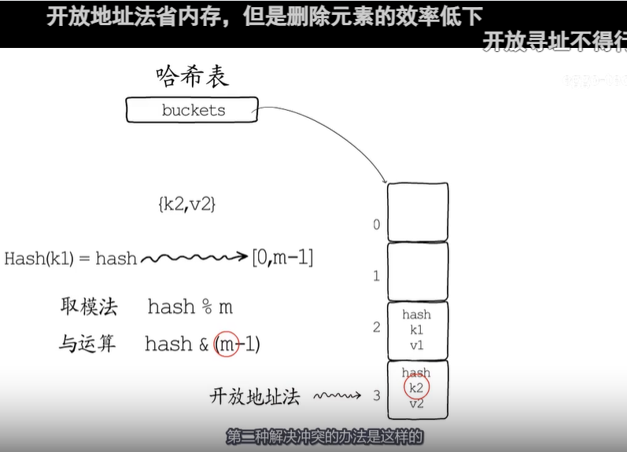
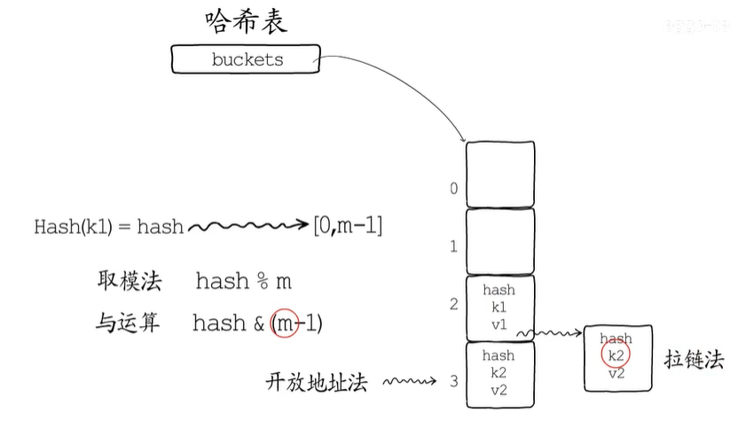
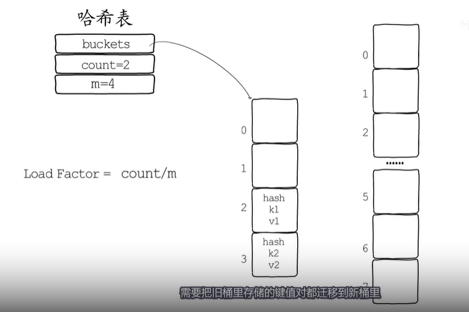
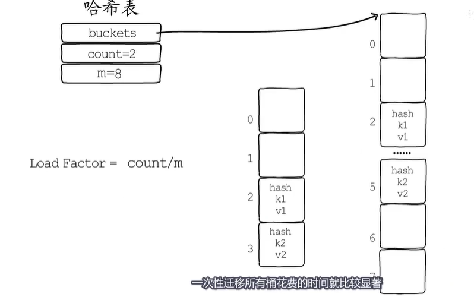
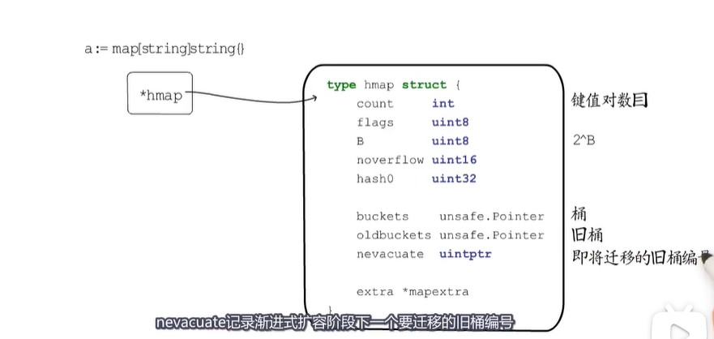
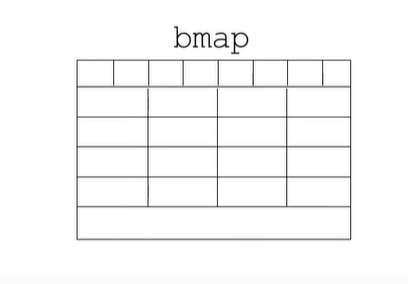
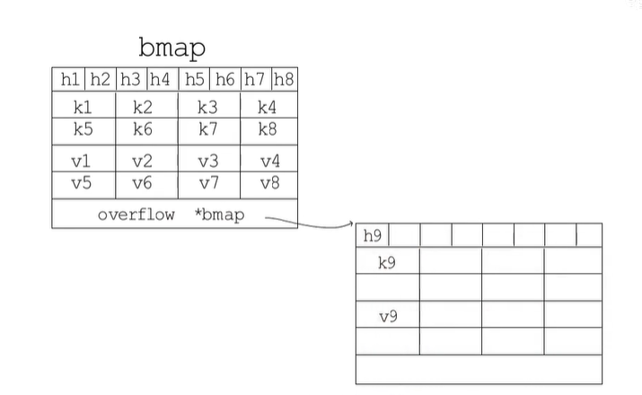
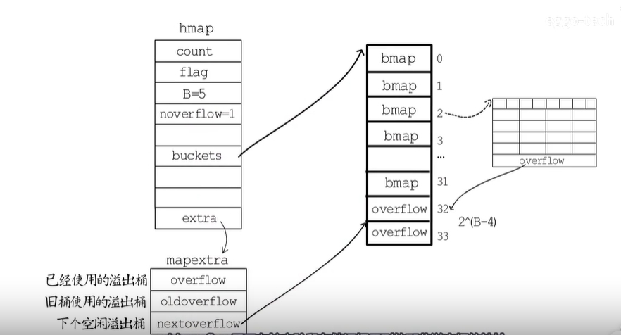

map 是hash表

hash 表由一堆buckets（桶)来存储键值对
一个键值对来了当然要选择一个桶来存储，怎么选？
先通过哈希函数把“键”处理一下，得到一个hash值，用这个hash值从m个桶中选择一个
桶编号区间0到m-1 [0, m-1]，有两种方法比较常用
	第一种取模法，就是用hash与桶的个数取模(hash%m)得到一个桶编号
	第二种就是与运算发hash值和m-1进行与运算(hash &(m-1))，若想确保运算结果落在区间[0,m-1]而不会出现空桶，就要限制桶的个数m必须是2整数次幂,这样m的二进制表示一定只有一位为1(比如 m=4， 结果是00000100), m-1的二进制表示 一定是低于这一位的所有位均为1（m-1 & 00000100）,如果桶的数目不是2的整数次幂(m=5, 00000101),就有可能出现有些桶绝对不会被选中的情况
	如桶选择好了，如果后来又有新的键值对选中这个桶就是发生了hash冲突，解决冲突的办法常用两种
		第一种 **开放地址法**，如编号为2的桶被占用了，那就找它后面没用被占用的桶来用，这里选中三号桶， 等到查找k2这个键值对时，虽然会首先定位这个编号为2的桶，但是经过比较key不相等，就会遍历它后面的桶知道key相等，或者遇到空桶，证明这个key不存在

		第二种是**拉链法**，编号为2的桶被占用了，没关系，在它后面链一个新桶存储这个键值对就好了，查找k2时同样会先找到2号桶，经比较发现key不相等，所以就顺着链表往后查找
		
	hash冲突的发生会影响哈希表的读写效率，选择散列均匀的哈希函数可以减少哈希冲突的发生，适时的对哈希表进行扩容也是保障读写效率的有效手段.
	**扩容**
	通常会保存储键值对的数目与桶的数目的比值作为是否需要扩容的判断依据(Load Factor = count /m)，这个比值被称为"负载因子", 需要扩容时就要分配更多的桶，他们就是新桶，需要把久桶里面存储的键值对都迁移到新桶里
	
	如果hash表的键值对比较多，一次性迁移所有的桶花费的时间就比较显著， 所以会在hash表需要扩容时先分配足够的新桶，然后后用一个字段记录久桶的位置，再增加一个字段记录久桶迁移的进度，比如记录下一个要迁移的久桶编号。
	
	在hash表每次读写操作时，如果检测到当前处于扩容阶段，就完成一部分键值对迁移任务，知道所有的久桶迁移完成，久桶不在使用才算真正完成一次hash表的扩容，像这样把键值对迁移的时间分摊到多次hash表操作中的方式叫做“渐进式扩容”， 可以避免一次性扩容带来的性能瞬间抖动。
	**golang中map**
	golang中map类型的底层实现就是hash表，map类型的底层实现就是hash表，map类型的变量本质上是一个指针，指向hmap结构体，count记录已经存储的键值对数目，B记录桶的数目是2的多少次幂,因为这里选择桶时用的是与运算方法，buckets记录桶在哪里，oldbuckets用于在扩容阶段保存久桶在哪，nevacuate 记录渐进式扩容阶段下一个要迁移的久桶编号 。
	
	**map使用的桶长什么样子**
	也就是bmap的结构
	
	一个桶里可以放8个键值对，但是为了让内存排列更加紧凑，8个key放一起，8个value放一起，在8个key的前面这是8个**toophash**。
	每个toophash都是对应hash值的高8位。最后这里是一个bmap型的指针指向一个溢出桶，溢出桶的内存布局与“常规桶”相同，是为了减少扩容次数而引入的，当一个桶存满了，还有可用的溢出桶时，就会在桶后面链一个溢出桶，继续往这里面存
	
	实际上如果hash表要分配的桶的数目大于2^4,就认为使用溢出桶的几率较大，就会预分配2^(B-4)个溢出桶备用，这些溢出桶与常规桶在内存中是连续的，只是前2^B个用做常规桶，用面的用作溢出桶，hmap结构体最后有一个extra字段，指向一个mapextra结构体，里面记录的都是溢出桶相关的信息，nextoverflow指向下一个空闲溢出桶，overflow是一个slice，记录目前已经被使用的溢出桶的地址，加入编号为2的桶存满了，就会在后面链一个溢出桶，nextoverflow指向下一个空闲桶，noverflow记录使用溢出桶的数量，此时只用了一个。oldoverflow用于在扩容阶段存储久桶用到的那些溢出桶的地址
	