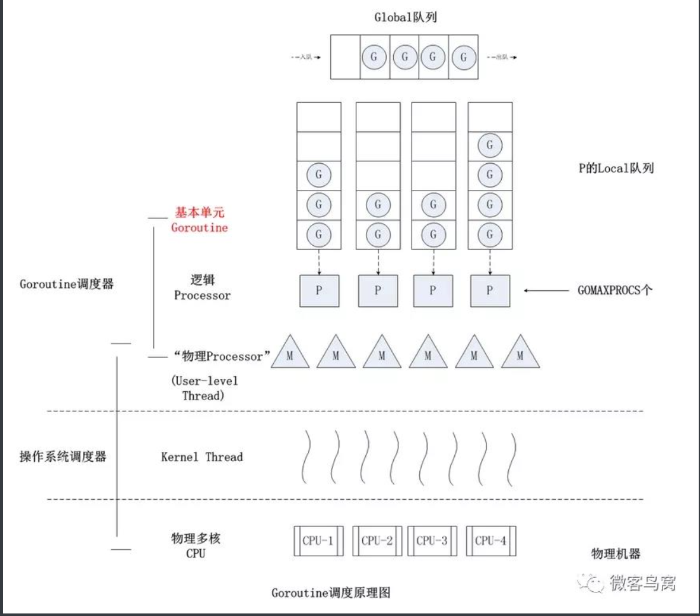
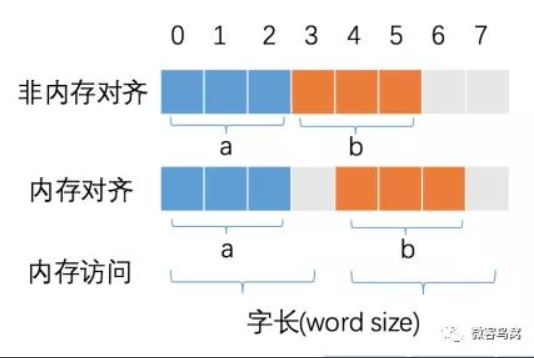

**深入剖析**

https://www.yuque.com/shjting/eptms3/hfpy2v

## 1. 垃圾回收

**垃圾回收、三色标记原理**

垃圾回收就是对程序中不再使用的内存资源进行自动回收的操作。

1.1 常见的垃圾回收算法：

- 引用计数：每个对象维护一个”用计数，当被引用对象被创建或被赋值给其他对象时引用计数自动加 +1；如果这个对象被销毁，则计数 -1 ，当计数为 0 时，回收该对象。

- - 优点：对象可以很快被回收，不会出现内存耗尽或到达阀值才回收。
  - 缺点：不能很好的处理循环引用

- 标记-清除：从根变量开始遍历所有引用的对象，引用的对象标记“被引用”，没有被标记的则进行回收。

- - 优点：解决了引用计数的缺点。
  - 缺点：需要 STW（stop the world），暂时停止程序运行。

- 分代收集：按照对象生命周期长短划分不同的代空间，生命周期长的放入老年代，短的放入新生代，不同代有不同的回收算法和回收频率。

- - 优点：回收性能好
  - 缺点：算法复杂

1.2 三色标记法

- 初始状态下所有对象都是白色的。
- 从根节点（全局变量，所有协程里面的局部变量）开始遍历所有对象，把遍历到的对象变成灰色对象
- 遍历灰色对象，将灰色对象引用(通过ptrmark 位图进行标记对象是不是指针)的对象也变成灰色对象，然后将遍历过的灰色对象变成黑色对象。
- 循环步骤3，直到灰色对象全部变黑色。
- 通过写屏障(write-barrier)检测对象有变化，重复以上操作
- 收集所有白色对象（垃圾）。

1.3 STW（Stop The World）

- 为了避免在 GC 的过程中，对象之间的引用关系发生新的变更，使得GC的结果发生错误（如GC过程中新增了一个引用，但是由于未扫描到该引用导致将被引用的对象清除了），停止所有正在运行的协程。
- STW对性能有一些影响，Golang目前已经可以做到1ms以下的STW。

1.4 写屏障(Write Barrier)

- 为了避免GC的过程中新修改的引用关系到GC的结果发生错误，我们需要进行STW。但是STW会影响程序的性能，所以我们要通过写屏障技术尽可能地缩短STW的时间。

造成引用对象丢失的条件:

一个黑色的节点A新增了指向白色节点C的引用，并且白色节点C没有除了A之外的其他灰色节点的引用，或者存在但是在GC过程中被删除了。以上两个条件需要同时满足：满足条件1时说明节点A已扫描完毕，A指向C的引用无法再被扫描到；满足条件2时说明白色节点C无其他灰色节点的引用了，即扫描结束后会被忽略 。

写屏障破坏两个条件其一即可

- 破坏条件1：Dijistra写屏障

满足强三色不变性：黑色节点不允许引用白色节点 当黑色节点新增了白色节点的引用时，将对应的白色节点改为灰色

- 破坏条件2：Yuasa写屏障

满足弱三色不变性：黑色节点允许引用白色节点，但是该白色节点有其他灰色节点间接的引用（确保不会被遗漏） 当白色节点被删除了一个引用时，悲观地认为它一定会被一个黑色节点新增引用，所以将它置为灰色

## 2. GPM 调度 和 CSP 模型

**协程的深入剖析**

**2.1 CSP 模型？**

CSP 模型是“以通信的方式来共享内存”，不同于传统的多线程通过共享内存来通信。用于描述两个独立的并发实体通过共享的通讯 channel (管道)进行通信的并发模型。

**2.2 GPM 分别是什么、分别有多少数量？**

- G（Goroutine）：即Go协程，每个go关键字都会创建一个协程。
- M（Machine）：工作线程，在Go中称为Machine，数量对应真实的CPU数（真正干活的对象）。
- P（Processor）：处理器（Go中定义的一个摡念，非CPU），包含运行Go代码的必要资源，用来调度 G 和 M 之间的关联关系，其数量可通过 GOMAXPROCS() 来设置，默认为核心数。

M必须拥有P才可以执行G中的代码，P含有一个包含多个G的队列，P可以调度G交由M执行。

**2.3 Goroutine调度策略**

- 队列轮转：P 会周期性的将G调度到M中执行，执行一段时间后，保存上下文，将G放到队列尾部，然后从队列中再取出一个G进行调度。除此之外，P还会周期性的查看全局队列是否有G等待调度到M中执行。
- 系统调用：当G0即将进入系统调用时，M0将释放P，进而某个空闲的M1获取P，继续执行P队列中剩下的G。M1的来源有可能是M的缓存池，也可能是新建的。
- 当G0系统调用结束后，如果有空闲的P，则获取一个P，继续执行G0。如果没有，则将G0放入全局队列，等待被其他的P调度。然后M0将进入缓存池睡眠。



## 3. CHAN 原理

**chan实现原理**

**3.1 结构体**

```golang
 type hchan struct {
     qcount   uint  // 队列中的总元素个数
     dataqsize uint  // 环形队列大小，即可存放元素的个数
     buf      unsafe.Pointer // 环形队列指针
     elemsize uint16  //每个元素的大小
     closed   uint32  //标识关闭状态
     elemtype *_type // 元素类型
     sendx    uint   // 发送索引，元素写入时存放到队列中的位置
     recvx    uint   // 接收索引，元素从队列的该位置读出
     recvq    waitq  // 等待读消息的goroutine队列
     sendq    waitq  // 等待写消息的goroutine队列
     lock mutex  //互斥锁，chan不允许并发读写
}
```

**3.2 读写流程**

**向 channel 写数据:**

若等待接收队列 recvq 不为空，则缓冲区中无数据或无缓冲区，将直接从 recvq 取出 G ，并把数据写入，最后把该 G 唤醒，结束发送过程。

若缓冲区中有空余位置，则将数据写入缓冲区，结束发送过程。

若缓冲区中没有空余位置，则将发送数据写入 G，将当前 G 加入 sendq ，进入睡眠，等待被读 goroutine 唤醒。

**从 channel 读数据**

若等待发送队列 sendq 不为空，且没有缓冲区，直接从 sendq 中取出 G ，把 G 中数据读出，最后把 G 唤醒，结束读取过程。

如果等待发送队列 sendq 不为空，说明缓冲区已满，从缓冲区中首部读出数据，把 G 中数据写入缓冲区尾部，把 G 唤醒，结束读取过程。

如果缓冲区中有数据，则从缓冲区取出数据，结束读取过程。

将当前 goroutine 加入 recvq ，进入睡眠，等待被写 goroutine 唤醒。
- buf是一个ring buffer结构，用于存储数据. waitq是一个双向链表，简单来说就是队列
所以简单说:
发送的时候，如果缓冲没满，或者有接收者，那就直接发;否则丢进去 sendq。
接收的时候，如果缓冲有数据，或者说有发送者，那就收;否则丢进去recvq。


**关闭 channel**

1.关闭 channel 时会将 recvq 中的 G 全部唤醒，本该写入 G 的数据位置为 nil。将 sendq 中的 G 全部唤醒，但是这些 G 会 panic。

panic 出现的场景还有：

- 关闭值为 nil 的 channel(没有初始化的channel)
- 关闭已经关闭的 channel
- 向已经关闭的 channel 中写数据

**3.2 无缓冲 Chan 的发送和接收是否同步?**

// 无缓冲的channel由于没有缓冲发送和接收需要同步 ch := make(chan int)    //有缓冲channel不要求发送和接收操作同步 ch := make(chan int, 2)  

channel 无缓冲时，发送阻塞直到数据被接收，接收阻塞直到读到数据；channel有缓冲时，当缓冲满时发送阻塞，当缓冲空时接收阻塞。

**Channel是同步的还是异步的？**

Channel是异步进行的, channel存在3种状态：

- nil，未初始化的状态，只进行了声明，或者手动赋值为nil
- active，正常的channel，可读或者可写
- closed，已关闭，千万不要误认为关闭channel后，channel的值是nil

| 操作     | 一个零值nil通道 | 一个非零值但已关闭的通道 | 一个非零值且尚未关闭的通道 |
| -------- | --------------- | ------------------------ | -------------------------- |
| 关闭     | 产生恐慌(panic) | 产生恐慌(panic)          | 成功关闭                   |
| 发送数据 | 永久阻塞        | 产生恐慌(panic)          | 阻塞或者成功发送           |
| 接收数据 | 永久阻塞        | 永不阻塞(得到零值)       | 阻塞或者成功接收           |


## 4. context 结构原理
使用场景:上下文传递和超时控制
原理：
父亲如何控制儿子:通过儿子主动加入到父亲的children里面，父亲只需要遍历就可以
**4.1 用途**

1. 安全参数传递(context.WithValue())
例子:
    - 链路追踪的trace id（可放在中间件的context）
    - AB测试的标记位
    - 压力测试标记位
    - 分库分表中间件中传递sharding hint
    - ORM中间件传递SQL hint
    - Web框架传递上下文

2. 控制链路(`WithCancel(), WithTimeout(), WithDeadline`, 控制子协程)
context是层层派生的，父派生子，子派生孙，一旦父context cancel，deadline或者timeout，所有的子孙context都能收到Done()结构体的返回值(Done() 返回值的chan struct{} 会被关闭)，Err()也能获取对应的错误信息
```go
func TestContext(t *testing.T) {
	ctx := context.WithValue(context.Background(), "k1", "1")
	cCtx := context.WithValue(ctx, "k2", "2")
	// 父 拿不到子 设置的值
	fmt.Println(ctx.Value("k2"))
	// 子可以 拿到父的值
	fmt.Println(cCtx.Value("k1"))
}
```
思考：如果上级context要获取下级的值要怎么实现？
答案：上级的存map作为值  下级可以修改map, 这样上级也能拿到，同理上级存指针也是可以，但**不推荐**这么做 , 已经破坏了context不可变的约束

```go
context.WithValue(context.Background(), "key", map[string]string{})
```


**4.2 数据结构**

Context 只定义了接口，凡是实现该接口的类都可称为是一种 context。

并发控制神器之Context
```golang
  type Context interface {   
  		Deadline() (deadline time.Time, ok bool)   
  		Done() <-chan struct{}   
  		Err() error   
  		Value(key interface{}) interface{}
  }
```

- 「Deadline」 方法：可以获取设置的截止时间，返回值 deadline 是截止时间，到了这个时间，Context 会自动发起取消请求，返回值 ok 表示是否设置了截止时间。

- 「Done」 方法：返回一个只读的 channel ，类型为 struct{}。如果这个 chan 可以读取，说明已经发出了取消信号，可以做清理操作，然后退出协程，释放资源。

- 「Err」 方法：返回Context 被取消的原因。可以通过这个Err()返回值结合switch case 来判断context是超时还是被取消了
	- 如果Done 还没有关闭，Err返回nil。
	- 如果Done已经关闭，Err返回一个非零的错误：
		- 如果上下文被取消,则返回Canceled(也就是主动cancel了，包括`context.WithCancel()`， `context.WithTimeout()`方法主动取消)
		- 如果上下文的最后期限已过，则`DeadlineExceeded`。(`context.WithTimeout()`超时了，)
		- 在Err返回一个非零的错误后，对Err的连续调用都会返回相同的错误。
```go
func main() {
	rootCtx := context.Background()
	tc, cancel := context.WithTimeout(rootCtx, time.Second)
	defer cancel()
	time.Sleep(2 * time.Second)
	switch tc.Err() {
	case context.Canceled:
	case context.DeadlineExceeded:
	}
}
```
- 「Value」 方法：获取 Context 上绑定的值，是一个键值对，通过 key 来获取对应的值。
  **父子context的注意点：**
- 父亲看控制儿子，但儿子不能控制父亲
- 子context试图重新设置超时时间，如果设置的超时时间比父级ctx大则不会成功，它依旧受到了父亲的控制，比父级ctx小才会成功
  通过`cCtx.Err()`的错误类型来判断并不是主动canceled 而是timeout
```go
func TestContext(t *testing.T) {
	ctx, pC := context.WithTimeout(context.Background(), time.Second)
	// 这个子ctx 的超时时间不会被重置，一样会被父ctx控制
	cCtx, cC := context.WithTimeout(ctx, 3*time.Second)
	go func() {
		<-cCtx.Done()
        fmt.Println(cCtx.Err()) // output: context deadline exceeded
		fmt.Println("time out")
	}()
	time.Sleep(2 * time.Second)
	pC()
	cC()
}
```
超时控制示例
```go
// 假设超时1秒后就取消子任务
func TestBusinessContext(t *testing.T) {
	ctx, cancel := context.WithTimeout(context.Background(), time.Second)
	defer cancel()
	end := make(chan struct{}, 1)
	go func() {
		MyBusiness()
		end <- struct{}{}
	}()
	select {
	case <-ctx.Done():
		fmt.Println("timeout")
	case <-end:
		fmt.Println("任务正常执行完毕")
	}
}
func MyBusiness() {
	time.Sleep(2 * time.Second)
}
```
**withCancel() 是如何关掉子cancel的？**
答案：创建儿子的时候会把儿子和父亲绑定到一起，然后父亲在cancel的时候会把儿子给一起cancel掉
## 5. 竞态、内存逃逸

**并发控制，同步原语 sync 包**

**5.1 竞态**

资源竞争，就是在程序中，同一块内存同时被多个 goroutine 访问。我们使用 go build、go run、go test 命令时，添加 -race 标识可以检查代码中是否存在资源竞争。

解决这个问题，我们可以给资源进行加锁，让其在同一时刻只能被一个协程来操作。

- sync.Mutex
- sync.RWMutex

**5.2 channel 内存逃逸分析**
内存分配:
- 分配到栈上：不需要考虑GC
- 分配到堆上：需要考虑GC

很不幸的，如果用**channel发送指针**，那么必然逃逸。
因为编译器无法确定，发送的指针数据最终会被哪个goroutine接收!，这样channel 就会被分配到堆上


**面试官问我go逃逸场景有哪些，我？？？**

「逃逸分析」就是程序运行时内存的分配位置(栈或堆)，是由编译器来确定的。堆适合不可预知大小的内存分配。但是为此付出的代价是分配速度较慢，而且会形成内存碎片（内存分配在堆上的都需要GC的）。

逃逸场景：

- 指针逃逸
- 栈空间不足逃逸
- 动态类型逃逸
- 闭包引用对象逃逸

**快问快答**

## 6. go 中除了加 Mutex 锁以外还有哪些方式安全读写共享变量？

Go 中 Goroutine 可以通过 Channel 进行安全读写共享变量。

**7. golang中new和make的区别？**

用new还是make？到底该如何选择？

- make 仅用来分配及初始化类型为 slice、map、chan 的数据。
- new 可分配任意类型的数据，根据传入的类型申请一块内存，返回指向这块内存的指针，即类型 *Type。如果使用new 来初始化slice、map、chan 是不会报错，但是不可以使用的，因为没有初始化
- make 返回引用，即 Type，new 分配的空间被清零， make 分配空间后，会进行初始。

## 8. Go中对nil的Slice和空Slice的处理是一致的吗?

首先Go的JSON 标准库对 nil slice 和 空 slice 的处理是不一致。

- slice := make([]int,0）：slice不为nil，但是slice没有值，slice的底层的空间是空的。
- slice := []int{} ：slice的值是nil，可用于需要返回slice的函数，当函数出现异常的时候，保证函数依然会有nil的返回值。

## 9. 协程和线程和进程的区别？

并发掌握，goroutine和channel声明与使用！

- 进程: 进程是具有一定独立功能的程序，进程是系统资源分配和调度的最小单位。每个进程都有自己的独立内存空间，不同进程通过进程间通信来通信。由于进程比较重量，占据独立的内存，所以上下文进程间的切换开销（栈、寄存器、虚拟内存、文件句柄等）比较大，但相对比较稳定安全。
- 线程: 线程是进程的一个实体,线程是内核态,而且是CPU调度和分派的基本单位,它是比进程更小的能独立运行的基本单位。线程间通信主要通过共享内存，上下文切换很快，资源开销较少，但相比进程不够稳定容易丢失数据。

- 协程: 协程是一种用户态的轻量级线程，协程的调度完全是由用户来控制的。协程拥有自己的寄存器上下文和栈。协程调度切换时，将寄存器上下文和栈保存到其他地方，在切回来的时候，恢复先前保存的寄存器上下文和栈，直接操作栈则基本没有内核切换的开销，可以不加锁的访问全局变量，所以上下文的切换非常快。

## 10. Golang的内存模型中为什么小对象多了会造成GC压力？

通常小对象过多会导致GC三色法消耗过多的GPU。优化思路是，减少对象分配。

## 11. channel 为什么它可以做到线程安全？

Channel 可以理解是一个先进先出的队列，通过管道进行通信,发送一个数据到Channel和从Channel接收一个数据都是原子性的。不要通过共享内存来通信，而是通过通信来共享内存，前者就是传统的加锁，后者就是Channel。设计Channel的主要目的就是在多任务间传递数据的，本身就是安全的。

## 12. GC 的触发条件？

主动触发(手动触发)，通过调用 runtime.GC 来触发GC，此调用阻塞式地等待当前GC运行完毕。

被动触发，分为两种方式：

- 使用步调（Pacing）算法，其核心思想是控制内存增长的比例,每次内存分配时检查当前内存分配量是否已达到阈值（环境变量GOGC）：默认100%，即当内存扩大一倍时启用GC。
- 使用系统监控，当超过两分钟没有产生任何GC时，强制触发 GC。

**13. 怎么查看Goroutine的数量？怎么限制Goroutine的数量？**

- 在Golang中,GOMAXPROCS中控制的是未被阻塞的所有Goroutine,可以被 Multiplex 到多少个线程上运行,通过GOMAXPROCS可以查看Goroutine的数量。
- 使用通道。每次执行的go之前向通道写入值，直到通道满的时候就阻塞了。


## 15. Goroutine和线程的区别

- 一个线程可以有多个协程
- 线程、进程都是同步机制，而协程是异步
- 协程可以保留上一次调用时的状态，当过程重入时，相当于进入了上一次的调用状态
- 协程是需要线程来承载运行的，所以协程并不能取代线程，「线程是被分割的CPU资源，协程是组织好的代码流程」
- 线程是内核态，协程是用户态

## 16. Go的Struct能不能比较？

- 相同struct类型的可以比较
- 不同struct类型的不可以比较,编译都不过，类型不匹配

## 17. Go主协程如何等其余协程完再操作？

使用sync.WaitGroup。WaitGroup，就是用来等待一组操作完成的。WaitGroup内部实现了一个计数器，用来记录未完成的操作个数。Add()用来添加计数；Done()用来在操作结束时调用，使计数减一；Wait()用来等待所有的操作结束，即计数变为0，该函数会在计数不为0时等待，在计数为0时立即返回。

## 18. Go的Slice如何扩容？

**slice 实现原理**

在使用 append 向 slice 追加元素时，若 slice 空间不足则会发生扩容，扩容会重新分配一块更大的内存，将原 slice 拷贝到新 slice ，然后返回新 slice。扩容后再将数据追加进去。

扩容操作只对容量，扩容后的 slice 长度不变，容量变化规则如下：

- 若 slice 容量小于1024个元素，那么扩容的时候slice的cap就翻番，乘以2；一旦元素个数超过1024个元素，增长因子就变成1.25，即每次增加原来容量的四分之一。
- 若 slice 容量够用，则将新元素追加进去，slice.len++，返回原 slice
- 若 slice 容量不够用，将 slice 先扩容，扩容得到新 slice，将新元素追加进新 slice，slice.len++，返回新 slice。

## 19. Go中的map如何实现顺序读取？

Go中map如果要实现顺序读取的话，可以先把map中的key，通过sort包排序。

## 20. Go值接收者和指针接收者的区别？

**究竟在什么情况下才使用指针？**

**参数传递中，值、引用及指针之间的区别！**

方法的接收者:

- 值类型，既可以调用值接收者的方法，也可以调用指针接收者的方法；
- 指针类型，既可以调用指针接收者的方法，也可以调用值接收者的方法。

但是接口的实现，值类型接收者和指针类型接收者不一样：

- 以值类型接收者实现接口，类型本身和该类型的指针类型，都实现了该接口；
- 以指针类型接收者实现接口，只有对应的指针类型才被认为实现了接口。

通常我们使用指针作为方法的接收者的理由：

- 使用指针方法能够修改接收者指向的值。
- 可以避免在每次调用方法时复制该值，在值的类型为大型结构体时，这样做会更加高效。

## 21. 在Go函数中为什么会发生内存泄露？

Goroutine 需要维护执行用户代码的上下文信息，在运行过程中需要消耗一定的内存来保存这类信息，如果一个程序持续不断地产生新的 goroutine，且不结束已经创建的 goroutine 并复用这部分内存，就会造成内存泄漏的现象。

## 22. Goroutine发生了泄漏如何检测？

可以通过Go自带的工具pprof或者使用Gops去检测诊断当前在系统上运行的Go进程的占用的资源。

## 23. Go中两个Nil可能不相等吗？

Go中两个Nil可能不相等。

接口(interface) 是对非接口值(例如指针，struct等)的封装，内部实现包含 2 个字段，类型 T 和 值 V。一个接口等于 nil，当且仅当 T 和 V 处于 unset 状态（T=nil，V is unset）。

两个接口值比较时，会先比较 T，再比较 V。接口值与非接口值比较时，会先将非接口值尝试转换为接口值，再比较。

```golang
func main() {
	var p *int = nil
	var i interface{} = p
	fmt.Println(i == p)   // true
	fmt.Println(p == nil) // true
	fmt.Println(i == nil) // false
}
```

- 例子中，将一个nil非接口值p赋值给接口i，此时,i的内部字段为`(T=*int, V=nil)`，`i`与`p`作比较时，将 `p` 转换为接口后再比较，因此 `i == p`，`p` 与 `nil` 比较，直接比较值，所以 `p == nil`。
- 但是当 i 与nil比较时，会将nil转换为接口`(T=nil, V=nil)`,与`i(T=*int, V=nil)`不相等，因此` i != nil`。因此 `V` 为 `nil` ，但 `T` 不为 `nil` 的接口不等于 `nil`。

## 24. Go语言函数传参是值类型还是引用类型？

- 在Go语言中只存在值传递，要么是值的副本，要么是指针的副本。无论是值类型的变量还是引用类型的变量亦或是指针类型的变量作为参数传递都会发生值拷贝，开辟新的内存空间。
- 另外值传递、引用传递和值类型、引用类型是两个不同的概念，不要混淆了。引用类型作为变量传递可以影响到函数外部是因为发生值拷贝后新旧变量指向了相同的内存地址。

## 25. Go语言中的内存对齐了解吗？

CPU 访问内存时，并不是逐个字节访问，而是以字长（word size）为单位访问。比如 32 位的 CPU ，字长为 4 字节，那么 CPU 访问内存的单位也是 4 字节。

CPU 始终以字长访问内存，如果不进行内存对齐，很可能增加 CPU 访问内存的次数，例如：



变量 a、b 各占据 3 字节的空间，内存对齐后，a、b 占据 4 字节空间，CPU 读取 b 变量的值只需要进行一次内存访问。如果不进行内存对齐，CPU 读取 b 变量的值需要进行 2 次内存访问。第一次访问得到 b 变量的第 1 个字节，第二次访问得到 b 变量的后两个字节。

也可以看到，内存对齐对实现变量的原子性操作也是有好处的，每次内存访问是原子的，如果变量的大小不超过字长，那么内存对齐后，对该变量的访问就是原子的，这个特性在并发场景下至关重要。

简言之：合理的内存对齐可以提高内存读写的性能，并且便于实现变量操作的原子性。

## 26. 两个 interface 可以比较吗？**

- 判断类型是否一样

reflect.TypeOf(a).Kind() == reflect.TypeOf(b).Kind()

- 判断两个interface{}是否相等

reflect.DeepEqual(a, b interface{})

- 将一个interface{}赋值给另一个interface{}

reflect.ValueOf(a).Elem().Set(reflect.ValueOf(b))

## 27. go 打印时 %v %+v %#v 的区别？**

- %v 只输出所有的值；
- %+v 先输出字段名字，再输出该字段的值；
- %#v 先输出结构体名字值，再输出结构体（字段名字+字段的值）；

```golang
type student struct {
	id   int32
	name string
}

func main() {
	a := &student{id: 1, name: "微客鸟窝"}
	fmt.Printf("a=%v \n", a)  // a=&{1 微客鸟窝}
	fmt.Printf("a=%+v \n", a) // a=&{id:1 name:微客鸟窝}
	fmt.Printf("a=%#v \n", a) // a=&main.student{id:1, name:"微客鸟窝"}
}
```

## 28. 什么是 rune 类型？**

Go语言的字符有以下两种：

- **uint8** 类型，或者叫 **byte** 型，代表了 ASCII 码的一个字符。
- **rune** 类型，代表一个 UTF-8 字符，当需要处理中文、日文或者其他复合字符时，则需要用到 rune 类型。rune 类型等价于 **int32** 类型。

```golang
	var str = "hello 你好" //思考下 len(str) 的长度是多少？
	// golang中string底层是通过byte数组实现的，直接求len 实际是在按字节长度计算
	//所以一个汉字占3个字节算了3个长度
	fmt.Println("len(str):", len(str)) // len(str): 12
	// 通过rune类型处理unicode字符
	fmt.Println("rune:", len([]rune(str))) //rune: 8
```

## 29. 空 struct{} 占用空间么？**

可以使用 unsafe.Sizeof 计算出一个数据类型实例需要占用的字节数:
```golang
func main() { 
	fmt.Println(unsafe.Sizeof(struct{}{}))  //0
}
```

空结构体 struct{} 实例不占据任何的内存空间。

## 30. 空 struct{} 的用途？**

因为空结构体不占据内存空间，因此被广泛作为各种场景下的占位符使用。

1. 将 map 作为集合(Set)使用时，可以将值类型定义为空结构体，仅作为占位符使用即可。

```golang
type Set map[string]struct{} 
func (s Set) Has(key string) bool { 
	_, ok := s[key] 
	return ok 
} 
func (s Set) Add(key string) { 
	s[key] = struct{}{} 
} 
func (s Set) Delete(key string) { 
	delete(s, key) 
} 
func main() { 
	s := make(Set) 
	s.Add("Tom") 
	s.Add("Sam") 
	fmt.Println(s.Has("Tom")) 
	fmt.Println(s.Has("Jack")) 
}
```

1. 不发送数据的信道(channel)使用 channel 不需要发送任何的数据，只用来通知子协程(goroutine)执行任务，或只用来控制协程并发度。

```golang
func worker(ch chan struct{}) { 
	<-ch 
	fmt.Println("do something") 
	close(ch) 
} 
func main() { 
	ch := make(chan struct{}) 
	go worker(ch) 
	ch <- struct{}{} 
}
```

1. 结构体只包含方法，不包含任何的字段

