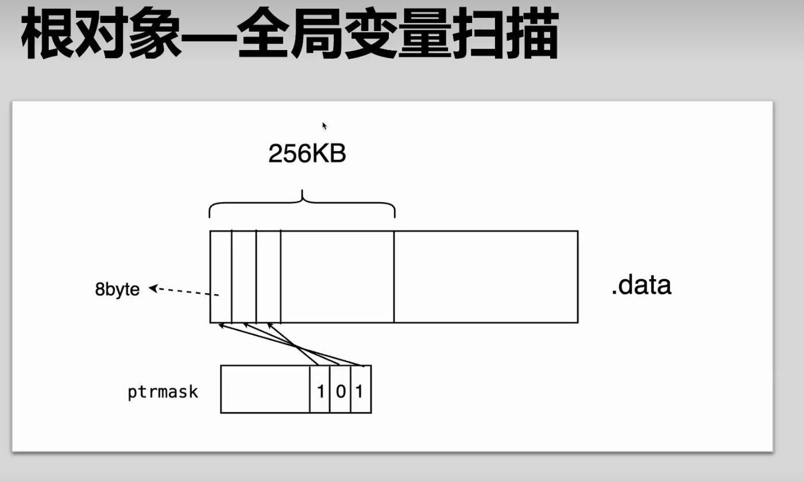

### 垃圾回收(GC,garbage collection )
* 自动内存管理的一种形式。
* 通常由垃圾收集器收集并适时回收或重用
* 不再被对象占用的内存

### 为什么要使用GC
* 减少错误和复杂性
&emsp;&emsp;内存泄漏，野指针，多次释放
* 解耦
&emsp;&emsp;减少模块之间的耦合意味着一个模块的行为不依赖于另一个模块的实现。当两个模块中同时维护了同—内存时，释放内存将会变得非常小心。这种手动分配的困难在于，难以在本地模块内做出全局的决定。

### 垃圾回收的经典策略
* 标记-清扫(mark-sweep)
缺点：
&emsp;&emsp;产生内存碎片
* 标记-压缩(mark-compact)
优点：
&emsp;&emsp;解决内存碎片问题
缺点：
&emsp;&emsp;需要更多次的循环，压缩花费计算成本，需要计算位置以及forword指针；
&emsp;&emsp;实现复杂；
&emsp;&emsp;CPU缓存
* 半空间复制(Semispace copy)
特点：
将内存压缩

* 引用计数(reference countint)
主要用在脚本语言（Python， PHP）
缺点：
额外的空间（在每个对象的头部需要额外的空间）
自依赖（自己引用自己的情况可能完全不会被标记为垃圾对象）
并发性（并发是需要加锁）

* 分代收集


* 三色标记
并发：
&emsp;&emsp;不需要暂停所有的用户协程 而是在很长一段时间内，用户的协程跟垃圾回收协程是并发的执行的
增量：
&emsp;&emsp;分成很多阶段让stop the world ，相当于暂停时间足够的短，尽量减少性能的损失
准确式：
&emsp;&emsp;编译时和运行时共同努力来识别某个对象是指针而不是int类型的某个数

过程：

- 初始状态下所有对象都是白色的。
- 从根节点（全局变量，所有协程里面的局部变量）开始遍历所有对象，把遍历到的对象变成灰色对象
- 遍历灰色对象，将灰色对象引用(通过ptrmark 位图进行标记对象是不是指针)的对象也变成灰色对象，然后将遍历过的灰色对象变成黑色对象。
- 循环步骤3，直到灰色对象全部变黑色。
- 通过写屏障(write-barrier)检测对象有变化，重复以上操作
- 收集所有白色对象（垃圾）
- 分为5个阶段：

### 三色标记垃圾回收的循环(阶段)，为什么需要STW(stop the world)，go垃圾回收的全局视图
```

	   +--------------------------------------------------------------------------------+
	   |																		 |
+------v------+		+-------------+		+-------------+		+------------+		+--------------+	 	
| 触发垃圾回收 |----> | 标记准备阶段 |---->| 并行标记阶段 |----->| 标记终止阶段 |---> | 垃圾懒清扫阶段 |
+-------------+		+-------------+		+-------------+		+-------------+		+--------------+
											|									 |
									  +------v------+						+------v--------+
									  |	 辅助标记    |					     |    辅助清扫   |
									  +-------------+						+--------------+
									  											  |	
									  										+------v-------+
									  										|系统驻留内存清扫|	
									  										+--------------+


```
* 标记准备阶段：
&emsp;&emsp;为了开始标记而进行准备的阶段
&emsp;&emsp;会STW 会停止所以的协程运行。开启写屏障。接下来会做一些简单的工作，如统计要清扫对象的个数，统计时间，把上一次没有清扫到的对象清扫完。
这个阶段还会做两个重要的事情：
如何决定需要多少个标记协程进行工作
&emsp;&emsp;这个指标是cpu核心数的25%。假如有4个核心来处理程序，那就是需要一个核心完全的去处理后台标记程序，其他的三个就可以去处理用户协程。假如核心数不能被1.25整除，这种情况是分段处理，比如先一段时间处理后台标记，然后又一段时间处理用户协程，轮着来

如何进行调度使标记协程运行

那么后台标记协程是什么启动的：
&emsp;&emsp;在调度的时候

* 并行标记阶段：
&emsp;&emsp;用户协程和垃圾回收协程同步进行标记检索
从根节点（全局变量，所有协程里面的局部变量）开始遍历所有对象，把遍历到的对象变成灰色对象
遍历灰色对象，将灰色对象引用(通过ptrmark 位图进行标记对象是不是指针)的对象也变成灰色对象，然后将遍历过的灰色对象变成黑色对象。

* 辅助标记：
&emsp;&emsp;防止在运行标记的时候用户协程还在不停的分配内存，假如GC在不停的标记，用户协程有不停的分配内存，这就可以会出现一直在垃圾回收根本没有可能会停下来，因为没有办法结束标记阶段

* 标记终止：
&emsp;&emsp;当把所有的对象都清扫完毕以后，就会关闭写屏障（让用户协程重新调度起来），计算时间周期，计算统计的指标，最重要的是计算下一次垃圾回收的目标值(阈值)。
* 垃圾懒清扫阶段：
* &emsp;&emsp;懒清扫就是清扫一下休息一下。引用懒清扫这时候就会有第二个问题：假如内存分配的很快，就会再次触发第二次垃圾回收，这时候懒清扫还没有清扫完毕 又要新的GC触发，这时候就会涉及辅助清扫
* 辅助清扫：
&emsp;&emsp;辅助清扫和辅助标记很类似，辅助清扫就是需要去明确当完成下一次垃圾回收时候要尽量的把上一次垃圾回收清扫完毕。
* 系统驻留内存清扫：
&emsp;&emsp;新开一个协程做驻留内存的清除，就是 它会去扫描一些定时的在线程的1%的CPU时间，它会去扫描新的内存的分布，当达到目标值以后它会去把这个内存还给操作系统


一般我们认为根对象是黑色对象，黑色对象的引用就是灰对象，灰对象扫描了以后就变成黑对象