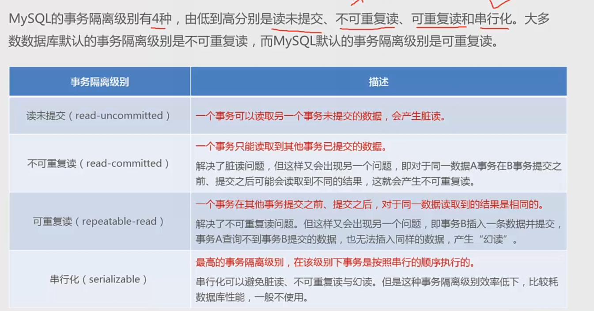
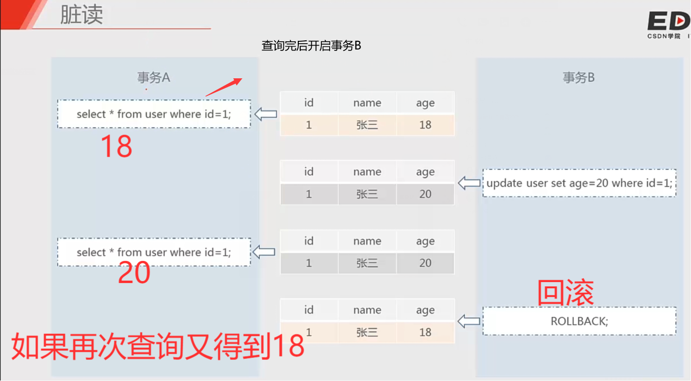
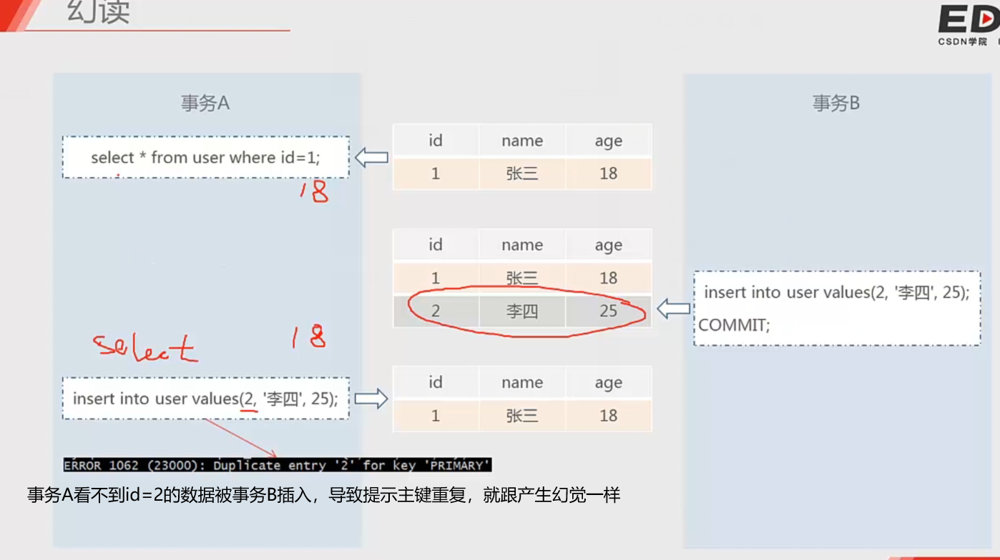
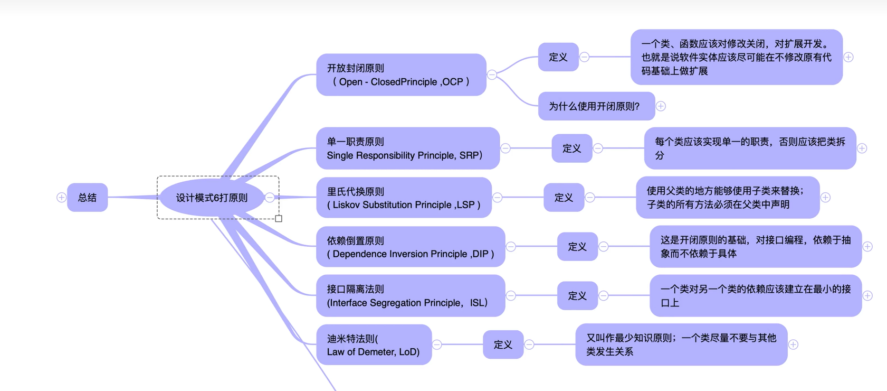
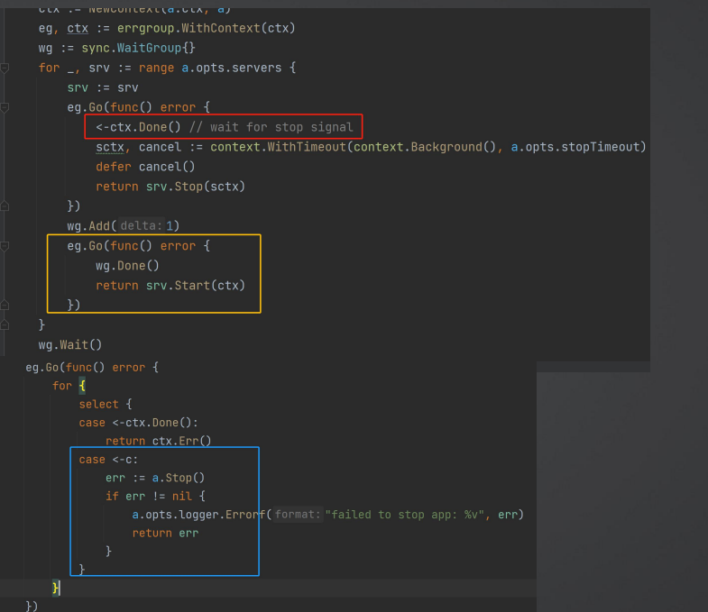
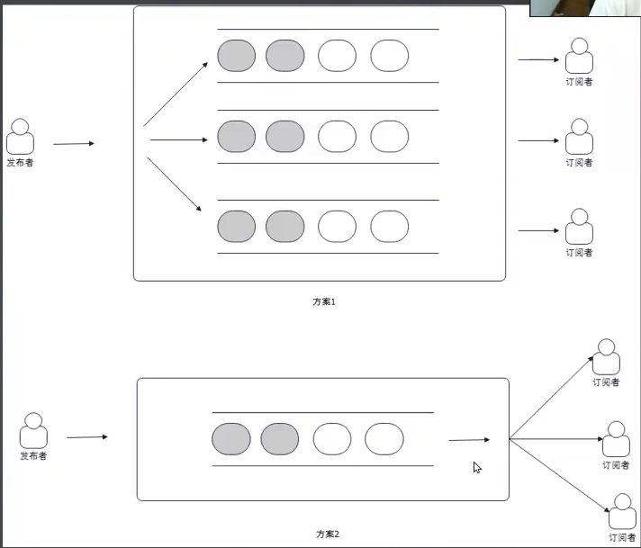

面试讲究的就是一个无中生有

## 数据库相关
### 索引失效

- 采用is null条件时，不能利用到索引
- 模糊查询时%在关键词的左边
- 索引字段做运算
- 索引字段使用函数
- 被索引字段，发生了隐式类型转换
- 联合索引不是最左字段	
&emsp;&emsp;联合索引不能使用or,否则会索引失效，比如index(a, b) select * from xx where a=11 or b=11;
### 死锁 
### 索引类型
&emsp;&emsp;主键，全文，唯一，外键，组合索引(联合索引)
### 主从复制
### sql 语句
### 事务
&emsp;&emsp;原子性，一致性，隔离性，持久性
###  mysql和postgresql的优缺点

###  innodb 使用什么锁，在什么情况下是表锁 
- 行锁
- 在没有主键索引或者索引失效的情况下使用表锁
	

### mysql中锁

1. **全局锁就是对整个数据库实例加锁**，它的典型使用场景就是做全库逻辑备份。这个命令可以使整个库处于只读状态。使用该命令之后，数据更新语句、数据定义语句、更新类事务的提交语句等操作都会被阻塞。
	
2. **共享锁又叫读锁**，其他会话可以并发的读操作，但其他会话都不能对数据进行修改（获取数据上的排他锁)，直到已释放所有共享锁。当如果事务对读锁进行修改操作，很可能会造成死锁。语法为：
```sql
select ... lock in share mode
```
3. **排他锁又叫写锁(write lock)**，若某个事物对某一行加上了排他锁，只能这个事务对其进行读写，在此事务结束之前，**其他事务不能对其进行加任何锁，其他进程可以读取,不能进行写操作，需等待其释放**。排它锁是悲观锁的一种实现。语法：
```sql
select ...for update
```
 **场景：**
&emsp; &emsp;lock in share mode适用于两张表存在业务关系时的一致性要求，for update适用于操作同一张表时的一致性要求

### myisam 和innodb的区别
* myisam 不支持事务，innodb支持事务
* innodb支持外键，myisam不支持外键，innodb在mysql5.6之前不支持全文索引
* innodb是聚集索引，myisam是非聚集索引
* myisam 是表锁，innodb是行锁
* InnoDB不保存表的具体行数，执行select count(*) from table时需要全表扫描。而MylSAM用一个变量保存了整个表的行数，执行上述语句时只需要读出该变量即可，速度很快;
	
### Mysql中VARCHAR(M)最多能存储多少数据?
&emsp;&emsp;对于VARCHAR(M)类型的列最多可以定义65535个**字节**。其中的M代表该类型最多存储的**字符数量**，但在实际存储时并不能放这么多。
&emsp;&emsp;MySQL对一条记录占用的最大存储空间是有限制的，除了BLOB或者TEXT类型的列之外，其他所有的列（不包括隐藏列和记录头信息）占用的字节长度加起来不能超过65535个字节。

- lnnoDB一棵B+树可以存放多少行数据?这个问题的其实非常简单:约2干万
	&emsp;&emsp;计算机在存储数据的时候，有最小存储单元，在计算机中磁盘存储数据最小单元是扇区(这就好比我们今天进行现金的流通最小单位是一毛)，一个扇区的大小是512字节，而文件系统（例如XFS/EXT4）的最小单元是块，一个块的大小是4k，而对于我们的InnoDB存储引擎也有自己的最小储存单元——页(Page) ，一个页的大小是16K。
	
	&emsp;&emsp;数据表中的数据都是存储在页中的，所以一个页中能存储多少行数据呢?假设一行数据的大小是1k，那么一个页可以存放16行这样的数据。
	&emsp;&emsp;对于B+树而言，只有叶子节点存放数据，非叶子节点存放的是只保存索引信息和下一层节点的指针信息。一个非叶子节点能存放多少指针?
	&emsp;&emsp;其实这也很好算，我们假设主键 ID为常用的bigint类型，长度为8字节，而指针大小在
	&emsp;&emsp;InnoDB 源码中设置为6字节，这样一共14字节，我们一个页中能存放多少这样的单元，其实就代表有多少指针，即16384/14=1170个。
	&emsp;&emsp;那么可以算出一棵高度为2的B+树，存在一个根节点和若干个叶子节点能存放1170*16=18720条这样的数据记录。
	&emsp;&emsp;根据同样的原理我们可以算出一个高度为3的B+树可以存放:1170*1170*16=21902400条这样的记录。

	
### 磁盘io很高，对mysql有什么影响

### MySQL `InnoDB` 支持 全文索引吗？
&emsp;&emsp;5.6版本以前不支持，5.6以后支持
### 如何避免死锁
&emsp;&emsp;当两个及以上的事务，双方都在等待对方释放已经持有的锁或**因为加锁顺序不一致**造成循环等待锁资源
解决：
#### 一： 由于外键导致的死锁
- 不要使用外键约束
- 如果事务中的 update 语句的更新没有更新外键(只作为where条件之一),那么不需要删除外键，只需要告诉数据库我不更新外键就不会死锁了
```sql
select * from xx for update =>select * from xx FOR NO KEY UPDATE
```
#### 二、加锁顺序不一致
- 处理死锁的方法是避免它，我们应该在事务中微调我们的查询
``` sql
- Tx1:transfer $10 from account 1 to account 2
BEGIN;
UPDATE accounts SET balance = balance- 10 WHERE id = 1 RETURNING *;
UPDATE accounts SET balance = balance + 10 WHERE id = 2 RETURNING *;
ROLLBACK;
- Tx2: transfer $10 from account 2 to account 1
BEGIN;
UPDATE accounts SET balance = balance - 10 WHERE id =2 RETURNING *;
UPDATE accounts SET balance = balance + 10 WHERE id = 1 RETURNING *;
ROLLBACK;
```
开两个会话
1 会话
```sql
BEGIN;
UPDATE accounts SET balance = balance- 10 WHERE id = 1 RETURNING *;
```
2 会话
```sql
BEGIN;
UPDATE accounts SET balance = balance - 10 WHERE id =2 RETURNING *;
```
此时id = 1 和 id = 2 的accounts的记录都被加锁了
会话1 在执行`UPDATE accounts SET balance = balance + 10 WHERE id = 2 RETURNING *;` 发现 被阻塞住了
会话2 执行  `UPDATE accounts SET balance = balance + 10 WHERE id = 1 RETURNING *;` 也如此。会话1等等会话2释放id=2的记录的锁，会话2等待会话1释放id = 1的记录的锁。 那么就死锁了

我们只要把加锁顺序一致不就可以了吗？
``` sql
- Tx1:transfer $10 from account 1 to account 2
BEGIN;
UPDATE accounts SET balance = balance- 10 WHERE id = 1 RETURNING *;
UPDATE accounts SET balance = balance + 10 WHERE id = 2 RETURNING *;
ROLLBACK;
- Tx2: transfer $10 from account 2 to account 1
BEGIN;
-- 保持和事务1一致，先加锁id = 1
UPDATE accounts SET balance = balance + 10 WHERE id = 1 RETURNING *; 
UPDATE accounts SET balance = balance - 10 WHERE id =2 RETURNING *;
ROLLBACK;
```
- so 防止死锁的最好方法是保持多个事务加锁的一致性，我们在写程序(go, php...)中 可以用if 判断 id 来执行 事务2的顺序方案
```go
func execTx(ctx context.Context, fn func(t *sql.DB) error) error {
    var db *sql.DB
	tx, err := db.BeginTx(ctx, nil)
	if err != nil {
		return err
	}

	// 防止fn执行过程中panic
	var completed bool
	defer func() {
		if !completed {
			if rbErr := tx.Rollback(); rbErr != nil {
				// TODO 记录日志
			}

		}
	}()
	err = fn(tx)
	if err != nil {
		rbErr := tx.Rollback()
		if rbErr != nil {
			return fmt.Errorf("database transaction error: %w, rollback error: %v", err, rbErr)
		}
	}
	completed = true
	return tx.Commit()
}

func (store *SQLStore) TransferTx(ctx context.Context, arg TransferTxParams) (TransferTxResult, error) {
	var result TransferTxResult

	err := store.execTx(ctx, func(q *sql.DB) error {
		var err error
		// 创建交易记录
		result.Transfer, err = q.CreateTransfer(ctx, CreateTransferParams{
			FromAccountID: arg.FromAccountID,
			ToAccountID:   arg.ToAccountID,
			Amount:        arg.Amount,
		})
		if err != nil {
			return err
		}

        // 个人流水记录, a发生一个交易， 金额是 -10
		result.FromEntry, err = q.CreateEntry(ctx, CreateEntryParams{
			AccountID: arg.FromAccountID,
			Amount:    -arg.Amount,
		})
		if err != nil {
			return err
		}
		  // 个人流水记录, a发生一个交易， 金额是 +10
		result.ToEntry, err = q.CreateEntry(ctx, CreateEntryParams{
			AccountID: arg.ToAccountID,
			Amount:    arg.Amount,
		})
		if err != nil {
			return err
		}

        // 更新用户余额
        // 保证加锁顺序
        // 死锁发生在更新操作？？？
		if arg.FromAccountID < arg.ToAccountID {
            // addMoney的逻辑是账号1 的余额 -10 ， 账户2的 +10 可以不封装addMoney ，拆除这两步骤这样比较容易理解
			result.FromAccount, result.ToAccount, err = addMoney(ctx, q, arg.FromAccountID, -arg.Amount, arg.ToAccountID, arg.Amount)
		} else {
			result.ToAccount, result.FromAccount, err = addMoney(ctx, q, arg.ToAccountID, arg.Amount, arg.FromAccountID, -arg.Amount)
		}

		return err
	})

	return result, err
}
```
[死锁博客](https://z.itpub.net/article/detail/7B944ED17C0084CF672A47D6E938B750)

### 事务的四种隔离级别
&emsp;&emsp;MySQL的事务隔离级别有4种,由低到高分别是读未提交、不可重复读(已提交读，postgresql默认)、可重复读(mysql innodb默认)和串行化。大多数数据库默认的事务隔离级别是不可重复读,而MySQL默认的事务隔离级别是可重复读。



#### 不可重复读的解决：

隔离级别:未提交读和已提交读

A事务内同一个SQL 读到了不同的数据。

在一个事务里面尽量避免读同一批数据两次，读一次就可以，后面就用读出来的数据

#### 脏读：

A事务能看到B事务未提交的修改。（事务B可能会提交，也可能会回滚）




#### 幻读：
&emsp;&emsp;事务A读取不到事务B未提交，已提交的执行结果(就是类似于我在开启事务的之前，拍了快照一样，你在这期间进行操作数据就是对快照操作，可以这么理解)。这会产生新的问题，即事务B插入一条数据并提交，事务A查询不到事务B提交的数据，也无法插入同样的数据，产生“幻读”。

MySQL中的InnoDB引擎在可重复读的隔离级别下，不会出现幻读。




一般如果要深入考察数据库是如何实现事务和隔离级别的，那么需要进一步了解MySQL 中的MVCC协议，以及相关的undo log和redo log。

### 如何解决幻读问题
https://blog.csdn.net/m0_48847163/article/details/124082312

### 不建议在Mysql中用join或关联子查询

- 执行子查询时，MYSQL需要创建临时表，查询完毕后再删除这些临时表，所以，子查询的速度会受到一定的影响，这里多了一个创建和销毁临时表的过程
- JOIN的话，它是走嵌套查询的。小表驱动大表，且通过索引字段进行关联。如果表记录比较少的话，还是OK的。大的话业务逻辑中可以控制处理。

### MySQL大数据量的分页查询优化
#### 先拿访问数据行的主键，主键再查询所需数据
```sql
select id from orders_history where type=8 limit 100000,1;

select * from orders_history where type=8 and id>=(select id from orders_history where type=8 limit 100000,1) limit 100;
```
原因分析：通过使用覆盖索引查询返回需要的主键，再根据主键获取原表需要的数据

#### 定位分页查询的主键的范围，主键再查询所需数据
```sql
select * from orders_history where type=2 and id between 1000000 and 1000100 limit 100;
```
这种查询方式能够极大地优化查询速度，基本能够在几十毫秒之内完成。限制是只能使用于**明确知道 id 的情况**，不过一般建立表的时候，都会添加基本的 id 字段，这为分页查询带来很多便利

**另外的写法**
```sql
select * from orders_history where id >= 1000001 limit 100;
```
当然还可以使用 in 的方式来进行查询，这种方式经常用在多表关联的时候进行查询，使用其他表查询的 id 集合，来进行查询
```sql
select * from orders_history where id in (select order_id from trade_2 where goods = 'pen') limit 100;
```

**1：使用子查询优化**

这种方式先定位偏移位置的 id，然后往后查询，这种方式适用于 id 递增的情况。sql如下图所示：

```sql
 SELECT
     * 
 FROM
     orders_history 
 WHERE
     type = 8 
    AND id >= ( SELECT id FROM orders_history WHERE type = 8 LIMIT 100000, 1 ) 
     LIMIT 100;
```

 **2：使用id限定优化**

这种方式假设数据表的id是连续递增的，则我们根据查询的页数和查询的记录数可以算出查询的id的范围，可以使用id between and 来查询。sql如下图所示：


```sql
 SELECT
     * 
 FROM
     orders_history 
 WHERE
     type = 2 
     AND id BETWEEN 1000000 
     AND 1000100 
     LIMIT 100;
```

还可以有另外一种写法，sql如下图所示：

```sql
select * from orders_history where id >= 1000001 limit 100;
```

总结：这种查询方案的前提条件已经说过了，主键递增且数据有序。其实就是利用B+树的原理进行的，因为在Innodb存储引擎中，数据是通过B+树进行存储，叶子节点存储的是主键id，另外子查询中也用到了覆盖索引。一般查询条件排序条件为按照主键id递增，或者是递减，查询偏移起始位置是经过计算之后，带入到sql中的。如果数据量实在是太大了，如果达到千万级别的话，哈哈哈，我建议还是使用分库分表组件吧，比如Apache ShardingSphere、MyCat等开源组件。

#### 缓存和数据库不一致的解决方案：

&emsp;&emsp;先更新数据库在删除缓存（redis等缓存）（下次请求进来时时更新缓存）,要给缓存加入过期时间

** 为什么是先更新数据库 **
&emsp;&emsp;因为更新数据库比更新缓存慢


### postgresql
- pg 默认的事务隔离级别
	&emsp;&emsp;不可重复读（mysql默认可重复读）
	
	
---

### TCP
- 怎么区分是用户主动退出还是网络问题
  &emsp;&emsp;判断有没有发fin包？
  &emsp;&emsp;维护一下心跳，用户主动退出要上报，否则就是网络出问题需进行重连

- 连接超时

- tcp 三次握手，四次挥手及作用
  **三次握手**：

  1.使每一方都能够确定对方的存在。
  ⒉.协商一些参数(最大报文段的长度，滑动窗口的大小，缓存大小等)。
  3.能够对运输实体资源(缓存)进行分配。
  **为什么TCP的挥手需要四次：**

​		参照三次握手机制，挥手最少需要三次，如果只有三次，客户端发送完数据请求断开连接，而服务端不一定也同样发送完数据，若同时回ACK和FIN给客户端，断开连接，可能造成数据的损坏；若先发送ACK，再等B的数据发送完了再发送FIN和ACK，就可以保证传输数据的完整性。

---

### IP
IP地址有两个标准，IPv4和IPv6 。这两个版本分别使用**32**、**128**个二进制位在网络上创建唯一地址。


---

### Websocket 和HTTP的区别
相同点:
- 都是一样基于TCP的，都是可靠性传输协议。
- 都是应用层协议。

不同点:
- WebSocket是双向通信 协议，模拟Socket协议，可以双向发送或接受信息。HTTP是单向的。
- WebSocket是需 要浏览器和服务器握手进行建立连接的。而http是 浏览器发起向服务器的连接，服务器预先并不知道这个连接。

重点:
WebSocket在建立握手时，数据是通过HTTP传输的。但是建立之后，在真正传输时候是不需要HTTP协议的。

过程大约如下
1. 首先，客户端发起http请求，经过3次握手后，建立起TCP连接; http请求头里存放WebSocket支持的版本号等信息，如: Upgrade、 Connection、WebSocket-Version等;
2. 然后，服务器收到客户端的握手请求后，同样采用HTTP协议回馈数据;
3. 最后，客户端收到连接成功的消息后，开始借助于TCP传输信道进行全双工通信


---

### Docker
#### 简单介绍一下docker
Docker 是一个开源的容器引擎，可以轻松的为任何应用程序，创建一个轻量级的，可移植的，自己自足的容器镜像。解决了软件程序跨环境/平台的迁移问题。

传统的软件更新发布部署效率低下，过程非常繁琐需要大量人工维护。
开发，测试，运维环境难以一致。
不同环境之间迁移数据成功太高。

有了docker可以解决传统软件程序上线，测试，维护所带来的大部分问题。特别是有了微服务和DevOps概念之后，docker更是成为了必不可少的基层环境部署工具。

Docker构建容易部署简单，隔离应用服务解耦，自动测试，快速部署，自动部署，持续部署。

---


### Redis
#### 支持的数据类型
&emsp;&emsp;string，list(需要了解底层)，set，sorted set，hash


#### list 的有什么特点？

#### 淘汰策略
- noeviction: 不删除策略, 达到最大内存限制时, 如果需要更多内存, 直接返回错误信息。大多数写命令都会导致占用更多的内存(有极少数会例外。
- allkeys-lru:所有key通用; 优先删除最近最少使用(less recently used ,LRU) 的 key。
- volatile-lru:只限于设置了 expire 的部分; 优先删除最近最少使用(less recently used ,LRU) 的 key。
- allkeys-random:所有key通用; 随机删除一部分 key。
- volatile-random: 只限于设置了 expire 的部分; 随机删除一部分 key。
- volatile-ttl: 只限于设置了 expire 的部分; 优先删除剩余时间(time to live,TTL) 短的key。
#### 事务
&emsp;&emsp;没有一致性和不支持回滚
#### 缓存穿透:

- 读请求对应的数据在**数据库中根本不存在**，因此每次都会发起数据库查询。数据库返回NULL，所以下一次请求依旧会打到数据库

- 关键点就是**这个数据根本没有**，所以不会回写缓存

- 一般是黑客使用了一些非法的请求，比如说非法的邮箱、ID等

解决：
- 把不存在的数据做设置过期时间比较短的缓存
- 

#### 缓存击穿:

- 缓存中没有对应 key的数据

- 一般情况下，某个key缓存未命中并不会导致严重问 题。但是如果该key的访问量非常大，那么大家都去数据库查询数据，就可能压垮数据库 *击穿和穿透比起来，关键在于击穿本身数据在DB里 面是有的，只是缓存里面没有而已，所以只要回写到缓存，此一次访问就是命中缓存

  解决：

  - 使用`singleflight`能够缓解问题。但是如果攻击者是 构造了大量不同的不存在的 key，那么`singleflight`的效果并不是很好
  - 知道数据库里面根本没有数据，缓存未命中就直接返 回
  - - 如果缓存里面是全量数据，那么**未命中就可以直接返回**
  - - 使用**布隆过滤器**或者`bit array`等结构，未命中的时候再问一下这些结构（主要用在数据量大的大型复杂项目）
  - 缓存没有，但是依旧不会去数据库查询，而是使用默认值
  - 在缓存未命中回表查询的时候，加上限流器
  - 在缓存未命中回表查询的时候 给缓存设一个较短的过期时间

#### 缓存雪崩:

- 同一时刻，大量key过期，查询都要回查数据库

- 常见场景是在启动的时候加载缓存(缓存预热)，因为所有key的 过期时间都**一样**，所以会在**同一时间全部过期**

  缓存雪崩解决方案:

  - 在设置key过期时间的时候，加上一个随机的偏移量
  - 建立备份缓存，缓存A和缓存B，A设置超时时间，B不设值超时时间，先从A读缓存，A没有读

​	
#### 分布式锁
&emsp;&emsp;单体应用可以使用互斥锁就解决了，但是在分布式中（多台服务）听过nginx负载均衡把请求负载到不同服务，在高并发下这种互斥锁就没有用了，应为他们用的都是同一台数据库，如果两个并发请求同时进来，被负载到1和2服务上，此时1和2可能同时获取到的库存是一样的，这可能就会超卖现象
	
&emsp;&emsp;分布式锁，使用redis中setnx(key不存在才设置成功)，以秒杀减库存为例，在业务代码逻辑开始前使用setnx进行设置某个key(加锁)，设置成功说明当前没有api在调用，可以正常的减库存，然后把key删掉(释放锁)
	
&emsp;&emsp; 但是这样又存在另一个问题，如果在代码执行到一半（锁还没有释放），然后程序抛异常了怎么办?可以使用defer做释放锁
	
&emsp;&emsp;如果执行一半时系统挂了呢？那锁也还没有释放，那就变成死锁了，要怎么办?可以对key设置过期时间。如果系统在代码执行到设置过期时间前挂掉了呢？那岂不是也变成死锁，可以在setnx的时候设置过期时间，假设10秒
	
&emsp;&emsp;在高并发下此时又衍生了一个问题，假设有两个请求进来a和b，a请求执行完整个流程需要15秒，b请求需要8秒。a请求在执行setnx后的其他代码逻辑花了10秒了（此时后面还有逻辑，还有代码没执行完，还有5秒才执行完整个逻辑）然后key就过期了，b请求可以进来，但是b需要8秒才执行完，a只还需要5秒，那么a就把b的key删掉，然后又有第三个请求进来，但是b还没执行完，如此循环，这也可能造成超卖问题（这样锁就永久失效了），这个问题就是我加的锁被别人释放掉了，解决锁永久失效方法:setnx的value存一个随机数，在释放锁时获取一遍然后判断是否和设置的时候一致。锁永久失效最好的解决方法是:在setnx后就开启一个携程定期检查key还存不存在（这个定期时间可以过期时间的1/3），存在就重新设置过期时间（续命），不存在则说明锁被自己释放掉了，跟心跳类似呀.

#### redis为什么那么快？ 
1. 纯内存操作
2. 单线程操作，避免了频繁的上下文切换
3. 采用了非阻塞I/O多路复用机制
##### 详细回答：
1. 完全基于内存，绝大部分请求是纯粹的内存操作，非常快速。数据存在内存中，类似于HashMap，HashMap的优势就是查找和操作的时间复杂度都是O(1)；
2. 数据结构简单，对数据操作也简单，Redis中的数据结构是专门进行设计的；
3. 采用单线程，避免了不必要的上下文切换和竞争条件，也不存在多进程或者多线程导致的切换而消耗 CPU，不用去考虑各种锁的问题，不存在加锁释放锁操作，没有因为可能出现死锁而导致的性能消耗；
4. 使用多路I/O复用模型，非阻塞IO；这里“多路”指的是多个网络连接，“复用”指的是复用同一个线程
5. 使用底层模型不同，它们之间底层实现方式以及与客户端之间通信的应用协议不一样，Redis直接自己构建了VM 机制 ，因为一般的系统调用系统函数的话，会浪费一定的时间去移动和请求

**Redis是单线程**
&emsp;&emsp;redis利用队列技术将并发访问变为串行访问，消除了传统数据库串行控制的开销

---


### Golang

#### 1. 数组和切片
```golang
slice = append(slice, elem1, elem2, ...)， append 函数返回一个slice这样	  设计有什么用意吗？
```
slice 可能发生扩容或缩容，此时slice 里面的数组地址会发生改变
		
##### 区别
- 切片的底层是数组

- 切片是指针类型，数组是值类型

- 数组的长度是固定的，而切片不是（切片是动态的数组）

- 切片比数组多一个属性：容量（cap)


#### 什么是闭包，闭包有什么缺陷
一个方法作为上下文，闭包最大的缺陷是会加剧内存逃逸(创建对象的时候内存分配到堆上，需要垃圾回收)

#### 什么情况下会出现栈溢出
无限循环，

#### defer 的实现机制
defer的内部实现分成三种机制:
- 堆上分配: 是指整个 defer 直接分配到堆上，缺点就是要被 GC管理
- 栈上分配: 整个 defer 分配到了 goroutine  上,不需要被 GC管理比堆上分配性能提升了30%。
- 开放编码 (Open Code): 启用内联的优化,你直观理解就是相当于把你的 defer 内容放到了你的函数最后。启用条件:
 - 函数的 defer数量少于或者等于8个
    用了一个byte来记录哪些要执行
 - 函数的 defer 关键字不能在循环中执行
    编译的时候不知道又多少个defer
 - 函数的 return 语句与 defer 语句的乘积小于或者等于 15个


#### 切片的扩容
当容量小于 256 的时候,两倍扩容
否则,按照 1.25 扩容
低版本是 1024 作为分界点。

原因：扩多了浪费内存，扩少了需要频繁的分配内存，需要一个权衡机制
扩两倍时候的计算容量可以使用位运算进行计算
#### 2. channel（原理）和锁,mutex 可以作为自旋锁吗？

#### main() 主函数所在的包是main包 package main 

#### 3. 设计模式
##### 设计模式的原则



- 单例
- 工厂
- 适配器
- 建造者
#### 4. goroutine 调度(gmp)，需要了解go 一个协程后的过程，做了那些事情
```
1. go func(){}() 语气创建G对象。
2. 将G放入P的本地队列（或者平衡到全局全局队列（本地队列满了以后就会放入全局队列））。
3. 唤醒或新建M来执行任务。
4. 进入调度循环
5. 尽力获取可执行的G，并执行
6. 清理现场并且重新进入调度循环
```

#### 5. 获取goroutine 的数量
```golang
	runtime.NumGoroutine()
```
#### 6. GC回收

#### 7. 基础50问

#### 8. select IO
- select 中只要有一个case能return，则立刻执行。
- 当如果同一时间有多个case均能return则伪随机方式抽取任意一个执行。
- 如果没有一个case能return则可以执行”default”块
	
#### 9. oop面向对象
- 封装：
&emsp;&emsp;隐藏对象的属性以及实现的细节，对外只暴露公开的接口，控制数据的读写操作，也就是将对象的属性和操作数据的方法结合起来，形成一个类。
&emsp;&emsp;目的：增加程序的安全，简化编程
- 继承：
&emsp;&emsp;子类继承父类，自动拥有父类的属性和方法
- 多态：

&emsp;&emsp;同一个行为有不同的表现形式，比如说一个类实例在调用相同的一个方法时候，在不同的场景下表现出不同的行为。列如水在不同的温度下有不同的形态，0°一下结冰 固态，0-100 液态， 100以上变成气态
#### goroutine泄漏
开了一个goroutine，一直占用他导致无法释放。基本上可以说，goroutine泄露都是因为goroutine被阻塞之后没有人唤醒它导致的。
**以下情况都会导致goroutine泄漏：**

- 只发送不接收，那么发送者一直阻塞，会导致发送者goroutine泄露
- 只接收不发送，那么接收者一直阻塞，会导致接收者goroutine泄露
- 读写nil channel都会导致goroutine泄露


#### 在go中接口
接口是一组行为的抽象。尽量用接口，以实现面向接口编程

我们在封装一个实现类的时候一定要先构建好抽象, 要先定义好接口(interface)

Go 1.18之前，Go的接口代表了一组方法的集合(method set),凡是实现了这些方法集合的类型，都被称之为实现了这个接口。这种设计有时候也被叫做`鸭子类型`(duck typing)。只要它走起来像鸭子，叫起来像鸭子，那么它就是鸭子。

在Go 1.18后，接口不再代表方法的集合了，而是代表类型的集合(type set)。只要某种类型在这个接口的类型集合中，那么我们就说这种类型实现了这个接口。

#### 10. make 和new
- new(T) 为每个新的类型T分配一片内存, 初始化为 零值（如将结构体的各个字段属性置为零值）， 并且返回类型为*T的内存地址：这种方法 返回一个指向类型为 T，值为 0 的地址的指针，它适用于值类型如数组和结构体。new 可分配任意类型的数据，如果使用 new来分配slice、map 和 channel是不会报错，但是没用任何效果
- make(T) 返回一个类型为 T 的初始值,它**只适用于**3种内建的引用类型：slice、map 和 channel


####  11.  go 如何实现一个接口
鸭子类型
接受者只需要实现了接口的所有方法就是实现了接口

go的接口还有一个特性，接口的包package 和实现接口的结构体如果不在同一个包， 不需要import定义接口的包 ，结构体只需要实现了接口的所有方法，也能实现了接口。

你的业务核心，你的系统核心，你的框架核心一定是接口构建起来的而不是实际类型实现构建起来的

**原则：**
*先有抽象在有实现*。也就要先定义接口。我们业务的核心，系统的核心或者框架的核心，最好都是接口直接互相通信。也就在接口直间 调来调去，调来调去。这些接口通信是放在某个接口的实现之下。这样的话可扩展性就非常的强

技巧：

在使用到其他包的方法时, 或者你的接口中包含了其他包接口的所有方法时就要组合接口。比如http.Handler 接口如下：

```go
type Handler interface {
	ServeHTTP(ResponseWriter, *Request)
}
```

而我们自己的接口需要使用ServeHTTP(ResponseWriter, *Request)方法时就要将http.Handler 组合到我们的接口中

```go
// 我的接口
type Handler interface {
	http.Handler// 组合了http.Handler接口
	Route(method, pattern string, handler HandleFunc)
}
```

接下来只需要实现ServeHTTP()和Route()两个方法即可


#### 延迟绑定
```go
fns := make([]func(), 0, 10)
for i := 0; i < 10; i++ {
	fns = append(fns, func() {
		// 这里的i并不是把值绑定而是绑定了一个地址，相当于只拿到i的引用
		fmt.Println("this is ", i)
	})
}
for _, fn := range fns {
	fn()
}
```
#### Go值接收者和指针接收者的区别？

**究竟在什么情况下才使用指针？**

**参数传递中，值、引用及指针之间的区别！**

方法的接收者:

- 值类型，既可以调用值接收者的方法，也可以调用指针接收者的方法；
- 指针类型，既可以调用指针接收者的方法，也可以调用值接收者的方法。

但是接口的实现，值类型接收者和指针类型接收者不一样：

- 以值类型接收者实现接口，类型本身和该类型的指针类型，都实现了该接口；
- 以指针类型接收者实现接口，只有对应的指针类型才被认为实现了接口。

```go
func main() {
	u := User{}
	u.Name()
	u.Age()
	up := &User{}
	up.Name()
	up.Age()
	// 这个会报错
	var _ Abc = u
	// 这个是编译通过的
	var _ Abc = up

}

type User struct {
}

type Abc interface {
	Age()
	Name()
}

func (u User) Name() {

}
func (u *User) Age() {
}

```
#### 闭包函数
具有上下文 + 匿名函数 就叫闭包函数，如下代码：

```go
// name 和 age 都是上下文
func bibao(name string) func()string {
	age := "26"
	return func() string {
		return "hello" + name + "my age " + age
	}
}
```

#### 对象(结构体)初始化问题
```go
struct Duck {}
func (d *Duck) swim(){
// swimming
}

// 如果是值类型。可以这么定义var d Duck，编译器自动编译成 var d Duck = Duck{}
var d Duck
d.swim()

// 如果是指针类型。dp为 nil，必须要var dp *Duck = &Duck{}
var dp *Duck
dp.swim() // painc
```

---

#### 12. gin 的路由分组有几种方式

---

#### 13.  gorm 的更新有几种方式
1. 保存所有字段
```golang
db.Save(&user)
```
如果主键为零值则插入，否则更新
2. 更新单个字段：name=hello

```golang
db.Model(&User{}).Where("active = ?", true).Update("name", "hello")
```
3. 更新多个字段
```golang
db.Model(&user).Updates(User{Name: "hello", Age: 18, Active: false})
```
#### 14. map 的底层

#### 15. iota

```golang
const (
    z = 10
    y
    a int = iota
    b
    c     = iota
    d int = iota
    e
    f
    g string = ""
    h        = iota
)
// z= 10 y= 10 a= 2 b= 3 c= 4 d= 5 e= 6 f= 7 g=  h= 9
```
#### interface 原理


#### 16. 打印结果是多少
```golang
var a uint = 1
var b uint = 2
fmt.Println(a - b) // 如果操作系统是32位，那么结果就是 2^32 -1, 如果是64位则是2^64-1
```
`golang`是强类型语言，uint的类型最终的计算结果肯定也是uint，uint 1 - uint 2 可以转换成0-1，在计算机里面都是以加法做运算，相当于0+(-1), 负数的计算转成补码，也就是11111111,然后以一个无符号的数据识别的话，就是一个当前位数的最大值

#### String转[]byte的两种方法. 将[]byte 转成slice
```go
// 第一种
str := "abc"
fmt.Println([]byte(str))
// 第二种使用unsafe 
strHeader := (*reflect.StringHeader)(unsafe.Pointer(&str))
fmt.Println(strHeader.Data)
// unsafe.Pointer 不是一个方法。先将 string 强制转换成unsafe.Pointer, 再将unsafe.Pointer转成reflect.StringHeader

// 将[]byte 转成slice
strHeader := (*reflect.StringHeader)(unsafe.Pointer(&str))
var strByte []byte
slictHeader := (*reflect.SliceHeader)(unsafe.Pointer(&strByte))
slictHeader.Data = strHeader.Data
slictHeader.Cap = strHeader.Len
slictHeader.Len = strHeader.Len

// 将slice转换成[]byte
b := (*[]byte)(unsafe.Pointer(slictHeader))
fmt.Println(*b) // abc
```
#### struct转[]byte的两种方法

```go
type User struct {
	ID   int
	Name string
}

func main() {
	user := &User{
		ID:   10,
		Name: "zs",
	}
	// 第一种:
	bs, _ := json.Marshal(user)
	fmt.Println(bs)
	// 第二种
	var b []byte
	size := unsafe.Sizeof(*user)
	byteHeader := (*reflect.SliceHeader)(unsafe.Pointer(&b))
	byteHeader.Len = int(size)
	byteHeader.Cap = int(size)
	byteHeader.Data = uintptr(unsafe.Pointer(user))
	fmt.Println(b)
}
```

#### 17. **内存对齐**

```golang
// PrintFieldOffset 用来打印字段偏移量
// 用于研究内存布局
// 只接受结构体作为输入
func PrintFieldOffset(entity any) {
	typ := reflect.TypeOf(entity)
	for i := 0; i < typ.NumField(); i++ {
		f := typ.Field(i)
		fmt.Println(f.Name, f.Offset)
	}
}

func main() {
	fmt.Println(unsafe.Sizeof(User{}))
	PrintFieldOffset(User{})

	fmt.Println(unsafe.Sizeof(UserV1{}))
	PrintFieldOffset(UserV1{})

	fmt.Println(unsafe.Sizeof(UserV2{}))
	PrintFieldOffset(UserV2{})
}

type User struct {
	Name    string
	age     int32
	Alias   []byte
	Address string
}

type UserV1 struct {
	Name    string
	age     int32
	agev1   int32
	Alias   []byte
	Address string
}

type UserV2 struct {
	Name    string
	Alias   []byte
	Address string
	age     int32
}
```
上面代码输出

```text
64
Name 0    
age 16    
Alias 24  
Address 48
64        
Name 0    
age 16    
agev1 20  
Alias 24  
Address 48
64        
Name 0    
Alias 16  
Address 40
age 56 
```

先分析第一个结构体输出，Name从0开始占16个字节，age是int32从16开始占4个字节，16+4 = 20，问题来了，Alias 为什么从24开始而不是20。在结合第二个结构体的输出agev1 20，核心在于它里面有个内存对齐的概念

**按照字长对齐**。因为Go本身每一次访问内存都是按照字长的倍数来访问的（CPU访问内存都是按照字长的倍数来访问的）。

在32位字长机器上，就是按照4个字节对齐
在64位字长机器上，就是按照8个字节对齐

为什么 agev1 的偏移量为20，这种补齐只在**相邻**的两个字段存在，如果我们把agev1 20放到结构体的最后一个字段则 agev1 64

对齐的主要目的是减少CPU访问内存的次数

面试可以这么回答：

CPU访问内存都是按照字长的倍数来访问的，如果两个相邻字段的字节长度小于等于4/8个字节才会对齐，

#### 内存逃逸

在Go里面，对象可以被分配到栈或者堆上。分配到堆上的，被称为内存逃逸。

**可能的原因（不是必然引起逃逸，而是可能逃逸。是否逃逸还跟执行上下文有关）∶**
- 指针逃逸：
如方法返回局部变量指针

- interface逃逸:
如使用interface{}作为参数或者返回值
- 接口逃逸:
如以接口作为返回值
- 大对象:
大对象会直接分配到堆上
- 栈空间不足

- 闭包:闭包内部引用了外部变量
```go
func CountFn() func()int {
	n := 0
	return func() int {
		n++
		return n
	}
}
```
```go
func main() {
	a, b := test(100)
	a() // 100
	b()// 110
}

func test(x int) (func(), func()) {
	return func() {
			println(x)
			x += 10
		}, func() {
			println(x)
		}
}
```
- channel传递指针

一般可以使用gcflags=-m来分析内存逃逸

```text
go build gcflags=-m xxxx
```

#### defer

```go
func main() {
	deferCall()
}
func deferCall() {
	defer func() {
		fmt.Println("打印前")
	}()
	defer func() {
		fmt.Println("打印中")
	}()
	defer func() {
		if err := recover(); err != nil {
			fmt.Println(err)
		}
		fmt.Println("打印后")
	}()
	panic("panic")
}
panic
打印后
打印中
打印前

```


#### 反转int 切片的两种写法

```go
func main() {
	ints := []int{1, 2, 3, 4, 5, 6, 7}
	// 第一种
	ret := make([]int, len(ints))
	for i := len(ints) - 1; i >= 0; i-- {
		ret[len(ints)-i-1] = ints[i]
	}
	fmt.Println(ret)
	// 第二种：
	for i, j := 0, len(ints)-1; i < j; i, j = i+1, j-1 {
		ints[i], ints[j] = ints[j], ints[i]
	}
	fmt.Println(ints)
    // 或者
    for i := 0; i < (len(ints)-1)/2; i++ {
		ints[i], ints[len(ints)-1-i] = ints[len(ints)-1-i], ints[i]
	}
    fmt.Println(ints)
}
```
#### 给定一个整数数组 nums和一个整数目标值 target，请你在该数组中找出 和为目标值 target的那两个整数，并返回它们的数组下标。
你可以假设每种输入只会对应一个答案。但是，数组中同一个元素在答案里不能重复出现。
示例 1：

输入：nums = [2,7,11,15], target = 9
输出：[0,1]
解释：因为 nums[0] + nums[1] == 9 ，返回 [0, 1] 。
```go
func twoSum2(nums []int, target int) []int {
	result := make([]int, 2, 2)
	// map的 key为切片的值，value为索引
	myMap := make(map[int]int, len(nums))
	for i, num := range nums {
		idx, ok := myMap[target-num]
		if ok {
			result[0], result[1] = i, idx
			return result
		}
		myMap[num] = i
	}

	return result
}
```


#### 18. 什么是 rune 类型？

Go语言的字符有以下两种：

- **uint8** 类型，或者叫 **byte** 型，代表了 ASCII 码的一个字符。

- **rune** 类型，代表一个 UTF-8 字符，当需要处理中文、日文或者其他复合字符时，则需要用到 rune 类型。rune 类型等价于 **int32** 类型。
```golang
var str = "hello 你好" //思考下 len(str) 的长度是多少？
// golang中string底层是通过byte数组实现的，直接求len 实际是在按字节长度计算
//所以一个汉字占3个字节算了3个长度
fmt.Println("len(str):", len(str)) // len(str): 12
// 通过rune类型处理unicode字符
fmt.Println("rune:", len([]rune(str))) //rune: 8
```
#### 原子操作和锁的区别
- 原子操作是由底层硬件支持的，是单个指令的互斥操作。锁是由原子操作+信号量完成的，锁一种数据结构。
- 原子操作属于乐观锁，锁是悲观锁。

---

####  算法
二分查找，冒泡
```golang
func binarySearch(arr []int, val int) int {
	firstIndex := 0
	lastIndex := len(arr) - 1
	for {
		midIndex := (firstIndex + lastIndex) / 2

		if firstIndex > lastIndex {
			break
		}

		if arr[midIndex] == val {
			return midIndex
		}

		if arr[midIndex] > val {
			lastIndex = midIndex - 1
		} else {
			firstIndex = midIndex + 1
		}
	}
	return -1
}
func bubbleSort(arr []int) []int {
	for i := 0; i < len(arr); i++ {
		for j := 0; j < len(arr)-i-1; j++ {
			if arr[j] > arr[j+1] {
				arr[j], arr[j+1] = arr[j+1], arr[j]
			}
		}
	}
	return arr
}
```

#### go 并发控制方式有哪几种
goroutine ,channel，context，waitGroup


#### 控制协程顺序

```golang
func task1(inputCh, nextChan chan struct{}, context int) {
	<-inputCh
	fmt.Println(context)
	nextChan <- struct{}{}
}

func task2(inputCh, nextChan chan struct{}, context int) {
	<-inputCh
	fmt.Println(context)
	nextChan <- struct{}{}
}

func task3(inputCh, nextChan chan struct{}, context int) {
	<-inputCh
	fmt.Println(context)
	nextChan <- struct{}{}
}
func main() {
    orange
	task1Ch := make(chan struct{}, 1)
	task2Ch := make(chan struct{}, 1)
	task3Ch := make(chan struct{}, 1)
	task1Ch <- struct{}{}
	for {
		go task3(task1Ch, task2Ch, 1)
		go task2(task2Ch, task3Ch, 2)
		go task1(task3Ch, task1Ch, 3)
		time.Sleep(time.Second)
	}
}
```
```go
import (
	"fmt"
	"sync"
	"time"
)

var co *sync.Cond
var group int

func work1() {
	fmt.Println("work1")
	for group = 1; group <= 3; group++ {
		//业务处理
		co.Broadcast()
		time.Sleep(time.Second * 1)
	}
}

func work2() {
	co.L.Lock()
	for group != 2 {
		co.Wait()
	}
	time.Sleep(time.Second * 1)
	fmt.Println("work2")
	co.L.Unlock()
}

func work3() {
	co.L.Lock()
	for group != 3 {
		co.Wait()

	}
	time.Sleep(time.Second * 2)
	fmt.Println("work3")
	co.L.Unlock()
}

func dowork(wg *sync.WaitGroup, fns ...func()) {
	for _, fn := range fns {
		wg.Add(1)
		go func(fn func()) {
			defer wg.Done()
			fn()
		}(fn)
	}
}
func main() {
	var wg sync.WaitGroup
	co = sync.NewCond(new(sync.Mutex))
	dowork(&wg, work1, work2, work3)
	defer wg.Wait()
}
```
#### errgroup

errgroup的使用示例：http://www.manongjc.com/detail/29-lzeegovjtfuptzx.html
##### errgroup.WithContext 利用context来传递信号
- WithContext 会返回一个 context.Context实例
- 如果 errgroup.Group 的 Wait 返回，或者任何一个 Group 执行的函数返回 error，context.Context 实例都会被取消（一损俱损）
- 所以用户可以通过监听 context.Context 来判断 errgroup.Group 的执行情况

这是典型的将 context.Context 作为信号载体的用法，本质是依赖于 channel 的特性。
Kratos的 Run()利用这个特性来优雅启动服务实例https://github.com/go-kratos/kratos/blob/main/app.go


- 如果黄色框返回，说明是启动有问题，那么其它启动没有问题的 Server 也会退出，确保要么全部成功，要么全部失败；

- 如果是蓝色框返回，说明监听到了退出信号，比如说 ctrl+ C，Server 都会退出。

注意：所有的 Server 调用 Stop 都是创建了一个新的 context，这是因为关闭的时候需要
摆脱启动时候的 context 的控制。

```go
func TestEGContext(t *testing.T) {
	g, ctx := errgroup.WithContext(context.Background())
	dataChan := make(chan int, 20)
	g.Go(func() error {
		<-ctx.Done()
		fmt.Println("err", ctx.Err())
		return nil
	})
	// 数据生产端任务子 goroutine
	for i := 1; ; i++ {
		i := i
		g.Go(func() error {
			if i == 10 {
				return fmt.Errorf("data 10 is wrong")
			}
			dataChan <- i
			fmt.Println(fmt.Sprintf("sending %d", i))
			return nil
		})
		if i == 10 {
			break
		}
	}
	// 主任务 goroutine 等待 pipeline 结束数据流
	err := g.Wait()
	if err != nil {
		fmt.Println(err)
	}
	fmt.Println("main goroutine done!")
}
```

---

### Rabbitmq
#### 为什么要使用mq
&emsp;&emsp;通常情况下消息队列用来解决，异步通讯，流量削峰，服务解耦，分布式事务一致性方案
#### Kafka与rabbit 与各自应用场景
rabbit 场景 金融相关的事务业务 毫秒级延迟，kafka 大数据流处理， 日志分析 等。kafka 是批量处理，吞吐量大，延迟比较高
#### 如何保证数据不会丢失
1. 生产端发送消息时，由于网络闪断原因，消息未到达mq
2. 生产端发送消息成功，mq也接收到了消息，刚准备处理时，mq宕机
	- 事务机制，属于同步方式，消息发送完之后会阻塞等待mq回应。在此期间无法发送下一条消息，严重降低吞吐量与性能。
	- confirm确认机制，属于异步方式。当消息达到指定的队列后，mq将会主动回传一个ack，代表消息入队成功。
	- 开启confirm模式，记录消息入列回执日志，如果失败可以手动发或者重发失败的消息
	...
	rabbitmq的底层使用AMQP,AMQP是应用层协议

### 网络编程
- TCP\IP
- UDP
- WEBSOCKET
- HTTP

### 规范
restful api

### jtw


### 共享登录状态

### gb28181/sip/rtsp

redis hash 哈希的值存的是什么

### 为什么要用grpc
gRPC 使用了 HTTP2
protobuf 压缩效率高
强类型
生态好

### 数据结构

- 单/双向链表
- 二叉树


### 微信支付
&emsp;&emsp;用户下单，后台服务器生成订单号，服务器调用微信支付的统一下单借口，微信返回预支付交易链接(用于生成二维码)，用户扫码 输入密码进行支付，支付成功后微信返回同步和异步通知，最后服务端应该再向微信查询一次支付状态


### 面试月经题

##### 防止被人盗取 token(面试热点)
a. token 编码了客户端信息，例如 Agent，mac 地址

b.对编码后的信息进行加密，后台收到再解密

csrf token 能够一定程度上缓解问题

d.不可以用IP(remote address 都不能用)

i. 公网IP 是会变的 (共享IP)
ii. 你换 wifi 了，换网络了，IP 也变了

#### 什么时单点登录

单点登录就是在一个多系统共存的环境下，用户在一处登录后，就不用在其他系统中登录，也就是用户的一次登录能得到其他所有系统的信任

同一个体系的不同系统（不同域名）登录一次就行共用session 或cookie

#### 单点登录你觉得问题出在哪里?难点在哪里?
a.异构服务端（不同语言的后端）
	一般是通过通信协议来调用: 服务调用(grpc)， http 调用，消息队列，进程间通信,文件系统

b. session 共享:子系统要共享 session
	借助第三方存储，比如说 Redis，数据库也可以
	1.啥都往 session 塞
	2.存储瓶颈，第三方存储瓶颈问题:所以引入了类似JWT的机制
		1. JWT这种是牺牲应用服务器来保护第三方存储
		2. CPU换存储空间

#### 什么时候使用jwt 什么时候是哦那个session
高频调用的，非敏感信息的可以放在jwt
非高频的敏感信息可以饭session

#### 鉴权和登录的区别和联系，认证（identity）和授权（authorizetion）的区别

认证：登录，身份证 认证，我得知道你是谁的问题

授权,鉴权2：权限问题。解决我知道你是谁，看看你有没有权限


#### 问： 一个50个g的数组文件 存的都是数字 有重复 ，如何得到排序后的数组 。
内存4个g 。
答：外排呗。流式读取其实就相当于桶排序，如果数据过于稀疏，4个g也不够用啊。还有可以参考优化方法，hash映射。不过如果是数字的话可以使用位排序

#### 接口幂等性和安全性、举例说明
安全性可以理解为资源是只读的
幂等性就是执行1次和执行多次对资源的操作结果是一样的
一个接口通过1次相同的访问，再对该接口进行N次相同的访问时候，对资源不造成影响，那么就认为接口具有幂等性。
**注意:** 这里的不造成影响是指:不对系统资源产生不一样的影响，而不是返回数据的结果
比如，字段name没有做唯一索引，多次插入就会有多条记录，就会对资源造成影响，这是不幂等的。如果执行多次只有一次插入成功才幂等。
insert into xxx values (name,xxx)
注意点：不是返回结果相同就是幂等
		安全性	幂等性
POST	否	否
GET 	 是	  是
DELETE  否	  是
PUT		否	是


否 是 是 是

#### 使用channel实现一个发布订阅，并且有消费组的概念
`消费组`：我们知道channel的特性是有一个goroutine 消费 了channel的元素，那么这个元素就会被踢出，一个元素只能消费一次 。消费组 指的是如果有多个消费者(订阅者)，每个消费者都能拿到拿到生产者(发布者)发布的消息。假如有一个生产者和十个消费者，生产者发布两条消息，十个消费者都能收到这两条消息。
那么有两种写法

**第一种写法(个人更倾向这种写法)**
其核心是每一个消费者维护一个消息channel，当生产者有消息时，遍历所有订阅者并把消息发送每个消费的channel中

```go
type Broker struct {
	consumers []*Consumer
}

func (b *Broker) Produce(msg string) {
	for _, c := range b.consumers {
		c.ch <- msg
	}
}

func (b *Broker) Subscribe(consume *Consumer) {
	b.consumers = append(b.consumers, consume)
}

type Consumer struct {
	ch chan string
}

func NewBroker() *Broker {
	b := &Broker{
		consumers: make([]*Consumer, 0, 10),
	}
	return b
}
func TestPublishSubscribe(t *testing.T) {
	b := NewBroker()
	c1 := &Consumer{ch: make(chan string, 1)}
	c2 := &Consumer{ch: make(chan string, 1)}
	c3 := &Consumer{ch: make(chan string, 1)}
	b.Subscribe(c1)
	b.Subscribe(c2)
	b.Subscribe(c3)
	b.Produce("msg1")
	fmt.Println(<-c1.ch)
	fmt.Println(<-c2.ch)
	fmt.Println(<-c3.ch)
}
```
**第二种方法**

```go
type Broker struct {
	ch        chan string
	consumers []func(s string)
}

func (b *Broker) Produce(msg string) {

	b.ch <- msg
}

func (b *Broker) Subscribe(consume func(s string)) {
	b.consumers = append(b.consumers, consume)
}

func (b *Broker) Start() {
	go func() {
		for {
			select {
			case s := <-b.ch:
				for _, c := range b.consumers {
					go func() {
						c(s)
					}()
				}
			}
		}

	}()
}

func NewBroker() *Broker {
	b := &Broker{
		ch:        make(chan string, 10),
		consumers: make([]func(s string), 0, 10),
	}
	b.Start()
	return b
}
func TestPS(t *testing.T) {
	b := NewBroker()
	b.Subscribe(func(s string) {
		fmt.Printf("%s\n", s)
	})
	b.Subscribe(func(s string) {
		fmt.Printf("%s\n", s)
	})
	b.Produce("a")
	b.Produce("b")
	b.Produce("c")
	
	time.Sleep(time.Second * 2)
}

```

#### 服务器优雅退出
假设我们现在有一个 Web服务。这个Web服务会监听两个端口:8080和8081。其中8080是用于监听正常的业务请求，它会被暴露在外部网络中;而8081用于监听我们开发者的内部管理请求，只在内部使用。
同时为了性能，我们在该服务中使用了本地缓存，并且采用了write-back的缓存模式。这个缓存模式要求，缓存在key过期的时候才将新值持久化到数据库中。这意味着在应用关闭的时候，我们必须将所有的key对应的数据都刷新到数据库中，否则会存在数据丢失的风险。
为了给用户更好的体验，我们希望你设计一个优雅退出的步骤，它需要完成:
- 监听系统信号，当收到ctrl +C的时候，应用要立刻拒绝新的请求
- 应用需要等待已经接收的请求被正常处理完成
- 应用关闭8080和8081两个服务器
- 我们能够注册一个退出的回调，在该回调内将缓存中的数据回写到数据库中
假设在我们的系统中有了几个基本结构和定义:
```go
// 代表应用本身
type App struct {
	servers []*Server
}
// 代表一个HTTP服务器，一个实例监听一个端口
type Server struct {
//
}
```
