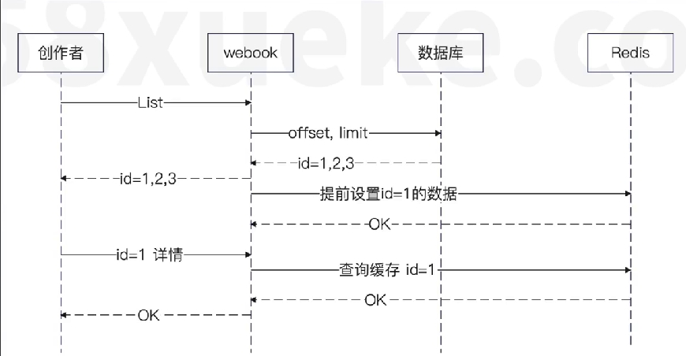

面试意义大于实践意义

缓存设计
大部分情况下，没什么人会缓存分页的结果，因为如果数据的筛选条件、排序条件、分页的偏移量和数据量中的任何一个发生了变化，缓存就很难使用了。
但是有一些缓存方案是可以考虑使用的。
也就是**只缓存第一页**。
在大多数的使用场景中，用户都是只看列表页的第一页很少会往后翻页。
所以，缓存住第一页之后就可以了

业务相关的缓存预加载
如下图，在返回列表查询的数据之后，就可以提前把部分数据放进缓存里面
而且,因为这是一个**预测性质的,所以过期时间设置得很短**，这样可以有效规避预测失败带来的内存开销

改进:不缓存大文档
这里还可以考虑在 Redis 内存消耗和缓存性能之间做一个权衡。
也就是，并不是所有的都值都缓存。有一些很长的文章就犯不着缓存了，浪费内存效果也很有限。
你在后续设计和缓存有关的机制时都要考虑这种问题。如果为了节省缓存的内存消耗，那么可以不缓存大对象。
注意!!!不是说所有情况下都不要缓存大对象而是说，你要权衡性能和内存开销。
如果说大对象计算起来非常慢，可以缓存起来，下次就不用计算了

如果在高并发场景下，本地缓存结合一致性哈希负载均衡算法+提前预加载 可以取得纳秒级别的性能

可以注意到，在不同的地方，缓存的过期时间是不同的
理论上来说，缓存过期时间应该是确保接下来对该资源的访问都命中缓存
一般情况下，过期时间越长，命中率越高，但是数据一致性会变差;过期时间越短,命中率越低,但是数据一致性会更好。

那么站在面试的角度来说，你记住这些案例:
- 业务相关的缓存预加载，过期时间要短。
- 在 Publish 提前设置过期时间这里，可以考虑根据创作者是否是大V来确定，大V有更长的过期时间

适合面试的缓存方案:淘汰策略
所谓淘汰策略,是指在缓存内存不够的情况下,要把一些数据淘汰掉,腾出空间。
常规的方案就是 LRU(最近最少使用)和 LFU(最近最不频繁使用),这两个常规方案在面试初中级岗位时是足够的。
但是要想面试出亮点，你记住这些方案:
- 优先淘汰普通创作者的数据，尽可能留下大V的数据。LFU 能够达成近似效果，LRU 效果要差一些
- 优先淘汰大对象。比如说一个帖子字数特别多,那么就可以优先淘汰了它,这样可以一次性释放出来很多内存。
- 优先淘汰小对象。比如说一个大对象要十秒钟才能计算出来,小对象100毫秒就能算出来,你就没必要留着小对象。

# 面试缓存总套路(持续更新)
### 方案
正常来说，所有人的项目经历里面都会有缓存相关的内容，所以如果你的方案仅仅是使用一下Redis，又或者就是本地缓存 +Redis + 数据库，那么还是不太容易赢得竞争优势
### 1.哈希负载均衡(一致性哈希负载均) +本地缓存
在使用本地缓存的时候，有两个缺陷:
- 本地缓存命中率比较低
- 内存消耗大
这都是因为同一个业务的请求，可能分散到不同的机器上。那么极端情况下，每一次请求都落到一个新机器上，那么这个机器的本地缓存没有这个数据，就需要加载缓存。因此解决思路就是借助业务相关的负载均衡算法，确保同一个业务的请求始终被分到同一个服务端节点上，这样就可以保证本地缓存的命中率。于此同时，别的节点也只需要缓存会落到自己这个节点上的业务的数据

# 数据一致性
来源与两个问题，1.并发读写， 2，部分失败